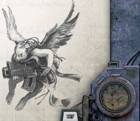

The custom of lining a blade with deadly toxins has been with humanity since the dawn of recorded time. Although smearing a poison on the blade has the advantage of simplicity, technology has since provided a better solution. A series of micro-dispensers  allow  a  wielder  to  coat  his  weapon  with poisons by simply pushing a button.

As  a  free  action,  a  character  with  a  weapon  equipped with a tox dispenser may cause his weapon to gain the Toxic Quality for one Round. Most Tox Dispensers may be used 10 times before requiring refilling. This may be equipped to any Primitive or Chain melee weapon. Primitive or Chain melee weapon.

*Source:* `Into the Storm, page 128`
