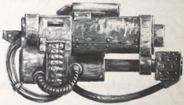
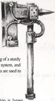

## Bigga Barrel

Ork  slavers  known  as  Runtherdz commonly use grabba stikks. Consisting of a sturdy metal pole, a deceptively simple pulley system, and an articulated barbed claw , grabba stikks are used to capture and restrain potential slaves. commonly use grabba stikks. Consisting of a sturdy metal pole, a deceptively simple pulley system, and an articulated barbed claw , grabba stikks are used to

## Bigga Klip

Like  all  Ork  weapons,  the  Grotwhip  is  larger and more brutal than its human counterpart, the Groxwhip. Used to keep Grotz in line, the Grotwhip is a barbed lash several metres long. Like  all  Ork  weapons,  the  Grotwhip  is  larger

## Kombi-shoota

This brutal mechanical gauntlet is a favoured weapon of Ork Warbosses.  Strapped  to  an  Ork's  arm,  the  power  klaw  ends in two or more snapping blades that can cut through nearly anything.  Within  Ork  society,  a  power  klaw  is  a  symbol  of status as much as a weapon. Orks often amputate their own arms and graft a power klaw to the stump, taking the weapon as  an  augmentic  implant.  Power  Klaws  double  the  wearer's Strength Bonus with that weapon, as if they had the Unnatural Strength Trait. If they do have the Unnatural Strength Trait, they add +1 to that Trait (x2 would go to x3, for example).

## Kustom Job

Like human weapons, Ork weapons can be upgraded to enhance their  performance.  Orks  forever  tinker  with  their  weapons, strapping on extra bitz that occasionally improve the weapon's performance.  An  Ork  with  the  Trade  (Armourer)  Skill  may upgrade weapons by making a successful Test. It is important to note that Ork weapons cannot be given human upgrades (see ROGUE T OGUE T OGUE RADER , Table 5-9: Weapon Upgrades, page 133) and human weapons cannot be given Ork upgrades. The following upgrades cannot be used to modify human weapons. R human weapons cannot be given Ork upgrades. The following upgrades cannot be used to modify human weapons.

## Ork Weapons in Other Books

A longer barrel and crude rifling give this weapon additional range. Increase the weapon's range by 10 metres. Upgrades: Any ranged weapon. A longer barrel and crude rifling give this weapon additional range. Increase the weapon's range by 10 metres. Upgrades:

## Loudener

Somehow, room for additional ammunition has been added to the weapon, often in the form of additional clips or dangling ammo belts, doubling the weapon's Clip size. Upgrades: Any Ranged weapon. Somehow, room for additional ammunition has been added to the weapon, often in the form of additional clips or dangling ammo belts, doubling the weapon's Clip size. Upgrades:

## More Shooty

This is not so much an upgrade as two weapons welded together. Unlike  human  weapons,  Twin-linked  Ork  weapons  need  not be identical. When a weapon receives this upgrade, it may be combined with any other ranged weapon possessed by the Ork. If the two combined weapons are the same, this weapon receives the Twin-Linked Quality . If they are different, this follows the rules for making Combi-weapons found on page 112.

Upgrades:

Any ranged weapon.

## Red Light

The weapon is retooled to the user's specifications or broken in by years of use. The weapon is granted the Customised Quality . Upgrades: Any ranged weapon.

| Table 3-18: Ork Melee Weapons   | Table 3-18: Ork Melee Weapons   | Table 3-18: Ork Melee Weapons   | Table 3-18: Ork Melee Weapons   | Table 3-18: Ork Melee Weapons   | Table 3-18: Ork Melee Weapons   | Table 3-18: Ork Melee Weapons   | Table 3-18: Ork Melee Weapons   |
|---------------------------------|---------------------------------|---------------------------------|---------------------------------|---------------------------------|---------------------------------|---------------------------------|---------------------------------|
| Name                            | Class                           | Range                           | Damage                          | Pen                             | Special                         | kg                              | Availability                    |
| Big Choppa                      | Melee                           | -                               | 2d10 R                          | 2                               | Tearing, Unbalanced             | 10                              | Rare/Average                    |
| Grabba Stikk                    | Melee                           | 2                               | 1d5                             | 0                               | Snare                           | 5                               | Rare/Average                    |
| Grotwhip                        | Melee                           | 3                               | 1d10+3 R                        | 0                               | Flexible, Tearing, Primitive    | 5                               | Rare/Average                    |
| Power Klaw                      | Melee                           | -                               | 2d10 E                          | 10                              | Power Field, Tearing, Unwieldy  | 17                              | Near Unique/Very Rare           |

## Sparky Knobz

There are plenty of Ork weapons in other books, such as the Slugga and Shoota in ROGUE TRADER . However,  these  weapons  can  be  customised  with Kustom  Bitz,  and  may  be  affected  by  special  rules contained in this book. In books other than INTO THE STORM ,  all  weapons  with  Ork in their title are considered  to  be  Ork  weapons. In  the  case  of  any confusion, the GM is also the final arbitrator of what is, and what is not, an Ork weapon.

## Spikey Bitz

The weapon's muzzle has been exaggerated to ludicrous proportions, amplifying its shots. When used in a Suppressing Fire Action, this weapon inflicts a -10 penalty on all Pinning Tests. Upgrades: All weapons capable of Suppressive Fire.

*Source:* `Battle Fleet of the Koronus, pages 145–146`
