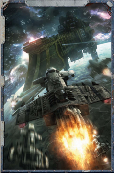

The  types of fighter craft are many  and  varied. Each spacefaring race approaches fighter craft design differently, and often  a  single  race  has  several  different  types  of  [Attack](combat-attack-rules.md)  craft for different duties. The Imperium, for [Example](rules-tests.md), uses the Fury for  space  superiority,  the  Starhawk  for  anti-ship  attacks,  and the Shark for [Hit and Run](starship-combat-rules.md) [Raids](mass-combat-raids.md). All of these [Small Craft](attack-craft-small-craft.md) have different capabilities, performance tolerance, and effectiveness. In space [Combat](rules-combat-overview.md), this is represented by Craft Rating.

Craft Rating is a way to represent the performance of a type  of  attack  craft.  It  is  an  abstract  value  representing  an [Attack Craft](attack-craft-rules.md)'s manoeuvrability, firepower, and durability. This value is represented by a bonus added to certain Tests made when fighters, bombers, and assault boats make attacks.

Table  1-3:  Common  Attack  Craft  [Ratings](crew-ratings.md) covers some of the most common attack craft and their ratings. This table also includes general squadron sizes-how many attack craft are in a squadron. These numbers should be treated as guidelines, to be modified if the GM feels it necessary.

If the GM wants to use an attack craft that does not have a Craft Rating, he can use its Manoeuvrability instead.

*Source:* `Battle Fleet of the Koronus, page 16`
