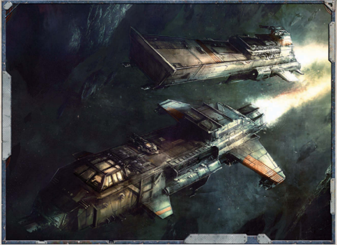

Slightly smaller than an assault boat, Starhawk-class bombers are slower and less armoured. Instead of troops, they carry a payload of [Plasma](weapons-general.md) bombs, [Armour](armour.md)-piercing missiles, and (in some cases) [Torpedoes](weapons-torpedoes.md). The Calixis-pattern has forward racks for up to 10 large anti-ship missiles with powerful krak [Warheads](weapons-warheads.md), and mid-bays containing multiple bomb-firing cylinders. Starhawks launch volleys of missiles at precise targets on an enemy ship, then close and make 'bombing runs' on the [Hull](starship-anatomy-detailed.md), pumping out flurries of [Plasma Warheads](weapons-warheads-plasma.md).

Crews of ten to fifteen man these weapons as well as less-potent armaments designed for defence against starfighters and incoming missiles. Like the Fury interceptor that often accompanies it, the Starhawk has cramped living quarters that allow these spacecraft to be used for extended assignments. Starhawk bombers are typically organised into [Squadrons](squadrons-overview.md) of ten craft.

Type:

Spacecraft

Cruising Speed:

1,800 kph/ 6 VUs per Strategic Turn in Space

Structural Integrity:

45

Armour:

Front 35, Side 35, Rear 30

Crew: Pilot, Co-pilot, 5 Gunners, Bombardier, Tech-Priest Enginseer

Tactical Speed:

15m/10 AUs

Manoeuvrability:

-10

[Size](character-traits.md):

Massive

Carrying Capacity:

Forward rack of 10 anti-

ship missiles, rear bays with 40 plasma bombsWeapons

1 Forward Gunner-operated-Twin-linked Lascannon (Facing Front, Range 600m (6 AUs), S/-/-, 5d10+10 E, Pen 10, Clip 200, [Reload](rules-combat-overview.md) -, Twin-linked)

2 Gunner-operated Twin-linked Long-barrelled Multi-laser Turrets (Facing All, Range 500m (5 AUs), -/-/10, 3d10+3 E, Pen 4, Clip Unlimited [powered from onboard reactor], Reload 2 Full, Twin-linked)

- 2  Wing-mounted Remote Gunner-operated Twin-linked Heavy Bolter Turrets (Facing  Front/Left/Rear  or  Front/ Right/Rear, Range 120 m (2 AU), -/-/10, 2d10+2 X, Pen 5, Clip 1000, Reload -, Tearing, Twin-linked)

## Subpages
- [Special Rules](mass-combat-special-rules.md)

*Source:* `Battle Fleet of the Koronus, page 141`
