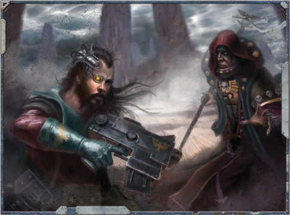

Choosing an Alternate Career Rank means a character has diverged from the generalised regular path of his career  for  a  more  specialised  one.  While  this  means access to new  and  often unique abilities during his  tenure,  it  may  often  mean  missing  out  on  the opportunities afforded in the regular development of his  character.  These  'missed'  Skills  and  Talents  can be purchased however by the character (with the GMs approval) as Elite Advances in the missed Rank for a base  cost  of  twice  the  original  cost  (a  200  xp  Skill would cost 400 xp, while a 500 xp Talent would cost an  impressive  1,000  xp).  The  GM  can  modify  this amount  up  or  down  as  he  sees  fit,  but  should  keep in  mind  that  Alternate  Ranks  present  opportunities to characters they normally would not get, and there should be a trade-off for this opportunity.

In  addition,  each  Alternate  Rank  is  only  available  to certain  Career  Paths-a  Flight  Marshal,  for  example,  can only be taken by a character with the Void Master Career. Lastly, each Alternate Rank has a minimum level at which they  can  be  taken.  A  character  must  have  reached  that  at least that level in their career in order to take that Rank.

If a character meets all the prerequisites for an Alternate Career  Rank,  he  may  take  the  Rank.  To  take  an  Alternate Career Rank, the player replaces the next rank they would have taken with the Alternate Career Rank. The new Advance Scheme is exchanged for the original Advance Scheme in that rank of the Career Path. At this point, the character has access to  the  new  Advances  and  may  spend  experience  points  to purchase them. Some of the Alternate Career Ranks also have special Traits or other abilities that are immediately applied to  the  character  taking  the  Rank.  Once  the  character  has earned enough experience points to reach the next rank in his Career, he returns to the next rank in his original Career Path.

While  any  new  Alternate  Rank  will  be  filled  with  new opportunities, there are some drawbacks. This new focus may deny a character access to other Skills and Talents, or force the character to pay more experience for them. A player may even find his character's maximum ability with certain Skills capped out earlier than he had planned. This is a potential price  for  taking  a  more  generalised  character  in  a  more specific and specialised direction.

As  all  of  this  may  complicate  the  normal  character progression system, Alternate Career Ranks are recommended for experienced players. Keep in mind also that regardless of how many new options a character may gain, the character's Rank is still governed by the total amount of experience he has earned.

## Becoming an Acquisitionist

Missionary Kantarine Slephan wishes to focus more on saving the souls of those who live on the frontier worlds of the Expanse, and decides  to  become  a  Torchbearer.  She  has  all  of  the  prerequisites needed,  and  at  Rank  3  switches  to  the  Torchbearer  Advances table.  She  is  still  a  Missionary,  but  now  devotes  less  of  her  time to civilised worlds and more to the solitude and nomadic existence of  the  wastelands.  Kantarine  has  access  to  the  Skills  and  Talents listed under the Torch-bearer Advances and at the costs listed there, and may spend xp on them freely from this point forward. While the piety is to be admired and she will be better able to survive on many  otherwise  unforgiving  planets,  she  will  have  missed  out  on certain  opportunities  from  the  standard  Missionary  Rank  3  list such as bettering herself with pistol weapons. When she moves on to Missionary Rank 4, if she still wishes to obtain these (and has the necessary xp to spend), she must pay for them as Elite Advances.

*Source:* `Battle Fleet of the Koronus, pages 71–72`
