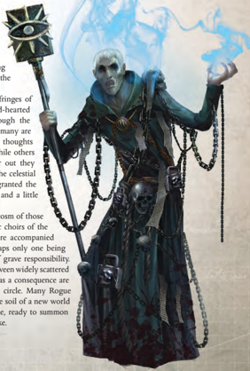

'I am [Soul-bound](character-traits.md) to the Emperor, and through His Grace, I speak across the voids.'

-Arradin Vykis, Astropath

T he Astropath Transcendent is a rare individual, indeed. He is a psyker whose powers and very essence has been touched by the light of the God-Emperor himself and who is able to form a lifeline of [Communication](rules-communication.md) across the limitless gulfs of space, his soul armoured against the gnawing taint of [The Warp](warp-imperial-space-travel.md) beyond. Each year, uncounted millions of psykers are born across the vast breadth of the Imperium. Most are detected and interred until collected by one of the fearsome Black Ships of The Adeptus Astra Telepathica. These vessels travel the galaxy in great circuits, their stygian holds inexorably filling with nascent psykers with each stop they make. The fate of the vast majority of the psykers is to [Fuel](weapons-ammunition.md) the insatiable fires of [The Astronomican](warp-travel-navigation.md) so that the Imperium might be held together for another day. Of those allowed to live, a tiny fraction are judged strong enough to undergo tutorage and go on to serve the Imperium in a staggering array of capacities, from Inquisitor to Battle Psyker.

Those chosen to become [Astropaths](psychic-psyker-types.md) undergo the ritual of Soul Binding, in which the body and soul are scoured clean of the taint of [The Warp](warp-imperial-space-travel.md) by the searing purity of the Emperor's beneficence. After months of fasting, prayer, and ritual preparation, the psykers are brought into the very depths of the Emperor's Palace in processions of a hundred at a time, there to undergo a ritual that will kill them, drive them insane, or bind them for all eternity to the Emperor. So intense is the ritual that the supplicants' sensory organs are almost totally overloaded-leaving them [Blinded](character-injury.md) by the experience-with many suffering further nerve [Damage](character-injury.md), incurring loss of smell, touch, or hearing.

Relying as heavily as the Imperium does on the warp for galactic [Communication](rules-communication.md), it has a great demand for [Astropaths](psychic-psyker-types.md), and each newly created Astropath who survives the Soul Binding is inducted into the ranks of The Adeptus Astra Telepathica. There he learns to send his thoughts singing across the galaxy via the medium of the warp, adding his psychic voice to entire choirs of his fellows, and communicating with others of his kind on planets light years distant.

It is a rare Astropath indeed who rises beyond his given duties and responsibilities in the ranks of the psychic choirs. Of those

few who do so, most are placed in [Charge](rules-combat-overview.md) of Astropathic facilities and relay stations dotted across Imperial space.  Those  with  the  sharpest  wits  become  itinerant emissaries or officials of the Adeptus Astra Telepathica itself or serve on the [Staff](weapons-general.md) of Inquisitors or Lord Militants. Some of the most self-aware and strong-willed of their kind  serve  their  vigils  alongside  Rogue  Traders,  casting their  thoughts out far beyond the realms of Man into the great voids beyond the Emperor's Domains.

It  takes  a  special  type  of  Astropath to serve on The Fringes of what is known, and such Astropaths must be both hard-hearted and  savvy  individualists  if  they  are  to  persevere.  Though  the experiences vary wildly from one Astropath to the next, many are driven slowly mad by what they describe as cold, alien thoughts echoing in the black gulfs at the edges of the galaxy, while others find  themselves  growing  increasingly  alone  the  further  out  they travel, as the psychic voices of their fellows recede into the celestial distance. Those few that can endure these rigours are granted the title of Astropath Transcendent, and are both respected and a little feared by their contemporaries

The duties of the Astropath Transcendent are a microcosm of those performed by the more established and ordinary psychic choirs of the Adeptus  Astra  Telepathica.  Most  Rogue  Trader  fleets  are  accompanied by little  more  than  a  handful  of  Astropaths,  with  perhaps  only  one  being stationed on each vessel, and so their position is one of grave responsibility. They provide the only means of viable communication between widely scattered vessels, not to mention across interstellar distances, and as a consequence are highly  valued  members  of  the  Rogue  Trader's  inner  circle.  Many  Rogue Traders would not even consider setting foot on the soil of a new world without an Astropath Transcendent at their side, [Ready](rules-combat-overview.md) to summon aid at a moment's notice should disaster strike.

## Starting Skills, Talents and Gear

Starting Skills: Awareness (Per), Common Lore (Adeptus Astra Telepathica) (Int), Forbidden Lore (Psykers) (Int), Invocation (WP), Psyniscience (Per), Scholastic Lore (Cryptology) (Int), Speak Language (High Gothic, Low Gothic) (Int). Starting Talents: [Pistol Weapon Training](talents-descriptions.md) (Universal), Heightened Senses (Sound), [Psy Rating](talents-descriptions.md) 2. Starting [Gear](equipment-gear.md): Best-[Craftsmanship](components-craftsmanship.md) [Laspistol](weapons-general.md) or best-[Craftsmanship](components-craftsmanship.md) stub automatic. Best-Craftsmanship mono-sword or common-Craftsmanship shock staff. Guard [Flak Armour](armour.md#flak-armour). [Charm](equipment-gear.md), void suit, [Micro-bead](equipment-tools.md), [Psy-focus](equipment-tools.md).

| Astropath Transcendent Characteristic Advances   | Astropath Transcendent Characteristic Advances   | Astropath Transcendent Characteristic Advances   | Astropath Transcendent Characteristic Advances   |        |
|--------------------------------------------------|--------------------------------------------------|--------------------------------------------------|--------------------------------------------------|--------|
| Characteristic                                   | Simple                                           | Intermediate                                     | Trained                                          | Expert |
| Weapon Skill                                     | 500                                              | 750                                              | 1,000                                            | 2,500  |
| Ballistic Skill                                  | 500                                              | 750                                              | 1,000                                            | 2,500  |
| Strength                                         | 250                                              | 500                                              | 750                                              | 1,000  |
| Toughness                                        | 250                                              | 500                                              | 750                                              | 1,000  |
| Agility                                          | 250                                              | 500                                              | 750                                              | 1,000  |
| Intelligence                                     | 100                                              | 250                                              | 500                                              | 750    |
| Perception                                       | 250                                              | 500                                              | 750                                              | 1,000  |
| Willpower                                        | 100                                              | 250                                              | 500                                              | 750    |
| Fellowship                                       | 500                                              | 750                                              | 1,000                                            | 2,500  |

| Rank 1 Astropath Transcendent Advances   | Rank 1 Astropath Transcendent Advances   | Type   | Prerequisites       |
|------------------------------------------|------------------------------------------|--------|---------------------|
| [Advance](combat-advance-action.md)                                  | Cost                                     |        |                     |
| Awareness                                | 100                                      | Skill  |                     |
| Ciphers (Astropath Sign)                 | 100                                      | Skill  |                     |
| Common Lore (Administratum)              | 100                                      | Skill  |                     |
| Common Lore (Adeptus Astra Telepathica)  | 100                                      | Skill  |                     |
| Forbidden Lore (Psykers)                 | 100                                      | Skill  |                     |
| Forbidden Lore (Warp)                    | 100                                      | Skill  |                     |
| Invocation                               | 100                                      | Skill  |                     |
| Literacy                                 | 100                                      | Skill  |                     |
| Psyniscience                             | 100                                      | Skill  |                     |
| Scholastic Lore (Cryptology)             | 100                                      | Skill  |                     |
| Scholastic Lore (Occult)                 | 100                                      | Skill  |                     |
| Secret Tongue (Rogue Trader)             | 100                                      | Skill  |                     |
| Psychic Technique (x2)                   | 100                                      | Talent |                     |
| Dodge                                    | 200                                      | Skill  |                     |
| Heightened Senses (Sound)                | 200                                      | Talent |                     |
| Psy Rating 2                             | 200                                      | Talent |                     |
| Melee Weapon Training (Primitive)        | 200                                      | Talent |                     |
| Pistol Weapon Training (Universal)       | 500                                      | Talent |                     |
| Rite of Sanctioning                      | 500                                      | Talent | Psy Rating, Special |
| Warp Affinity                            | 500                                      | Talent | Psy Rating, Special |

| Rank 2 Astropath Transcendent Advances      | Rank 2 Astropath Transcendent Advances   | Rank 2 Astropath Transcendent Advances   |                                         |
|---------------------------------------------|------------------------------------------|------------------------------------------|-----------------------------------------|
| Advance                                     | Cost                                     | Type                                     | Prerequisites                           |
| Awareness +10                               | 200                                      | Skill                                    | Awareness                               |
| Ciphers (Astropath Sign) +10                | 200                                      | Skill                                    | Ciphers (Astropath Sign)                |
| Common Lore (Administratum) +10             | 200                                      | Skill                                    | Common Lore (Administratum)             |
| Common Lore (Adeptus Astra Telepathica) +10 | 200                                      | Skill                                    | Common Lore (Adeptus Astra Telepathica) |
| Forbidden Lore (Psykers) +10                | 200                                      | Skill                                    | Forbidden Lore (Psykers)                |
| Invocation +10                              | 200                                      | Skill                                    | Invocation                              |
| Psyniscience +10                            | 200                                      | Skill                                    | Psyniscience                            |
| Scholastic Lore (Cryptology) +10            | 200                                      | Skill                                    | Scholastic Lore (Cryptology)            |
| Scholastic Lore (Occult) +10                | 200                                      | Skill                                    | Scholastic Lore (Occult)                |
| Scrutiny                                    | 200                                      | Skill                                    |                                         |
| Blind Fighting                              | 200                                      | Talent                                   | Per 30                                  |
| Combat Sense                                | 200                                      | Talent                                   | Per 40                                  |
| Psychic Technique (x2)                      | 200                                      | Talent                                   |                                         |
| Dark Soul                                   | 200                                      | Talent                                   |                                         |
| Foresight                                   | 200                                      | Talent                                   | Int 30                                  |
| Melee Weapon Training (Primitive)           | 200                                      | Talent                                   |                                         |
| Sound Constitution (x2)                     | 200                                      | Talent                                   |                                         |
| Totall Recall                               | 200                                      | Talent                                   |                                         |
| Psy Rating 3                                | 300                                      | Talent                                   | Psy Rating 2                            |
| Resistance (Psychic Powers)                 | 300                                      | Talent                                   |                                         || Rank 3 Astropath Transcendent Advances      | Rank 3 Astropath Transcendent Advances   | Rank 3 Astropath Transcendent Advances   |                                             |
|---------------------------------------------|------------------------------------------|------------------------------------------|---------------------------------------------|
| Advance                                     | Cost                                     | Type                                     | Prerequisites                               |
| Awareness +20                               | 200                                      | Skill                                    | Awareness +10                               |
| Ciphers (Astropath Sign) +10                | 200                                      | Skill                                    | Ciphers (Astropath Sign)                    |
| Common Lore (Administratum) +20             | 200                                      | Skill                                    | Common Lore (Administratum) +10             |
| Common Lore (Adeptus Astra Telepathica) +20 | 200                                      | Skill                                    | Common Lore (Adeptus Astra Telepathica) +10 |
| Common Lore (Imperial Guard)                | 200                                      | Skill                                    |                                             |
| Common Lore (Imperial Navy)                 | 200                                      | Skill                                    |                                             |
| Deceive                                     | 200                                      | Skill                                    |                                             |
| Forbidden Lore (Psykers) +20                | 200                                      | Skill                                    | Forbidden Lore (Psykers) +10                |
| Forbidden Lore (Warp) +10                   | 200                                      | Skill                                    | Forbidden Lore (Warp)                       |
| Invocation +20                              | 200                                      | Skill                                    | Invocation +10                              |
| Psyniscience +20                            | 200                                      | Skill                                    | Psyniscience +10                            |
| Scholastic Lore (Cryptology) +20            | 200                                      | Skill                                    | Scholastic Lore (Cryptology) +10            |
| Scholastic Lore (Occult) +20                | 200                                      | Skill                                    | Scholastic Lore (Occult) +10                |
| Scrutiny +10                                | 200                                      | Skill                                    | Scrutiny                                    |
| Chem Geld                                   | 200                                      | Talent                                   |                                             |
| Peer (Astropaths)                           | 200                                      | Talent                                   | Fel 30                                      |
| Psy Rating 4                                | 200                                      | Talent                                   | Psy Rating 3                                |
| Psychic Technique (x2)                      | 200                                      | Talent                                   |                                             |
| Melee Weapon Training (Universal)           | 500                                      | Talent                                   |                                             |
| Psychic Discipline                          | 500                                      | Talent                                   |                                             |

| Rank 4 Astropath Transcendent Advances   | Rank 4 Astropath Transcendent Advances   | Rank 4 Astropath Transcendent Advances   |                                        |
|------------------------------------------|------------------------------------------|------------------------------------------|----------------------------------------|
| Advance                                  | Cost                                     | Type                                     | Prerequisites                          |
| Blather                                  | 200                                      | Skill                                    |                                        |
| Ciphers (Astropath Sign) +20             | 200                                      | Skill                                    | Ciphers (Astropath Sign) +10           |
| Common Lore (Imperial Guard) +10         | 200                                      | Skill                                    | Common Lore (Imperial Guard)           |
| Common Lore (Imperial Navy) +10          | 200                                      | Skill                                    | Common Lore (Imperial Navy)            |
| Common Lore (Imperium)                   | 200                                      | Skill                                    |                                        |
| Deceive +10                              | 200                                      | Skill                                    | Deceive                                |
| Scholastic Lore (Heraldry)               | 200                                      | Skill                                    |                                        |
| Scrutiny +20                             | 200                                      | Skill                                    | Scrutiny +10                           |
| Secret Tongue (Administratum)            | 200                                      | Skill                                    |                                        |
| Armour of Contempt                       | 200                                      | Talent                                   | WP 40                                  |
| Orthoproxy                               | 200                                      | Talent                                   |                                        |
| Paranoia                                 | 200                                      | Talent                                   |                                        |
| Hatred (Daemons)                         | 200                                      | Talent                                   |                                        |
| Heightened Senses (Touch)                | 200                                      | Talent                                   |                                        |
| Light Sleeper                            | 200                                      | Talent                                   | Per 30                                 |
| Meditation                               | 200                                      | Talent                                   |                                        |
| Psy Rating 5                             | 200                                      | Talent                                   | Psy Rating 4                           |
| Psychic Technique (x2)                   | 200                                      | Talent                                   |                                        |
| Sound Constitution (x2)                  | 200                                      | Talent                                   |                                        |
| Strong Minded                            | 500                                      | Talent                                   | WP 30, Resistance (Psychic Techniques) |

| Rank 5 Astropath Transcendent Advances   | Rank 5 Astropath Transcendent Advances   | Rank 5 Astropath Transcendent Advances   |                                                     |
|------------------------------------------|------------------------------------------|------------------------------------------|-----------------------------------------------------|
| Advance                                  | Cost                                     | Type                                     | Prerequisites                                       |
| Charm                                    | 200                                      | Skill                                    |                                                     |
| Common Lore (Imperial Guard) +20         | 200                                      | Skill                                    | Common Lore (Imperial Guard) +10                    |
| Common Lore (Imperial Navy) +20          | 200                                      | Skill                                    | Common Lore (Imperial Navy) +10                     |
| Common Lore (Imperium) +10               | 200                                      | Skill                                    | Common Lore (Imperium)                              |
| Deceive +20                              | 200                                      | Skill                                    | Deceive +10                                         |
| Forbidden Lore (Warp) +20                | 200                                      | Skill                                    | Forbidden Lore (Warp) +10                           |
| Logic                                    | 200                                      | Skill                                    |                                                     |
| Scholastic Lore (Heraldry) +10           | 200                                      | Skill                                    | Scholastic Lore (Heraldry)                          |
| Good Reputation (Astropaths)             | 200                                      | Talent                                   | Fel 50, Peer (Astropaths)                           |
| Heightened Senses (Taste)                | 200                                      | Talent                                   |                                                     |
| Peer (Imperial Guard)                    | 200                                      | Talent                                   | Fel 30                                              |
| Psy Rating 6                             | 200                                      | Talent                                   | Psy Rating 5                                        |
| Rapid Reload                             | 200                                      | Talent                                   |                                                     |
| Sound Constitution (x2)                  | 200                                      | Talent                                   |                                                     |
| Talented (Choose One)                    | 200                                      | Talent                                   |                                                     |
| Unshakeable Faith                        | 200                                      | Talent                                   |                                                     |
| Psychic Technique (x2)                   | 300                                      | Talent                                   |                                                     |
| Infused Knowledge                        | 500                                      | Talent                                   | Int 40                                              |
| Warp Sense                               | 500                                      | Talent                                   | Navigator or Psy Rating, Psyniscience Skill, Per 30 |
| Favoured by the Warp                     | 500                                      | Talent                                   | WP 35                                               || Rank 6 Astropath Transcendent Advances   |   Cost | Type   | Prerequisites                    |
|------------------------------------------|--------|--------|----------------------------------|
| Charm +10                                |    200 | Skill  | Charm                            |
| Command                                  |    200 | Skill  |                                  |
| Common Lore (Imperium) +20               |    200 | Skill  | Common Lore (Imperium) +10       |
| Evaluate                                 |    200 | Skill  |                                  |
| Intimidate                               |    200 | Skill  |                                  |
| Logic +10                                |    200 | Skill  | Logic                            |
| Scholastic Lore (Heraldry) +20           |    200 | Skill  | Scholastic Lore (Heraldry) +10   |
| Ambidextrous                             |    200 | Talent | Ag 30                            |
| Heightened Senses (Smell)                |    200 | Talent |                                  |
| Jaded                                    |    200 | Talent | WP 30                            |
| Peer (Imperial Navy)                     |    200 | Talent | Fel 30                           |
| Sound Constitution (x2)                  |    200 | Talent |                                  |
| Sure Strike                              |    200 | Talent | WS 30                            |
| Psychic Technique (x2)                   |    300 | Talent |                                  |
| Basic Weapon Training (Universal)        |    500 | Talent |                                  |
| Bastion of Iron Will                     |    500 | Talent | Psy Rating, Strong Minded, WP 40 |
| Exotic Weapon Training (Choose One)      |    500 | Talent |                                  |
| Improved Warp Sense                      |    500 | Talent | Warp Sense                       |
| Psychic Discipline                       |    500 | Talent |                                  |
| Thrown Weapon Training (Universal)       |    500 | Talent |                                  |

| Rank 7 Astropath Transcendent Advances   | Rank 7 Astropath Transcendent Advances   | Rank 7 Astropath Transcendent Advances   | Rank 7 Astropath Transcendent Advances   |
|------------------------------------------|------------------------------------------|------------------------------------------|------------------------------------------|
| Advance                                  | Cost                                     | Type                                     | Prerequisites                            |
| Blather +10                              | 200                                      | Skill                                    | Blather                                  |
| Charm +20                                | 200                                      | Skill                                    | Charm +10                                |
| Chem-Use                                 | 200                                      | Skill                                    |                                          |
| Command +10                              | 200                                      | Skill                                    | Command                                  |
| Evaluate +10                             | 200                                      | Skill                                    | Evaluate                                 |
| Intimidate +10                           | 200                                      | Skill                                    | Intimidate                               |
| Logic +20                                | 200                                      | Skill                                    | Logic +10                                |
| Scholastic Lore (Legend)                 | 200                                      | Skill                                    |                                          |
| Air of Authority                         | 200                                      | Talent                                   | Fel 30                                   |
| Quick Draw                               | 200                                      | Talent                                   |                                          |
| Rapid Reaction                           | 200                                      | Talent                                   | Ag 40                                    |
| Sound Constitution (x2)                  | 200                                      | Talent                                   |                                          |
| Talented (Choose One)                    | 200                                      | Talent                                   |                                          |
| Psychic Technique (x2)                   | 500                                      | Talent                                   |                                          |
| Infused Knowledge                        | 500                                      | Talent                                   | Int 40                                   |
| Mighty Shot                              | 500                                      | Talent                                   | BS 40                                    |
| Polyglot                                 | 500                                      | Talent                                   | Int 30, Fel 30                           |
| Psy Rating 7                             | 500                                      | Talent                                   | Psy Rating 6                             |
| Deadeye Shot                             | 500                                      | Talent                                   | BS 30                                    |
| Warp Conduit                             | 500                                      | Talent                                   | Psy Rating, Strong Minded, WP 50         |

| Rank 8 Astropath Transcendent Advances   | Rank 8 Astropath Transcendent Advances   | Rank 8 Astropath Transcendent Advances   |                               |
|------------------------------------------|------------------------------------------|------------------------------------------|-------------------------------|
| Advance                                  | Cost                                     | Type                                     | Prerequisites                 |
| Blather +20                              | 200                                      | Skill                                    | Blather +10                   |
| Chem-Use +10                             | 200                                      | Skill                                    | Chem-Use                      |
| Command +20                              | 200                                      | Skill                                    | Command +10                   |
| Intimidate +20                           | 200                                      | Skill                                    | Intimidate +10                |
| Scholastic Lore (Legend) +10             | 200                                      | Skill                                    | Scholastic Lore (Legend)      |
| Good Reputation (Imperial Guard)         | 200                                      | Talent                                   | Fel 50, Peer (Imperial Guard) |
| Good Reputation (Imperial Navy)          | 200                                      | Talent                                   | Fel 50, Peer (Imperial Navy)  |
| Crack Shot                               | 500                                      | Talent                                   | BS 40                         |
| Duty Unto Death                          | 500                                      | Talent                                   | WP 45                         |
| Fearless                                 | 500                                      | Talent                                   |                               |
| Hard Target                              | 500                                      | Talent                                   | Ag 40                         |
| Iron Discipline                          | 500                                      | Talent                                   | WP 30, Command                |
| Lightning Reflexes                       | 500                                      | Talent                                   |                               |
| Litany of Hate                           | 500                                      | Talent                                   | Hatred                        |
| Precise Blow                             | 500                                      | Talent                                   | WS 40, Sure Strike            |
| Psy Rating 8                             | 500                                      | Talent                                   | Psy Rating 7                  |
| Psychic Technique (x2)                   | 500                                      | Talent                                   |                               |
| Sprint                                   | 500                                      | Talent                                   |                               |
| Swift Attack                             | 500                                      | Talent                                   | WS 35                         |
| Two-Weapon Wielder (Ballistic)           | 500                                      | Talent                                   | BS 35, Ag 35                  |

*Source:* `Roguetrader Corerulebook, pages 49–50`
