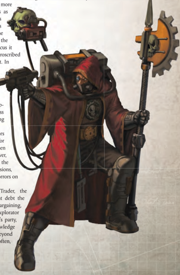

'The Quest for Knowledge [Drives](components-drives.md) the Mechanicus to the stars; forgotten Archeotech and un-catalogued [Celestial Phenomena](rules-celestial-phenomena.md) await, the voice of the Omnissiah awaiting to be witnessed.'

## -explorator Enginseer Acula

P art adventurer, part warrior, part emissary of the Machine Cult of Mars, Explorators are Tech-priests, bionically augmented adepts of The Adeptus Mechanicus. Their function is to travel into the depths of the unknown and unearth the ashes of the past in order to acquire knowledge and secrets for the glory of the Omnissiah. Something of a breed apart in the Cult Mechanicus, they are seen as a necessary evil by some of their fellows and vital agents of the Machine God by others. Explorators undertake  their  Quest  for  Knowledge  across  the  stars,  seeking  out  undiscovered  data  and  unrecorded  phenomena,  forgotten archeotech hoards, and unknown life forms. All Mechanicus Research Stations, exploration ships, and outposts any distance from a [Forge World](chargen-stage2-origin-path.md) are likely to be manned by Explorators. It is also the sacred function of these intrepid (or foolhardy) individuals to delve in the unexplored reaches of the galaxy, either as part of great Mechanicus-backed fleets or by attaching themselves to the Rogue Trader houses to carry them into the beyond in search of both the future and, most importantly, the past.

The lost achievements of Mankind's Dark Age of Technology soared far beyond anything that can be made today. Only by re-learning ancient lore found scattered across the stars and painstakingly piecing it together can Man ever achieve such dizzying heights again. Attempts at improvisation or adaptation are viewed by most followers of the Omnissiah as the height of hubris. Imagining that one can set oneself above the knowledge of the Ancients without risking their deadly sins and the dark fate that led to the horrors of the Age of Strife is pure folly .

Explorators themselves tend towards a greater independence of mind and inquisitive thought than adherents of the Machine Cult in more sheltered roles, and they often have their own secret agendas and arts far beyond those of their more Cult in more sheltered roles, and they often have their own secret agendas and arts far beyond those of their more

pedestrian peers. Many tech-adepts, particularly of the more junior  and  provincial  variety,  regard  the  Explorators  as dubious  outsiders,  [Prone](combat-special-circumstances.md)  to  stray  beyond  the  bounds of  the  arcane  dogma  and  rigidly  adhered-to  precepts laid  down by the inviolable teachings of the Machine Cult.  Whether  or  not  this  is  true,  it  is  undoubtedly  the case that amongst the adherents of the Cult Mechanicus it is they who are the most likely to be exposed to the proscribed technologies of the alien and the sins of the dark past. In truth, Explorators are on the frontline of perils few can understand. There more than a few Explorators who,  in  their  desire  to  uncover  the  secrets  of the  universe,  have  fallen  prey  to  some  xenos dogma and turned from the rigid doctrine of the eight Universal Laws, have become corrupted by warptwisted engramatic code and lost their souls to the abyss of Chaos, or have simply been driven mad from knowing too much. pedestrian peers. Many tech-adepts, particularly of the more junior  and  provincial  variety,  regard  the  Explorators  as dubious  outsiders,  [Prone](combat-special-circumstances.md)  to  stray  beyond  the  bounds of  the  arcane  dogma  and  rigidly  adhered-to  precepts laid  down by the inviolable teachings of the Machine Cult.  Whether  or  not  this  is  true,  it  is  undoubtedly  the case that amongst the adherents of the Cult Mechanicus it is they who are the most likely to be exposed to the proscribed technologies of the alien and the sins of the dark past. In truth, Explorators are on the frontline of perils few can understand. There more than a few Explorators who,  in  their  desire  to  uncover  the  secrets  of the  universe,  have  fallen  prey  to  some  xenos dogma and turned from the rigid doctrine of the eight Universal Laws, have become corrupted by warptwisted engramatic code and lost their souls to the abyss of Chaos, or have simply been driven mad from knowing

Yet, the risks are worth the [Rewards](economy-rewards.md), and Explorators have found many of the greatest prizes in the Quest for Knowledge, and their role in many other affairs has been key to their success and the Imperium's survival. However, countless Explorators have met with grisly deaths in the hostile galaxy they explore, and on mercifully rare occasions, their ill-conceived prying has unleashed cataclysmic horrors on Mankind. Yet, the risks are worth the [Rewards](economy-rewards.md), and Explorators have found many of the greatest prizes in the Quest for Knowledge, and their role in many other affairs has been key to their success and the Imperium's survival. However, countless Explorators have met with grisly deaths in the hostile galaxy they explore, and on mercifully rare occasions, their ill-conceived prying has unleashed cataclysmic horrors on

When an Explorator accompanies a Rogue Trader, the arrangement  may  have  come  about  by  some  ancient  debt  the Rogue Trader's line owed the Cult Mechanicus, hard bargaining, or  even  pure  chance.  Whatever  the  case,  the  Explorator will be a valued member of the Rogue Trader's party, bringing with him a wealth of esoteric knowledge and arcane technical know-how quite beyond any other member of the crew, and often, not a little firepower of his own. When an Explorator accompanies a Rogue Trader, the arrangement  may  have  come  about  by  some  ancient  debt  the Rogue Trader's line owed the Cult Mechanicus, hard bargaining, or  even  pure  chance.  Whatever  the  case,  the  Explorator will be a valued member of the Rogue Trader's party, bringing with him a wealth of esoteric knowledge and arcane technical know-how quite beyond any other member of the crew, and often, not a little firepower of his own.

## Starting Skills, Talents and Gear

Starting Skills: Common Lore (Machine Cult, Tech) (Int), Forbidden Lore (Archeotech, Adeptus Mechanicus) (Int), Literacy (Int), Logic (Int), Speak Language (Explorator Binary, Low Gothic, Techna-lingua) (Int), Tech-Use (Int), Trade (Technomat) (Int). Starting Trait: Mechanicus Implants (see page 366).

Starting Talents:

[Basic Weapon Training](talents-descriptions.md) (Universal), [Melee Weapon Training](talents-descriptions.md) (Universal), Logis Implant.

Starting [Gear](equipment-gear.md): Boltgun or best-[Craftsmanship](components-craftsmanship.md) [Lasgun](weapons-general.md) or good-[Craftsmanship](components-craftsmanship.md) hellgun, best-Craftsmanship shock [Staff](weapons-general.md) or goodCraftsmanship power axe, Enforcer light carapace, [Multikey](equipment-tools.md), [Void Suit](equipment-gear.md), [Injector](equipment-drugs-and-consumables.md), [Sacred Unguents](equipment-drugs-and-consumables.md), [Micro-bead](equipment-tools.md), combi-tool, dataslate. The Explorator also begins play owning and controlling one servo-skull familiar (see page 375).

| Explorator Characteristic Advances   | Explorator Characteristic Advances   | Explorator Characteristic Advances   |         |        |
|--------------------------------------|--------------------------------------|--------------------------------------|---------|--------|
| Characteristic                       | Simple                               | Intermediate                         | Trained | Expert |
| Weapon Skill                         | 250                                  | 500                                  | 750     | 1,000  |
| Ballistic Skill                      | 250                                  | 500                                  | 750     | 1,000  |
| Strength                             | 100                                  | 250                                  | 500     | 750    |
| Toughness                            | 100                                  | 250                                  | 500     | 750    |
| Agility                              | 500                                  | 750                                  | 1,000   | 2,500  |
| Intelligence                         | 100                                  | 250                                  | 500     | 750    |
| Perception                           | 500                                  | 750                                  | 1,000   | 2,500  |
| Willpower                            | 250                                  | 500                                  | 750     | 1,000  |
| Fellowship                           | 500                                  | 750                                  | 1,000   | 2,500  |

| Rank 1 Explorator Advances          | Rank 1 Explorator Advances   |        |                     |
|-------------------------------------|------------------------------|--------|---------------------|
| [Advance](combat-advance-action.md)                             | Cost                         | Type   | Prerequisites       |
| Awareness                           | 100                          | Skill  |                     |
| Common Lore (Machine Cult)          | 100                          | Skill  |                     |
| Common Lore (Tech)                  | 100                          | Skill  |                     |
| Drive (Ground Vehicle)              | 100                          | Skill  |                     |
| Forbidden Lore (Archeotech)         | 100                          | Skill  |                     |
| Forbidden Lore (Adeptus Mechanicus) | 100                          | Skill  |                     |
| Literacy                            | 100                          | Skill  |                     |
| Logic                               | 100                          | Skill  |                     |
| Scholastic Lore (Astromancy)        | 100                          | Skill  |                     |
| Secret Tongue (Rogue Trader)        | 100                          | Skill  |                     |
| Secret Tongue (Tech)                | 100                          | Skill  |                     |
| Tech-Use                            | 100                          | Skill  |                     |
| Trade (Armourer)                    | 100                          | Skill  |                     |
| Trade (Technomat)                   | 100                          | Skill  |                     |
| Autosanguine                        | 200                          | Talent |                     |
| Logis Implant                       | 200                          | Talent |                     |
| Sound Constitution (x2)             | 200                          | Talent |                     |
| Mechadendrite Use (Utility)         | 500                          | Talent | Mechanicus Implants |
| Basic Weapon Training (Universal)   | 500                          | Talent |                     |
| Melee Weapon Training (Universal)   | 500                          | Talent |                     |

| Rank 2 Explorator Advances              | Rank 2 Explorator Advances   |        |                                     |
|-----------------------------------------|------------------------------|--------|-------------------------------------|
| Advance                                 | Cost                         | Type   | Prerequisites                       |
| Awareness +10                           | 200                          | Skill  | Awareness                           |
| Common Lore (Machine Cult) +10          | 200                          | Skill  | Common Lore (Machine Cult)          |
| Common Lore (Tech) +10                  | 200                          | Skill  | Common Lore (Tech)                  |
| Forbidden Lore (Archeotech) +10         | 200                          | Skill  | Forbidden Lore (Archeotech)         |
| Forbidden Lore (Adeptus Mechanicus) +10 | 200                          | Skill  | Forbidden Lore (Adeptus Mechanicus) |
| [Dodge](rules-combat-overview.md)                                   | 200                          | Skill  |                                     |
| Logic +10                               | 200                          | Skill  | Logic                               |
| Medicae                                 | 200                          | Skill  |                                     |
| Scholastic Lore (Astromancy) +10        | 200                          | Skill  | Scholastic Lore (Astromancy)        |
| Tech-Use +10                            | 200                          | Skill  | Tech-Use                            |
| Binary Chatter                          | 200                          | Talent |                                     |
| Electro Graft Use                       | 200                          | Talent |                                     |
| Ferric Lure                             | 200                          | Talent | Mechanicus Implants                 |
| Luminen Charge                          | 200                          | Talent | Mechanicus Implants                 |
| Prosanguine                             | 200                          | Talent |                                     |
| Sound Constitution (x2)                 | 200                          | Talent |                                     |
| Technical Knock                         | 200                          | Talent | Int 30                              |
| Total Recall                            | 200                          | Talent | Int 30                              |
| Maglev Grace                            | 500                          | Talent | Mechanicus Implants                 |
| Pistol Weapon Training (Universal)      | 500                          | Talent |                                     || Rank 3 Explorator Advances Advance      |   Cost | Type   | Prerequisites                            |
|-----------------------------------------|--------|--------|------------------------------------------|
| Chem-Use                                |    200 | Skill  |                                          |
| Common Lore (Koronus Expanse)           |    200 | Skill  |                                          |
| Common Lore (Machine Cult) +20          |    200 | Skill  | Common Lore (Machine Cult) +10           |
| Common Lore (Tech) +20                  |    200 | Skill  | Common Lore (Tech) +10                   |
| Common Lore (War)                       |    200 | Skill  |                                          |
| [Dodge](rules-combat-overview.md) +10                               |    200 | Skill  | Dodge                                    |
| Forbidden Lore (Adeptus Mechanicus) +20 |    200 | Skill  | Forbidden Lore (Adeptus Mechancicus) +10 |
| Forbidden Lore (Archeotech) +20         |    200 | Skill  | Forbidden Lore (Archeotech) +10          |
| Medicae +10                             |    200 | Skill  | Medicae                                  |
| Navigation (Surface)                    |    200 | Skill  |                                          |
| Tech-Use +20                            |    200 | Skill  | Tech-Use +10                             |
| Trade (Explorator)                      |    200 | Skill  |                                          |
| Feedback Screech                        |    200 | Talent | Mechanicus Implants                      |
| Luminen Shock                           |    200 | Talent | Mechanicus Implants                      |
| Nerves of Steel                         |    200 | Talent |                                          |
| Peer (Adeptus Mechanicus)               |    200 | Talent | Fel 30                                   |
| Sound Constitution                      |    200 | Talent |                                          |
| Gun Blessing                            |    500 | Talent | Mechanicus Implants                      |
| The Flesh is Weak 1                     |    500 | Talent | Mechanicus Implants                      |
| Maglev Transcendence                    |    500 | Talent | Maglev Grace, Mechanicus Implants        |

| Rank 4 Explorator Advances Advance   |   Cost | Type   | Prerequisites                    |
|--------------------------------------|--------|--------|----------------------------------|
| Chem-Use +10                         |    200 | Skill  | Chem-Use                         |
| Common Lore (Imperial Guard)         |    200 | Skill  |                                  |
| Common Lore (Koronus Expanse) +10    |    200 | Skill  | Common Lore (Koronus Expanse)    |
| Common Lore (War) +10                |    200 | Skill  | Common Lore (War)                |
| Drive (Ground Vehicle) +10           |    200 | Skill  | Drive (Ground Vehicle)           |
| Drive (Skimmer/Hover)                |    200 | Skill  |                                  |
| Medicae +20                          |    200 | Skill  | Medicae +10                      |
| Scholastic Lore (Astromancy) +10     |    200 | Skill  | Scholastic Lore (Astromancy)     |
| Scholastic Lore (Chymistry)          |    200 | Skill  |                                  |
| Trade (Voidfarer)                    |    200 | Skill  |                                  |
| Concealed Cavity                     |    200 | Talent |                                  |
| Luminen Blast                        |    200 | Talent | Mechanicus Implants              |
| Sound Constitution (x2)              |    200 | Talent |                                  |
| Talented (Tech-Use)                  |    200 | Talent |                                  |
| Exotic Weapon Training (Choose One)  |    500 | Talent |                                  |
| Ferric Summons                       |    500 | Talent | Mechanicus Implants, Ferric Lure |
| The Flesh is Weak 2                  |    500 | Talent | The Flesh is Weak 1              |
| Machinator Array                     |    500 | Talent | Mechanicus Implants              |
| Mechadendrite Use (Weapon)           |    500 | Talent | Mechanicus Implants              |
| Rite of Awe                          |    500 | Talent | Mechanicus Implants              |

| Rank 5 Explorator Advances Advance   |   Cost | Type   | Prerequisites                     |
|--------------------------------------|--------|--------|-----------------------------------|
| Chem-Use +20                         |    200 | Skill  | Chem-Use +10                      |
| Common Lore (Imperial Guard) +10     |    200 | Skill  | Common Lore (Imperial Guard)      |
| Common Lore (Imperial Navy)          |    200 | Skill  |                                   |
| Navigation (Surface) +10             |    200 | Skill  | Navigation (Surface)              |
| Pilot (Flyers)                       |    200 | Skill  |                                   |
| Scholastic Lore (Astromancy) +20     |    200 | Skill  | Scholastic Lore (Astromancy) +10  |
| Scholastic Lore (Chymistry) +10      |    200 | Skill  | Scholastic Lore (Chymistry)       |
| Scholastic Lore (Tactica Imperialis) |    200 | Skill  |                                   |
| Trade (Archaeologist)                |    200 | Skill  |                                   |
| Trade (Explorator) +10               |    200 | Skill  | Trade (Explorator)                |
| Trade (Voidfarer) +10                |    200 | Skill  | Trade (Voidfarer)                 |
| Electrical Succour                   |    200 | Talent | Mechanicus Implants               |
| Rapid Reload                         |    200 | Talent |                                   |
| Sound Constitution (x2)              |    200 | Talent |                                   |
| The Flesh is Weak 3                  |    500 | Talent | The Flesh is Weak 2               |
| Heavy Weapon Training (Choose One)   |    500 | Talent |                                   |
| Infused Knowledge                    |    500 | Talent | Int 40                            |
| Master Enginseer                     |    500 | Talent | Tech-Use +10, Mechanicus Implants |
| Mimic                                |    500 | Talent |                                   |
| Rite of Fear                         |    500 | Talent | Mechanicus Implants               || Rank 6 Explorator Advances               | Rank 6 Explorator Advances   |        |                                      |
|------------------------------------------|------------------------------|--------|--------------------------------------|
| Advance                                  | Cost                         | Type   | Prerequisites                        |
| Common Lore (Imperial Guard) +20         | 200                          | Skill  | Common Lore (Imperial Guard) +10     |
| Common Lore (Imperial Navy) +10          | 200                          | Skill  | Common Lore (Imperial Navy)          |
| Navigation (Surface) +20                 | 200                          | Skill  | Navigation (Surface) +10             |
| Pilot (Flyers) +10                       | 200                          | Skill  | Pilot (Flyers)                       |
| Pilot (Space Craft)                      | 200                          | Skill  |                                      |
| Scholastic Lore (Chymistry) +20          | 200                          | Skill  | Scholastic Lore (Chymistry) +10      |
| Scholastic Lore (Tactica Imperialis) +10 | 200                          | Skill  | Scholastic Lore (Tactica Imperialis) |
| Trade (Archaeologist) +10                | 200                          | Skill  | Trade (Archaeologist)                |
| Trade (Explorator) +20                   | 200                          | Skill  | Trade (Explorator) +10               |
| Trade (Shipwright)                       | 200                          | Skill  |                                      |
| Trade (Voidfarer) +20                    | 200                          | Skill  | Trade (Voidfarer) +10                |
| Counter Attack                           | 200                          | Talent | WS 40                                |
| Iron Jaw                                 | 200                          | Talent | T 40                                 |
| Sound Constitution                       | 200                          | Talent |                                      |
| Blademaster                              | 500                          | Talent | WS 30, Melee Weapon Training (any)   |
| Deadeye Shot                             | 500                          | Talent | BS 30                                |
| Energy Cache                             | 500                          | Talent | Mechanicus Implants                  |
| Furious Assault                          | 500                          | Talent | WS 35                                |
| The Flesh is Weak 4                      | 500                          | Talent | The Flesh is Weak 3                  |
| Rite of Pure Thought                     | 500                          | Talent | Mechanicus Implants                  |

| Rank 7 Explorator Advances           | Rank 7 Explorator Advances   |        |                                   |
|--------------------------------------|------------------------------|--------|-----------------------------------|
| Advance                              | Cost                         | Type   | Prerequisites                     |
| Awareness +20                        | 200                          | Skill  | Awareness +10                     |
| Command                              | 200                          | Skill  |                                   |
| Common Lore (Rogue Traders)          | 200                          | Skill  |                                   |
| Dodge +20                            | 200                          | Skill  | Dodge +10                         |
| Drive (Walker)                       | 200                          | Skill  |                                   |
| Evaluate                             | 200                          | Skill  |                                   |
| Intimidate                           | 200                          | Skill  |                                   |
| Navigation (Stellar)                 | 200                          | Skill  |                                   |
| Scholastic Lore (Numerology)         | 200                          | Skill  |                                   |
| Ambidextrous                         | 200                          | Talent | Ag 30                             |
| Crushing Blow                        | 200                          | Talent | S 40                              |
| Good Reputation (Adeptus Mechanicus) | 200                          | Talent | Fel 50, Peer (Adeptus Mechanicus) |
| Heightened Senses (Choose One)       | 200                          | Talent |                                   |
| Sound Constitution (x2)              | 200                          | Talent |                                   |
| Flame Weapon Training (Universal)    | 500                          | Talent |                                   |
| Heavy Weapon Training (Choose One)   | 500                          | Talent |                                   |
| Master Chirurgeon                    | 500                          | Talent | Medicae +10                       |
| Mighty Shot                          | 500                          | Talent | BS 40                             |
| Swift Attack                         | 500                          | Talent | WS 35                             |
| Wall of Steel                        | 500                          | Talent | Ag 35                             |

| Rank 8 Explorator Advances          | Rank 8 Explorator Advances   |        |                              |
|-------------------------------------|------------------------------|--------|------------------------------|
| Advance                             | Cost                         | Type   | Prerequisites                |
| Command +10                         | 200                          | Skill  | Command                      |
| Common Lore (Rogue Traders) +10     | 200                          | Skill  | Common Lore (Rogue Traders)  |
| Drive (Walker) +10                  | 200                          | Skill  | Drive (Walker)               |
| Evaluate +10                        | 200                          | Skill  | Evaluate                     |
| Intimidate +10                      | 200                          | Skill  | Intimidate                   |
| Navigation (Stellar) +10            | 200                          | Skill  | Navigation (Stellar)         |
| Scholastic Lore (Numerology) +10    | 200                          | Skill  | Scholastic Lore (Numerology) |
| Heightened Senses (Choose One)      | 200                          | Skill  |                              |
| Iron Discipline                     | 200                          | Talent | WP 30, Command               |
| Sound Constitution (x2)             | 200                          | Talent |                              |
| Enhanced Bionic Frame               | 500                          | Talent | Machinator Array             |
| Exotic Weapon Training (Choose One) | 500                          | Talent |                              |
| Hip Shooting                        | 500                          | Talent | BS 40, Ag 40                 |
| Independent Targeting               | 500                          | Talent | BS 40                        |
| Lightning Attack                    | 500                          | Talent | Swift Attack                 |
| Marksman                            | 500                          | Talent | BS 35                        |
| Step Aside                          | 500                          | Talent | Ag 40, Dodge                 |
| Thrown Weapon Training (Universal)  | 500                          | Talent |                              |
| Two-Weapon Wielder (Ballistic)      | 500                          | Talent | BS 35, Ag 35                 |
| Void Tactician                      | 500                          | Talent | Int 35                       |

*Source:* `Roguetrader Corerulebook, pages 53–54`
