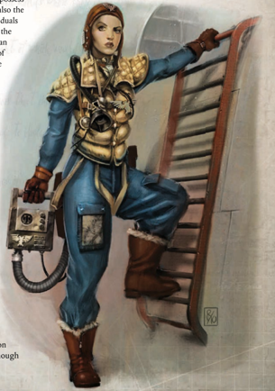

Drusus, bless this sword, that it may cut deep into the flesh of the alien! Drusus, bless this gun, that it may execute my enemies! Drusus, bless this armour, that it might protect your humble servant! Drusus, bless this warrior's soul, that I might bring the light of the God-Emperor to the farthest star! With blessed Drusus in my heart, may I do His work! In the God-Emperor's name!## A Machine of Flesh (talent)

'Greetings, recruits. W elcome to Third Wing. First, this isn't the Navy or whatever mossy pee-dee-eff you came from. You're now with the Phantoms, the finest group of fighting pilots in this hellhole of space, and I'm the finest fighting pilot amongst them. So when I give an order, you' d be wise to treat it as if it comes from the lips of the Emperor himself!'

-Flight Marshal Shioban O'Neill, call-sign 'Viper,' addressing new pilots of the 3rd Fury Interceptor Wing

M any  Void-masters  start  as  pilots,  rising  through the ranks of their homeworld services from small atmospheric craft to system ship and then to mighty starships kilometres in length, such as the ones they serve on now. For some, though, there is no pull to move from graceful fighters  to  big,  lumbering  hulks.  Instead  they  continue  to pilot  small  craft-particularly  deadly  Imperial  fightershoning their skills to the edge of human endurance. For them, there is nothing as pure as a dogfight in the air or in the void, one on one until one is dead and the other victorious. Years of such combat breeds an unparalleled bravado. They are a breed apart, an elite corps like no others. The Flight Marshals who lead these pilots are even more so, for they must possess not only the flying skills to humble their charges, but also the leadership skills to make a group of daredevil individuals into a cohesive combat force. Whether in the cockpit, the briefing room, or the tavern, they have to be better than the best to ensure the continued loyalty and respect of their men. That continued drive for constant excellence sets the Flight Marshal apart.

## Becoming a Genetor

Prerequisites: Pilot  (Flyers  and  Space  Craft)  +20, Pilot (Personal) +10

The Flight Marshall is  simply  the  finest  pilot  in  the sky, the void, or even five meters off the ground on a dare. His reputation is based on considerable skills, alongside  a  meticulously  cultivated  image;  there  are few in the business who are not in awe of his legend. Pirates,  renegades,  blood-red  ork  fightas,  even  the elegant  and  deadly  Eldar  corsairs;  so  far  none  have bested him.

Whenever  making  an  Opposed  Pilot  Test,  if  the Flight Marshal and his opponent both make the same number  of  degrees  of  success,  the  Flight  Marshal counts as winning the Test (in essence, he wins ties). The Flight Marshal also wins ties when making any opposed Interaction Skill Tests with other members of the Imperial Navy.

his  starfighter  is  an  extension  of  himself.  He  can  gauge his  engine's  performance  by  the  pitch  of  the  vibrations through his cockpit even as he can tell how many tonnes of  ordnance  remain  in  his  bays  by  the  sharpness  of  his

Many Flight  Marshals  got  their  start  in  the  local PDF or the Imperial Navy. In the Imperium's military, the Navy is responsible for any flying machines, even those limited to the atmosphere. These pilots hone their skills in atmospheric attack fighters such as the famous  Thunderbolts  or  Lightnings.  Within  these powerful  planes  and  among  a  company  of  other talented  flyers,  the  true  warriors  begin  to  emerge, those who can not only out fly but out think their opponent while issuing  commands and protecting their comrades. They learn to trust only their fellow flyers,  and  know  them  by  the  callsigns  they  earn in  the  air.  Anyone  not  part  of  their  fighter  group is tolerated-or more often ignored. Indeed, many pilots have more respect for their opponents in the air than the ground troops on their own side.

The  finest of these may  pilot voidfighters, duelling in the blackness of space with huge Fury Interceptors and Starhawk Bombers. Such craft are enormous, requiring a small flight crew to augment the pilot's abilities. In time, the pilot bonds with his crew, just as he does with his fellow pilots. They  fly  together,  fight  together,  andeventually-they will die together.

A flyer also forms a strong connection to  his  craft,  growing  to  feel  as  though

| Flight Marshal Advances Advance      |   Cost | Type   | Prerequisites                                       |
|--------------------------------------|--------|--------|-----------------------------------------------------|
| Awareness 20                         |    200 | Skill  | Awareness 10                                        |
| Carouse                              |    200 | Skill  |                                                     |
| Common /ore (Imperial Navy) 10       |    200 | Skill  | Common /ore (Imperial Navy)                         |
| Drive (Skimmer Hoverer) 10           |    200 | Skill  | Drive (Skimmer Hoverer)                             |
| Scholastic /ore (Tactica Imperialis) |    200 | Skill  |                                                     |
| Command 20                           |    200 | Skill  | Command 10                                          |
| Pilot (Personal) 10                  |    200 | Skill  | Pilot (Personal)                                    |
| Air of Authority                     |    200 | Talent | Fel 30                                              |
| Best of the Best                     |    400 | Talent | Pilot (Flyers, Space Craft) 20, Pilot (Personal) 10 |
| Charm 10                             |    200 | Talent | Charm                                               |
| Deadeye Shot                         |    200 | Talent | BS 40                                               |
| Decadence                            |    200 | Talent | T 40                                                |
| Talented (Gamble)                    |    200 | Talent |                                                     |
| Hip Shooting                         |    200 | Talent | BS 40,Ag 40                                         |
| Hotshot Pilot                        |    200 | Talent | Pilot Skill,Ag 40                                   |
| Iron Discipline                      |    200 | Talent | WP30, Command                                       |
| Peer (Imperial Navy)                 |    200 | Talent | Fel 30                                              |
| Sound Constitution                   |    200 | Talent |                                                     |
| Exotic Weapon Training (Choose 2ne)  |    500 | Talent |                                                     |
| Good Reputation (Imperial Navy)      |    500 | Talent | Fel 50, Peer (Imperial Navy)                        |
| Talented (Command)                   |    500 | Talent |                                                     |
| 9oid Tactician                       |    500 | Talent | Int 35                                              |

turning manoeuvres. He and his plane are bonded, and each pilot  lovingly  adorns  his  craft  with  his  callsign,  squadron insignia, and other personalised artwork. Of course, every kill  is  also  prominently  displayed,  depicting  the  type  of craft and the enemy who flew them. Those who fight with mercenary  brigades  or  Rogue  Trader  carrier  wings  may display  their  personal  heraldry  or  the  markings  of  their liege-commander, though this is not always the case. The Voidsharks squadron flying as part of the Bastion Eternal's combat wing became well-known throughout Winterscale's Realm for their reversal of this practice. Their dead metal exteriors, stripped of paint and coloration, reflected the cold and unerring skill each pilot displayed as they calmly shot down every enemy they encountered.

But the Flight Marshal must not only fight, he must also command, an altogether different struggle. Often, the pilots under his command constantly seek to challenge him. Their leader  may  not  be  the  finest  technical  pilot,  but  must  be smarter and sharper, using superior experience and knowledge to demonstrate he can still out fly anyone. He must also be as inspirational as any Ministorum Missionary, motivating his pilots with fiery speeches of death and glory. Knowing what will maintain esprit de corps and keep his flyers the deadliest group in the void is another of the arts a Flight Marshal must learn in order to lead effectively. Pilots know the Emperor guards and guides those who fly through the great spaces of the void, but their Flight Marshal will surely be working with Him every step of the way.

*Source:* `Battle Fleet of the Koronus, pages 80–81`
