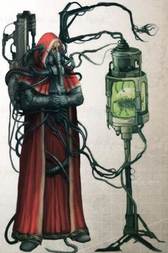

Becoming a Flight Marshal is not often a role a leading pilot will  actively  seek  out-usually  the  role  is  assumed  as  part of a natural progression. Years of flight hones their skills in combat, while years of guiding lesser pilots hones their skills in command. Giving orders becomes second nature, and such is  their  ability  that  few  would  question  their  directives.  To lead  such  a  highly  individualistic  and  strong-willed  group is more than most Imperial officers could tolerate, especially when the flight groups are mercenary or bound to a Rogue Trader's line. Instead of herding unwilling sheep into the fray, a Flight Marshal carefully guides his wolves, tempering their bloodlust and properly directing their fury.

Required Career:

Void-master

Alternate Rank:

Rank 4 or Higher (13,000 xp)

Other  Requirements:

Pilot  (Flyers  and  Space  Craft)

+10, Command## Lostok Augmentation (trait)

'Subject species 'Ork,' height is 218.6cm, 25.56cm above observed mean. Mass is 163.15kg, consisting mostly of dense skeletal structure and musculature, and 31.4% above observed mean. Epidermal layer is thick and lacking in nerve endings compared to the human norm. Pain response is... less than anticipated, demonstrating extreme tolerance for discomfort. Previous test has awakened subject, and it now attempts to free itself. Muscle relaxant administered to reduce disruptive motion, at 460% of human standard dosage-tolerance for chemical influences is considerable. Preparing to open chest cavity...'

-Genetor Aurelius Thoze, Adeptus Mechanicus Xenobiologist.

G enetors are scholars into matters genetic and biological. Sometimes referred to as Magos Biologis, Genetors number alongside the Logis, Artisan and  Magos  ranks  of  the  Adeptus  Mechanicus  as  its  ruling G and  Magos  ranks  of  the  Adeptus  Mechanicus  as  its  ruling G Priesthood, possessing access to knowledge and resources far beyond that  of  the  lesser  Enginseers  and  Lexmechanics.  A Genetor's field of study makes him distinct from the majority of Tech-Priests, their professional obsession with organic life often making them seem strange to their more mechanicallyinclined brethren.

For the most part, Genetors differ little from other TechPriests-they  bear  the  same  manner  of  implants,  venerate information and understanding as the manifestation of divinity, and engage upon the Quest for Knowledge in much the same way. The difference is that they are not so quick to judge flesh and blood as  inferior  to  steel  and  plasma,  seeing  living  creatures as extremely complex and adaptable machines. Where some are content to make this observation distantly, others embrace it,  seeking  to  improve  their  forms  not  with  steel,  but  with better flesh and better blood. To an unknowing observer, a Genetor may appear little different to any other Tech-Priest when  swathed  in  their  robes.  However,  where  most  TechPriests' mass is derived from steel reinforcement and implanted armour plate, a Genetor may have augmented himself with vatmuscle, toughened skin, and organic-reinforced bones instead.

Their interest in the organic is not merely limited to their own  forms,  or  even  to  that  of  humans.  The  study  of  alien genetics, to understand how they function so as to slay them the better, is a common field of study for Genetors, this subsect  collectively  known  as  Xenobiologists.  Such  knowledge is  dangerous,  and  many  Genetors  have  been  condemned  as heretics  for  claiming  the  superiority  of  a  particular  xenos' biology  to  that  of  humans.  Regardless,  the  presence  of  a Genetor,  particularly  a  Xenobiologist,  is  seen  as  an  asset  by Explorator Fleets and Rogue Traders alike, as their knowledge of  human  and  inhuman  forms  allows  them  to  discern  the nature  of  a  newly-encountered  Xenos  or  indiginous  species, or categorise a new strain of abhuman found on a far-flung world.

Within  the  Calixis  Sector,  Genetors  have  a particularly illustrious history- Xenobiologists in  great  numbers  joined  with  the  Angevin Crusade to study the aliens native to the

## Becoming a Gland Warrior

Talent  Groups: Brute,  Clawed/Fanged,  Feels  No Pain, Multiple Arms, Nightsider, Regeneration, Sonar Sense, Sturdy, Tough Hide, Venomous, Winged Flesh is  not  a  weakness as far as you are concerned, but rather a font of untapped potential. Locked within your genes and your tissues are the secrets to greater power, and though you do not eschew the purity of steel  nor  your  existing  implants,  you  see  them  only as  part  of  the  mechanism  by  which  you  can  better yourself.  You  gain  one  of  the  following  mutations: Brute,  Clawed/Fanged,  Feels  No  Pain,  Nightsider, Tough  Hide,  or  Venomous,  or  one  of  the  following Traits: Regeneration, Sonar Sense or Sturdy. You gain that Trait or the effects of the Mutation (although, as you  are  either  grafting  biological  systems  into  your body  or  manipulating  your  own  genetic  structure, whether or not you are actually a mutant is debatable).

region as their realms were shattered by the forces of the Imperium. Since that time, they have remained a noteworthy, if  often  overlooked,  element  of  Cult  Mechanicus  politics within the Lathes and beyond, and they gather in significant numbers  to  join  expeditions  into  the  Koronus  Expanse, seeking  to  be  the  first t o

| Genetor Advances Advance               |   Cost | Type   | Prerequisites                          |
|----------------------------------------|--------|--------|----------------------------------------|
| Chem-8se                               |    200 | Skill  |                                        |
| Common /ore (.oronus Expanse)          |    200 | Skill  |                                        |
| Common /ore (Machine Cult) 20          |    200 | Skill  | Common /ore (Machine Cult) 10          |
| Common /ore (Tech) 20                  |    200 | Skill  | Common /ore (Tech) 10                  |
| Common /ore (War)                      |    200 | Skill  |                                        |
| Dodge 10                               |    200 | Skill  | Dodge                                  |
| Forbidden /ore (Adeptus Mechanicus) 20 |    200 | Skill  | Forbidden /ore (Adeptus Mechanicus) 10 |
| Forbidden /ore (Mutants)               |    200 | Skill  |                                        |
| Forbidden /ore (;enos)                 |    200 | Skill  |                                        |
| Medicae 10                             |    200 | Skill  | Medicae                                |
| Navigation (Surface)                   |    200 | Skill  |                                        |
| Scholastic /ore (Beasts)               |    200 | Skill  |                                        |
| Scholastic /ore (Chymistry)            |    200 | Skill  |                                        |
| Tech-8se 20                            |    200 | Skill  | Tech-8se 10                            |
| Trade (Chymist)                        |    200 | Skill  |                                        |
| Trade (Chymist) 10                     |    200 | Skill  | Trade (Chymist)                        |
| Trade (Explorator)                     |    200 | Skill  |                                        |
| Forbidden /ore (Mutants) 10            |    300 | Skill  | Forbidden /ore (Mutants)               |
| Forbidden /ore (;enos) 10              |    300 | Skill  | Forbidden /ore (;enos)                 |
| Scholastic /ore (Beasts) 10            |    300 | Skill  | Scholastic /ore (Beasts)               |
| Forbidden /ore (Mutants) 20            |    500 | Skill  | Forbidden /ore (Mutants) 10            |
| Forbidden /ore (;enos) 20              |    500 | Skill  | Forbidden /ore (;enos) 10              |
| Scholastic /ore (Beasts) 20            |    500 | Skill  | Scholastic /ore (Beasts) 10            |
| Feedback Screech                       |    200 | Talent | Mechanicus Implants                    |
| /uminen Shock                          |    200 | Talent | Mechanicus Implants                    |
| Nerves of Steel                        |    200 | Talent |                                        |
| Peer (Adeptus Mechanicus)              |    200 | Talent |                                        |
| Resistance (Poison)                    |    200 | Talent |                                        |
| AMachine of Flesh x3                   |    500 | Talent |                                        |
| Master Chirurgeon                      |    500 | Talent | Medicae 10                             |

encounter new life to dissect and analyse.

Three  distinct  philosophies  exist  amongst  the  Calixis Sector's Genetors. The first and oldest is the Primus Humanum which espouses the purity of the human form as a vessel for knowledge, viewing the Emperor's form as that of the ideal human  and  that  of  the  perfect  vessel  for  knowledge.  The second and presently most dominant amongst the Genetors of  the  Lathes  are  collectively  known  as  Apexists,  believing that  adversity  breeds  strength  in  the  organic,  and  that  the perfect  organism  is  the  one  that  has  overcome  every  rival and every  challenge;  the  philosophy  itself  is  an  adaptation of the writings of an ancient pre-Imperial scholar. The third philosophy, currently gaining favour amongst more widelytravelled Genetors and causing concern  amongst  more traditional Genetors, is espoused by the Companions of Vogel, whose leader, Heydrich Vogel, returned from a century-long expedition into the Koronus Expanse and began preaching a creed of forced genetic and biological augmentation in order to strengthen humanity for the troubles ahead. Some believe that Vogel's ideology verges upon heresy, and its suggestion that humanity is somehow insufficient in its current state is seen by many as being a blasphemy in its own right.

*Source:* `Battle Fleet of the Koronus, pages 82–83`
