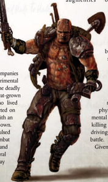

The difference between a Genetor and a more conventional Tech-Priest  is  one  of  training,  aptitude  and  focus.  As  is  so frequently the case in the Adeptus Mechanicus, understanding begets  power,  which  in  turn  begets  knowledge,  and  only those who possess the will and the wit to understand that knowledge can properly obtain any form of status amongst their kind.

A particular and unusual disposition is required to become a  Genetor;  the  tendency  to  view  organic  life  as  a  form  of machine in its own right, rather than as the weak fleshy shell many Tech-Priests view it as. Beyond this, however, it takes mainly dedication and research for an Explorator to become a Genetor, using his knowledge of the organic sciences to aid in the exploration of the realms beyond the Imperium.

Required Career:

Alternate Rank: Rank 3 or Higher (10,000 xp) Other  Requirements: Toughness  of  35  or  higher,  an  Intelligence  of  40 or  higher,  and  possess  the  Autosanguine  and Prosanguine Talents.

Explorator The  Explorer  must  have  a## Elite Advance

'The killing rush, it's stronger than Slaught, hypes me better than Frenzon. I' d kill to taste it... even kill you to taste it.'

-Ryant Gos, Gland Warrior Mercenary

T o act as an Arch-Militant means being one of the finest warriors  humanity has to offer.  Having  risen  through the ranks or up from the underhives, survived countless battles  and  killed  endless  foes,  it  would  be  easy  to  believe such a person is more than a match for any opponent. The longer spent fighting in the Expanse, however, the more one realises  that  being  merely  human isn't  always  good enough. For some this means improved martial disciplines, mechanical augmentics,  or  superior  weaponry.  There  is  another  path though,  infamously  rumoured  through  the  undercircuit  of mercenaries  and  pit  fighters  and  all  others  who  make  their living by the bolter and chainsword-to submit to the flesh manipulations of the Adeptus Mechanicus and become a Gland Warrior.

The  quest  of  improving  the  human  body  as  a  fighting machine has been ongoing for millennia-the Holy Emperor's favoured sons, the Adeptus Astartes, are living examples of this quest. The Adeptus Mechanicus favour a more direct approach, simply replacing troublesome flesh and blood with the purity of plasteel and circuitry in order to create forces like the Skittari Tech-Guard. However, the secrets of these processes are jealously

guarded and often too time-consuming for  the  needs  of  the  Imperium's  war machine,  so other techniques  have been explored. For many centuries the Genetors  of  the  Adeptus  Mechanicus strived  to  improve  the  flesh  itself  via series  of  operations  and  implantations which  could  be  done  in  a  relatively short  period  of  time.  Finally ,  on  the forge worlds of Dantis III, they achieved success. An unexpected Tyranid invasion had  caught  the  system  unawares,  and only the nearby Imperial Guard regiment on Lostok was able to offer any defence. Unfortunately,  the  heavily-polluted  planet was already covered with vile Tyranid organisms, rendering combat outside the factory complexes nearly impossible. Several companies of the toughest guardsmen volunteered for experimental surgeries to allow them to fight effectively in the deadly environment.  Implanted  with  series  of  new  vat-grown organs  and  drug-secreting  glands,  those  who  lived through the process could now fight unprotected on the surface and counter the horrific creatures with an

inhuman aggressiveness and ferocity of their own. After many months, the swarm was repulsed and  the  few  survivors  of  the  combat were recovered for further study and examination. Of  those, several were  quickly  plucked  away

## Instinctual Understanding (trait)

The Lostok process introduces a series of new organs and  glands  to  a  Gland  Warrior's  body,  allowing  it to  survive  in  more  toxic  environments  as  well  as fight even more fiercely than before. These duplicate  the  effects  of  a  Respirator  and  make  them immune to most Toxins (including the extra damage dealt by weapons with  the Toxic  quality).  Their  new glands also act as  Injectors containing Frenzon, Slaught, Stimm, and  Spur.  The  user  may  activate their  implant  glands  to produce any of these drugs as a Free Action requiring a Routine (+20) Willpower Test for each dosage. A Failure means that gland has malfunctioned,  and  will  need  1d5  days  to  recover. Other newly added organs are designed to filter away any chemical by-products of the dosages, so the user does  not  need  to  take  any  tests  afterwards for ill effects.  The  augmented  physiology will also ward off any  effects  of  excessive  drug  use  (see  page  142  of Rogue Trader).

by Inquisitors  and  others  wishing  to  have  such  an  individual fighting at their side (or in their name).

The  process  of  creating  Gland  Warriors  is  more  art  than science, like much of the Imperium's works. Despite this, many more  of  these  augmented  humans  have  appeared  in  wars throughout  the  Imperium,  and  have  acted  more  covertly  as assassins. Their exploits became legends amongst the Imperial Guard  regiments  which  have  seen  action  with  them.  In  the Calixis Sector, detatchements of Gland Warriors have been used effectively in the hive war on Tranch, where their ferocity matches that of their mutant foes. While most Imperial Guard armies in the sector do not normally contain Gland Warrior units, some elite  formations  do  feature  these  specialised  squads.  It  is  even

whispered that entire fighting regiments of these fleshaugmentics operate  in  the  more  desperate  and hellish warzones of Calixis.

While the surgeries that produce these once-men  are somewhat short, it takes many months for the recipient to learn how to properly utilise their new biological  additions,  assuming  the soldier  survives  the  process.  Even soldiers  already  used  to  fighting with the aid of combat drugs must re-learn how to use their body in order to make use of their newlyheightened motor functions and more-durable physiology. The physical changes can also bring about mental  ones,  increasing  one's  focus  on killing and combat until there is little else driving them but impatience for the next battle.

Given  the  nightmarish  conditions  they often  fight  in,  it  is not uncommon

| Gland Warrior Advances          | Gland Warrior Advances   | Gland Warrior Advances   | Gland Warrior Advances       |
|---------------------------------|--------------------------|--------------------------|------------------------------|
| Advance                         | Cost                     | Type                     | Prerequisites                |
| Chem-8se                        | 200                      | Skill                    |                              |
| Chem-8se 10                     | 200                      | Skill                    | Chem Use                     |
| Common /ore (Imperial Guard) 10 | 200                      | Skill                    | Common /ore (Imperial Guard) |
| Common /ore (.oronus Expanse)   | 200                      | Skill                    |                              |
| Battle Rage                     | 200                      | Talent                   | Frenzy                       |
| Blind Fighting                  | 200                      | Talent                   | Per 30                       |
| Chem Geld                       | 200                      | Talent                   |                              |
| /ight Sleeper                   | 200                      | Talent                   | Per 30                       |
| Nerves of Steel                 | 200                      | Talent                   |                              |
| Paranoia                        | 200                      | Talent                   |                              |
| Sound Constitution (x2)         | 200                      | Talent                   |                              |
| Berserk Charge                  | 500                      | Talent                   |                              |
| -aded                           | 500                      | Talent                   | WP 30                        |
| Sprint                          | 500                      | Talent                   |                              |
| Swift Attack                    | 500                      | Talent                   | WS 35                        |
| 8narmed Warrior                 | 500                      | Talent                   | Ag 35                        |
| Autosangine                     | 600                      | Talent                   |                              |

for Gland Warriors to decide they would rather pick who and when they will fight than depend on the whims of a superior officer. Many become mercenaries, prized through the sector and  beyond.  In  the  Expanse  there  are  also  Genetors  both authorised and renegade willing to work their operations on existing warriors to transform them from human to more than human. Here their life is filled with blood, for there is always a  conflict  that  needs  fighters  of  their  calibre.  Membership in warrior lodges is not uncommon, for they often find true fellowship only in the company of other augmentics. These secretive  cults  often  draw  the  attention  of  the  Inquisition, even in the lawless reaches beyond the Imperium's rule. The Red Night Brotherhood is just one of the lodges destroyed by massed Imperial forces lead by the Ordo Hereticus, but there are many others where the more feral Gland Warriors gather,  and  what  they  may  discuss  beyond  the  heavy  fur there are many others where the more feral Gland Warriors gather,  and  what  they  may  discuss  beyond  the  heavy  fur lodge curtains no one can say. Most Rogue Traders are willing to turn a blind eye to such activities as long as the warrior continues his duties and maintains his loyalty, but a vigilant continues his duties and maintains his loyalty, but a vigilant trader will always keep an eye on every member of his crew.

## Shamanic Powers (trait)

While some careers are the result of specialised training or years of intensive studies, the transformation to a Gland Warrior is due primarily to a series of surgeries. These introduce tox-filters into their lungs and bloodways as well as artificial vat-grown organs  and  drug-producing  gland  implants,  all  designed  to greatly augment an already formidable fighter to levels normally impossible to attain otherwise. Only those of sufficiently strong constitution and combat expertise would be selected for the process, and only those with a sufficiently strong will to live despite  the  agonies  associates  with  the  process  will  survive it. Once they have adapted to their newly augmented bodies though, they are death incarnate in combat.

Required Career:

Arch-Militant

Alternate Rank: Rank 4 or Higher (13,000 xp) Alternate Rank: Rank 4 or Higher (13,000 xp)

The character must have a Toughness Other Requirements: The character must have a Toughness of 40 or higher, and must posses the Melee Weapon Training (Universal), True Grit, and Die Hard Talents. (Universal), True Grit, and Die Hard Talents.

Traits: All Gland Warriors receive the Lostok Augmentation Trait upon taking the Alternate Rank.

+earest Ingraine, Although I have often said you must be willing to use whatever resources are available, I warn you to be cautious of the gland warriors. Though they do indeed live up their reputation, they are a dangerous and unpredictable lot. The glands and organs that boost their combat abilities also send a berserker fury through their veins. I have heard dark tales of gland warrior bodyguards falling on those whom they were supposed to protect, overwhelmed by bloodlust. +o not tell our aristocratic cousins, but I would sooner trust a barbarian 2root with my safety. At least they are loyal so long as the money lasts. ©A. A.

85

85

*Source:* `Battle Fleet of the Koronus, pages 84–86`
