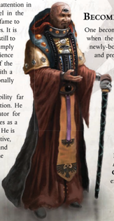
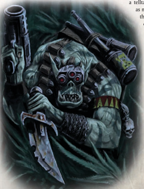

One becomes a Navis  Scion  while  still  in  infancy, when  the  elders  of  a  Navigator  House  select  a newly-born  child,  one  free  of  prenatal  mutation, and prepare for it a life of higher education and

social tutoring. Navis  Scions  are  still trained to harness their natural abilities to  perceive  the  Warp  and  direct  the course  of  mighty  voidships,  but  are also  tutored  in  history,  literature,  and the realities of Imperial politics. Though their  skill  in  the  art  of  navigation  may suffer,  Scions  emerge  from  the  their studies  with  sharp  minds  and  sharper tongues,  ready  to  represent  their  House in all things.

Required Career: Navigator Alternate Rank: 1 (5,000 xp) only. Other Requirements: Due to their excessive mutations and marginalised existence at the fringes of Imperial society, Navigators of the  Renegade  Houses cannot select this Alternate Career.

| Navis Scion Advances             | Navis Scion Advances   | Navis Scion Advances   | Navis Scion Advances   |
|----------------------------------|------------------------|------------------------|------------------------|
| Advance                          | Cost                   | Type                   | Prerequisite           |
| Barter                           | 100                    | Skill                  |                        |
| Ciphers (Nobilite Family)        | 100                    | Skill                  |                        |
| Carouse                          | 100                    | Skill                  |                        |
| Performer (Storyteller)          | 100                    | Skill                  |                        |
| Scholastic Lore (Heraldry)       | 100                    | Skill                  |                        |
| Scholastic Lore (Navis Nobility) | 100                    | Skill                  |                        |
| Carouse +10                      | 200                    | Skill                  | Carouse                |
| Charm                            | 200                    | Skill                  |                        |
| Commerce                         | 200                    | Skill                  |                        |
| Inquiry                          | 200                    | Skill                  |                        |
| Speak Language (Trader's Cant)   | 200                    | Skill                  |                        |
| Trade (Soothsayer)               | 200                    | Skill                  |                        |
| Disguise                         | 500                    | Skill                  |                        |
| Charm +10                        | 500                    | Skill                  | Charm                  |
| Commerce +10                     | 500                    | Skill                  | Commerce               |
| Peer (Government)                | 100                    | Talent                 | Fel 30                 |
| Peer (Nobility)                  | 100                    | Talent                 |                        |
| Decadence                        | 500                    | Talent                 | T 30                   |
| Good Reputation (choose one)     | 500                    | Talent                 | Fel 50, Peer           |
| Hard Bargain                     | 500                    | Talent                 |                        |

Note: Although this Rank replaces Rank 1 of the Navigator Career, it does not re-list the Navigator's starting Skills and Talents. All Skills and Talents listed here are in addition to the Navigator's starting Skills and Talents.

¨Entrusted  aboard  the  Naval  scout  Vigilo  Umbra,  en-route  to  Port  Wander  from  9itammeron, 0  .81 .M41.

To my faithful daughter and heir , the Lady Igraine Armengarde, It  is  my  regrettable  duty  to  inform  you  that  our  dynasty's  senior  Navigator ,  Mondrovax  Brom, has taken his place at the foot of the .olden Throne. Though you knew him only as a jovial old man with boney knees, I shall forever remember him as a sage, explorer , confidante, and friend. No one can replace him in my heart. But someone must replace him aboard the Bansidhe. For this reason the Bansidhe rendeavoused with the Splendour Unknowing, a highliner maintained by /ouse Aleene. It was aboard this stately craft that I had the pleasure meeting Mondovus .ral. Expecting to deal with /ouse functionaries, it came as a surprise when a charming young navigator greeted me at the main airlock. Though his third eye was evident, he exhibited nothing in the way of  obvious  mutation.  Though  he  was  unnaturally  pale  for  one  so  young,  he  nevertheless  possessed strikingly handsome features and charm to match. We spent much of the evening discussing Mondrovax with obvious fondness in our voices. Mondovus, as it happened, is Mondrovax's maternal nephew, and had many a tale to tell about his uncle's exploits before his service to the Armengarde dynasty. We bantered long into the night, and raised many a toast to well-remembered Mondrovax. In the  midst  of  that  night  of  fond  reminiscences,  we  managed  to  negotiate  a  contract  between  the Armengarde  dynasty  and  /ouse  Aleene.  A  skilful  navigator  once  again  guides  the  Bansidhe through the turbulent routes of the Expanse. What a pity that it could not be Mondovus.

Yours in mourning, Lord-Captain Aoife Armengarde

Bearer of the Armendarde Warrant and master of the cruiser Bansidhe## Becoming an Ork Mekboy

'Da ooman base iz got walls an' fings, see. So, if I'z goes up to da wall, all sneaky-like, and blows it up wiv me bombs, den dere'll be an 'ole in da wall wot da ladz can go fru, see. So, when you'z lot 'ears sumfing go boom, you charge,' cos dere'll be an 'ole in da wall. Unnastand?'

-Snikskin, Ork Kommando, explaining a plan to a group of other Orks

F ew people would ever think of Orks as a subtle species. Generally speaking, few Orks think of themselves as subtle.  Kommandos  are  different,  the  exception  that proves  the  rule.  Rare  enough  that  many  Imperial  Guard commanders refuse to believe in their existence, Kommandos are  nevertheless  an  example  of  Orks  breaking  from  the stereotype  of  witless,  bestial  monsters  that  most  humans believe them to be.

Many Kommandos are Blood Axes in origin, having learnt from and adopted a range of human battlefield tactics, such as the use of camouflage, stealth and surprise. In spite of the generally boisterous and unsubtle inclinations of Orks, they are remarkably successful in their chosen role as infiltrators, guerrillas and masters of psychological warfare, turning the belief that Orks could never sneak up on someone to their advantage by doing just that. The shock of their success at closing on enemies unseen is a terrifying thing, for even a small Ork (small being a relative term) is a deadly combatant in its own right, more than capable of

tearing apart enemies with only the  most  basic  of  weaponry. At  close  range,  an  Ork  is  at its deadliest, and its enemies have  few  opportunities  to bring  such  a  resilient  beast down by the time it reaches melee. The notion of having such a creature in your midst without warning, then, is not one that any soldier wishes to contemplate.

Compounding  matters  is that other Orks have come to the  conclusion  that  sneaking towards an enemy and putting bombs on them without anyone  noticing  is  not  only great  fun,  but  is  also  highly effective. Consequently, many Kommandos are experts  in  demolition,  using the  crude  but  spectacular explosives made by

## Worky Gubbinz (talent)

Prerequisites: Ork,  Concealment  +10,  Silent  Move +10

The  prospect  of  an  Ork  bursting  from  a  concealed position and attacking is an unsettling one to say the least,  and  the  few  who  survive  the  experience  never forget  the  sight  of  a  hulking  green-skinned  monster appearing  nearby  with  a  gigantic  blade  in  hand. During any turn in which the Ork Kommando begins unseen by  his  enemy  and chooses  to reveal itself and attack them, he counts as having the Fear (1) Trait-or if  he  already  has  the  Fear  Trait,  he  counts  his  Fear Trait as one hgiehr than normal.

Mekboys  to  breach  bunkers  and  set  traps.  Their  tendency towards demolitions is both a matter of tactical effectiveness and of mutual competition-seeing which Kommandos can sneak  the  closest,  plant  the  biggest  bombs,  and  cause  the biggest explosions without ever being spotted. For all their inclination  towards  stealth,  Kommandos  are  still  Orks,  and the chance to cause a good explosion is a hard thing to pass up.

Many Kommandos take their work very seriously, smearing  their  bodies  in  paint  and  wearing  camouflaged clothing  (neither  of  which  is  necessarily  in  the  correct colours  to  actually  conceal  the  Ork;  Ork  camouflage  is  of extremely  variable  effectiveness),  stripping  down  to  carry as  little  equipment  as  possible,  and  even  smearing  their weapons with soot or mud to eliminate

a  telltale  gleam.  Their  inclination, as masters of stealth in a society that barely understands the concept,  is  to  be  'sneaky' at all times, lurking in shadows, hiding behind piles of scrap and moving as quietly as possible for  as  much  of  the  time as  possible.  Other  Orks tend  either  not  to  notice or not to care, which means  that  Kommandos go  unperturbed  for  great lengths of time, or at least until  they  get  bored  and leap from their hiding place to attack.

As mercenaries, Kommandos are considered quite valuable. Being predominantly Blood Axes, Kommandos often have little compunction about

| Ork Kommando Advances Advance      |   Cost | Type   | Prerequisites                       |
|------------------------------------|--------|--------|-------------------------------------|
| Barter 10                          |    200 | Skill  | Barter                              |
| Common /ore (2rks) 20              |    200 | Skill  | Common /ore (2rks) 10               |
| Common /ore (War) 20               |    200 | Skill  | Common /ore (War) 10                |
| Concealment                        |    200 | Skill  |                                     |
| Concealment 10                     |    200 | Skill  | Concealment                         |
| Concealment 20                     |    200 | Skill  | Concealment 10                      |
| Demolition                         |    200 | Skill  |                                     |
| Demolition 10                      |    200 | Skill  | Demolition                          |
| Demolition 20                      |    200 | Skill  | Demolition 10                       |
| Shadowing                          |    200 | Skill  |                                     |
| Shadowing 10                       |    200 | Skill  | Shadowing                           |
| Shadowing 20                       |    200 | Skill  | Shadowing 10                        |
| Silent Move                        |    200 | Skill  |                                     |
| Silent Move 10                     |    200 | Skill  | Silent Move                         |
| Silent Move 20                     |    200 | Skill  | Silent Move 10                      |
| Speak /anguage (2rk) 20            |    200 | Skill  | Speak /anguage (2rk) 10             |
| /ight Sleeper                      |    200 | Talent | Per 30                              |
| Sound Constitution (x2)            |    200 | Talent |                                     |
| Talented (Intimidate)              |    200 | Talent |                                     |
| Forbidden /ore (;enos) 10          |    300 | Skill  | Forbidden /ore (;enos)              |
| Heavy Weapon Training (Choose 2ne) |    300 | Talent |                                     |
| Ded µArd                           |    500 | Talent | 2rk, µArd, T 50                     |
| Ded Sneaky                         |    500 | Talent | 2rk, Concealment 10, Silent Move 10 |
| Dual Strike                        |    500 | Talent | Ag 40, Two-Weapon Wielder (Melee)   |
| Exotic Weapon Training (Any 2ne)   |    500 | Talent |                                     |
| Swift Attack                       |    500 | Talent |                                     |
| Two-Weapon Wielder (Ballistic)     |    500 | Talent | BS 35,Ag 35                         |
| 8narmed Warrior                    |    500 | Talent | WS 35,Ag 35                         |

working for a human, and they eagerly accept payment in all  manner  of  human-made  wargear.  More  importantly, their  understanding  of  stealth  tactics  makes  them  far  more controllable and practical than most other Ork Freebooterzas Orks who know how to keep quiet and wait for things, they  are  far  less  of  a  liability  than  any  other  Ork  in  tense situations,  and  they  don't  lack  for  any  of  an  Ork's  normal proclivity for violence. For the Kommando, the benefits are notable  as  well-lacking  appreciation  of  his  skill  from  his own kind, and eager to learn more of this 'sneaky kunnin'' from the humans that inspired his particular ilk in the first place, Kommandos find working for humans to be a valuable experience, at least until they get bored and decide humans would be more entertaining to fight.

Amongst those soldiers who frequently face Orks, Kommandos are considered some of the most terrifying to face, because they differ so greatly from what is considered to be standard Ork tactics. In many cases, experienced bands of  Kommandos  have  learnt  to  play  on  this  fear,  engaging in  practices  such  as  scalping,  or  taunting  their  foes  while concealed, in order to inspire further dread.

*Source:* `Battle Fleet of the Koronus, pages 91–93`
