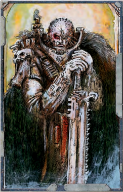
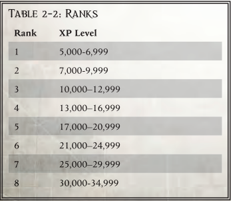

## Description

In each [Career](chargen-stage2-origin-path.md) Path section, you can find a description and illustration  to  help  give  you  some  ideas  about  what  your character  might  be  like.  This  section  tells  you  a  little  bit

about the background for the career and how it fits into the Imperium as a whole.

## Rank Chart

Each [Career](chargen-stage2-origin-path.md) Path is divided into a series of Ranks. This chart tells you the progression necessary to reach a certain Rank.

## Characteristic Advance Scheme

Each [Career](chargen-stage2-origin-path.md) Path allows you to improve your character's raw abilities, or [Characteristics](starship-anatomy-detailed.md). Depending on the nature of the [Career](chargen-stage2-origin-path.md) Path, some [Characteristics](starship-anatomy-detailed.md) are more difficult to increase than others.  This  chart  lists  the  cost  of  each  Characteristic Advance you can take.

## Rank Advance Scheme

For each Rank within your [Career](chargen-stage2-origin-path.md) Path, you will find a table that shows you what new abilities your character can learn, and what you must do in order to learn them.

## Character Advancements

'I want every man-jack of you to learn your mate's duties as well as yer own. Don't assume he'll be breathin' when the fighting starts.'

-Boatswain Flint aboard the [Sabre](rogue-trader-vessel-example.md)

As you adventure through the 41st Millennium, your character  will  have  plenty  of  opportunity  to  improve.  Y our Game Master will reward you with [Experience Points](economy-rewards-measure-of-success.md) that you can spend to further develop your character. Each [Career](chargen-stage2-origin-path.md) has plenty of room for you to customise your character and make him unique.

There are three types of improvements you can select for your character:

- Characteristic Advance-Increases your raw abilities ·
- Rank Increase-Opens new training opportunities ·
- Skill or Talent [Advance](combat-advance-action.md)-Learn new Skills or Talents · In addition to the Advances listed for the Ranks within your  [Career](chargen-stage2-origin-path.md)  Path,  sometimes  your  GM  will  allow  you  to purchase an Elite Advance. See page 39 for more on this.

### Characteristic Advance

A Characteristic  [Advance](combat-advance-action.md)  is  an  increase  to  your  character's raw abilities.  When  you  buy  a  Characteristic  Advance,  you add +5 to the Characteristic on your character sheet.

Characteristic Advancements are divided into four progression levels. These are as follows:

- Simple: · A small fulfillment of your potential.
- Intermediate: · A significant improvement to your capabilities.
- Trained: · Active,  focused  effort  upon  improving  your prowess.
- Expert: · The limit of your natural capabilities.

As  you  set  about  increasing  a  Characteristic,  you  must progress  through  each  of  the  progression  levels  in  turn, starting at Simple and ending with Expert.

The costs for these increases for each [Career](chargen-stage2-origin-path.md) are listed in the relevant [Career](chargen-stage2-origin-path.md) section in a table, which looks like this:

### Rogue Trader Characteristic Advance Scheme

| Characteristic   | Simple   | Intermediate   | Trained   | Expert   |
|------------------|----------|----------------|-----------|----------|
| Willpower        | 250 xp   | 500 xp         | 750 xp    | 1,000 xp |

As you can see, the first +5 increase to a Rogue Trader's Willpower  costs  250  xp;  the  next  +5  (the  Intermediate progression level) costs 500 xp; a further +5 improvement (the  Trained  progression  level)  costs  750  xp;  while  the final  possible  improvement  (Expert  progression  level)  costs 1,000 xp.

The costs for Characteristic Advances are cumulative. So you  couldn't  just  pay  500  xp  for  a  +10  increase.  Instead, you'd pay 250 xp for the Simple [Advance](combat-advance-action.md), and then pay 500 xp for the Intermediate Advance.

### Example

Jonas wants to increase the Willpower of his Rogue Trader character. His starting Willpower is 34, and it will cost Jonas 250 xp to buy the Simple Willpower [Advance](combat-advance-action.md). He spends 250 xp, increasing his character's  Willpower  to  39.  Jonas  wants  to  raise  his  character's Willpower even higher, so he spends another 500 xp (the cost of the Intermediate Advance) to increase his Rogue Trader's Willpower by another +5. In the end, Jonas's Rogue Trader has increased his Willpower to 44 (34+5+5=44), and has spent 750 xp to do so (250+500=750).

| Table 2-1: Careers [Career](chargen-stage2-origin-path.md)   | Description                                           |   Page |
|-----------------------------|-------------------------------------------------------|--------|
| [Arch-militant](career-arch-militant.md)               | Warriors without [Peer](talents-descriptions.md), leaders of soldiers            |     44 |
| [Astropath Transcendent](career-astropath-transcendent.md)      | Communicators of the Imperium, [Soul-bound](character-traits.md) psykers     |     48 |
| [Explorator](career-explorator.md)                  | Masters of machinery, seekers of ancient technology   |     52 |
| [Missionary](career-missionary.md)                  | Emissaries of the Emperor's word, healers and leaders |     56 |
| Navigator                   | Mutants, pilots of [The Warp](warp-imperial-space-travel.md)                           |     60 |
| Rogue Trader                | Masters of starships, leaders, diplomats, and rogues  |     40 |
| [Seneschal](career-seneschal.md)                   | Keepers of secret knowledge, subtle investigators     |     64 |
| [Void-master](career-void-master.md)                 | Pilots, gunners, and masters of space                 |     68 |## Ranks

Your  Rank  is  a  general  measure  of  your  experience  and capabilities. It represents the progression of your character's abilities as he grows in wealth, power, and status. Y our Rank is determined by the total amount of [Experience Points](economy-rewards-measure-of-success.md) your character has spent. The Advancement Scheme for each Rank has  a  combination  of  Skills  and  Talents,  which  you  may purchase with xp.

You  may  buy  Advances  from  any  Rank  Advancement Scheme that you currently hold or have previously held.

As  your  Rank  rises,  you  have  access  to  more  and  more Advancement Schemes, and therefore have more options on how to customise your character.

As with Characteristic Advances, it is easy to gain Ranks to start with, but it becomes progressively harder throughout the life of your character.

Each  [Career](chargen-stage2-origin-path.md)  Path  has  unique  Ranks.  As  your  character progresses in power, you may sometimes find yourself eligible for two or more Ranks. When this occurs, you must make a choice between the Ranks available to you.

Some of the greater Ranks have prerequisites attached to them.  These  are  things  like  Skills,  Characteristic  levels,  or previous Ranks that you must possess before you can choose a particular Rank.

### Gaining Ranks

Characters automatically gain Ranks by spending xp. Once a character's total spent xp reaches the necessary amount, the character's Rank increases. Note that Rank increases always occur after an [Advance](combat-advance-action.md) has been taken.

All Careers in Rogue TRadeR require the same amount of xp in order to increase in Rank. The xp needed to advance in Rank is listed on the table below.

| Table   | 2-2: Ranks    |
|---------|---------------|
| Rank    | XP Level      |
| 1       | 5,000-6,999   |
| 2       | 7,000-9,999   |
| 3       | 10,000-12,999 |
| 4       | 13,000-16,999 |
| 5       | 17,000-20,999 |
| 6       | 21,000-24,999 |
| 7       | 25,000-29,999 |
| 8       | 30,000-34,999 |

### Example

Jonas's  Rogue  Trader  has  spent  9,800  xp  in  total  on  various Advances. In the course of the game, Jonas earns an additional 250 xp,  which  he  decides  to  spend  on  a  Characteristic  [Advance](combat-advance-action.md).  He receives permission from his GM to take the Advance, then crosses the 250 xp from his unspent xp amount. He notes down the Advance on his character sheet and alters his Characteristic Profile to reflect the  Advance  he  took.  Finally  he  adds  the  250  xp  to  his  current xp total. Jonas now has spent 10,050 xp (9,800+250=10,050). When he consults the Rogue Trader Ranks, he sees he has enough xp to earn Rank 3 Rank. He removes his old Rank (2) and notes that his character is Rank 3 on his character sheet.

## Skill and Talent Advances

A  Skill  [Advance](combat-advance-action.md)  teaches  you  a  new  Skill  or  improves  an existing  Skill  to  make  it  more  effective.  A  Talent  Advance gives you a knack or aptitude for something.

Depending on your [Career](chargen-stage2-origin-path.md) choice, some Skills and Talents are  easier  to  learn  than  others.  A  scholarly  [Seneschal](career-seneschal.md),  for [Example](rules-tests.md), would have to spend far fewer [Experience Points](economy-rewards-measure-of-success.md) to learn Logic than an [Arch-militant](career-arch-militant.md) would. The wide range of Skills and Talents allows you to customise your character as you wish.

### Prerequisites

If you take a look at the listed Advances for each Rank, you'll notice some require you to have a Talent or a Characteristic at a particular rating. Y ou must meet all the listed prerequisites before purchasing such an [Advance](combat-advance-action.md). If you are ever in doubt about  a  prerequisite,  ask  your  GM,  who  can  overrule  or change prerequisites as he wishes.

### Buying an Advance

Buying an Advance is simple. Once you have had a good look at your Advancement Schemes, and chosen what you want to buy, follow these steps:

-  Check  with  the  GM  to  make  sure  the  [Advance](combat-advance-action.md)  you'd like is available (the GM may restrict certain Skills and Talents to meet the needs of the [Campaign](rules-campaign.md), or he might offer a better option).
-  Deduct  the  Advance's  cost  from  your  current  pool  of [Experience Points](economy-rewards-measure-of-success.md).
-  Write down the name of the Advance in the Advances section of your character sheet.
-  Apply any changes to [Characteristics](starship-anatomy-detailed.md), Skills, Talents, or [Traits](character-traits.md) that the Advance brings.
-  Finally, add the newly spent xp to your total spent xp.

As you undertake adventures, you will earn more [Experience Points](economy-rewards-measure-of-success.md) as a reward for good roleplaying, completing missions, and for coming up with clever ideas. These [Rewards](economy-rewards.md) allow you to buy further Advances for your character.

Certain Advances have a multiplier listed after their name (x2, x3, etc.) Advances with a multiplier may be purchased multiple  times  at  that  Rank,  up  to  a  maximum  number  of times equal to the multiplier.### Deciding How to Advance Your Character

Figuring out which Advances you should take can be a little daunting at first. Whilst Characteristic Advances are expensive, they do have wide-ranging effects on your character's ability. Meanwhile, Skills and Talents are relatively cheap and open a lot of new opportunities. Y ou will need to decide if you want to focus on improving your core abilities, to concentrate on [Gaining Skills](skills-gaining.md) and Talents, or to forge a compromise between the two tactics.

You can expect to gain around 500 xp with each session of play, provided you are reasonably successful and roleplay well. When planning your Advances, you might find it handy to use that amount as a measure of how long it will take you to gain a  certain  improvement. For [Example](rules-tests.md), a Trained +5 Weapon Skill Advancement which costs 750 xp will take roughly two sessions to gain. Meanwhile, a new Talent which costs 100 xp could be gained after only a single session of play. If you get stuck, or simply aren't sure which would be a better Advance for your character, ask your GM to help you out.

## Elite Advances

Your  character  is  broadly  described  by  his  [Career](chargen-stage2-origin-path.md)  Path; however, the Advancements listed are not the sum total of all that your character could learn. Sometimes your character will be exposed to certain Skills or Talents during play. For [Example](rules-tests.md), you might spend an adventure living amongst the heathen nomads of Traxis 7 or learning to mine nephium on Lucien's Breath. If you think that you have a good reason for learning  a  Skill  or  Talent  not  listed  on  your  Advancement Scheme, you can request an Elite  [Advance](combat-advance-action.md)  from  your  GM. The base cost for an Elite Advance is 500 xp, which the GM may increase or decrease depending on the situation. To make a request, you will need the following:

-  Logical  justification  for  the  Elite  Advance-e.g.,  'I've spent three months on Lucien's Breath, so it makes sense I would pick up the Trade (Miner) Skill.'
- In-character explanation for how you gained the · Advance-e.g.,  'I  joined  a  small  independent  mining guild  who  taught  me  the  trade  in  exchange  for  three months hard labour.'
-  An offer of how many [Experience Points](economy-rewards-measure-of-success.md) you are willing to pay to gain the Advance-e.g., 'I'll happily pay 200 xp to learn the Trade (Miner) Skill.'

Your GM may decide not to grant you the Elite Advance or may require a higher Experience Point cost than you have suggested.  In  these  cases,  gracious  acceptance  of  the  GM's decree is the best course. Y our GM may also rule that you need to pass a series  of  tests  in  order  to  successfully  learn the requested Skill or Talent. This will usually tie into your explanation for how you gained the Advance, e.g., 'Make a Barter Test to convince the mining guild it's worth their time to teach you their craft.' The quest for an Elite Advance can be an adventure in and of itself.

Sometimes your GM will offer you an opportunity to take an  Elite  Advance  as  part  of  the  reward  for  completing  an adventure. For [Example](rules-tests.md), you may have encountered a strange xenos race while on your [Endeavours](economy-endeavours.md). Having defeated this race,  your  GM  might  offer  you  the  chance  to  purchase Forbidden  Lore  (Xenos).  Sometimes  these  Elite  Advances will  come  with  additional  side  effects,  such  as  [Corruption](character-corruption.md) or Insanity points. Think carefully before taking up such an offer!

## Creating Your Own Career Paths

Whilst  the  [Career](chargen-stage2-origin-path.md)  Paths  detailed  here  are  purposely  broad in  scope,  once  you've  had  some  experience  adventuring within the 41st Millennium, you might find it fun to develop something a little more specific. Perhaps you feel like making up an alien race, or maybe you've always wanted to be a Grox Herder.  If  this  is  the  case,  work  closely  with  your  GM  to develop  an  [Advance](combat-advance-action.md)  Scheme  that  is  [Balanced](weapons-general.md)  and  sensible. Remember to make sure that your new [Career](chargen-stage2-origin-path.md) fits in with the other members of your group-after all, if Explorers cannot work smoothly together, malignant forces in the universe will happily exploit their weaknesses.

## Completing All the Ranks

Through a combination of skill, audacity, daring, and sheer luck, your character may survive the manifold horrors of the 41st Millennium long enough to progress to the top Rank within  his  [Career](chargen-stage2-origin-path.md).  In  game  terms,  the  character  who  has attained  the  top  Rank  of  his  [Career](chargen-stage2-origin-path.md)  is  considered  to  have completed  his  Career  Path.  The  character  has  now  passed beyond the scope of Rogue TRadeR and has entered into the realms of other [Warhammer](weapons-general.md) 40,000 roleplaying games.

At  those  rarefied  heights,  little  is  out  of  reach  for  such powerful  characters.  Some  may  lead  massive  [Crusades](mass-combat-crusades.md)  to conquer planets or may direct the trade of fleets of starships. Others might become the Lord-governors of entire Sub-sectors established in their name. Some might become nothing more than whispered legend and infamy. There are many options, only limited by your imagination.

*Source:* `Roguetrader Corerulebook, pages 37–40`
