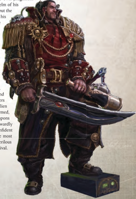

'I claim this world in the name of the Emperor of Man and his Imperium. I bring justice and truth for the loyal, punishment and death for the guilty, and the spoils I take by my own hand.'

-Ansellion Aquairre, [Lord-captain](rank-lord-captain.md) of the Caelestis Imperium

T he bearer of a sacred Warrant that empowers him to journey beyond the boundaries of the Imperium to trade, explore, and make war in the God-Emperor's name, a Rogue Trader is a unique figure in the grim [Darkness](combat-special-circumstances.md) of the Imperium. He may be a newly entitled power on the rise or hail from a long Lineage of nobles and voidfarers, but all bear their titles with [Pride](chargen-stage2-origin-path.md), striking out Into the Unknown in search of [Fortune](chargen-stage2-origin-path.md) and glory. A Rogue Trader is a power unto himself in the dark voids, master of all he surveys/.notdefat least as far as his force of arms and sharpness of wits can press the claim. A Rogue Trader can be many things but whether standing as diplomat before a planetary ruler, cutting a shadowed deal in a station undercity, bellowing [Orders](combat-orders.md) amidst an armed host set upon plunder, or striding the [Bridge](starship-anatomy-detailed.md) of a mighty starship, they remain one thing above all-free.

Often, Rogue Traders come from a dynasty of great leaders and visionary commanders, with a renowned (or darkly infamous) Lineage stretching back millennia. Other times, they are from younger, more dynamic families, often coming from the ranks of The Adeptus Terra, The Imperial Navy, or The Imperial Guard. Whatever their origins, all Rogue Traders are first and foremost masters of their own fates, and upon their shoulders can rest the success or failure not only of their [Endeavours](economy-endeavours.md) and their bloodlines, but of countless future generations and, often, the fortunes of entire worlds.

Despite the fact that the weight of such responsibility is his to bear alone, a Rogue Trader invariably surrounds himself with a coterie of allies and retainers. No Rogue Trader can undertake his mission alone, for no man or woman can be master of every single aspect of trade, exploration, exploitation, and war. As a result, all of the most successful Rogue Traders have the ingrained ability to recognise the value of others and their motivations and, as a leader, are able to utilise every weapon and ability in their human arsenal to their full potential.

Though he must rely on others for the most specialised of skills  (not  to  mention  certain  needful  resources),  it  falls  to the  Rogue  Trader  to  know  how  and  when  to  exercise  his  own  judgement the  Rogue  Trader  to  know  how  and  when  to  exercise  his  own  judgement

and how to delegate where needed. He may not steer the helm of his void-[Cruiser](starship-anatomy-detailed.md), nor fire and [Aim](rules-combat-overview.md) every macrocannon in person, but the Rogue Trader selects and commands those who do and it is his orders that are obeyed. Likewise he may know little of the arcane rites of the [Augury](psychic-disciplines-list.md) and auspex, but it is ultimately his  decision  whether  or  not  to  trust  the  word  of  the [Explorator](career-explorator.md) who claims it safe to breathe the air of a newly discovered world. and how to delegate where needed. He may not steer the helm of his void-cruiser, nor fire and [Aim](rules-combat-overview.md) every macrocannon in person, but the Rogue Trader selects and commands those who do and it is his orders that are obeyed. Likewise he may know little of the arcane rites of the [Augury](psychic-disciplines-list.md) and auspex, but it is ultimately his  decision  whether  or  not  to  trust  the  word  of  the [Explorator](career-explorator.md) who claims it safe to breathe the air of a newly

Rogue Traders must always look to their own abilities and protection, regardless of the power of their allies, for there  will  always  be  those  envious  of  their  power  and station, and countless rivals to their goals. As a result, most have a penchant for the very finest personal [Weapons](weapons-general.md) and equipment their fortunes can acquire/.notdeffor  even  friends  can soon  become  enemies  when  a  world's  ransom  is  at  stake. Some never leave their bridge without donning an ancient and revered  suit  of  artificer-wrought  power  [Armour](armour.md),  while  others secrete fiendishly cunning personal force field generators of alien manufacture beneath a gaudy uniform. None are ever unarmed, bearing, even aboard their own vessels, minute [Digital Weapons](weapons-general.md) and  other  implements  of  destruction.  However  they  outwardly comport themselves, Rogue Traders must be supremely confident in their own abilities, and able to walk away from even the most desperate  situation  somehow  having  profited  from  their  perilous adventure, even if that profit must be counted purely by survival. Rogue Traders must always look to their own abilities and protection, regardless of the power of their allies, for there  will  always  be  those  envious  of  their  power  and station, and countless rivals to their goals. As a result, most have a penchant for the very finest personal weapons and equipment their fortunes can acquire/.notdeffor  even  friends  can soon  become  enemies  when  a  world's  ransom  is  at  stake. Some never leave their bridge without donning an ancient and revered  suit  of  artificer-wrought  power  [Armour](armour.md),  while  others secrete fiendishly cunning personal force field generators of alien manufacture beneath a gaudy uniform. None are ever unarmed, bearing, even aboard their own vessels, minute digital weapons and  other  implements  of  destruction.  However  they  outwardly comport themselves, Rogue Traders must be supremely confident in their own abilities, and able to walk away from even the most desperate  situation  somehow  having  profited  from  their  perilous adventure, even if that profit must be counted purely by survival.

## Starting Skills, Talents and Gear

Starting Skills: Command (Fel), Commerce (Fel), [Charm](equipment-gear.md) (Fel), Common Lore (Imperium) (Int), Evaluate (Int), Literacy (Int), Scholastic Lore (Astromancy) (Int), Speak Language (High Gothic, Low Gothic) (Int). Starting Talents: [Air of Authority](talents-descriptions.md), [Pistol Weapon Training](talents-descriptions.md) (Universal), Melee Weapon Training (Universal). Best-[Craftsmanship](components-craftsmanship.md) laspistol or good-[Craftsmanship](components-craftsmanship.md) hand cannon or common-Craftsmanship plasma pistol.  Best-Craftsmanship  mono-sword  or  common-Craftsmanship  power  sword.  [Micro-bead](equipment-tools.md),  void  suit,  set  of  fine

Starting [Gear](equipment-gear.md): clothing, xeno-pelt cloak, best-Craftsmanship enforcer light carapace or storm trooper carapace.

| Rogue Trader Characteristic Advances   | Rogue Trader Characteristic Advances   | Rogue Trader Characteristic Advances   | Rogue Trader Characteristic Advances   | Rogue Trader Characteristic Advances   |
|----------------------------------------|----------------------------------------|----------------------------------------|----------------------------------------|----------------------------------------|
| Characteristic                         | Simple                                 | Intermediate                           | Trained                                | Expert                                 |
| Weapon Skill                           | 100                                    | 250                                    | 500                                    | 750                                    |
| Ballistic Skill                        | 250                                    | 500                                    | 750                                    | 1,000                                  |
| Strength                               | 500                                    | 750                                    | 1,000                                  | 2,500                                  |
| Toughness                              | 500                                    | 750                                    | 1,000                                  | 2,500                                  |
| Agility                                | 250                                    | 500                                    | 750                                    | 1,000                                  |
| Intelligence                           | 100                                    | 250                                    | 500                                    | 750                                    |
| Perception                             | 250                                    | 500                                    | 750                                    | 1,000                                  |
| Willpower                              | 250                                    | 500                                    | 750                                    | 1,000                                  |
| Fellowship                             | 100                                    | 250                                    | 500                                    | 750                                    |

| Rank 1 Rogue Trader Advances       | Rank 1 Rogue Trader Advances   |        |
|------------------------------------|--------------------------------|--------|
| [Advance](combat-advance-action.md)                            | Cost                           | Type   |
| Awareness                          | 100                            | Skill  |
| Command                            | 100                            | Skill  |
| Commerce                           | 100                            | Skill  |
| Charm                              | 100                            | Skill  |
| Ciphers (Rogue Trader)             | 100                            | Skill  |
| Common Lore (Imperium)             | 100                            | Skill  |
| Common Lore (Rogue Traders)        | 100                            | Skill  |
| Dodge                              | 100                            | Skill  |
| Evaluate                           | 100                            | Skill  |
| Literacy                           | 100                            | Skill  |
| Pilot (Space Craft)                | 100                            | Skill  |
| Scholastic Lore (Astromancy)       | 100                            | Skill  |
| Secret Tongue (Rogue Trader)       | 100                            | Skill  |
| Speak Language (Trader's Cant)     | 100                            | Skill  |
| Air of Authority                   | 100                            | Talent |
| Ambidextrous                       | 200                            | Talent |
| Melee Weapon Training (Primitive)  | 200                            | Talent |
| Renowned Warrant                   | 200                            | Talent |
| Pistol Weapon Training (Universal) | 500                            | Talent |
| Melee Weapon Training (Universal)  | 500                            | Talent |

| Rank 2 Rogue Trader Advances        | Rank 2 Rogue Trader Advances   |        |                |
|-------------------------------------|--------------------------------|--------|----------------|
| Advance                             | Cost                           | Type   | Prerequisites  |
| Barter                              | 200                            | Skill  |                |
| Blather                             | 200                            | Skill  |                |
| Carouse                             | 200                            | Skill  |                |
| Charm +10                           | 200                            | Skill  | Charm          |
| Command +10                         | 200                            | Skill  | Command        |
| Common Lore (Koronus Expanse)       | 200                            | Skill  |                |
| Deceive                             | 200                            | Skill  |                |
| Forbidden Lore (Xenos)              | 200                            | Skill  |                |
| Gamble                              | 200                            | Skill  |                |
| Intimidate                          | 200                            | Skill  |                |
| Performer (Choose One)              | 200                            | Skill  |                |
| Pilot (Flyers)                      | 200                            | Skill  |                |
| Scholastic Lore (Imperial Warrants) | 200                            | Skill  |                |
| Iron Discipline                     | 200                            | Talent | WP 30, Command |
| Jaded                               | 200                            | Talent | WP 30          |
| Leap Up                             | 200                            | Talent | Ag 30          |
| Quick Draw                          | 200                            | Talent |                |
| Sound Constitution (x2)             | 200                            | Talent |                |
| Two-Weapon Wielder (Melee)          | 300                            | Talent | WS 35, Ag 35   |
| Exotic Weapon Training (Choose One) | 500                            | Talent |                |
| Two Weapon Wielder (Ballistic)      | 500                            | Talent | BS 35, Ag 35   || Rank 3 Rogue Trader Advances        | Rank 3 Rogue Trader Advances   |        |                                       |
|-------------------------------------|--------------------------------|--------|---------------------------------------|
| Advance                             | Cost                           | Type   | Prerequisites                         |
| Acrobatics                          | 200                            | Skill  |                                       |
| Charm +20                           | 200                            | Skill  | Charm +10                             |
| Command +20                         | 200                            | Skill  | Command +10                           |
| Common Lore (Imperial Navy)         | 200                            | Skill  |                                       |
| Dodge +10                           | 200                            | Skill  | Dodge                                 |
| Drive (Ground Vehicle)              | 200                            | Skill  |                                       |
| Scholastic Lore (Heraldry)          | 200                            | Skill  |                                       |
| Scholastic Lore (Legend)            | 200                            | Skill  |                                       |
| Scrutiny                            | 200                            | Skill  |                                       |
| Search                              | 200                            | Skill  |                                       |
| Secret Tongue (Underdeck)           | 200                            | Skill  |                                       |
| Security                            | 200                            | Skill  |                                       |
| Sleight of Hand                     | 200                            | Skill  |                                       |
| Dark Soul                           | 200                            | Talent |                                       |
| Decadence                           | 200                            | Talent | T 30                                  |
| Foresight                           | 200                            | Talent | Int 30                                |
| Resistance (Fear)                   | 200                            | Talent |                                       |
| Sound Constitution                  | 200                            | Talent |                                       |
| Exotic Weapon Training (Choose One) | 500                            | Talent |                                       |
| Gunslinger                          | 500                            | Talent | BS 40, Two Weapon Wielder (Ballistic) |

| Rank 4 Rogue Trader Advances      | Rank 4 Rogue Trader Advances   | Rank 4 Rogue Trader Advances   | Rank 4 Rogue Trader Advances   |
|-----------------------------------|--------------------------------|--------------------------------|--------------------------------|
| Advance                           | Cost                           | Type                           | Prerequisites                  |
| Awareness +10                     | 200                            | Skill                          | Awareness                      |
| Climb                             | 200                            | Skill                          |                                |
| Commerce +10                      | 200                            | Skill                          | Commerce                       |
| Common Lore (Imperium) +10        | 200                            | Skill                          | Common Lore (Imperium)         |
| Common Lore (Rogue Traders) +10   | 200                            | Skill                          | Common Lore (Rogue Traders)    |
| Dodge +20                         | 200                            | Skill                          | Dodge+10                       |
| Drive (Skimmer/Hover)             | 200                            | Skill                          |                                |
| Speak Language (Eldar)            | 200                            | Skill                          |                                |
| Tech-Use                          | 200                            | Skill                          |                                |
| Trade (Voidfarer)                 | 200                            | Skill                          |                                |
| Catfall                           | 200                            | Talent                         | Ag 30                          |
| Double Team                       | 200                            | Talent                         |                                |
| Rapid Reaction                    | 200                            | Talent                         | Ag 40                          |
| Sound Constitution (x2)           | 200                            | Talent                         |                                |
| Basic Weapon Training (Universal) | 500                            | Talent                         |                                |
| Counter Attack                    | 500                            | Talent                         | WS 40                          |
| Crushing Blow                     | 500                            | Talent                         | S 40                           |
| Into the Jaws of Hell             | 500                            | Talent                         | Iron Discipline                |
| Sprint                            | 500                            | Talent                         |                                |
| Swift Attack                      | 500                            | Talent                         | WS 35                          |

| Rank 5 Rogue Trader Advances      | Rank 5 Rogue Trader Advances   | Rank 5 Rogue Trader Advances   | Rank 5 Rogue Trader Advances       |
|-----------------------------------|--------------------------------|--------------------------------|------------------------------------|
| Advance                           | Cost                           | Type                           | Prerequisites                      |
| Awareness +20                     | 200                            | Skill                          | Awareness +10                      |
| Barter +10                        | 200                            | Skill                          | Barter                             |
| Blather +10                       | 200                            | Skill                          | Blather                            |
| Carouse +10                       | 200                            | Skill                          | Carouse                            |
| Ciphers (Underworld)              | 200                            | Skill                          |                                    |
| Commerce +20                      | 200                            | Skill                          | Commerce +10                       |
| Common Lore (Imperium) +20        | 200                            | Skill                          | Common Lore (Imperium) +10         |
| Common Lore (Koronus Expanse) +10 | 200                            | Skill                          | Common Lore (Koronus Expanse)      |
| Common Lore (Rogue Traders) +20   | 200                            | Skill                          | Common Lore (Rogue Traders) +10    |
| Deceive +10                       | 200                            | Skill                          | Deceive                            |
| Evaluate +10                      | 200                            | Skill                          | Evaluate                           |
| Navigation (Stellar)              | 200                            | Skill                          |                                    |
| Disarm                            | 200                            | Talent                         | Ag 30                              |
| Light Sleeper                     | 200                            | Talent                         | Per 30                             |
| Sound Constitution                | 200                            | Talent                         |                                    |
| Blademaster                       | 500                            | Talent                         | WS 30, Melee Weapon Training (any) |
| Combat Master                     | 500                            | Talent                         | WS 30                              |
| Lightning Attack                  | 500                            | Talent                         | Swift Attack                       |
| Master & [Commander](rank-commander.md)                | 500                            | Talent                         | Int 35, Fel 35                     |
| Sure Strike                       | 500                            | Talent                         | WS 30                              || Rank 6 Rogue Trader Advances            | Rank 6 Rogue Trader Advances   |        |                                     |
|-----------------------------------------|--------------------------------|--------|-------------------------------------|
| Advance                                 | Cost                           | Type   | Prerequisites                       |
| Barter +20                              | 200                            | Skill  | Barter +10                          |
| Blather +20                             | 200                            | Skill  | Blather +10                         |
| Carouse +20                             | 200                            | Skill  | Carouse +10                         |
| Common Lore (Koronus Expanse) +20       | 200                            | Skill  | Common Lore (Koronus Expanse) +10   |
| Deceive +20                             | 200                            | Skill  | Deceive +10                         |
| Forbidden Lore (Xenos) +10              | 200                            | Skill  | Forbidden Lore (Xenos)              |
| Gamble +10                              | 200                            | Skill  | Gamble                              |
| Evaluate +20                            | 200                            | Skill  | Evaluate +10                        |
| Intimidate +10                          | 200                            | Skill  | Intimidate                          |
| Navigation (Stellar) +10                | 200                            | Skill  | Navigation (Stellar)                |
| Scholastic Lore (Imperial Warrants) +10 | 200                            | Skill  | Scholastic Lore (Imperial Warrants) |
| Security +10                            | 200                            | Skill  | Security                            |
| Blind Fighting                          | 200                            | Talent | Per 30                              |
| Paranoia                                | 200                            | Talent |                                     |
| Sound Constitution (x2)                 | 200                            | Talent |                                     |
| Hip Shooting                            | 500                            | Talent | BS 40, Ag 40                        |
| Master Orator                           | 500                            | Talent | Fel 30                              |
| Precise Blow                            | 500                            | Talent | WS 40, Sure Strike                  |
| True Grit                               | 500                            | Talent | T 40                                |
| Wall of Steel                           | 500                            | Talent | Ag 35                               |

| Rank 7 Rogue Trader Advances            | Rank 7 Rogue Trader Advances   |        |                                         |
|-----------------------------------------|--------------------------------|--------|-----------------------------------------|
| Advance                                 | Cost                           | Type   | Prerequisites                           |
| Acrobatics +10                          | 200                            | Skill  | Acrobatics                              |
| Climb +10                               | 200                            | Skill  | Climb                                   |
| Forbidden Lore (Xenos) +20              | 200                            | Skill  | Forbidden Lore (Xenos) +10              |
| Gamble +20                              | 200                            | Skill  | Gamble +10                              |
| Scholastic Lore (Imperial Warrants) +20 | 200                            | Skill  | Scholastic Lore (Imperial Warrants) +10 |
| Scholastic Lore (Legend) +10            | 200                            | Skill  | Scholastic Lore (Legend)                |
| Scrutiny +10                            | 200                            | Skill  | Scrutiny                                |
| Search +10                              | 200                            | Skill  | Search                                  |
| Security +20                            | 200                            | Skill  | Security +10                            |
| Sleight of Hand +10                     | 200                            | Skill  | Sleight of Hand                         |
| Swim                                    | 200                            | Skill  |                                         |
| Trade (Voidfarer) +10                   | 200                            | Skill  | Trade (Voidfarer)                       |
| Armour of Contempt                      | 200                            | Talent | WP 40                                   |
| Sound Constitution (x2)                 | 200                            | Talent |                                         |
| Fearless                                | 500                            | Talent |                                         |
| Hard Bargain                            | 500                            | Talent |                                         |
| Dual Strike                             | 500                            | Talent | Ag 40, Two-Weapon Wielder (Melee)       |
| Duty Unto Death                         | 500                            | Talent | WP 45                                   |
| Flame Weapon Training (Universal)       | 500                            | Talent |                                         |
| Step Aside                              | 500                            | Talent | Ag 40, Dodge                            |

| Rank 8 Rogue Trader Advances        | Rank 8 Rogue Trader Advances   |        |                                       |
|-------------------------------------|--------------------------------|--------|---------------------------------------|
| Advance                             | Cost                           | Type   | Prerequisites                         |
| Acrobatics +20                      | 200                            | Skill  | Acrobatics +10                        |
| Climb +20                           | 200                            | Skill  | Climb +10                             |
| Scholastic Lore (Legend) +20        | 200                            | Skill  | Scholastic Lore (Legend) +10          |
| Scrutiny +20                        | 200                            | Skill  | Scrutiny +10                          |
| Search +20                          | 200                            | Skill  | Search +10                            |
| Sleight of Hand +20                 | 200                            | Skill  | Sleight of Hand +10                   |
| Swim +10                            | 200                            | Skill  | Swim                                  |
| Trade (Voidfarer) +20               | 200                            | Skill  | Trade (Voidfarer) +10                 |
| Resistance (Psychic Powers)         | 200                            | Talent |                                       |
| Sound Constitution (x2)             | 200                            | Talent |                                       |
| Talented (Choose One)               | 200                            | Talent |                                       |
| Assassin Strike                     | 500                            | Talent | Ag 40, Acrobatic                      |
| Deadeye Shot                        | 500                            | Talent | BS 30                                 |
| Dual Shot                           | 500                            | Talent | Ag 40, Two-Weapon Wielder (Ballistic) |
| Exotic Weapon Training (Choose One) | 500                            | Talent |                                       |
| Independent Targeting               | 500                            | Talent | BS 40                                 |
| Mighty Shot                         | 500                            | Talent | BS 40                                 |
| Lightning Reflexes                  | 500                            | Talent |                                       |
| Thrown Weapon Training (Universal)  | 500                            | Talent |                                       |
| Void Tactician                      | 500                            | Talent | Int 35                                |

*Source:* `Roguetrader Corerulebook, pages 41–42`
