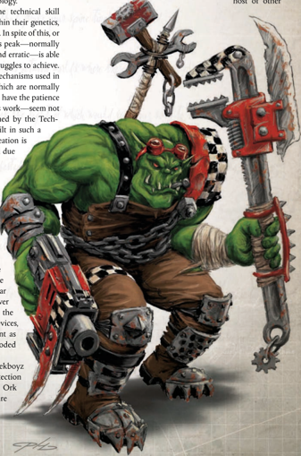
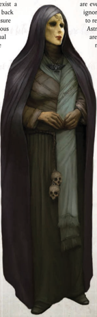

Ork  Mekboyz  are  born,  not  made.  On  some  level,  every Mekboy has been one ever since he emerged from the dirt as a 'Y oof,' whether he realises it or not. That level of instinctive understanding  of  machines,  getting  guns  to  work  when other  Orks  couldn't,  being  able  to  fix a bike or trukk, and a host  of  other

| Ork Mekboy Advances Advance             |   Cost | Type   | Prerequisites           |
|-----------------------------------------|--------|--------|-------------------------|
| Barter 10                               |    200 | Skill  | Barter                  |
| Common /ore (2rks) 20                   |    200 | Skill  | Common /ore (2rks) 10   |
| Common /ore (War) 20                    |    200 | Skill  | Common /ore (War) 10    |
| Demolition                              |    200 | Skill  |                         |
| Demolition 10                           |    200 | Skill  | Demolition              |
| Demolition 20                           |    200 | Skill  | Demolition 10           |
| Speak /anguage (2rk) 20                 |    200 | Skill  | Speak /anguage (2rk) 10 |
| Tech-8se 10                             |    200 | Skill  | Tech-8se                |
| Tech-8se 20                             |    200 | Skill  | Tech-8se                |
| Trade (Armourer)                        |    200 | Skill  |                         |
| Trade (Armourer) 10                     |    200 | Skill  | Trade (Armourer)        |
| Trade (Armourer) 20                     |    200 | Skill  | Trade (Armourer) 10     |
| Trade (Shipwright)                      |    200 | Skill  |                         |
| Trade (Shipwright) 10                   |    200 | Skill  | Trade (Shipwright)      |
| Trade (Shipwright) 20                   |    200 | Skill  | Trade (Shipwright) 10   |
| /ight Sleeper                           |    200 | Talent | Per 30                  |
| Sound Constitution (x2)                 |    200 | Talent |                         |
| Technical .nock                         |    200 | Talent | Int 30                  |
| Forbidden /ore (;enos) 10               |    300 | Skill  | Forbidden /ore (;enos)  |
| Pilot (Flyer)                           |    300 | Skill  |                         |
| Heavy Weapon Training (Choose 2ne) (x2) |    300 | Talent |                         |
| Runt] (x2)                              |    300 | Talent | 2rk                     |
| Ded µArd                                |    500 | Talent | 2rk, µArd, T 50         |
| Exotic Weapon Training (Any 2ne) (x2)   |    500 | Talent |                         |
| Talented (Tech-8se)                     |    500 | Talent |                         |
| Two-Weapon Wielder (Ballistic)          |    500 | Talent | BS 35,Ag 35             |
| Worky Gubbin]                           |    500 | Talent | 2rk, Tech-8se 10, WP30  |

## Survival Master (talent)

Prerequisites: Ork, Tech-Use +10, Willpower 30+

The Ork has an innate and instinctive skill with machinery, allowing him to perform feats of engineering that defy logic, cobbling together random lumps of wrecked technology and scrap metal into something bizarre and startlingly effective. Orks with this talent gain the following benefits:

An Ork with this talent counts all Ork-made weapons as Reliable-his greater understanding of them allows him to use the weapons more effectively than other Orks.

An Ork with this talent may attempt a Tech-Use Test to quickly 'kustomise' any device he comes across, whether it needs it or not. With weapons, this takes a number of minutes equal to the number of half actions the gun normally takes to reload. If the test is successful, then the gun's craftsmanship improves by one step until the next time it needs to be reloaded, at which point it breaks and will need to be repaired. If the Ork 'kustomises' another hand-held device or piece of gear, all tests to use the object gain a +5 bonus for a number of hours equal to the Ork's Willpower Bonus, at which point it will cease functioning. The GM can devise alternative effects for a Mekboy's 'kustomisations.' In all cases, if the test is failed, then the device breaks and will not work until repaired fully.

things  all  lead  towards  a  young  Ork  eventually  realising his  fate  and  taking  up  spanner  and  oil  squig  to  become  a Mekboy. Trial and error-usually lots of error, but Orks are tough enough not to care too much-hone the Ork's skill with machinery, and failed experiments are routinely sold to gullible Orks.

Required Career:

Ork Freebooter

Alternate Rank:

Rank 4 or Higher (13,000 xp)

Other  Requirements: Y ou  must  have  an  Intelligence  of 30 or higher. In addition, you must be trained in the Tech- Use Skill, and have at least two Exotic Weapon Proficiency Talents.## Becoming a Torchbearer

'I have made the pilgrimage to Holy Terra. I have knelt at the foot of the Golden Throne. I have been made to look upon His divine countenance, and it struck me blind! The Soul-Bound are forever changed. Dare you claim to be holier than I?'

-Tien Voor, senior Astropath of the merchantman Solis Lux

A n  Astropath's  life  is  a  hard  one.  Taken  from  their home  worlds  at  a  tender  age,  kept  in  fetid  cells aboard the Blackships of the Inquisition, subjected to rigourous testing and brutal conditioning by the Scholastica Psykana, then Soul-Bound to the God-Emperor in a punishing ritual that few survive and leaves all blind, only to spend their lives toiling in a profession that causes many of their number to 'burn out' from mental and psychic fatigue,  it's  a  wonder  that  any  Astropath  enters service  with  his  sanity  intact.  But  there  exist  a rare few for whom the journey to Terra and back again  is  not  a  grinding  mechanism  to  ensure the  survival  of  the  Empire,  but  a  righteous trial  rewarded  with  epiphany  and  spiritual transubstantiation. For such Astropaths, the loss of their eyes is an insignificant price to  pay  for  a  brief  communion  with  the God-Emperor.  If  there  was  ever  any doubt in their hearts about the divinity of The  Master of Mankind,  it is burned away by the crackling psychic fires  of  Soul-Binding.  Perhaps  it  is the  rather  recent  founding  of  the Calixis Sector by Holy Crusade, but such viewpoints are common in the Calixis  Sector-and  by  extension, the Koronus Expanse. Though such individuals go by many names throughout the galaxy, the Calixian Conclave of the Holy Inquisition has taken to referring to these Astropaths as Transubstantial Initiates.

Not content to simply ferry the messages of the God-Emperor's servants, Transubstantial Initiates dedicate their lives to serving the  will  of  the  God-Emperor  of Mankind  in  a  more  direct  role. They see their psychic powers as a blessing of the God-Emperor, and they believe it is their divine  duty  to use their powers to further his will. They also tend towards a  religious  focus.  In  the  course  of  their  nominal  duties  as messengers, Transubstantial Initiates give special priority to the  communiqués  of  the  Adeptus  Ministorum,  Inquisition, and  any  others  they  judge  as  undertaking  a  holy  mission. Both the Calixian Conclave and the Ecclesiarchy operations in  the  Expanse  find  such  Astropaths  very  useful  for  that reason.

Unlike  most  Astropaths,  Transubstantial  Initiates  make no attempt to cover what remains of their eyes within polite society. They consider their blindness to be a mark of honour and  devotion,  holy  stigmata  granted  by  the  God-Emperor. Initiates  display  their  blindness  proudly,  their  rheumy  eyes, shrivelled  retinas,  and  empty  sockets  a  gruesome  testament to the singular event  that  made  them  what  they  are. Transubstantial Initiates  spend  what  scant  leisure  time  they have  in  theosophical  study,  prayer,  and  meditation.  Many have been known to loudly broadcast liturgies deep into the Warp, claiming that in so doing they drive away Daemons and other Chaos spawn, while others insist that so long as excerpts  of  the  Creed  flit  between  worlds  the  wisdom of  the  righteous  can  never  be  lost.  Other  Initiates are even more active in their faith, seeking out the ignorant and the faithless that they might be made to repent and accept the will of the God-Emperor. Astropaths on  such a self-appointed mission are  said  to  rewrite  the  contents  of  heathen minds,  defending  their actions by  stating that  there  is  no  free  will,  only  His  Will. It  is  for  these  reasons  that  many  assume Transubstantial Initiates and Missionaries would  make  fast  allies.  Unfortunately, the adamantine convictions of the two leads to conflict; Missionaries see Transubstantial Initiates are borderline heretics,  and  Transubstantial  Initiates see  Missionaries  as  unfortunates  too quick  to  look  beyond  the  Imperium before  attempting  to  understand  the true nature of The Master of Mankind.

There are many amongst the Expanse who  proclaim  Transubstantial  Initiates to be nothing more than heretics who bear a brand of sanction. They denounce such Astropaths as deluded fools driven to madness by mental trauma wrongly assumed  to  be  a  religious  experience. Why the Ecclesiarchy does not outright  condemn  the  beliefs  of  the Transubstantials,  nor  the  Inquisition widely prosecute them, is a testament to their usefulness to the two organisations. When questioned about  the  possible  incorrectness  of| Transubstantial Initiate Advances   | Transubstantial Initiate Advances   | Transubstantial Initiate Advances   | Transubstantial Initiate Advances   |
|-------------------------------------|-------------------------------------|-------------------------------------|-------------------------------------|
| Advance                             | Cost                                | Type                                | Prerequisite                        |
| Ciphers (Astropath Sign)            | 100                                 | Skill                               |                                     |
| Common /ore (Ecclesiarchy)          | 100                                 | Skill                               |                                     |
| Forbidden /ore (Warp)               | 200                                 | Skill                               |                                     |
| /iteracy                            | 100                                 | Skill                               |                                     |
| Performer (choose one)              | 100                                 | Skill                               |                                     |
| Scholastic /ore (Imperial Creed)    | 200                                 | Skill                               |                                     |
| Scholastic /ore (Imperial Creed) 10 | 200                                 | Skill                               | Scholastic /ore (Imperial Creed)    |
| Scholastic /ore (Philosophy)        | 200                                 | Skill                               |                                     |
| Scholastic /ore (Philosophy) 10     | 200                                 | Skill                               | Scholastic /ore (Philosophy)        |
| Trade (Remembrancer)                | 200                                 | Skill                               |                                     |
| Secret Tongue (Ecclesiarchy)        | 300                                 | Skill                               |                                     |
| Dodge                               | 500                                 | Skill                               |                                     |
| Psychic Technique (x2)              | 200                                 | Talent                              |                                     |
| Chem Geld                           | 200                                 | Talent                              |                                     |
| Flame Weapon Training (8niversal)   | 300                                 | Talent                              |                                     |
| Foresight                           | 300                                 | Talent                              | Int 30                              |
| Master 2rator                       | 300                                 | Talent                              | Fel 30                              |
| Peer (Ecclesiarchy)                 | 300                                 | Talent                              |                                     |
| Peer (Inquisition)                  | 300                                 | Talent                              |                                     |
| Peer (The Insane)                   | 300                                 | Talent                              |                                     |
| Rite of Sanctioning                 | 300                                 | Talent                              | Psy Rating, Special                 |
| Psychic Discipline                  | 750                                 | Talent                              | Psy Rating                          |
| 8nshakeable Faith                   | 500                                 | Talent                              |                                     |

their faith, Transubstantials are quick to point out that their detractors have never set foot upon Holy Terra, nor have they stood in the light of The Golden Throne.

Inevitably, Transubstantial Initiates come into conflict with the religious and secular authorities of the Imperium. Some, not wishing to come into open conflict with fellow servants of the God-Emperor, turn inward, quieting their fervour in public for the sake of concordance with the Adeptus. Those that refuse to curtail the expression of their piety draw the ire of many, becoming pariahs. These outcasts are often the first Astropaths to sign on to an Expanse-bound Rogue Trader's crew,  seeking  freedom  beyond  The  Maw  and  a  chance  to demonstrate the living glory of the God-Emperor on worlds far from His holy light. Most Rogue Traders are more than willing to take on a Transubstantial Initiate, as their fervour and conviction tends to translate to vastly increased psychic power. It is because of this that many Transubstantial Initiates scorn conventional weaponry, preferring to fight with purifying flame or their 'blessed' powers.

*Source:* `Battle Fleet of the Koronus, pages 95–97`
