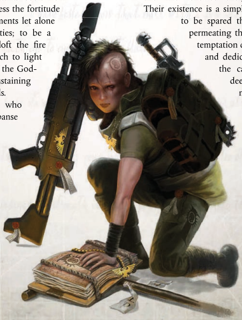
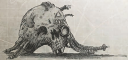

The path to becoming a Transubstantial Initiates is a short one, beginning at  the  moment  of  Soul-Binding,  when  the  coruscating psychic energies of the God-Emperor blast their way through the young Psyker's mind, leaving behind a small fragment of His power and little else. No experience in the course of the Astropath's life can compare with this moment. For many, it takes  far  longer  to  adjust  and  interpret  this  event,  meaning many  Astropaths  do  not  declare  themselves  Transubstantial Initiates until after undertaking duties in the Koronus Expanse. It is there, as they begin their duties amongst the very reaches of the God-Emperor's domain, that many come to the conclusion that they have been spiritually transformed and uplifted. Some become obsessed with the notion. This usually does happen early in their career, however, so it is almost unheard of for an established Astropath to become a Transubstantial Initiate, though under exceptional circumstances the GM may wish to grant access to this Alternate Rank as part of an Elite Advance.

Required Career: Astropath Transcendent

Alternate Rank: 1 (5,000 xp) only.

Other Requirements: An Explorer may have no more than 5 Corruption Points when this Alternate Career is taken. An Explorer who takes this Alternate Career suffers -3 Weapon Skill and -3 Ballistic Skill.

Note: Although this Rank replaces Rank 1 of the Astropath Transcendent Career, it does not re-list the Astropath Transcendent's  starting  Skills  and  Talents.  All  Skills  and Talents listed here (including the two Psychic Technique Talents) are in addition to starting Skills and Talents.## Peer (xenos)

' As the fire warms your body, know that the Emperor's righteousness will warm your soul. As this fire keeps the animals at bay, so the Emperor's wrath will ward off the unspeakable terrors that would prey on you. As this fire lights the night, so the Emperor's illumination will bring you out of the darkness and into the bosom of the Holy Imperium of Man'

-Lindesfarre Schaeln, Torchbearer to the lost tribes of the Red Wastelands

T he Missionaries operating in the Expanse are a breed apart from those who serve the Emperor's Will in the civilised  space  of  Calixis,  for  they  encounter  terrors and wonders undreamed of by their brethren ministering to the sector.  Travelling  from  world  to  world  in  these  lawless systems and bringing the Holy Creed to those who have lost the Emperor's light is a Missionary's sacred duty. However, some  of  the  roughest  and  most  dangerous  worlds  in  the Expanse  have  primitive  human  cultures  that  predate  the Imperium.  These  heathen  worlds  have  never  heard  of  the God-Emperor  or  the  Imperium  of  Man,  and  are  likely  to violently resist the word of the Ministorum. In these cases, a typical Missionary has little chance of converting a populace, and the Ministorum relies on the talents of the Missionaries known very informally as Torchbearers.

Torchbearers  are  sent  to  human  cultures  far  from  the Emperor's light, who may worship dark and savage gods. On these worlds, where feral nomads rule and primitive weapons are the height of development, it requires a strength of body and willingness to devote years or decades to the struggle  to  save  the  inhabitants'  souls  from the shadows. Too few possess the fortitude to survive in such environments let alone carry  on  their  blessed  duties;  to  be  a Torch-bearer  is  to  bear  aloft  the  fire of  the  Imperium  with  which  to  light the way, while the spirit of the GodEmperor  burns  within,  sustaining the Missionary in his travails.

While  all  Missionaries  who travel through the Expanse are expected to operate independently  for  long periods, a Torchbearer might find himself planted on a desolate and unforgiving world with no  contact  for  years  at  a time,  stranded  due  to severe Warp-storms

## Becoming an Xenographer

Prerequisites: Toughness (40)

The Torchbearer's ability to thrive in the most inhospitable and desolate areas allows him to continue his holy mission where others would fall. Be it endless desert  dunes,  rainforests  of  entangling  fauna,  barren mountain ranges, or even hideous death worlds, he can persevere. The character may re-roll all failed Survival, Tracking,  and  Wrangling  Skill  Tests,  although  each check can only be re-rolled once.

or perhaps simply forgotten for decades at a time. As such, they  are  experts  in  survival,  and  are  expected  to  endure the  predations  of  both  nature  and  man.  When  they  arrive on  a  new  world  they  may  know  nothing  other  than  the fragmentary reports of passing explorers who mentioned the unprofitable natives encountered and little else. Other planets may provide nothing but a Ministorum beacon designed to attract  their  attention,  left  behind  by  ancient  Missionaria Galaxia probes. So Torchbearers learn to travel light with a wide range of essential gear, building and creating whatever else they need-for their skills are great and their needs are few. In little time they can fashion permanent missions where the newly faithful may learn to properly worship their GodEmperor.

Torchbearers  go  into  their  new  worlds  knowing  they may never be recovered, given the vagaries of Warp travel. Many say their farewells to their shipmates and comrades on departure, for it may be years before they are reunited. Yet such is their spiritual nature that they are comfortable with these long stretches of isolation from civilisation's comforts, and find renewed energy in their blessed endeavours. Their existence is a simple one, attractive to those wishing to  be  spared  the  subtle  and  vicous  politics  that permeating the Ministorum hierarchies. And yet temptation can overwhelm even the most pious and dedicated of these missionaries, as was the  case  of  Karthom  Laui.  Grounded deep  in  the  Ragged  Worlds,  he  was not seen for another 45 years until his  homeship  Aurum  Veneratus returned,  and  the  landing  party was ambushed as their craft was overrun  by  hordes  of  fanatical natives  now  lead  by  their  AllFather  Karthom  the  Beneficent. His mind  twisted by the long years of isolation, he remade the Imperial Creed into a glorification of  himself  and  became  a  god of  the  savage  tribes.  Laui  was presumed  killed  in  the  ensuing series of attacks throughout the  system,  but

| Torchbearer Advances Advance          |   Cost | Type   | Prerequisites                 |
|---------------------------------------|--------|--------|-------------------------------|
| Charm 10                              |    200 | Skill  |                               |
| Climb                                 |    200 | Skill  |                               |
| Common /ore (Ecclesiarchy) 10         |    200 | Skill  |                               |
| Common /ore (.oronus Expanse)         |    200 | Skill  |                               |
| Common /ore (Imperial Creed) 10       |    200 | Skill  |                               |
| Dodge 10                              |    200 | Skill  | Dodge                         |
| Forbidden /ore (Mutants)              |    200 | Skill  |                               |
| Medicae 10                            |    200 | Skill  | Medicae                       |
| Scholastic /ore (Beasts)              |    200 | Skill  |                               |
| Scholastic /ore (Beasts) 10           |    200 | Skill  | Scholastic Lore (Beasts)      |
| Survival                              |    200 | Skill  |                               |
| Survival 10                           |    200 | Skill  | Survival                      |
| Survival 20                           |    200 | Skill  | Survival 10                   |
| Swim                                  |    200 | Skill  |                               |
| Tracking                              |    200 | Skill  |                               |
| Tracking 10                           |    200 | Skill  | Tracking                      |
| Wrangling                             |    200 | Skill  |                               |
| Wrangling 10                          |    200 | Skill  | Wrangling                     |
| Good Reputation (Feral Worlders)      |    200 | Talent | Fel 50, Peer (Feral Worlders) |
| Hardy                                 |    200 | Talent | T 40                          |
| Marksman                              |    200 | Talent | BS 35                         |
| Peer (Feral Worlders)                 |    200 | Talent | Fel 30                        |
| Polyglot                              |    200 | Talent | Int 40, Fel 30                |
| Resistance (Cold or Heat, choose one) |    200 | Talent |                               |
| Sound Constitution (x2)               |    200 | Talent |                               |
| Divine Ministration                   |    500 | Talent | Pure Faith                    |
| Master 2rator                         |    500 | Talent | Fel 30                        |
| Survival Master                       |    500 | Talent | T 40                          |
| Thrown Weapon Training (8niversal)    |    500 | Talent |                               |
| 8narmed Warrior                       |    500 | Talent | WS 35,Ag 35                   |

rumours of his insane vision persist, and his followers are still sometimes encountered on other undeveloped planets.

Such infamies endure despite the efforts of the Ecclesiarchy to suppress such heretical tales. It is better to heed the saga of Trell Palnus, the Flame of Westwind. He devoted the his life to a forsaken world, spending long years walking from settlement to settlement and converting those he found, either through holy word or holy flame. Such was his presence that few were required to be consecrated by the latter. In just three generations the planet went from a worthless rock to burning light in the Expanse, a profitable shrineworld and home to many of the Ministorum's most fiercely devout subjects. As long as there are such examples to set souls aflame, surely Kronus can be saved from the darkness that pervades the Expanse.

*Source:* `Battle Fleet of the Koronus, pages 98–99`
