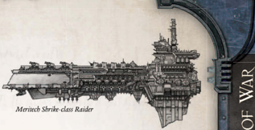

Dimensions: 2.1 km long, 0.4 km abeam at fins approx.

Mass: 8.5 megatonnes approx.

Crew: 19,500 crew, approx.

Accel: 2.3 gravities max sustainable acceleration.

The Carrack class is a recent attempt to recreate the ancient star  galleon  concept.  The  increasing  impression  amongst commercial  shipbuilders-in  common  with  many  citizens of  the  Imperium-is  that  the  galaxy  is  becoming  a  more dangerous place, and that the end times are fast approaching. Certain Chartist [Captains](imperial-starship-types.md) place their faith in solidly built, well armed freighters, designed from the ground up to be capable of carrying heavy loads while also tackling light [Raiders](ships-raiders-overview.md) or other miscreants.

The Carrack  class  is  a  product  of  the  shipyards  that  sit on  the  adjoining  edges  of  the  Calixis  and  Ixianid  Sectors, where travellers must often stand alone against the foulest of terrors  that  boil  up  from  the  depths  of  intergalactic  space. Robust and vigourous, these stout craft give the lie to the trite accusation that Imperial shipbuilding is a dying art. Though the design is less than 1,000 years old, these ships are as bold and strong as any transport of their [Size](character-traits.md) in the history of the Imperium, and have driven off many ill-advised pirate [Raids](mass-combat-raids.md).

Speed: 4

Manoeuvrability: -5

Detection:

+10

[Hull](starship-anatomy-detailed.md) Integrity: 45

[Armour](armour.md):

15

Turret Rating: 1

Space:

38

SP: 25

Weapon Capacity:

2 Dorsal

Cargo  Hauler: This  vessel  was  designed  for  transporting goods, and no amount of retrofitting can fully change this. This Hull comes pre-equipped with one [Main Cargo Hold](starship-supplemental-components.md) Component  (See  page  203  of  the Rogue T RadeR core rulebook).  The  hull's  Space  has  already  been  reduced  to account for this, however when the ship is constructed it must be able to provide a total of 2 Power to this Component.

*Source:* `Battle Fleet of the Koronus, page 30`
