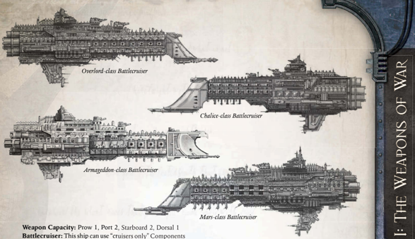

Dimensions: 5.1 km long,0.8 km abeam at fins approx.

Mass: 29 megatonnes approx.

Crew: 98,200 crew, approx.

Accel: 3.4 gravities max sustainable acceleration.

The Chalice class was a bold but not entirely successful attempt to further develop the concept of the battlecruiser. It is unique to Battlefleet Calixis, as it was designed within the Sector.

The  theory  seemed  sound:  a  fast  heavy  [Cruiser](starship-anatomy-detailed.md),  with light  [Armour](armour.md)  and  powerful  [Weapons](weapons-general.md)  that  could  outrun  and outmanoeuvre  anything  it  could  not  immediately  destroy. During  the  bleak  middle  years  of  the  Angevin  Crusade, much was made by Imperial propagandists of the new, locally manufactured 'super-[Cruisers](hulls-overview.md)' planned to roll up the numerous xenos and heretic empires arrayed against the Emperor's forces. Even though they only came into service as the crusade ended, hopes  for  these  vessels  were  immense.  Early  Chalice-class [Captains](imperial-starship-types.md) were lauded as glamorous, swashbuckling adventurers in endless vox reels and data plays.

Sadly,  the  vessels  failed  to  live  up  to  expectations.  Two of  the  original  Chalice  class  [Battlecruisers](ships-battlecruisers-overview.md)  were  destroyed during  an  engagement  with  unknown  xenos  forces  in  the Hazeroth Abyss in 123.M40, and others lost to accident or fleet  engagements  over  the  next  millennia.  Due  to  an  active Inquisitorial [Campaign](rules-campaign.md) to conceal these military setbacks, these ships remain admired amongst the ignorant general Imperial public, who believe these ships are the iron core of Battlefleet Calixis. However, these sleek and beautiful warships, while fast and well armed, have a glass jaw, and a disconcerting tendency to rupture plasma conduits under sustained assault.

Speed: 6

Manoeuvrability: +10

Detection:

+10

Hull Integrity:

70

Armour: 19

Turret Rating: 2

Space: 75

SP: 63

Weapon Capacity: Prow 1, Port 2, Starboard 2, Dorsal 1 Battlecruiser: This ship can use 'cruisers only' Components Additional Plasma Conduits: All Chalice-class battlecruisers  have  many  heavy  plasma  conduits,  a  risky trade-off for increased power. Any plasma drive installed on a Chalice increases power generated by 4. However, every time a Chalice takes a Critical Hit, there is a 25% chance it suffers an additional Fire! Critical Hit as well. Prow 1, Port 2, Starboard 2, Dorsal 1 This ship can use 'cruisers only' Components Additional Plasma Conduits: All Chalice-class

*Source:* `Battle Fleet of the Koronus, page 23`
