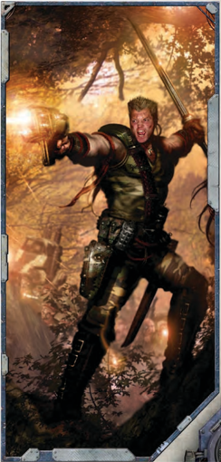

## Stage 1: Generate Characteristics

Many  of  the  key  aspects  of  your  character  are  defined  in terms of numbers. Some of the most basic of these are called [Characteristics](starship-anatomy-detailed.md).  They  represent  your  Explorer's  capabilities, ranging from physical [Characteristics](starship-anatomy-detailed.md) such as Strength and Toughness to mental ones like Intelligence and Willpower.

## Stage 2: the Origin Path

The next step in creating your character is to determine your origin path. The Imperium is a vast civilisation, and by the time your character begins his adventures as an Explorer, he has been influenced by many different factors. The Origin Path Chart on page 16 displays the various choices you will make to build your character from the ground up. This stage is also the point where you determine how many Fate Points and [Wounds](character-injury.md) you have.

## Stage 3: Spend Experience Points

This step is where you can further customise your Explorer. Each  character  begins  play  with  an  amount  of  [Experience Points](economy-rewards-measure-of-success.md) (xp) that reflects his life prior to becoming an Explorer. You  may  spend  your  starting  experience  to  purchase  new Skills  and  Talents  or  to  improve  your  [Characteristics](starship-anatomy-detailed.md).  See Chapter Ii: Career Paths for details.

## Stage 4: Giving Characters Life

Once all the numbers are finished with, it is time to flesh out your Explorer. This stage helps you define your character's appearance, past, temperaments, beliefs, and more. This step is an important one, as it helps you portray the character during game play and makes your Explorer a unique being, helping to set him apart from others who may fill a similar niche.

## Stage 5: Profit Factor and Ship Points

Now, there are things that  are  vital  to  the  entire  group  of players,  namely,  your  group's  starship  and  starting  [Profit Factor](economy-wealth-and-acquisitions.md). This step will help you create your vessel and set up your Rogue Trader dynasty's Warrant of Trade.

## Spending Experience Points?

Several of the options in this chapter allow a character to spend an amount of [Experience Points](economy-rewards-measure-of-success.md), abbreviated as 'xp.' Starting characters in Rogue Trader begin with 500 xp that they may spend to purchase an available option. See page 30 for more details.

## Stage 6: Select Equipment

Explorers may also select some additional [Weapons](weapons-general.md), [Armour](armour.md), and  equipment  from Chapter  V:  Armoury . To  select equipment, each character may make one [Acquisition](economy-acquisition-rules.md) using the group's [Profit Factor](economy-wealth-and-acquisitions.md).

## Stage 7: Play Rogue Trader

With all of this complete, you are now [Ready](rules-combat-overview.md) to play Rogue TRadeR !

*Source:* `Roguetrader Corerulebook, pages 13–14`
