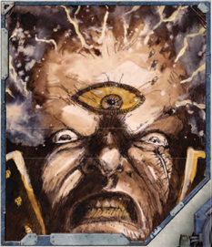

## Insanity and Corruption Points

Insanity Points (IP) and [Corruption Points](character-corruption.md) (CP) are [Characteristics](starship-anatomy-detailed.md) that characters gain during play. Both of these scores begin at 0 when a player starts and increase over time as [Damage](character-injury.md) is done to a character's state of mind (IP) and the purity  of  his  soul  (CP).  The  higher  these  scores,  the  more twisted, damaged, and debilitated a character becomes, and should either of these scores ever reach 100, a character is hopelessly driven mad or [Tainted](chargen-stage2-origin-path.md) and his [Career](chargen-stage2-origin-path.md) and life come to a sudden and abrupt end, exactly as if he had been killed.

## Fear

Fear  comes  into  effect  when  the  characters  are  confronted with  scenes  of  atrocity  or  horror,  or  when  they  are  called on  to  battle  against  terrifying  aliens,  insane  perversions  of science, and nightmarish entities from [The Warp](warp-imperial-space-travel.md). When a PC is  confronted  by  such  a  frightening  event  or  adversary,  he must take a Fear Test; this is a Willpower Test, modified by how frightening the thing is. If the PC passes this Test, then he  may  continue  to  act  as  normal.  If  he  fails  however,  he succumbs to Fear.

### Degrees of Fear

Some things are clearly more frightening than others; for a Rogue Trader, facing a boarding party of dishevelled human pirates, although obviously dangerous, is not sufficient to  call  for  a  Fear  Test.  However,  facing  the  same  boarding party comprised of ravening warp entities or hideously alien xenos  would  certainly  warrant  a  test. Table  10-3:  Fear Test Difficulties ,  offers some guidelines on the severity of Fear Tests.

### Failing the Fear Test

If a character fails a Fear Test in a [Combat](rules-combat-overview.md) situation, he must immediately roll on Table 10-4: The Shock Table , adding +10 to the result for each Degree of Failure. The effects listed are applied immediately to the character.

If the character fails the Fear Test in a non-[Combat](rules-combat-overview.md) situation, the character becomes unnerved and suffers a -10 penalty to any Skill or Test that requires concentration on his part. This penalty  lasts  while  the  character  remains  in  the  vicinity  of the object of his Fear (simply leaving and coming back again doesn't stop this!).

In addition, if a non-combat Fear Test is failed by 30 or more, the character also gains +1d5 Insanity Points.

### Shock and Snapping Out of It

Characters may be able to shake off some of the effects of Fear after the initial shock has worn off. Where specified on Table 10-4: The Shock Table that a character may 'snap out of it,' a character can make a Willpower Test at the beginning of his next Turn. If this succeeds, then he regains his senses, shrugs off the effects, and may act normally from then on. If he fails this Test, the effect continues.  A character may test again at the beginning of each of his subsequent [Turns](rules-combat-overview.md) until he succeeds.

| Table 10-5: The Insanity Track   | Table 10-5: The Insanity Track                | Table 10-5: The Insanity Track                |
|----------------------------------|-----------------------------------------------|-----------------------------------------------|
| Insanity Points                  | Degree of Madness                             | Trauma Modifier                               |
| 0-9                              | Stable                                        | n/a                                           |
| 10-19                            | Unsettled                                     | +10                                           |
| 20-29                            | Unsettled                                     | +10                                           |
| 30-39                            | Unsettled                                     | +10                                           |
| 40-49                            | Disturbed                                     | +0                                            |
| 50-59                            | Disturbed                                     | +0                                            |
| 60-69                            | Unhinged                                      | -10                                           |
| 70-79                            | Unhinged                                      | -10                                           |
| 80-89                            | Deranged                                      | -20                                           |
| 90-99                            | Deranged                                      | -20                                           |
| 100+                             | Terminally Insane-character retires from play | Terminally Insane-character retires from play |

### Going Insane

C haracters  in Rogue  TRadeR face  things  in  their travels  that  the  vast  masses  of  humanity will forever remain unaware of: spending prolonged periods in [The Warp](warp-imperial-space-travel.md), visiting ancient and terrible worlds, and dealing with treacherous aliens are just a few of these. Such are the stresses and horrors of these tasks that the slow slide into insanity is a constant threat. No human mind, not even one hardened by the harsh rigours of life in the Imperium, is immune to the slow erosion of sanity by the horrors of the 41st millennium, and a Rogue Trader and his crew are no exception.

In Rogue  TRadeR ,  these  dangers  are  represented  by Insanity Points. Insanity Points represent the strain put on a character's mind by his experiences; the more Insanity Points a  character  has,  the  more  fragile  his  mind.  The  [Cumulative Effects](psychic-techniques-list.md) of gaining Insanity Points are divided into Traumas, which  represent  the  short  term  after-effects  of  particularly terrible  experiences,  and  Disorders,  which  are  permanent mental afflictions that sign-post a character's slide into total madness.

#### Degrees of Madness

A  character  is  classified  as  having  a  certain  Degree  of Madness  depending  on  how  many  Insanity  Points  he  has. This classification gives a player a broad idea of the state of a character's mind and how close to the edge he has become. A character's Degree of Madness also determines the modifier that will apply to Tests taken to avoid Mental Trauma.

#### Mental Trauma

Mental Trauma represents the relatively short-term [Damage](character-injury.md) to a character's state of mind that he suffers after experiencing a horrific or supernatural event. Each time the character gains 10 Insanity Points he must make a Trauma Test. This is a Willpower Test,  modified  in  difficulty  by  how  many Insanity  Points  the  character  has  accrued  in  total (see Table  10-5:  The  Insanity  Track ). If the Test is passed, the character manages to cope with his experience without extra ill effect.  If  the  Test  is  failed,  roll  d100,  adding  10  for  every Degree  of  Failure,  comparing  the  result  to  Table 10-6: Mental Traumas . The result is applied to the character in the aftermath of any encounter that inflicted the Insanity Points on him.

#### Gaining Mental Disorders

Mental disorders reflect the permanent, long-term effects on a character's mind of exposure to things horrific and unnatural. A  character  automatically  gains  a  new  disorder  (or  a  more severe version of an existing disorder) each time he acquires a  certain  number  of  Insanity  Points.  A  character  gains  one Minor Disorder when he gains 40 Insanity Points, one Severe Disorder  when  he  gains  60  Insanity  Points,  and  one  Acute Disorder when he gains 80 Insanity Points. (This corresponds to becoming 'Disturbed,' 'Unhinged,' and 'Deranged' according to Table 10-5: The Insanity Track .)

Disorders can be selected by the GM, or the GM can allow the player to select one if he prefers. A character must have the preceding severity of a disorder for it to get worse, (so for a disorder to have become 'Severe' the character must have the 'Minor' version of the disorder first, with the exception of '[The Flesh Is Weak](talents-descriptions.md)' that has no Minor version).

#### Example

Rylar Mane has been captured by Eldar Corsairs and is being held aboard their vessel as they subject him to their alien tortures. This traumatic event increases Mane's Insanity Points to a total of 10, forcing him to make a Trauma Test by rolling against his Willpower with a penalty of -10. If he fails, he will then need to roll on the Trauma Table and suffer the results. Should he later gain another 10 Insanity Points, increasing his total to 20, he would need to test once more. If his total were to reach 40, in addition to testing he would also gain his first disorder-though it is doubtful [The Eldar](faction-eldar-overview.md) will keep him alive that long…#### Only the Insane Shall Prosper…

The more insane a character becomes the less horrific things seem. After all, what are the monsters of reality compared to those one sees whenever one closes one's eyes? If the first digit of a character's Insanity total is double or more a thing's Fear Rating (see page 294) the character is unaffected by it and does not need to make a Fear Test.

### Disorders and Their Severity

The effect a mental disorder has on a character is left largely up to the GM, though the descriptions presented below provide some guidelines. If a character fi nds himself in a situation or encounter where his disorder will be a detriment, he can test Willpower. Success means he is able to ignore the effects of the disorder for the remainder of the encounter. A character with a 'fear of insects' for [Example](rules-tests.md), would have to test Willpower before  entering  a  crypt  full  of  beetles  and  spiders.  Success means he could enter, while failure could mean anything from the character suffering penalties as long as he was inside, to him not being able to enter the crypt at all.

All  disorders  are  rated  as  being  Minor,  Severe,  or  Acute  in ascending order of effect.

- Minor  Disorder: · The  effects  of  the  disorder  manifest rarely or are experienced only to a small degree. Any Test to overcome the effects of the disorder gain a +10 bonus.
- Severe Disorder: · The effects of the disorder are stronger and  may  occur  regularly .  There  is  no  modifier  to  Tests made to overcome the effects of the disorder.
- Acute  Disorder: · The  effects  of  the  disorder  are  very strong and occur at the slightest stimulation. Any Test to overcome the effects of the disorder take a -10 penalty .

### Types of Mental Disorder

The variety  of  unpleasant  and  unwholesome  disorders  that might  afflict  a  character  is  potentialy  limitless,  and  a  few examples  are  presented  here.  GMs  should  also  feel  free  to invent their own to suit individual characters and the horrors they undergo.

#### The Flesh Is Weak!

#### Seriousness: Severe, Acute.

The character sees his flesh as weak and will constantly blame it  for  his  failures  and  problems.  He  will  also  try  to  change and/or  remove  his  flesh,  becoming  increasingly  obsessed with surgical modification as well as bionic replacement.

### Table 10-6: Mental Traumas Roll  1d100  and  Add  +10  for  Every  Degree  of Failure.

### Roll Result

01-40

The character becomes withdrawn and quiet. The character is at -10 to all Fellowship-based Tests. This lasts for 3d10 hours.

41-70

The character must compulsively perform an action such as fevered praying, frantically cleaning a weapon, reciting verse, and so on, and pays little attention to anything else. All Tests that are based on Intelligence, Fellowship, or Perception suffer a -10 penalty. This effect lasts for 3d10 hours.

71100 The character is constantly fearful, seeing danger everywhere, and is extremely jumpy. The character gains a +10 bonus to all Perception-based Tests and is at a -10 penalty to his Willpower for the next 1d5 days.

101120 The character suffers from a temporary severe phobia (see Disorders, page 296). This effect lasts for 1d5 days.

121130 The character reacts to the slightest stress or pressure by becoming extremely agitated. When performing any task that involves a Test, the character must first pass a Willpower Test or suffer a -10 modifier to the Test. If the character gets into [Combat](rules-combat-overview.md), all Tests during [Combat](rules-combat-overview.md) automatically suffer a -10 modifier. This effect lasts for 1d5 days.

131140 The character suffers vivid and extreme nightmares whenever he tries to sleep. The next day and for the next 1d10 days, the character will be exhausted by lack of sleep and gains a level of [Fatigue](character-injury.md). This effect lasts for 1d5 days.

141150 The character is struck dumb and is unable to speak. This lasts for 1d5 days.

151160 Extremely distressed and unfocused, the character refuses to eat or drink and looks in a terrible state. The character takes a -10 penalty to all [Characteristics](starship-anatomy-detailed.md) (no Characteristic can be reduced below 1) for 1d10 days.

161- The character temporarily becomes hysterically

170

[Blind](weapons-general.md) or deaf. This effect lasts for 1d10 days.

171+ The character becomes completely traumatised and virtually unresponsive. He can't initiate actions but may be gently led. This effect lasts for 1d10 days.

### Phobia

Seriousness: Minor, Severe, Acute.

The  character  has  a  deep  dislike  and  fear  for  a  particular thing or circumstance. A phobic character must succeed on a  Willpower  Test  to  interact  with  the  focus  of  his  phobia. Enforced or gratuitous exposure to the focus of his exposure may incur Fear Tests. Examples of this disorder are:

#### Fear of the Dead

The character has an abiding fear and loathing of corpses and the dead, possibly due to the fact that sometimes they don't stay dead…#### Fear of Insects

Scuttling things with many legs are the character's waking nightmare: faceless, numberless, and hungry, forever hungry.

### Obsession/compulsion

Seriousness: Minor, Severe, Acute.

The character has a compulsion to perform a particular action or is obsessed with a particular thing. A character must make a Willpower Test not to act in a compulsive way or not pursue his obsession when the opportunity arises. Examples of this disorder include any of the following:

#### Kleptomania

The character compulsively steals small objects when he can. Often the character attaches no value to such objects.

#### Self-mortification

The character must scourge and whip his flesh on a regular basis (or after a particular event such as killing), in order to purge away the sin of his actions through pain.

### Visions and Voices

Seriousness: Minor, Severe, Acute.

The character sees things that are not there and hears things that  others  do  not.  Acute  sufferers  may  be  completely immersed within their visions.

#### Dead Comrade

The character hears the voice of an old friend now long-dead. At a Severe level, he may have visions of his friend. If his condition becomes Acute, they may even hold conversations.

#### Flashbacks

The character relives  traumatic  moments  from  his  life.  The length and vividness of these episodes vary according to the seriousness of his condition.

### Delusion

Seriousness: Minor, Severe, Acute.

The character suffers from a particular false belief that he has to act on as if it were the truth, despite his better judgement or evidence to the contrary.

| Table 10-7: The [Corruption](character-corruption.md) Track   | Table 10-7: The [Corruption](character-corruption.md) Track   | Table 10-7: The Corruption Track   | Table 10-7: The Corruption Track   |
|------------------------------------|------------------------------------|------------------------------------|------------------------------------|
| CP Total                           | Degree of Corruption               | Malignancy Test                    | [Mutation](character-mutations-list.md)                           |
| 01-30                              | [Tainted](chargen-stage2-origin-path.md)                            | +0                                 | -                                  |
| 31-60                              | Soiled                             | -10                                | First Test                         |
| 61-90                              | Debased                            | -20                                | Second Test                        |
| 91-99                              | Profane                            | -30                                | Third Test                         |
| 0                                  | Damned-Character removed from play | Damned-Character removed from play | Damned-Character removed from play |

#### Invulnerability

The character believes that he will never get severely injured, either  through  luck  or  divine  providence.  Such  a  character would have to pass a Willpower Test not to enter a ganghouse and  throw  insults  and  punches  instead  of  exercising  due caution, for [Example](rules-tests.md).

#### Righteousness

The character believes his choices are right and justified, no matter  what  the  cost.  Such  a  character  might  refuse  to  act subtly where it would otherwise be prudent to do so.

### Horrific Nightmares

Seriousness: Minor, Severe.

The character suffers from vivid and reoccurring nightmares: trying to [Run](rules-combat-overview.md) from a black sun in the sky, or being imprisoned in an endless machine, for [Example](rules-tests.md). After any stressful day, the character must pass a Willpower Test in order not to succumb to his terrors while asleep. If he fails, the character will suffer from a single level of [Fatigue](character-injury.md) (see [Fatigue](character-injury.md), page 251) on the following day.

## Removing Insanity Points From a Character

With the GMs permission, a character may use xp to remove Insanity Points. It costs 100 xp to remove a single Insanity Point. A character may never go down a Degree of Madness and so will never lose his disorders. All buying back of Insanity Points should be properly represented as time and effort spent by the character in game. Possible ways of representing the removal of Insanity are:

-  Prayer, fasting, penance, and mortification of the flesh.
-  Long-term palliative care.
-  Recuperation in quiet and pleasant surroundings.
-  Contemplation  of  great  holy  works  or  other  articles of  faith  (such  as  the  Credo  Omnissiah  for  Mechanicus characters).## [Example](rules-tests.md)

Having escaped [The Eldar](faction-eldar-overview.md) Corsairs, Rylar Mane is spending time on the shrine world of Chilautox as he is nursed back to health by the cloud-maidens of The Temple of Seven Virtues. The GM decides that this period of rest is suitable to repair some of [Damage](character-injury.md) done to Mane's mind and allows Mane's player to spend 500xp to reduce his character's IP by 5.

*Source:* `Roguetrader Corerulebook, pages 295–300`
