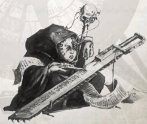

Some Rogue Trader Dynasties are known for all the wrong reasons. A House purged in the aftermath of the Fall of the Tellurian Combine for example might be held as an object lesson in the follies of dappling in things man should have no truck with. Other Houses are known for the ruthlessness of their actions and although respected are not regarded with any warmth. A Rogue Trader from such a House would be wise to consider very carefully how widely he broadcasts his name when operating beyond Imperial Space, for there are many rivals who might take advantage of even a temporary state of vulnerability.

Ship Points: 6

Profit Factor:

12

*Source:* `Into the Storm, page 45`
