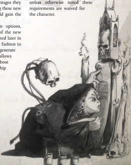

' As we pass through this world, we leave behind more than we think. Each of us leaves behind a lasting legacy that casts its shadow upon all who follow.'

-Solomon Haarlock

T he ROGUE TRADER Core  Rulebook  introduces  six Home  Worlds  for  players  to  choose  from.  Each Home World selection provides the character with the  necessary  background  and  characteristics  needed  to represent where that Explorer came from-ranging from their  culture  and  heritage  to  environmental  factors  that have molded the Explorer into the person they now are.

In INTO THE STORM , the players have six additional Home World options to choose from. Like the original six worlds, these new choices help to give definition to the character-a starting point from which the Explorer left his old life behind and began anew as a traveller amongst the stars. These new Home Worlds are additional options to give the player more choices on where their Explorer originated. On the Origin Path,  each  player  may  replace  the  current  Home  World options  with  these  new  options,  effectively  allowing  12 different Home World choices.

Once a player has chosen his Explorer's  Home World, he should be sure to write down all the traits and abilities provided by the Home World on his character sheet.. Note also that many of the talents granted by the Home Worlds to also that many of the talents granted by the Home Worlds to

the characters have prerequisites: unless otherwise noted these requirements  are  waived  for the character.

## Life as a Footfallen

'Frontier worlds are lawless planets that sit on the edge of the Imperium. Savage and brutal, your world has always been home to a small number of settlers that are descended from the original colonists. You are tenacious and hardy, and have learned that the only justice in the galaxy is that which you hand out yourself.'

There are numerous frontier worlds scattered across the borders of  the  Imperium,  particularly  within  the  Calixis  Sector  and Koronus Expanse. A frontier world is more than simply a world or system that sits upon the edge of the map; it is far away from centres of power, the protection of the military, and the influence of the Ecclesiarchy . Many of these worlds consist of a  small  number  of  population  centres,  and  often  times  their environment is every bit as deadly as any death world. Some planets are barely habitable; others are hardly explored. These are  rough-and-tumble  places  with  few  luxuries  and  fewer defences. Because of this, many are left open to the predations of xenos invaders and pirates. Frontier worlds are also havens for those who are seeking to escape Imperial justice.

Due to their unique position on the frontier, it's not unusual for the populace to have extensive dealings with xenos and abhuman species. In fact, some settlements can only get by because of the trade they conduct with outsiders.

## Footfallen Characters

Frontier worlds, such as Faldon Kise or Solace Encarmine, can often barely be classified as 'civilised.' The populace is rough and  determined  in  equal  measure,  and  many  settlements  on these worlds are ramshackle, resembling primitive, run-down, dry, dusty spots where life is harsh and unforgiving and justice comes from the barrel of a gun (or at the end of a rope). Here, the population must learn to survive on its own. There are no Adeptus Arbites Precinct-fortresses to maintain law, no PDF to protect the citizens from invasion, and no Fleet waiting in orbit to take them to safety . The people are tough and hard-working, used to living without the amenities that are taken for granted on other worlds. They are also insular and prefer to handle matters on their own, with little time for outsider interference.

The environments of these worlds can vary greatly-from near Death worlds to virtual paradises-but most tend to fall somewhere in between. The settlements on these worlds also vary,  but  are  usually  small  and  fairly  primitive.  Those  who travel to such places must be prepared to face any environment, from toxic slime jungles to bone-scouring winds.

Though  poorly  educated,  those  who  are  raised  upon  a frontier  world  have  learned  that  survival  is  paramount.  As a result they are surly, coarse, rough, and durable folk who often refuse to back down from a confrontation-even when faced  with  overwhelming  odds  (and  especially  if  they  feel they are right). They have little patience for small talk and even less for those who are dishonest and disreputable. They make excellent scouts and foragers. It's also not unheard of for these people to conduct trade and associate with xenos races-even mutants-as most settlements lack an Imperial Cult  representative  to  cow  them  into  believing  that  these creatures are evil and should be shunned or destroyed.

*Source:* `Battle Fleet of the Koronus, pages 9–10`
