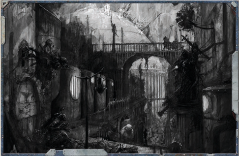

### Agents of the Throne and Dark Heresy

The basic procedure for obtaining Elite Advances is described in the ROGUE T OGUE T OGUE RADER Core Rulebook. However, that brief section only scratches the surface of the possibilities that Elite Advances can  provide.  This  section  will  go  into  more  detail  about  the ways in which Elite Advances can be obtained and used by both players and GMs to theme characters and campaigns alike.

At the heart of it, the use of Elite Advances centres around the character-his desires, his experiences, and the opportunities he  discovers.  Gaining  an  Elite  Advance  should  always  be focussed upon representing that, with the rules used to reflect the character and the campaign. They aren't a quick way to bypass the structure of the Career Path to get a powerful talent early (or, at least, not without a valid, in-character justification), nor should they simply be used to power up a character.

Elite Advances come in two broad categories: player-requested advances,  where  the  player  gives  a  justification  for  why  his character  should  learn  something,  and  GM-granted  advances, where a situation within the context of the ongoing game prompts the GM to offer an advance to one or more of the player characters.

With  player-requested  advances,  the  player  selects  the advance he would like his character to obtain, gives an incharacter justification for gaining that advance, and makes an offer of how much the character is willing to pay in exchange for that advance -this should be in xp in all but the oddest of circumstances. The GM then considers the request, and may alter it as he sees fit (including outright denying it), sometimes changing the cost (or adding an additional price-skill tests, Insanity or Corruption Points, a cost in time or resources, etc) and sometimes changing the advance granted for something similarly appropriate. The GM's word in this regard is final. GM-granted  advances  skip  the  first  step  described  above,

### Those Who Serve the Golden Throne

While there  are  no  hard-and-fast  rules  for  obtaining Elite  Advances,  some  guidance  can  be  provided  for GMs  and  players  alike  as  to  what  different  abilities are  likely  to  cost.  It  is  easy  enough  to  estimate  an advance's  worth  from  its  presence  in  the  various career paths-most advances cost 100, 200 or 500xp. When purchased as an Elite  Advance,  such  advances should usually  be  priced  above  their  normal  value, usually  twice  their  regular  cost.  Some  of  this  cost can  then, if  appropriate  to  the  advance  itself,  or  the difficulty  of obtaining it, be exchanged for an appropriate alternative cost-Corruption Points, Insanity  Points, the  accumulation  of  enemies,  time spent training,  roleplaying  challenges  as  a  mentor is  sought  out  or negotiated  with...  the  possibilities are as limitless as  the  variety  of  Elite  Advances themselves.

with the GM setting a price, picking the skills, talents and/or traits being granted, and giving an in-character reason for the advance. Such advances can be used to promote the theme of a campaign, to represent special training offered by an ally , patron or  other  grateful  or  benevolent  party  (or  less-than-benevolent party with an ulterior motive), or even as a reward for a particular success  or  noteworthy  event.  GM-granted  advances  are,  of course,  optional-a  player  unwilling  to  accept  the  cost  will gain nothing and lose nothing-and may be either permanent additions to a character's advance scheme (meaning that they can be taken at any point from then on) or available only for a limited time, perhaps only at that particular time and place.

### Writ of Authority (trait)

Elite Advance Packages take the concept of Elite Advances a step further, providing new and unique abilities as well as the potential for multiple advances in a single package deal. Elite Advance Packages, like the simpler Elite Advances, are ways to tailor and shift the direction of a character in ways that aren't covered by the normal Career Paths or even by the Advanced Careers like those earlier in this chapter. The packages contain a wide variety of possible effects, and some of them may even add to your character's advance scheme, providing a list of skills and talents which can be purchased at a later point for additional experience.  When  spending  this  additional  experience,  you advance through your career normally-it matters not where your experience is spent, only that you spend it.

The  following  Elite  Advance  Packages  are  examples,  a selection of possible ways for the player and GM to use Elite Advance Packages to develop characters and campaigns beyond the limits of a character's career path. There are, in theory, an endless  number  of  possible  Elite  Advance  Packages,  because there are an endless variety of things which can cause significant changes to a character during his or her lifetime. There are no hard-or-fast rules for creating these packages-this is left up to a GM's own judgement as to what they should cost and what abilities they should grant. One thing should remain constant, however: there should always be a cost. In many cases, that

cost  will  be  in  xp,  but  as  with  ordinary  Elite  Advances,  the cost may instead be partially or completely in Insanity Points, Corruption Points, the accumulation of enemies, tests of skill and  ability,  roleplaying  challenges,  wealth  and  resources,  or anything that players or their characters value.

As with all Elite Advances, Elite Advance Packages should be narrative-led, they should reflect some in-game occurrence, or some force, ideology, faction or event within a game. They are not simply a way for a player to string together powerful abilities  for  his  character  to  have,  just  because  he  wants them-there should be some element of the narrative driving the acquisition of such abilities, and a cost to obtain them. This  is  why  the  GM is  always  the  final  arbitrator  of what an Elite Advance Package consists of and whether or not a player can take it.

Elite Advance Package use is optional, and because they modify and can potentially upset the balance of the character progression system, they are recommended for experienced groups.

## Glimpse From Beyond

'You may speak with His voice in this Throne-forsaken place, LordCaptain, but I am His eyes and ears, and it may serve you well not to utter such blasphemies where He can hear...'

-Confessor Aidus Hevaille, Pontifex-Auditor of Synod Calixis

The  Imperium  grants Rogue  Traders great power, for without such power their task would be insurmountable, and individuals of sufficient will and purpose would seldom seek such a role. Even so, their autonomy is not always as complete as it may seem, nor their power as unassailable as they might wish to believe. The Imperium has many organisations, offices and departments with a vested interest in the discoveries and exploits  of  a  Rogue  Trader,  and  as  many  more  again  who turn their attentions towards the Rogue Traders themselves, watchful  for  signs  of  corruption  or  infirmity  that  would jeopardise their duty to Him-on-Terra.

Surrounded as they are by all manner of adjutants, advisors and  assistants,  a  Rogue  Trader's  entourage  is  the  perfect place  for  an  agent  of  one  of  those  myriad  organisations, their  loyalty  given  to  an  authority  higher  than  that  of  the individual they watch so carefully. Some operate openly, their differing loyalties plain for all to see, their advice given in the  best  interests  of  their  superiors.  Others  keep  their  true purpose hidden, acting as spies against the man they claim to serve, all in the name of greater masters.

### Witness to the Accursed

It  is  no  coincidence  that  the  Agent  of  the  Throne package is entirely appropriate to represent the skills and  powers  that  might  be  possessed  by  Acolytes  of the  Inquisition,  particularly  senior  ones  who  have proven their worth. As an Elite Advance, this package is  easily  used in DARK HERESY without modification, and could well be given to an entire group of Acolytes as a way of giving them a common skill base distinct from their own unique proficiencies.| Agent of the Throne Advances Advance    |   Cost | Type   | Prerequisites                    |
|-----------------------------------------|--------|--------|----------------------------------|
| Common /ore (Adeptus Arbites)           |    200 | Skill  |                                  |
| Common /ore (Adeptus Astra Telepathica) |    200 | Skill  |                                  |
| Common /ore (Adeptus Mechanicus)        |    200 | Skill  |                                  |
| Common /ore (Administratum)             |    200 | Skill  |                                  |
| Common /ore (Ecclesiarchy)              |    200 | Skill  |                                  |
| Common /ore (Imperial Guard)            |    200 | Skill  |                                  |
| Common /ore (Imperial Navy)             |    200 | Skill  |                                  |
| Common /ore (Navis Nobilite)            |    200 | Skill  |                                  |
| Ciphers (choose one) (x3)               |    300 | Skill  |                                  |
| Command                                 |    300 | Skill  |                                  |
| Common /ore (choose one) 10             |    300 | Skill  | Common /ore (any one)            |
| Deceive                                 |    300 | Skill  |                                  |
| Forbidden /ore (The Inquisition)        |    300 | Skill  |                                  |
| Inquiry                                 |    300 | Skill  |                                  |
| Intimidate                              |    300 | Skill  |                                  |
| Scholastic /ore (Bureaucracy)           |    300 | Skill  |                                  |
| Scholastic /ore (-udgement)             |    300 | Skill  |                                  |
| Command 10                              |    500 | Skill  | Command                          |
| Deceive 10                              |    500 | Skill  | Deceive                          |
| Forbidden /ore (The Inquisition) 10     |    500 | Skill  | Forbidden /ore (The Inquisition) |
| Inquiry 10                              |    500 | Skill  | Inquiry                          |
| Intimidate 10                           |    500 | Skill  | Intimidate                       |
| Air of Authority                        |    500 | Talent | Fel 30                           |

### Unholy Insight (trait)

Given  the  diverse  and  dangerous  nature  of  a  Rogue  Trader's exploits,  it  is  of  little  surprise  that  many  organisations  go  to great lengths to observe these powerful men and women. Most notorious and terrifying amongst these is the Inquisition, whose vigilant Acolytes move secretly through all parts of the Imperium, with the ships of Rogue Traders no exception. However, where the agents of the Inquisition may be the most obvious example of Agents of the Throne, they are far from the only ones.

With new worlds, forgotten enclaves of humankind and lost knowledge of immense worth to be found beyond the reach  of  the  Imperium,  the  Ecclesiarchy  and  the  Adeptus Mechanicus both are eager to send agents  out  to  find  and exploit  these  resources.  The  Missionaria  Galaxia  of  the Ecclesiarchy and the Explorators of the Adeptus Mechanicus are  the  most  overt  agents  these  organisations  possess,  but others are used as well. Within the Calixis Sector and out into the Koronus Expanse, for example, Pontifex-Auditors serve as the spies and observers of Cardinal Ignato.

No  less  significant  are  Administratum  and  Departmento Munitorum Archivists, who record in exacting detail the exploits of their subject, or representatives of Lord-Admirals of the Imperial Navy  and  Lord-Generals  of  the  Imperial  Guard  who  wish  to keep a close eye on the realms they may one day be crusading to conquer in the Emperor's name. Even the Navis Nobilite is wont

to indulge in secretive intelligence-gathering, another part of

the great game of intrigue that runs all through the Great

Houses of the Navigators.

Restrictions: Only human, non-mutant characters may select this Elite Advance Package.

Advance Cost: 600xp

Effect: Gain  the  Writ  of  Authority  trait,  and  the  Peer talent  appropriate  to  the  organisation  the  character  serves, chosen from the following list (additional options available at  GM's  discretion):  Adeptus  Arbites,  Adeptus  Mechanicus, Administratum,  Ecclesiarchy,  Government,  Inquisition,  or Military. In addition,the character may spend xp on the Agent of the Throne advances shown on the table above.

Special: There are a number of Common Lore skills on the Agent  of  the  Throne  Advances  table,  as  well  as  Forbidden Lore (Inquisition). Due to the broad range of organisations an Agent of the Throne may belong to, this list covers many groups  and  factions  within  the  Imperium.  Y ou  may,  under normal  circumstances,  only  select  Common  or  Forbidden Lore skills from the Agent of the Throne Advances table that directly relate to your chosen organisation.

## Binary Cortex (trait)

You  are  a  legitimate  and  senior  agent  of  one  of  the many  organisations  of  the  Imperium,  and  bear  their authority.  This  Writ  of  Authority  is  often  carried  in the form of a symbol or icon such as the Rosettes of the Inquisition or the badges of the Adeptus Arbites, and serves as the physical proof of your authority.

Gain  a  +10  bonus  on  Command  and  Intimidate Tests  when  dealing  with  those  who  understand  and either  respect  or  fear  the  authority  you  wield.  You must  be  identified  as  an  agent  who  bears  a  Writ  of Authority to gain this bonus.### Rite of Duplessence

'There are things... in the void... that no man should know of, much less see... I have borne witness to such things, and I now am cursed to see them always, their visage burned into my memory such that they scar mind and soul. I am damned, and would wish my fate upon no other. Beware the world of the dead.'

-Last recorded words of Kobras Aquirre, received via Astrotelepathy in 688.M41. Transmission is believed to have originated from within the Hecaton Rifts in 201.M41.

The Koronus Expanse is a haunted and terrible place, where dead civilisations are buried and madness is as inescapable as the light of the stars. There are an untold variety of things within  the  Expanse  that  would  shatter  the  minds  of  men or  leave  them  as  twisted  reflections  of  who  and  what  they once were. Legends abound of such things, of worlds that bleed, and the ships of vengeful ghosts, of the fell light and dreadful silence of the Rifts, shrouded in storm, and of the dread Yu'vath who once stalked the stars.

In a place so assailed by all manner of accursed and fearful legends,  it  is  no  surprise  that  the  legends  themselves  carry within them some fragment of truth. Such truths are terrible and costly to know, for even the slightest glimpse of the horrors that birthed these legends is a dangerous thing, vile and deadly enough to wound the psyche and sear the soul. Those who bear witness to such impossible horrors seldom survive, and those who do are not untouched by the experience, their minds forever more haunted by things that should not be.

### Two Minds With a Single Purpose

To see beyond the fragile veil of sanity and purity, to catch even the merest glimpse of things that defy all imagination, is to suffer great trauma. Those who survive are seldom the same, both less than they were, and something more.

Some endure with their minds clear, possessed of a strength and focus that is often startling to those who knew the witness, yet beneath this apparent strength and vigour is a soul blasted and scarred, tainted by exposure to one of the nightmares of the cosmos. Others suffer the wretched maladies of the mind,

## Sanctioned Xenos

Your mind has been touched by something vast and damning.  Whether  through  soul-scarring  clarity  or the  vile  artifice  of  an  insane  mind,  you  hold  secrets that no human being should ever possess.

Whenever  an  Explorer  with  this  trait  attempts a  Forbidden Lore Test, he can choose to gain a +10 bonus on  the  test,  as  the  twisted  architecture  of  his mind  sees  patterns  that  make  little  sense  and  come to conclusions that are disturbingly precise. However,  each  time  the Explorer  gains  this  bonus, he gains 1 Insanity or 1 Corruption Point (whichever is appropriate). Additionally, when attempting  any  Intelligence  or  Willpower  test,  the Explorer may instead substitute his Corruption Point or Insanity Point total for those Characteristics.

no longer certain of the shape or substance of reality or fully in control of themselves, yet pure of spirit in spite of all they have seen. Others still see their sanity fracture and their purity wither in the presence of such horror.

Yet  amidst  it  all  comes  an  insight,  an  understanding  of the unholy that few possess. With the loss of mind or purity comes  an  instinct  that  defies  reason,  to  understand  things which  should  not  be  known.  The  warped  conclusions of  these  witnesses  are  often  invaluable  to  those  who  must brave the terrible perils of the Expanse, and servants of the Inquisition and other organisations charged with facing the foulest things the galaxy can produce often find use for those who have witnessed the unholy and survived.

Restrictions: It  up  to  a  GM  to  decide  whether  or  not  a particular  encounter is vile and traumatic enough to access to this Elite Advance Package-but the Explorer must gain at least 5 Corruption Points or Insanity Points-or a Mental Disorder  or  Malignancy-from  the  experience  in  order  to take this Elite Advance Package.

Advance Cost: 400xp

Effect: Gain  the  Unholy  Insight  trait  and  a  further  2d10 Corruption  Points  or  Insanity  Points  (GM's  choice).  In addition,  the  Explorer  can  spend  xp  on  the  Glimpse  From Beyond advances shown on the table below.

| Glimpse From Beyond Advances Advance                                          |   Cost | Type   | Prerequisites                                                                 |
|-------------------------------------------------------------------------------|--------|--------|-------------------------------------------------------------------------------|
| Forbidden /ore (Daemonology, Heresy, Mutants, Psykers, the Warp, or ;enos)    |    200 | Skill  |                                                                               |
| Forbidden /ore (Daemonology, Heresy, Mutants, Psykers, the Warp, or ;enos) 10 |    300 | Skill  | Forbidden /ore (Daemonology, Heresy, Mutants, Psykers, the Warp, or ;enos)    |
| Forbidden /ore (Daemonology, Heresy, Mutants, Psykers, the Warp, or ;enos) 20 |    400 | Skill  | Forbidden /ore (Daemonology, Heresy, Mutants, Psykers, the Warp, or ;enos) 10 |
| Disturbing 9oice                                                              |    200 | Talent |                                                                               |
| Paranoia                                                                      |    200 | Talent |                                                                               |
| Peer (The Insane)                                                             |    200 | Talent |                                                                               |
| Resistance (Psychic Techniques)                                               |    200 | Talent |                                                                               |
| Dark Soul                                                                     |    500 | Talent |                                                                               |
| Strong-Minded                                                                 |    500 | Talent | WP30, Resistance (Psychic Techniques)                                         |
| From Beyond                                                                   |    800 | Trait  |                                                                               |### To Serve Another Species

Your brain is joined by another, allowing you to share intellect and knowledge swiftly.

The brain is that of another Tech-Priest, with a distinct identity and personality, and distinct abilities and skills. Roll 2d10+40 to determine this character's  Intelligence,  and  2d10+30  to  determine  its  Willpower.  These  characteristic scores are assumed to already include Simple and Trained Intelligence advances and a Simple Willpower advance.

The brain starts with a number of Intelligence-based Skills, chosen from those currently available on the Explorer's Advance Scheme (so, if the Explorer is a Rank 4 Explorator, the other brain in the Binary Cortex can buy any skills from  ranks  1-4  of  the  Explorator  advance  scheme),  equal  to  his  Intelligence  Bonus,  and  all  are  considered  to  be Trained Skills, Basic or Advanced depending on the skill's normal type.

This second brain has no influence over the Explorer's body, nor any access to his senses (though he can share thoughts and memories freely, so it can see what he has seen only fractions of a second later), and is utterly incapable of performing any action with a physical component. The second brain may attempt any non-physical skill or ability check (using the characteristics determined earlier) freely, and may assist the Explorer with any task involving a Skill that both possess, granting the usual bonuses for having someone to assist him. If it tests against a Skill you do not possess, it can pass the information gained to you as a free action, allowing you to use that information as if you had passed the test or been otherwise informed of those details.

Experience  may  be  spent  on  skills,  talents  and  advances  for  the  second  brain,  all  of  which  are  taken  from  the Explorer's present advance scheme but which must be purchased with its own experience, which it gains at half the rate the Explorer does. Talents may only be purchased for the second brain if the effects of those talents are completely and utterly  mental  in  nature,  and  the  second  brain  cannot  meet  the  prerequisites  for  any  talent  if  they  include  any characteristic the second brain does not possess. Similarly, bionics and implants may be added to the second brain only if they apply specifically to the brain-there's no point fitting a binary cortex with a bionic arm, but a Cortex Implant is entirely appropriate.

However, having a second mind communicating with the Explorer constantly, unaware of what's going on outside and occasionally disagreeing with him can be distracting. To represent this incessant distraction, the Explorer suffers -5 to his Perception Characteristic, and a -5 to Initiative.

### Sanctioned Xenos (trait)

'We stand as two minds to one purpose, Lord-Captain. Our intellects-In a moment, Tharizon-as I was saying, our intellects are joined in the purity of the Quest for Knowledge and-Excuse me, Captain; my colleague has just hypothesized something which demands our immediate attention.'

-Magos Amyntor Golansz, bonded by the Rite of Duplessence with Magos Abimelech Tharizon

The  Adeptus  Mechanicus  are  willing  to  go  to  almost  any lengths to further their understanding of the arcane sciences they study. For many Tech-Priests, the flesh is a weakness, a soft and feeble container for the brain, and the brain itself is only useful as a tool for the storage and comprehension of knowledge. The ritual and methodical replacement of organic tissue  with  bionic  equivalents,  and  the  cold  scorn  heaped upon those who succumb to emotions and other weaknesses of  the  flesh  (including,  but  not  limited  to,  eating,  drinking and sleeping) are all indicative of this belief, and most TechPriests eager to discard the flesh that causes such weakness and replace it with the purity of steel and electricity.

In the most extreme cases, some of the oldest Arch-Magi have  long  since  become  little  more  than  artificiallysustained  brains  linked  to  vast  meme-vaults  and data-crypts, driven insane by possessing far more knowledge than any human mind can truly comprehend and willingly locked within a steel prison of their own design for centuries. For men such as these, the pursuit of knowledge is something worth paying any price for, and such a disembodied existence, basking in the purity of absolute and incalculable knowledge unfettered by the weaknesses of the flesh, is something that more than a few Tech-Priests aspire to.

To discard all but the brain in the pursuit of knowledge is  not  as  uncommon  as  it  might  seem.  This  is  especially common amongst the most respected Magos of the Lathes, some  of  whom  are  many  centuries  old.  In  several  other cases  amongst  Mechanicus agents working in the Expanse, two  Tech-Priests  working  upon  the  same  project  have been  known  to  enter  into  the  deepest  of  collaborations,  a process  known  to  the  Disciples  of  Thule  as  the  Rite  of Duplessence. This procedure requires that one of the two  Tech-Priests  shed  his  flesh  and  most  of  his  implants to  become  a  disembodied  brain,  which  is  then  implanted into  the  body  of  the  other  Tech-Priest,  their  brains  linked together  so  that  they  can  work  together  more  closely.  To undertake this rite is looked upon favourably by many TechPriests, who particularly applaud the one who willingly takes on the burden of remaining clothed in flesh so that another can be freed of it.

### Rogue Traders and the Inquisition

To  undertake  the  Rite  of  Duplessence  is  a  sacrifice  and  a boon in equal measure. To remain clad in flesh while your colleague  escapes  it  is  an  act  viewed  with  great  honour because  it  is  burdensome,  and  because  it  shows  you  to  bewilling to sacrifice your own selfish desires in exchange for a greater benefit to others-in essence, you have demonstrated yourself willing to be a cog in a far greater machine. To take on  the  mind  of  another  into  your  body  is  the  greatest  of boons because knowledge can be shared so swiftly and fully, without the burdensome need for language.

The union of a Binary Cortex-as the resulting symbiosis of two brains is called-is not always an easy one, however. Each  mind  within  the  union  is  still  an  independent,  freewilled  entity  possessed  of  its  own  memories,  experiences, opinions  and  beliefs.  While  the  Rite  of  Duplessence  is seldom performed on two Tech-Priests of radically differing perspectives,  differences  of  opinion  can  arise,  particularly as both Tech-Priests have no way to be distanced from one another.  Even  the  purest-minded  and  most  logical  TechPriests  are  sometimes  prone  to  becoming  irritated  by  such close proximity with a colleague.

The benefits, however, are vast. When working perfectly in synch with one another, the two Tech-Priests can collaborate on  tasks  with  impossible  speed,  completing  research  and solving  technical  problems  faster  and  more  efficiently  than either  of  them  could  have  done  alone,  able  to  receive  an alternate opinion on their theories instantaneously.

Restrictions: Y ou  must  have  the  Mechanicus  Implants trait,  and  be  a  member  in  good  standing  of  the  Adeptus Mechanicus to gain this Elite Advance Package. Additionally,

you must find another Tech-Priest willing to join you in the rite, and both of you must undergo extensive augmetic surgery taking several months in order to become a Binary Cortex.

Advance Cost: 1000xp

Effect: You  gain  the  Binary  Cortex trait.  Additionally,  you  gain  the  Good Reputation (Adeptus Mechanicus) Talent,  even  if  you  don't  meet  the prerequisites, to demonstrate the increased favour you are  shown for undertaking the Rite of Duplessence.

*Source:* `Battle Fleet of the Koronus, pages 102–107`
