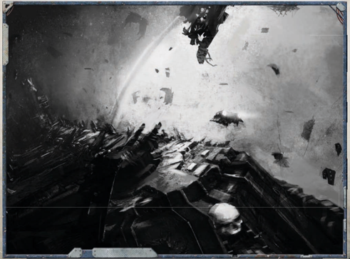
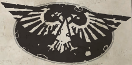

| Vehicle Classifications .......................................................170       |                                                                 |
|------------------------------------------------------------------------------------------|-----------------------------------------------------------------|
| Vehicle Characteristics.......................................................171        |                                                                 |
| Driving and Flying ............................................................171       |                                                                 |
| Vehicle Combat..................................................................172      |                                                                 |
| Aerial Combat ...................................................................174     |                                                                 |
| Attacking in Aerial Combat..............................................176              |                                                                 |
| Shooting Vehicle Weapons                                                                 | ...............................................177              |
| Sample Vehicles .................................................................179     |                                                                 |
| Chapter VI: Expanded Psychic Powers                                                      |                                                                 |
| New Navigator Powers                                                                     | .....................................................189        |
| New Astropath Powers......................................................193            |                                                                 |
| Theosophamy.....................................................................197      |                                                                 |
| New Discipline and Techniques.......................................197                  |                                                                 |
| The Theosophamy Discipline...........................................197                 |                                                                 |
| Astropathic Choirs.............................................................199       |                                                                 |
| Astropaths and Navigators in Starship Combat.............200                             |                                                                 |
| Chapter VII: Enhanced Game Mechanics                                                     |                                                                 |
| Social Interaction Challenges...........................................204              |                                                                 |
| Using Interaction and Lore Skills in Social Situations..204                              |                                                                 |
| Meta and Background Endeavours..................................207                      |                                                                 |
| Meta Endeavours................................................................208       |                                                                 |
| Background Endeavours....................................................210             |                                                                 |
| Making Background Endeavours.....................................211                     |                                                                 |
| Sample Meta Endeavour....................................................214             |                                                                 |
| Component Endeavours....................................................216              |                                                                 |
| Expanded Acquisition Rules.............................................221               |                                                                 |
| Making Multiple Acquisition Tests..................................221                   |                                                                 |
| Attracting Unwanted Attention........................................222                 |                                                                 |
| Using Profit Factor                                                                      | ............................................................223 |
| Ship Roles...........................................................................224 |                                                                 |
| Rank One............................................................................224  |                                                                 |
| Rank Two..........................................................................225    |                                                                 |
| Rank Three.........................................................................226   |                                                                 |
| Rank Four...........................................................................229  |                                                                 |
| Chapter VIII: Port Wander                                                                |                                                                 |
| The Guardian of the Maw................................................234               |                                                                 |
| In and Around Port Wander.............................................235                |                                                                 |
| The Ruling Factions ..........................................................241        |                                                                 |
| Notable Persons of Port Wander......................................242                  |                                                                 |
| The Law on the Port..........................................................248         |                                                                 |
| The Planets of Rubycon II                                                                | ...............................................249              |
| The Maw and the Fleet                                                                    | .....................................................252        |## Life on a Frontier World

'I only ask for two things in life. A stout ship, and the light of the Emperor to sail her by.'

-Rogue Trader Elizabeth Orleans

T he  Koronus  Expanse  is  a  place  of  adventures  and danger in equal measure. Xenos, pirates, heretics, and worshippers of Dark Gods await those who venture through the Maw, and ancient horrors lurk amongst countless lost and undiscovered worlds in the depths of the Expanse. Many brave and foolhardy Explorers have set off from Port Wander to try  their  luck  and  wrest  their  fortune  from  the Koronus  Expanse  with  a  stout  ship  and  their  Warrant  of Trade. Few return.

INTO THE STORM is an essential guide to those who wish to  make  their  fortune  in  the  41st  Millennium  and  live  to enjoy  it.  Functioning  primarily  as  a  rules  expansion  for Rogue Trader , this book examines and expands on all aspects of an Explorer, from the weapons he wields and ships he pilots,  to  the  Endeavours  he  pursues  and  adventures  he undertakes.  With  this  book,  an  Explorer  can  ensure  he  is properly prepared to face the travails that await him in the grim darkness of the far future.

The book begins with rules  for  expanding  the  Origin Path of character creation. New home worlds and options for  replacing  choices  along  the  Path  allow  for  a  much wider  range  of  customisation  and  new,  unique  characters. From there, INTO THE  STORM introduces  two  new  Career classes,  the  mercenary  Kroot  and  the  bloodthirsty  Orks, and  numerous  Alternate  Career  Rank  options,  allowing players to further sculpt their characters in response to their adventures in the Expanse.

The book continues with new selections of equipment, some of which are commonplace and essential to Imperial life,  and  others  that  are  rare  and  even  unique  to  the Expanse.  New  rules  for  starships  and  vehicles  follow, providing  Rogue  Traders  with  transports  ranging  from the  humble  Rhino  APC  to  the  mighty  gun-cutter.  New powers  and  abilities  for  Navigators  and  Astropaths  are also provided, including rules allowing them to use their formidable powers in space combat.

Finally, INTO THE  STORM provides  new  rules  for  using Profit Factor, Endeavours, and taking on important positions in the hierarchy of a starship. The book closes with an indepth examination of Port Wander: last Imperial port before the Maw, and gateway to the Koronus Expanse. Here players will find a location brimming with potential adventure and intrigue,  as  well  as  a  location  for  repairing,  refitting,  and resupplying before returning to the dangerous Expanse.

Introduction

©Entrusted aboard the sprint trader Imperium's Voice, en-route to Port Wander from Zayth, 046.816. M41.

I write this to you with the hopes that you will receive it on the eve of your majority, when you shall take your first steps into your inheritance. In recognition that the day when you shall claim the Armengarde Warrant of Trade is drawing ever closer , I take auto-Xuill to parchment and pen this missive. Perhaps you can add it to the many letters I have sent in the past years.

To my daughter and heir, the Lady Igraine Armengarde, in care of Captain 1onus +efray, /ouse 2rin

6ne day, you shall stand on the bridge of the Bansidhe and sail through the Maw to the wonders and terrors that lie beyond©but to reach that point will reXuire diligence and dedicated preparation. In the decades I have travelled the void, I have learned a great deal that the Sisters of the 6rders Famulous neglected to instruct during my formative years. A great deal that they are neglecting to instruct you in, even now. The Expanse contains much more than those who live within the Imperium could ever imagine, and it is not possible to see these splendours and these terrors and remain unchanged. With this I hope to provide a measure of that knowledge, that you might enter the storm un´inching in years to come.

Study and learn it well. Be ready for the day when you, too, pursue endeavours amongst the Expanse¢a day to which I look forward with hope and no small amount of pride.

I remain your devoted mother ,

Lord-captain Aoife Armengarde Bearer of the Armengarde Warrant and master of the cruiser Bansidhe

6## Frontier World Characters

'The stars call out to us, like the Siren's songs of yore; they lure us to fortune...or calamity.'

-Captain Zacharias du Kane, Rogue Trader

I n the ROGUE TRADER Core Rulebook, players are able to create and customise their characters through the choices made on the Origin Path. This chapter expands the Origin Path giving players more choices such as new Home Worlds and  background  options;  it  also  introduces  a  set  of  new options for players to give to their Explorers: Lineages.

In this chapter, there are six new Home Worlds from which Explorers can hail, and a new set of options called Lineages. In addition to the new Home Worlds and Lineages, the other lines  on  the  Origin  Path  include  new  selections  to  choose from. These selections work just like the ones presented in ROGUE TRADER .  Combined  with  those  choices,  these  new possibilities can help flesh out the player's Explorer and create distinct characters that are unique in the 41st Millennium and potentially possess specific ties to the Koronus Expanse.

Within  some  of  these  new  selections  the  players  have several  options  to  choose  from-similar  to  the  choices they have with the Lure of the Void selections in the core rulebook. Some of these new options have Experience Point (xp) costs associated with them due to the advantages they confer. However, it should be noted that including these new choices in a game is optional, and players should gain the GM's permission before selecting one. they have with the Lure of the Void selections in the core rulebook. Some of these new options have Experience Point (xp) costs associated with them due to the advantages they confer. However, it should be noted that including these new choices in a game is optional, and players should gain the

In addition to the character customisation options, players  and  Game  Masters  can  also  make  use  of  the  new Ship and Warrant Path generation system presented later in this chapter. This new system works in a similar fashion to the Origin Path. Instead of rolling randomly to generate a Warrant of Trade and starting Ship Points, it allows the  Explorers  to  determine  significant  details  about their  Dynasty's  Warrant  of  Trade  and  the  ship points to go along with it. In addition to the character customisation options, players  and  Game  Masters  can  also  make  use  of  the  new Ship and Warrant Path generation system presented later in this chapter. This new system works in a similar fashion to the Origin Path. Instead of rolling randomly to generate a Warrant of Trade and starting Ship Points, it allows the  Explorers  to  determine  significant  details  about their  Dynasty's  Warrant  of  Trade  and  the  ship

*Source:* `Battle Fleet of the Koronus, pages 5–9`
