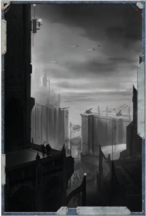

From the moment you could walk and hold a weapon, every waking moment of your life has been spent training to fight and kill the enemies of the God-Emperor. Y ou know the basics of combat and military tactics. Y ou are disciplined, honourable, loyal, and have the highest regard for integrity . However, the military doctrine that has surrounded you your whole life has also made you inflexible and dogmatic. Y ou grew up in a fortress-city; your neighbours all served to keep the mighty bulwark of your world standing against the enemy . As a member of a Rogue Trader's crew, you may serve as the ship's Master-at-Arms, or you may command a ship's mighty armaments and military compliments as a Rogue Trader. In any case you know your knowledge and skills in warfare are put to good use.

On the Origin Path chart, Fortress World may be taken instead of Forge World.

Characteristic Modifiers: +5 Ballistic Skill; +5 Willpower; -5 Intelligence; -5 Fellowship

Starting  Skills: Fortress  world  characters  begin  with  the Secret  Tongue  (Military)  (Int)  and  Common  Lore  (War)  as trained Skills.

Hated  Enemy: Growing up in  the  shadow  of  the  enemy affects those who live on a fortress world. They are taught to  hate  and  kill  their  enemy  on  sight  without  hesitation. Fortress world characters begin with the Hatred Talent (the group chosen is the enemy that the fortress world has been established against).

Constant Combat Training: All fortress world characters begin  with  Basic  Weapon  Training  (Las or SP).  However, they suffer a -5 penalty on Social Interaction Tests regarding non-combat topics (GM's discretion).

Steel Nerve: Every day denizens of fortress worlds train with live ammunition and explosives, and are comfortable around weapon's fire.  Fortress  world  characters  gain  the  Nerves  of Steel Talent.

Starting  Wounds: Fortress  world  characters  double  their starting  Toughness  Bonus  and  add  1d5+1  to  the  result  to determine their starting wounds.

Starting Fate Points: Roll 1d10 to determine a fortress world character's starting Fate Points. On a roll of 1 -9, he begins with 3 Fate Points; on a roll of 10, he begins with 4 Fate Points.## Life on a Penal World

'The  Battlefleet  serves  as  a  cornerstone  of  the  Imperium's  mighty war machine. You are descended from a long and noble line of naval families  and  warship  clans.  As  a  member  of  the  Battlefleet  of  the Imperial Navy you have a proud lineage -you are mankind's shield against the darkness of the void.'

The great  battlefleets  of  the  Imperial  Navy  are  among  the most ordered and disciplined organizations in the Imperium. The  men  and  women  of  the  Imperial  Navy's  officer  class stand  apart,  even  from  other  Void  Born.  They  have  their own  culture,  and  descend  from  a  long  and  noble  line  of naval families and ship clans that can trace their lineage back millennia.  It  is  with  great  distinction  that  these  members serve the Golden Throne, persecuting renegades and pirates in the name of God-Emperor of Mankind. Many battlefleet members can trace their origins to the rulers of worlds that administer the battlefleets' ships. Here their families collect and  organise  battle-won  wealth,  judiciously  managing  the spoils of war so that the great battlefleets may continue to serve the God-Emperor with distinction and honour.

## Penal World Characters

The  men  and  women  of  the  Imperial  Battlefleets  are  a proud,  martially-minded  people  with  a  strong  sense  of honour.  Crews  live  together  on  ship,  eat  together,  and face  the  enemies  of  the  Imperium  together.  Since  they  are trained  from  birth,  they  have  knowledge  of  shipboard  life that surpasses many of the most knowledgeable void-born. From  the  moment  they  are  able,  the  people  serving  the Battlefleet are taught how to move about in zero gravity, deal with ship-board emergencies, and handle warp travel.  As  they  mature,  they  progress  on  to more complicated pursuits such as learning ship-based weaponry, spatial navigation, and basic naval tactics. They learn the history of their ship and their Battlefleet, and they learn the pride that comes from being among the Emperor's finest. that surpasses many of the most knowledgeable void-born. From  the  moment  they  are  able,  the  people  serving  the Battlefleet are taught how to move about in zero gravity, deal with ship-board emergencies, and handle warp travel.  As  they  mature,  they  progress  on  to more complicated pursuits such as learning ship-based weaponry, spatial navigation, and basic naval tactics. They learn the history of their ship and their Battlefleet, and they learn the pride that comes from being among the

Members of the Battlefleets are a diverse and varied lot, but they have a few things in  common  with  each  other.  They almost universally respect duty, loyalty, and integrity, and show great strength of character. Conversely, they despise those  who  show  weakness,  deceit, and those who are generally lazy and inconsistent.  Compared  to  the  Void Born of Chartist and trade vessels, they have a larger physical build, the result of living  in  more  normal  gravity  conditions than that of their counterparts.. Members of the battlefleets are also more respected for their role as humanity's  protectors  among the stars. Members of the Battlefleets are a diverse and varied lot, but they have a few things in  common  with  each  other.  They almost universally respect duty, loyalty, and integrity, and show great strength of character. Conversely, they despise those  who  show  weakness,  deceit, and those who are generally lazy and inconsistent.  Compared  to  the  Void Born of Chartist and trade vessels, they have a larger physical build, the result of living  in  more  normal  gravity  conditions than that of their counterparts.. Members of the battlefleets are also more respected for their role as humanity's  protectors  among

*Source:* `Battle Fleet of the Koronus, pages 12–13`
