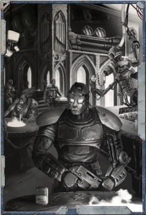

## Using Lineage

To see the stars, the suns and the moons of worlds already claimed by Man is of no interest to you. Only the hidden promise of strange and distant worlds entices you, and you desire only to push on and see as many new horizons and unique skies as possible. To mark unknown worlds with your presence and see things the likes of which no man has ever seen before is what drives you, and such a desire leaves no time for laxity, nor any room for complacency. Y ou must go forward, for there is nothing unseen in your wake.

Cost: 200xp

Effects: Gain Common Lore (Koronus Expanse) and either Scholastic  Lore  (Astromancy)  or  Trade  (Explorator)  as trained Skills.

## Example

You  live  for  excitement,  and  no  greater  excitement  can  be found than that of battle. Y ou yearn for the din and mayhem of conflict, the tests of skill, wits and courage, and eagerly seek  out  fights  wherever  they  can  be  found.  Others  may condemn you as a warmonger or find your belligerent ways off-putting, but your heart craves the rush of battle and such a thing should not be denied. Even in times of peace, you prepare for war, duelling for sport and honour, honing your skills and musing through countless theoretical strategies in anticipation of wars to come.

Cost: 250xp

Effects: Gain Scholastic Lore (Tactica Imperialis) as a trained Skill. Additionally gain the Nerves of Steel and Quick Draw Talents. Finally, gain +3 Weapon Skill or Ballistic Skill, but suffer -3 Fellowship.

## Along a Long and Glorious History

Whatever the pleasure, you have indulged in it. Y our hedonism defines  you,  your  reputation  is  dark  and  sordid,  and  you are not sated yet. Amongst the unknown must be sights and sounds and experiences as yet undreamt of by mankind,  and  you  cannot  stop  until  you  have found and sampled them! The world around you  grows  dull  and  grey  as  you  begin  to exhaust the possibilities of pleasure, and even the strictest taboos of  your  culture  are  becoming  increasingly  tempting  in  your desperate search for something new to satisfy you. Whatever you find, you may not escape it unscathed -or unchanged. Cost: 200xp Effects: Gain the Decadence Talent, Carouse as a trained Skill, and gain +3 Toughness or Fellowship. However, diverse and possibly ill-advised experiences have left their mark, tainting the character and making him incautious of further risks. Gain 1d5 Corruption Points and reduce suffer -3 Willpower.

## A Dark Secret

' Actually, I could not care less if you lived or died. My grandfather, however, felt differently.'

-Kurai Yume, upon settling a blood-debt

M ost  Warrants  of  Trade  are  ancient,  dating  back centuries  or  even  millennia  and  often  spanning generations.  Similarly,  the  great  houses  of  the Navis Nobilite have their origins in the dark and shrouded times  before  the  founding  of  the  Imperium.  Commanders of great starships, devoted servants of the church and proud histories of martial prowess can all be found within in the bloodlines  of  powerful  families.  The  continuation  of  great familial traditions is itself an age-honoured tradition within the Imperium, with every generation inheriting the skills and prestige of its predecessors and passing those on to the next generation in turn.

Such lineages are not necessarily limited to families. Within the  fane-laboratories  and  temple-factories  of  the  Adeptus Mechanicus, the covens and cabals of the Scholastica Psykana, the  drill-abbeys  of  the  Schola  Progenium  and  the  Military Academies  at  the  great  Segmentum  Fortresses,  educational fraternities provide a similar strength of legacy, each graduate given the benefit of ancient wisdom and lore and in turn given the chance to pass that on to those who succeed them.

Regardless  of  its  nature,  a  lineage  defines  the  means  by which an Explorer came by his current career path and learnt the methods of that trade. Some characters will have no lineage of  note,  their  paths  forged  alone  with  no  proud  ancestor  to guide their steps. Others may stand apart from their bloodlines, pursuing a different path than that of their antecedents. Whether a character's lineage is noteworthy, infamous or utterly obscure is up to the player and the GM-this section is optional, and may be used or ignored as appropriate.

## My Great-grandfather Built This Colony

Lineage is an optional addition to the Origin Path system. After choosing his options from each of the rows of the Origin Path, as described on page 15 of the ROGUE TRADER Core  Rulebook,  the  player  may  choose  whether  or  not he  wants  his  character  to  possess  a  Lineage  of  Renown, and  which  of  the  following  entries  he  wishes  to  use  to represent that lineage.Lineage  choices  are  free  and  open,  not  constrained  by the  other  choices  of  the  Origin  Path-but  that  is  not  to say  that  a  Lineage  comes  without  a  cost.  Because  they  are additional options beyond the six rows of the Origin Path, each Lineage costs xp. This is to be taken from the starting xp  of  the  character,  and  cannot  be  purchased  at  any  time except character creation-an Explorer cannot suddenly and retroactively gain an ancient and well-known ancestry; he is either born with it or he is not.

Each of the Lineage entries below consists of a description, defining the nature of the lineage as a whole in broad terms, followed by three sub-categories describing how the character relates to that lineage. These choices define both the cost of the Lineage and the benefit the character derives from it. The description  for  each  Lineage  assumes  a  familial  legacy,  but this does not necessarily have to be the case-the description should be used as a guide for a character's background and be tailored to fit, rather than used as a strict definition of who he was and where he came from.

## Prominent Ancestry

Nathan has created a character, Jequin Hos, a Rogue Trader from a family that has long held a powerful W arrant of Trade. He decides that  he  will  purchase  a  Lineage  option  to  reflect  his  character's heritage, and selects A Proud Tradition, defining the Hos W arrant as having been held by a long line of respected Rogue Traders. He tmust then  choose  between  the  three  options  within  A  Proud  Tradition: Heir  Apparent,  Uncertain  Inheritance,  or  Shameful  Offspring. Deciding that Jequin was one of many competing potential heirs, the one who finally triumphed over his siblings and rivals, Nathan selects Uncertain Inheritance, paying the xp cost and applying the benefits listed.

## Remember Your Forebears

Select one of the following options:

## A Proud Tradition

Something foul lurks  within  your  ancestry,  something  that would bring ruin upon your family were it ever to become known to outsiders. Y ou guard that secret with your life, for the disgrace of it would bring you and all your family low. Your power now makes that all the harder, for your enemies are many and they eagerly seek the means to overcome you. Were they to learn of your secret familial disgrace, little would be able to stop them extorting or blackmailing you for all you possess, or even simply revealing it out of spite and malice. Cost: 100xp

Effect: Gain Deceive and Scrutiny as trained Skills, owing to the character's constantly guarded nature. However, the strain of long years of concealing the secret has hindered prosperity, so reduce starting Profit Factor by 1.

## Heir Apparent

Your  connections  and  the  legacy  you  have  inherited  reach many  places,  and  you  have  learned  of  those  places  well, lending authority to your presence and swaying those who might  otherwise  have  cause  to  doubt  you.  Y our  ancestors laid the foundations for your present prosperity, and you take advantage  of  that  whenever  the  opportunity  arises.  When your own reputation does not open doors for you, that of your forebears will.

Cost: 350xp

Effect: Gain  the  Peer  (any  one)  Talent,  representing  some of  the  wide-ranging  connections  the  character's  family  has cultivated. In addition, increase starting Profit Factor by 1.

## Uncertain Inheritance

Your  family  has  existed  for  a  very  long  time,  predating sectors  of  the  Imperium  and  with  branches  spread  far  and wide across the galaxy. Y our family name is one known well in many places, recorded in ancient archives of history and proudly remembered on worlds you may never see, due to the exploits of distant kin and legendary ancestors. Members of your family pride themselves on their lengthy and widespread legacy, and you were taught the lore of your ancestors from an early age. an early age. an early age.

Your  formative  years  were  spent  in  the  presence  of  many tutors, learning the history of the Imperium and the part your ancestors  played  in  that  history.  Long  hours  of  study,  and longer ones of rote-learning and recitation, have given you a significant insight into matters historical, and the habits of your youth stay with you even to this day-you retain a deep curiosity about the events of ancient times.

Cost: 200xp

Effect: Gain Scholastic Lore (Archaic) as a trained Skill, and Scholastic Lore (Legend) as an untrained Basic Skill. Gain Scholastic Lore (Archaic) as a trained Skill, and Scholastic Lore (Legend) as an untrained Basic Skill. Gain Scholastic Lore (Archaic) as a trained Skill, and Scholastic Lore (Legend) as an untrained Basic Skill.

## Shameful Offspring

Though I have no doubt that your studies have given you a thorough knowledge of the history of our family, it would be remiss of me to make light the exploits of my predecessors. 6ne can never dismiss the experiences of those who have come before, for in their triumphs and failures can be found the most crucial of details. I will never forget the lessons taught to me by the tales of your great-grandmother /elen Armengarde, whose instincts for spotting attempts upon her life failed her only once. /er wary manner and cunning were an inspiration to me, and I have since weathered no fewer than fourteen assassination attempts thanks to her example. Consider deeply the legacy left behind by your ancestors; it would be foolish to ignore them.

29

29## Accursed Be Thy Name

You are the latest in a long line to take up this profession, an heir to a proud and prestigious lineage. The pressure of expectation and the weight of responsibility have always been your companions and your burden, and while you may have acted out against them as a callow youth, you are now the head of the household, the one whose name is synonymous with  that  of  your  line  and  your  profession.  For  better  or worse, the prestige of your lineage is now yours to carry.

Select one of the following options:

## Outraged Scion

Your fate was always this: to stand at the forefront of the next generation  and  carry  the  family  tradition  one  step  further. For  you,  the  weight  of  responsibility  was  the  hardest,  for you  alone  were  required  to  bear  the  expectations  of  your entire  family.  Now,  however,  you  look  back  thankfully  on those harsh formative years, for the constant pressure of your teachers and predecessors gave you an advantage which will allow you to thrive in the years ahead.

Cost: 100xp

Effect: Pick a single Skill from amongst the Starting Skills for the character's Career Path.Gain the Talented Talent for that Skill.

## Secret Taint

Your early years were spent in a constant state of intrigue, as you warred silently with your siblings, cousins and rivals to be the one who inherited the power and the prestige. Those who failed would be condemned to lives of lesser significance, always overshadowed by the one who claimed the prize. In the end, long-fought political battles and hard-won cunning paid off and you stand triumphant-and alone.

Cost: 300xp

Effect: Gain the Paranoid Talent, and Deceive as a trained Skill.  Additionally,  gain  a  +3  bonus  to  Intelligence  or Perception.

## Vile Insight

Burdened by expectations of glory and succession, you quickly sought the first escape you could find. While your siblings worked hard to  earn  the  prestige  of  the  family  name,  you indulged your whims and desires in an effort to avoid those responsibilities.  Whether  through  cruel  fate,  inexplicable fortune or great calamity, however, you find yourself the only heir to the line, and your forebears shudder to think of the damage you might do to the family name now that you are in charge.

Cost: 150xp.

Effect: You gain your choice of Carouse or Gamble as a trained Skill, and the Decadence Talent. Y ou also gain either 1d5 Corruption Points or 1d5 Insanity Points (your choice) due to the toll your life of reckless revelry has taken.

## Disgraced

Your line is tainted, corrupted by some unspeakable foulness that  has  attracted  the  scorn  and  wrath  of  Inquisitors  and Confessors  and  all  manner  of  others  over  the  generations. Like the Haarlock line of Rogue Traders (thought cursed by many) or the scions of the tainted houses of Malfi, many of your ancestors and predecessors were vile heretics, unrepentant blasphemers and twisted schemers whose evil is legendary, and more than a few of them burned for their sins. Now the burden of their infamy is yours to bear, and whether you choose to continue their legacy or strive to overcome remains to be seen. Select one of the following options:

## Another Generation of Shame

You stand apart from your predecessors and have made yourself an example of purity  to  spite  their  foul  memory .  When  the  purges came and claimed your living relatives, you led the Inquisition to  their  door,  glad  to  see  them  receive  the  punishment  they deserved. Now free to pursue your own legacy, you hope above all else that you can leave the taint of your lineage behind.

Cost: 300xp.

Effect: Gain  the  Armour  of  Contempt  Talent  and  select two  Forbidden  Lore  skills  from  the  following  list  to  treat as  untrained  Basic  Skills:  Daemonology,  Heresy,  Mutants, Pirates, Psykers, The Warp, or Xenos.

## The Last Child

You have long been careful to hide the worst of yourself and your family from outsiders. Their greatest atrocities are tales of horror, yet the truth of them is far worse. Endless caution and boundless  cunning  define  generations  of  your  ancestors,  and you have inherited these traits along with something far more sinister. Now you are the head of the family, and your power can be used to any end you wish...so long as nobody discovers it.

Cost: 400xp

Effect: Gain the Dark Soul Talent and Deceive as a trained Skill. In addition, gain +5  Intelligence or Willpower. However, the taint is so deeply rooted within the character's line, he gains 1d10+10 Corruption Points.

## The One to Redeem Them

Whether for good or  ill,  you  have  seen  much  that  no  human  ever should. Esoteric and forbidden knowledge was your constant companion through your early life, and your understanding of such subjects is something that would shock most people. Whether you choose to turn that insight to greater things, or are tainted by it, is for the future to decide. For now, you possess great knowledge, and it gives you a decisive edge. Cost: 300xp

Effect: Select  any  three  Forbidden  Lore  skills  from  the following list: Daemonology, Heresy, Mutants, Pirates, Psykers,  The  Warp,  or  Xenos.  Gain  those  as  trained  Skills. However, the malign nature of your knowledge has touched the character's mind and soul. Gain 2d5 Insanity Points and 2d5 Corruption Points.

## Of Extensive Means

Shame  is  your  inheritance.  Y our  family  line  is  in  shambles, its  resources  all  but  depleted,  its  connections  severed  and its  reputation  met  with  only  scorn  and  pity .  Y ou  grew  up  in dilapidated finery , constantly mocked by the wealth and prestige of generations past, and constantly reminded of the fact that you are yet another heir with nothing of worth to inherit. Now you stand at the forefront of your broken family, and must choose whether you will continue their disgrace or end it.

Select one of the following options:

## A Powerful Legacy

Your life has been ill-favoured. With nothing to look up to, no prestige to bear the burden of, your life lacked aspiration, and you have spent years whittling away what little wealth remains, allowing the family reputation to sink even lower as the glorious past grows ever more distant. Even now, you do little but bring it further shame and disrepute.

Cost:

100xp

Effect: Gain  Carouse  as  a  Trained  Skill,  and  the  Peer (Underworld)  Talent. However,  reduce  starting Profit Factor by 1.

## Born to Wealth

Your  family  is  not  merely  disgraced,  it  is  dead.  Y ou  alone are  the  sole  survivor  of  a  once-proud  lineage  that  fell  into disrepute  and  paid  the  ultimate  price  for  it.  Whether  they made the wrong enemies, were on the wrong world at the wrong  time  as  war  or  rebellion  took  hold,  or  faced  some other  fate,  they  are  gone  and  you  are  all  that  remains,  the last heir and the only one who can ensure that your family continues or, at the very least, dies with pride. Y ou will need all your wits and cunning to ensure the survival of your clan, as your once vast resources are now next to nothing.

Cost:

200xp

Effect: Gain  Barter  and  Trade  (any  one)  as  trained  Skills. Additionally,  gain  +3  Intelligence  or  Fellowship.  However, reduce starting Profit Factor by 2.

## Far-reaching Contacts

Your family's shame is an outrage you have struggled beneath your whole life. Perhaps inspired by noble ancestors predating the  fall  from  grace,  or  simply  infuriated  by  the  state  of  the family  reputation  and  resources,  you  set  forth  to  bring  your inheritance back from the brink and return your clan to the glory  it  knew  long  ago.  With  no  others  to  challenge  your claim, you have taken control and pushed onwards to achieve something worthy of your ancestors, stopping at nothing to regain their wealth and redeem their honour.

Cost:

300xp

Effect: Gain Commerce as a trained Skill, and gain a bonus +50 Achievement Points when completing any objective for an Endeavour. However, in spite of the character's efforts, his family's resources are still not what they once were; reduce starting Profit Factor by 1.

## Witch-born

Wealth, power, servants... your family has all of these things in abundance. For longer than you can recall, your family has always known the right people, had the most money, been able to obtain the finest things, and had the most dignified and skilful vassals. Y ou were born to such means, and never wanted for anything. Some may call you spoiled, or unfairly lucky, but the challenges of having and maintaining wealth and power are far beyond the unfortunates who have never possessed such things. Now that wealth and power is yours to command, and it shall take you far.

Select one of the following options:

## Perilous Choice

A place in the politics of entire sectors of Imperial Space is the legacy you have found yourself with, and thanks to your influence  amongst  men  and  women  whose  wills  command worlds, you are eminently comfortable in such circles. Y ou are respected and feared for what you can do to those who earn your displeasure, and for the discretion with which you use that power. Even when people have not heard of your family, so commanding and powerful is your presence that they will listen anyway.

Cost:

350xp

Effect:

Y ou  gain  the  Talented  (Intimidate),  Talented

(Command) and Air of Authority Talents.## Proven to Be Pure

Your  inheritance  was  huge.  The  wealth  afforded  to  the lesser scions of your family was still more than sufficient to eclipse the entire estates of many lesser families. As the one who claimed the ultimate prize, your wealth is greater still, bringing with it the means to do a great many things that those of less grand circumstances might never dream of. Any desire you have now is within your grasp, for there are few doors that sufficient money cannot open eventually.

Cost:

300xp

Effect:

Increase starting Profit Factor by 2.

## Witch-knowledge

You  know  people  who  know  people,  and  the  people  you know are well-placed  indeed.  For  generations,  your  family has had friends, relatives and acquaintances in every sector of Imperial society. This extensive network of contacts and allies has allowed your family to become more powerful and influential  than  they  might  otherwise  have  been,  and  now that  network  is  yours  to  use.  A  casual  name-drop  here,  an 'I'm a friend of the Lord-Admiral' there, and sooner or later nothing is beyond your reach.

Cost:

300xp

Effect:

Gain any three Peer Talents (subject to GM approval).

*Source:* `Battle Fleet of the Koronus, pages 29–33`
