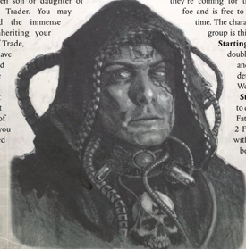
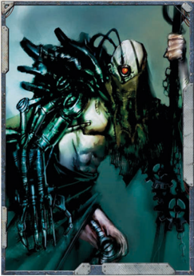

## Fringe Survivor

You are the child of a family gifted with a Warrant of Trade. Your dynasty may be thousands of years old, or perhaps your parents were awarded their own Warrant and your dynasty is considered to be an upstart.. Whatever the case may be, you have been given the training needed to keep your family's dynasty alive for at least another generation. You are the child of a family gifted with a Warrant of Trade. Your dynasty may be thousands of years old, or perhaps your parents were awarded their own Warrant and your dynasty is considered to be an upstart.. Whatever the case may be, you have been given the training needed to keep your family's dynasty alive for at least another generation.

You  are  the  chosen  son  or  daughter  of a powerful Rogue Trader. You may have been granted the immense responsibility of  inheriting  your dynasty's Warrant of Trade, You  are  the  chosen  son  or  daughter  of a powerful Rogue Trader. You may have been granted the immense responsibility of  inheriting  your dynasty's Warrant of Trade,

in which case you have in which case you have

assumed  the  coveted title of Rogue Trader.  However,  it is  just  as  likely  that you saw the Warrant passed  on  to  one  of your  siblings,  and  you are either expected to  support  them  in their Endeavours, or  plunge  into  the your  siblings,  and  you unknown to make your fortune and earn glory for your family with your own resourcefulness. How you do this is up to you and whatever abilities you may possess, and you may even go so far as to sign on with a different Rogue Trader to grasp the opportunities you seek.

You have been gifted with immense rank and privilege, and the immense responsibilities to go with them. Trained in command and the intricacies of commerce, you are ambitious and  perhaps  even  a  bit  devious.  However,  duplicity  is  the trademark of a  child  of  your  dynasty,  and  you  know  your trade well. Y ou will use every shred of ingenuity to ensure your family's name survives in the cruel and uncaring world of the 41st Millennium.

On the Origin Path chart, Child of Dynasty may be taken instead of Noble Born.

Characteristic Modifiers: -3 Toughness; +3 Intelligence; -5 Willpower; +5 Fellowship

Starting Skills: The Child of Dynasty character begins with Literacy (Int), and Speak (High Gothic) as trained Skills.

Dynastic Warrant: Due to the prestigious heritage of a Child of  Dynasty,  they  can  bring  considerable  resources  to  bear when outfitting a starship. All Child of Dynasty characters add an extra +3 Ship Points to those already generated when building the group's ship. However, a group with a Child of Dynasty Character may not exchange their Ship Points for Profit Factor-any unspent Ship Points at the end of creating their starship are lost.

Honour Amongst One's Peers: Even the most unimportant offspring of a Rogue Trader dynasty are likely to have grown up amongst the rarefied heights of Imperial aristocracy, and can handle themselves amongst them without embarrassment. A Child of Dynasty gains a +5 bonus to all Fellowship Tests to interact with high-ranking officials of the Imperium and members of the Imperial nobility in a formal setting (exactly when this bonus applies is up to the GM). A Child of Dynasty gains a +5 bonus to all Fellowship Tests to interact with high-ranking officials of the Imperium and members of the Imperial nobility in a formal setting (exactly when this bonus applies is up to the GM).

This  character  has  an  enemy  who  covets their  position,  their  wealth,  or  their  ship.  The  Child  of Dynasty has no idea who this person is, or the fact that they're  coming  for  them.  The  GM  determines  this foe  and  is  free  to  reveal  this  enemy  at  any  given time. The character gains the Enemy Talent; the group is this unseen foe. Unseen Enemy: This  character  has  an  enemy  who  covets their  position,  their  wealth,  or  their  ship.  The  Child  of Dynasty has no idea who this person is, or the fact that they're  coming  for  them.  The  GM  determines  this foe  and  is  free  to  reveal  this  enemy  at  any  given time. The character gains the Enemy Talent; the group is this unseen foe.

Starting Wounds: The  Child  of  Dynasty doubles his starting Toughness Bonus and  adds  1d5  to  the  result  to determine their starting number of Wounds. Starting Wounds: doubles his starting Toughness Bonus and  adds  1d5  to  the  result  to determine their starting number of Wounds.

Starting Fate Points: Roll 1d10 to determine this character's starting Fate Points. On a 1-3, begins with 2 Fate Points; on a 4-7, he begins with 3 Fate Points; on an 8 - 10, he begins with 4 Fate Points. Starting Fate Points: to determine this character's starting Fate Points. On a 1-3, begins with 2 Fate Points; on a 4-7, he begins with 3 Fate Points; on an 8 - 10, he begins with 4 Fate Points.

## Survivalist

L isted  below  are  new  Origin  Path  options  that  may  be L isted  below  are  new  Origin  Path  options  that  may  be L taken in place of the ones described in the L taken in place of the ones described in the L ROGUE T OGUE T OGUE RADER Core  Rulebook.  As  mentioned  earlier,  when  choosing L Core  Rulebook.  As  mentioned  earlier,  when  choosing L one of these new selections, players should note that they have three choices. The player selects the option he wishes for his character and applies the effects. Because of the depth and power these new choices provide, each selection costs a listed number of experience points. This cost is deducted from the character's starting experience. Note that once a character has been created, the player cannot go back and later purchase these options-this must be done during character creation. Also, any modifications made to an Explorer due to taking these new choices does not count as an Advance for the purposes of increasing in rank, nor do increases or reductions count toward the improvement of a Characteristic through normal means.

If an Origin Path selection provides a character with training in a Skill the character is already trained in, or will be trained in based on the starting Skills provided by his Career selection (or an additional Origin Path choice), the player may choose to give his Character +10 to that Skill, instead. Note, this counts as the +10 training in that Skill, if the option to gain +10 in that Skill becomes available later in the character's Career, he cannot purchase it again. (He can, of course, purchase the +20 Advance if it becomes available, see page 15 of ROGUE T OGUE T OGUE RADER ). R ). R

The  player  may  also  choose  to  forgo  the  additional training  in  that  Skill,  and  instead  decrease  the  cost  of  that alternate Origin Path choice by 50 experience points. This option  is  also  available  if  the  character  would  receive  a duplicate Talent-although since the character cannot receive 'additional  training'  in  a  Talent,  the  Origin  Path  choice  is automatically reduced by 50 experience points.

## Heretek

The new options presented here add another level of complication  and  detail  to  the  Origin  Path  system, giving players a wider range of choices with which to define their characters. Every effort has been made to match  the  most  appropriate  new  options  to  their proper  places in the Origin Path-for example, Knowledge  is  a  new  Motivation  highly  appropriate for  Explorator  characters, and as such is placed above Explorators  on  the  Origin  Path-but  some concessions  had  to  be  made  to  the  limited  space available, and some options which  may  be  desirable or appropriate may not be  accessible to certain character archetypes if using the Origin Path strictly.

It is recommended, then, that a GM making use of these  additional  options  nominate  one  or  more  rows of the Origin Path as 'free choice rows,' as described in  the ROGUE TRADER CORE RULEBOOK ,  in  order  to make these options more available to everyone.

## Pit-fighter

Life is the Emperor's currency. Spend it well.

-Imperial Proverb

T he Imperium is a vast place, and within it there are countless thousands of life stories. For most, the life a person is born to will be the only one he ever knows. For some, however, this life is merely the beginning.

Each  of  the  new  Birthrights  in  this  section  can  be substituted for those from the Character Creation section in the ROGUE TRADER Core Rulebook, taking its place on the Origin Path. Unlike those in the core rulebook, these entries are  more  detailed  and  each  contains  three  distinct  options under a single broad heading, each of which has an xp cost associated with its benefits. When choosing one of the new entries, pick a single option from amongst those presented for that Birthright, and pay the listed amount of xp.

## Unnatural Origin

A character may select Fringe Survivor instead of the Scavenger or Savant entry on the Standard Origin Path table.

Life  in  the  Imperium  of  Man  is  constrictive  and  stifling. You and your family did whatever it took to survive in this regime by living out on the fringes of society. Each day was a struggle, but somehow, against all odds, they found a way so you could go on and realise the destiny the God-Emperor had entrusted in you.

Perhaps you come from a long line of hereteks, steeped in  the  dark  arts  of  tech-reclamation;  salvaging  whatever scraps  you  could  get  your  hands  on  in  order  to  turn  them into  something  a  bit  more  useful,  ever-fearful  of  discovery by  the  Adeptus  Mechanicus.  Or,  your  family  might  have travelled from place to place as traders, miners, or some other nomadic profession, never settling in one area for very long, but teaching you how to get by in nearly any environment and climate.

Many worlds in the Calixis Sector and Koronus Expanse have legitimate and underground blood sport arenas where death  is  dealt  out  to  the  delight  of  screaming  crowds  and jaded nobility. In many places throughout the sector, these fighters are highly respected and arena combat is considered a time-honoured tradition. Perhaps such a place is where you grew up-with pit-fighters and arena gladiators to keep you company and teach you to fight for coin and the entertainment of the crowds.

Select one of the following options:

## Contaminated Environs

There are those who, for whatever reason, move about from place  to  place,  never  staying  in  one  spot  for  very  long. Some are nomadic families and tribes who move about their  world's  continents  following  herds  or  other resources.  Some  are  miners  or  merchants  who go  about  plying  their  trade  or  wares.  There are others who not only move about acrossthe land, but also go from system to system-and beyond! Whatever  background  your  family  has,  this  is  the  life  you were born into. Y our life is that of a nomadic wanderer, with little permanence. But you do have skills and honed instincts that keep you alive in the most hostile of climates. Y ou are alert  for  danger  and  know  how  to  survive  in  the  galaxy's myriad wildernesses. However, you have also witnessed many horrors of this galaxy through you travels as there are places in this universe that man was not meant to go. The nightmares still haunt you to this day.

Cost:

300xp

Effect: Gain  +3  Toughness  or  +3  Perception.  Additionally, gain  the  Survival  (Int)  Skill  as  a  Trained  Skill.  Also,  gain  1 additional Fate Point and 1d5+1 Insanity points.

## False-man

Those  known  as  tech-heretics,  or  'hereteks,' are often branded as criminals. As technology is little understood and rightly feared for the troubles it has caused in mankind's past, these  blasphemers  are  often  hunted  down  by  the  Adeptus Mechanicus.  If  caught,  they  face  the  prospect  of  being 'recycled' into a servitor-mind-wiped and slaved to serve the Priesthood of Mars. Hereteks are versed in the dark arts of technology, and typically gained their knowledge outside the  Priesthood  of  Mars.  Many  gained  their  'dark'  powers through the application of intuitive leaps of logic. Some of them  are  nothing  more  than  scavengers  who  dwell  in  the dregs of society. Others are more dangerous, supplying the underworld and black markets with prohibited technology, drugs, chems, and even weaponry. A few tales whispered in the  dark  shadows  tell  of  those  hereteks  who  have  crossed over into greater tech-heresy and delve into things best not spoken of. Like any subculture within the Imperium, hereteks are  often  drawn  to  those  of  like  mind  and  those  that  can survive on the fringes of society.

Cost:

100xp

Effect: Gain +3 Intelligence. Additionally, the character may select  two  skills  from  the  following  list  as  Trained  Skills: Chem-Use (Int), Common Lore (Tech) (Int), Forbidden Lore (Archeotech) (Int),  Tech-Use (Int),  Medicae  (Int),  Scholastic Lore (any) (Int). In addition, gain 1d5+1 Corruption points. The Adeptus Mechanicus does make it a point to hunt down and eliminate hereteks.

## Tainted by the Warp

Across  the  Calixis  Sector,  there  are  numerous  underground blood-sport arenas and fighting pits where barbaric gladiators fight for glory and the entertainment of the masses; this is your world. Thriving amid the lower castes of society, gladiatorial combat is a staple of many Imperial cultures. Here, men and women fight for glory and wealth; there are a few, however, who have been sentenced to the pits for their crimes. Many of the fighters are hereditary combatants; their parents fought, their grandparents fought, and so on back through the generations. In the Calixis Sector, names like 'Red Hook,' 'Killer Kane,' and 'The Butcher' are infamous within the arenas.

You  have  been  training  and  honing  your  body  since birth,  and  you  have  been  champion  more  than  once.  Y ou have studied at the feet of great pugilists and sword-masters. Some of the depraved and jaded nobility crave exotic fights and thus you have been pitted against grotesque xenos and mutants with awful mind-powers. But your abilities have not gone unnoticed and you know soon enough you will again feel  the  rush  and  clarity  of  mind  that  can  only  come  from mortal combat.

Cost:

200xp

Effect: Gain +3 Toughness or +3 Strength, and +3 Weapon Skill.  In  addition,  gain  the  Rival  (Underworld)  Trait  and  1 Corruption Point.

## In Service to the Throne

A character may select An Unnatural Origin instead of the Scapegrace or Stubjack entries on the standard Origin Path table.

There are many in the Imperium whose existence is not kind; indeed,  there  are  few  for  whom  the  Imperium  is  anything other than a distant and uncaring master. For some, however, existence is something to be suffered and endured. For these wretched few, life is a twisted and unnatural thing, and such men and women either find release in an early death or rise above their abhorrent origins. Some are cursed by a polluted environment, others doomed by the taint of the Warp, while others still are false-men, wrought or remade in flesh-vats and genetic vaults, their lives and bodies as clay to the whims of others. Those who endure their bleak existence are hardened by it, made resolute by an unrelenting desire to leave theirpast behind. In either case, it is said in hushed tones that these men and women may be something less than human.

Select one of the following options:

## Tithed

The industry of man leaves entire worlds choking on acrid fumes and drowning in noxious effluvia. On innumerable worlds, and hive worlds in particular, chemicals flood from manufactoriums, research stations, starports, and all manner of other locations, leaving the world poisoned. Such places are  toxic  to  human  life,  yet  humans  may  still  exist  there, the  dregs  of  society  forced  into  the  most  inhospitable places imaginable. Amidst polluted water and foul vapours, these people endure horrific lives, and as generations pass the  poisons  that  suffuse  their  erstwhile  homes  taint  their very nature, scarring their genes and rendering their very humanity a flawed and deformed thing. You may bear this contamination openly,  your  form  twisted  and  mutated,  or you may simply appear unhealthy.

Cost: 100xp

Effects: Gain  the  Peer  (Mutants)  and  Resistance  (Poisons) Talents. Also gain +3 to either Toughness or Willpower, but suffer -3 Fellowship. For an additional 100xp, the character may roll once on Table 14-3:Mutation on page 369 of the ROGUE TRADER Core Rulebook, re-rolling any results of 75 or higher.

## Born to Lead

Your  life  is  not  your  own.  It  is  the  product  of  an  arcane science only barely understood by those that wield it, who seek to emulate the Emperor's mastery of genetics. Y our form and your nature are manufactured, the result of tampering by those who seek to make men more able to perform certain tasks. Y ou are a rarity in the Imperium and beyond it, a human being wrought by artificial means, and whether you embrace the purpose of your creation or deny it, the fact that you may not be entirely human is still weighs heavily upon you. One thing you do know is that you are still human in part-their science cannot create new life, it can only change that which already exists. However small a comfort that may be, even if it provides only solace through hatred, it is something.

Cost: 300xp

Effects: Gain  the  Ambidextrous,  Autosanguine  and  ChemGeld Talents. Additionally, select two characteristics: They are both increased by +3. However, select one characteristic and reduce it by -3, and either gain 2d10 Insanity Points or lose one Fate Point permanently.

## One Amongst Billions

Whatever the reason, you have been irrevocably tainted by contact with the Immaterium, your soul scarred by a malign exposure that was present since you were very young. To you the material world feels static and unyielding, pale and cold compared to the barely-imaginable churning of the Warp. Y ou are distant from his fellow man, for their world feels so small and confining compared to the infinite reaches your instincts tell  you  lay  beyond reality's walls, and little can scare you; the  horrors  of  the  Warp  have  lingered  in  swiftly-forgotten dreams, lurking behind your conscious mind for most of your life, and no mortal concern can compare with that.

Cost: 200xp

Effects: Gain the Dark Soul and Jaded talents, and Forbidden Lore (Warp) as an untrained Basic Skill. Further, gain +3 to Perception or Willpower. However, suffer -3 to Fellowship and gain 1d10 Corruption Points. For an additional 300xp, the  character  may  purchase  the  Favoured  by  the  Warp talent, gaining an additional 1d10 Corruption Points in the process.

*Source:* `Battle Fleet of the Koronus, pages 15–20`
