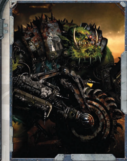

| Xenos Characters ................................................................46              |                                                                                        |
|--------------------------------------------------------------------------------------------------|----------------------------------------------------------------------------------------|
| The Alien in the Imperium                                                                        | .................................................46                                    |
| Kroot                                                                                            | ....................................................................................47 |
| Alien Biology........................................................................48          |                                                                                        |
| Kroot Player Characters......................................................48                  |                                                                                        |
| Kroot Kindreds.....................................................................49            |                                                                                        |
| Kroot Characteristics                                                                            | ...........................................................50                          |
| Kroot Talents                                                                                    | .......................................................................50              |
| Kroot Mercenary..................................................................52              |                                                                                        |
| Orks.......................................................................................56    |                                                                                        |
| Orks in the Koronus Expanse.............................................58                       |                                                                                        |
| Ork Player Characters.........................................................60                 |                                                                                        |
| Skills and Talents                                                                               | .................................................................63                    |
| Ork Freebooter                                                                                   | ...................................................................66                  |
| Alternate Career Ranks                                                                           | .......................................................70                              |
| Taking an Alternate Career                                                                       | Rank......................................70                                           |
| Career Progression...............................................................71              |                                                                                        |
| Acquisitionist........................................................................72         |                                                                                        |
| Augmenticist.........................................................................74          |                                                                                        |
| Calixian Privateer.................................................................76            |                                                                                        |
| Drusian Adherent.................................................................78              |                                                                                        |
| Flight Marshal......................................................................80           |                                                                                        |
| Genetor..................................................................................82      |                                                                                        |
| Gland Warrior.......................................................................84           |                                                                                        |
| Kroot Shaper ........................................................................86          |                                                                                        |
| Legend of the Expanse........................................................88 Navis Scion      | ...........................................................................90          |
| Ork Kommando...................................................................92                |                                                                                        |
| Ork Mekboy.........................................................................94            |                                                                                        |
| Transubstantial Initiate......................................................................96 |                                                                                        |
| Torchbearer...........................................................................98         |                                                                                        |
| Xenographer.......................................................................100            |                                                                                        |
| Elite Advances                                                                                   | ....................................................................102                |
| Using Elite Advances.........................................................102                 |                                                                                        |
| Agent of the Throne..........................................................103                 |                                                                                        |
| Glimpse From Beyond.......................................................105                    |                                                                                        |
| Rite of Duplessence...........................................................106                |                                                                                        |
| Sanctioned Xenos...............................................................107               |                                                                                        |
| Chapter III: Extended Armoury                                                                    |                                                                                        |
| Ranged weapons................................................................110                |                                                                                        |
| Las Weapons.......................................................................110            |                                                                                        |
| Solid Projectile Weapons                                                                         | ..................................................111                                  |
| Bolt Weapons......................................................................112            |                                                                                        |
| Melta Weapons...................................................................114              |                                                                                        |
| Plasma Weapons.................................................................114               |                                                                                        |
| Flame Weapons...................................................................114              |                                                                                        |
| Primitive Weapons.............................................................114                |                                                                                        |
| Launchers............................................................................115         |                                                                                        |
| Grenades and Launcher Munitions..................................116                             |                                                                                        |
| Exotic Ranged Weapons....................................................117                     |                                                                                        |
| Archeotech Ranged Weapons...........................................118                          |                                                                                        |
| Xenos Ranged Weapons....................................................119                      |                                                                                        |
| Primitive Weapons.............................................................121                |                                                                                        |
| Chain Weapons                                                                                    | ..................................................................122                  |
| Shock Weapons..................................................................122               |                                                                                        |
| Power Weapons..................................................................124               |                                                                                        |
| Exotic Melee Weapons                                                                             | ......................................................124                              |

| Force Weapons ..................................................................126       |                                                                                          |
|-------------------------------------------------------------------------------------------|------------------------------------------------------------------------------------------|
| Weapon Upgrades..............................................................127          |                                                                                          |
| Unusual Ammo...................................................................128        |                                                                                          |
| Armour                                                                                    | ................................................................................129      |
| Force Fields.........................................................................130  |                                                                                          |
| Gear                                                                                      | .....................................................................................133 |
| Clothing..............................................................................133 |                                                                                          |
| Drugs and Consumables....................................................133              |                                                                                          |
| Tools                                                                                     | ....................................................................................134  |
| The Exotic and the Alien                                                                  | ..................................................138                                    |
| Bionics and Implant Systems............................................141                |                                                                                          |
| Ork Armoury......................................................................142      |                                                                                          |
| Kroot Armoury...................................................................146       |                                                                                          |
| Chapter IV: Starships Expanded                                                            |                                                                                          |
| Serving Aboard a Starship                                                                 | ................................................148                                      |
| Families and Dynasties......................................................149           |                                                                                          |
| New Starship Hulls............................................................151         |                                                                                          |
| Ship Background Packages...............................................153                |                                                                                          |
| Additional Components....................................................156              |                                                                                          |
| Essential Components                                                                      | .......................................................156                               |
| Supplemental Components...............................................158                 |                                                                                          |
| Archeotech Components...................................................161               |                                                                                          |
| Ship Upgrades....................................................................162      |                                                                                          |
| Example Rogue Trader Vessels.........................................165                  |                                                                                          |
| Eternal Praetorian                                                                        | .............................................................165                         |
| Measured Response............................................................166          |                                                                                          |
| Bounty of Scintilla                                                                       | ............................................................167                          |
| Sovereign Venture                                                                         | .............................................................168                         |

## Subpages
- [Frontier World](frontier-world.md)
- [Footfallen](footfallen.md)
- [Fortress World](fortress-world.md)
- [Battlefleet](battlefleet.md)
- [Penal World](penal-world.md)
- [Maleziel](maleziel.md)
- [Life as a Child of Dynasty](life-as-a-child-of-dynasty.md)

*Source:* `Into the Storm, page 4`
