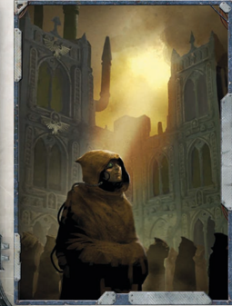

## Crusade

Human  life  is  the  single  most  abundant  resource  in  the Imperium of Man, and yours is no different. Dragged from the life you seemed destined to lead so that you might serve the Emperor in some other capacity, your years were spent in  the  company  of  those  like  yourself,  people  of  many worlds given up as a tithe to the Imperium. You may have served in the Imperial Guard or been conscripted into the Imperial Navy. You may even have been a conscript-colonist for  a  newly-settled  world,  a  menial  for  the  city-offices  of the Administratum, or something else entirely. Whatever the case, your life of service helped you escape from the life you might have lead, providing you with a broader knowledge of the Imperium and the rare opportunity to see things you might  never  have  even  heard  of  had  you  not  been  taken from your home.

Cost: 350xp

Effect: Gain a single Common Lore skill as a trained Skill, chosen from the following list: Adeptus Astra Telepathica, Administratum, Imperial Creed, Imperial Guard, Imperial Navy, Imperium or War. In addition, select any two choices from the following list of skills and talents. Skills chosen are gained as trained Skills:  Drive  (any  one),  Literacy,  Medicae,Navigation (surface), Survival, Tech-Use, Basic  Weapon Training (Las), Basic Weapon Training (SP), Pistol Weapon Training (Las), Pistol Weapon Training (SP). Finally, gain +3 Willpower or Ballistic Skill.

## Call to War

With status comes responsibility, though some of high birth may dispute it. To be born above others is to lead them, and your  life  has  been  directed  to  that  end  for  as  long  as  you can remember. All branches and departments of the Adeptus Terra  require  those  who  can  command  others  with  a  clear head  and  an  iron  will,  and  your  adult  life  has  been  spent in  one  of  those  departments, be it the Imperial Guard, the Ministorum,  the  Administratum  or  something  else  besides. With this life comes the resolve and dedication of those with power earned, and the confidence to lead without doubt or hesitation. Men and women such as you are a valuable asset to the Imperium, and those who thrive in their duties are often well-rewarded.

Cost:

200xp

Effects: Gain Command, Literacy and any one of Scholastic Lore  (Bureaucracy,  Imperial  Creed,  Judgement  or  Tactica Imperialis) as Trained Skills. In addition, gain +3 Intelligence or Fellowship, but suffer -3 Toughness.

## Chasing the Enemy

Your early life was unremarkable, merely a single face amongst the  teeming  masses  of  humanity.  Of  no  importance  to  the hierarchy  of  the  Imperium,  nor  cast  out  beyond  the  fringes of  society,  you  seemed  doomed  to  a  life  of  mediocrity  and anonymity. Through ceaseless toil to improve your lot in life, you learned quickly the politics of the common man, of preserving your own meagre interests with a wary eye cast to the efforts of your peers. Through these methods, you clawed your way from amongst the masses to make something of yourself.

Cost: 200xp

Effects: Gain the Paranoia and Unremarkable Talents, and any one Trade or Common Lore as a trained Skill. Additionally, gain +3 Perception or Intelligence, but suffer -3 Strength.

## Warrior

'Looking out into the cosmos and seeing the primordial powers of creation stirs something in all of us. That is what brought me out here.'

-Darius Xerxes, Master Helmsman

The void calls out to a select few. Those who answer the call find a life of excitement and horror, for in darkest depths of the blackness of space, 'Here be monsters!'

The new Lure of the Void options presented in this section can be substituted for the existing ones presented in the ROGUE TRADER Core Rulebook, as presented on the Origin Path table. Like those selections, each of these presents three options for the  player  to  choose  from.  However,  unlike  those  presented in the core rulebook, the options presented here do not give players the standard 3 choices per option. Instead, these options are more detailed and more powerful. As such, they have an associated Experience Point (xp) cost. Like the new Birthright options above, when selecting these new options, choose one of the three choices presented, pay the xp cost associated with it, and apply the listed effects to your Explorer.

## Hunter

A character may select Crusade instead of the Criminal or Renegade entries on the standard Origin Path table.

The Imperium is in a near-total state of war, and the need for those willing to fight in the Emperor's name is great. In these times, great armies are raised, a Warmaster is named, and  crusades  head  out  in  massive  campaigns  to  smash  the enemy into oblivion. As great as the Imperial war machine is, there are thousands of smaller units and PDFs that struggle to hold out until reinforcements arrive. Many citizens answer the clarion call to march in the name of the Golden Throne. There  are  some  who  have  been  charged  with  eliminating the enemy from their territory, and just as they are about to complete the herculean task set before them, the cowardly enemy  flees  across  the  expanse.  It's  only  fit  and  right  for these soldiers of the Imperium to pursue such cowards and eliminate them with extreme prejudice as an affront to the God-Emperor of Man. Others excel at martial combat, trained by the Imperiumt until their skills are razor-sharp. These menand women comprise the elite forces that are aimed at the enemies of the Imperium, striving to become ever better by seeking out other warriors on the field of battle and test their mettle in single combat-either learning new techniques in the process, or becoming another casualty of war.

Select one of the following options:

## Bounty Hunter

The Imperium called on you to help fight its wars. Y ou have trained with and fought beside the best, and you have the scars  to  prove  it.  Y ou  spent  a  long  time  training  to  be  the Emperor's Hammer and learned a number of useful skills and tactics. Perhaps you faced off against Eldar corsairs, or maybe you  hunted  down  the  greenskin  Orks,  perhaps  you  even battled against some other foe. Whoever the enemy was, you not only fought against them, but learned a number of their weaknesses  as  well.  Though  you  may  have  a  different  life now, you have not forgotten the basics that you have learned as you head out into the unknown of the void.

Cost: 150xp

Effect: Gain +5 Ballistic Skill. Additionally, gain the Talents Peer  (Military)  and  Hatred  (select  from  the  following  list: Eldar, Orks, Kroot, Chaos, or other as approved by the GM). In  addition,  gain  +1d10  Insanity  points  to  represent  the horrors of war.

## Xenos Hunter

You  had  the  enemy  square  in  your  sights,  but  before  you could finish the job, the coward ran. This may have been a space battle where massive hulks burned in the blackness of the void, or it could have been on the field of some unknown planet  where  your  quarry  fled.  However  he  escaped,  you have vowed to hunt him to the ends of the cosmos-and you won't return until you have proof of his demise. Y our chase has led you across the sectors of the Imperium, and across countless worlds in search of your foe. During the chase you have learned much about your enemy: where he sleeps, what he  wears,  what  he  eats,  how  he  moves.  Unfortunately,  he manages to stay one step ahead of you; taunting you to move ever  onwards,  begging  you  to  find  him  and  eradicate  him from existence.

Cost:

150xp

Effect: Gain +3 Intelligence or +3 Willpower. Also gain the Hatred Talent with the group being the target the character is chasing through the cosmos (subject to GM approval).

## Hunted

The Imperial war machine is ever on the lookout for those with a natural aptitude for close combat. They take a special interest in those trained in the martial arts before they ever learn to shoot. Such people tend to come from savage places such as death worlds or hive worlds. The Imperium employs them as shock troops and assault specialists. Each and every day is spent honing their body and skills into a weapon for the  Emperor.  It  is  not  surprising  that  many  wish  to  go  on to become the pinnacle of their art, and thus seek out those who are also skilled in close combat. Sometimes, only one walks away from such encounters, wiser for the techniques they have met and overcome. Other times these encounters prove  less  lethal,  and  both  parties  walk  away  with  new knowledge-and new wounds.

Cost:

250xp

Effect: Gain  +5 W eapon Skill, either +5 T oughness or +5 Agility , and -5 Fellowship. In addition, gain the Meditation Talent.

*Source:* `Battle Fleet of the Koronus, pages 20–22`
