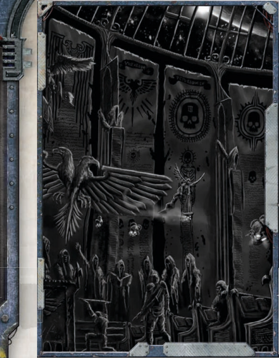

## Devotion

Many  worlds  are  claimed  in  the  name  of  Rogue  Traders, and  thus  the  Imperium.  Sometimes,  however,  these  worlds go uncatalogued. Perhaps the Rogue Trader was lost before he or she could record the discovery, or maybe something happened  within  the  family  that  prevented  them  from returning. Whatever the case may be, you have come across one of these 'lost dynasties' and seized it in the name of your family, or re-discovered a lost ancestral claim.

Cost: 400xp

Effect: Add +1 Profit to the group's total Profit Factor, and gain +1 Fate Point. The player and the GM should work out the details of this lost resource so it can be worked into the campaign story, as needed.

## Creed

The  universe  is  a  mysterious  place  full  of  darkness  and danger.  There  are  forces  at  work  that  are  beyond  human comprehension  and  occasionally  whole  worlds  are  ripped away from their parent systems-cast into the void. Y ou have discovered such a rogue planet (or were part of an expedition that discovered one) and travelled to it. Y ou brought back the treasures and secrets of this world, which you claimed in the name of your family or patron. There are mysteries still to be unearthed upon this world, and it could be that the planet harbours something dark.

Cost: 200xp

Effect: Gain +3 Willpower and a single Exploration skill of your choice as a Trained Skill. However, travelling to this lost world is an unnerving experience. Gain +1d5 Insanity Points. It's up to the player and the GM to work out the details of this lost world and determine what it contains.

## Duty

You have always been an explorer, travelling to places beyond the  edges  of  the  map.  This  time,  however,  you  may  have gone  too  far.  Y ou  witnessed  something  that  man  was  not meant to see and came back changed as a result. Perhaps you somehow survived a warp storm, or maybe you were pulled into some other part of the galaxy where man has yet to set foot. Regardless, the experience has changed you and your perceptions-perhaps not for the better.

Cost: 100xp

Effect: Gain +1d5 Corruption Points and +1d5 Insanity Points. In addition, select two Forbidden Lore Skills as Trained Skills (or gain +10 to two Forbidden Lore Skills already possessed).

## Loyalty

It is not sufficient merely to possess the means and opportunity to  venture  beyond  the  borders  of  the  Imperium:  one  must possess the will to do so. To journey amongst the haunted stars, far from the safety of the Emperor's domain, requires a sense of purpose so strong that it defines a person-for those who embark on such a voyage may never return.

The  following  new  Motivations  can  be  substituted  for one  of  those  from  the  Character  Creation  section  in  the ROGUE  TRADER Core  Rulebook,  taking  its  place  on  the Origin  Path.  Unlike  those  in  the  core  rulebook,  these entries  are  more  detailed.  Every  new  Motivation  consists of three distinct options under a single broad heading, each of which has an xp cost associated with its benefits. When choosing one of the new entries, pick a single option from amongst those presented for that Motivation, and pay the listed amount of xp.

## Knowledge

Devotion may be selected in place of the Endurance or Renown entries on the standard Origin Path table.

You go into the unknown not for yourself, but for something greater. Y ou believe, and whether your belief is a religious one, a matter of personal loyalty, an absolute dedication to duty, or something else entirely, it gives you the strength to persevere when all seems lost. Y ou will not rest, nor will you falter, while your faith remains intact. Others may question your  devotion,  unable  to  understand  how  someone  could cleave  so  tightly  to  something  as  distant  and  abstract  as duty,  loyalty,  honour,  or  faith,  when  other  paths  grant  so much more...but you know better. You will not be swayed by those who comprehend nothing beyond themselves and their own ambitions.

Select one of the following options:

### Knowledge Is Life, Life Is Knowledge

Faith is your shield and your sword, it is the strength in your muscles and the life in your veins, and the power that drives you ever onwards. While stars exist beyond the reaches of the Emperor's light, there can be no rest, for it is Mankind's destiny to rule the stars and you will permit no exception to that. Y ou look with scorn upon those who crave material things, for their deeds are tainted by their impure desires, no matter how great those deeds may be. If you seek any remembrance or legacy of your own, it is as an implement of the Emperor's will, the blade in His right hand and the mouthpiece for His voice. Y ou seek to inspire and rally others to your cause, to instil fervour and zeal and drive your fellow man to righteousness.

Cost:

200xp

Effects: Gain Charm and Common Lore (Imperial Creed) as trained Skills. In addition, gain the Inspire Wrath Talent.

### Know Thy Foe

To labour is human, to serve divine. Y ou find strength in duty and eagerly embrace the strictures and dictates such duty requires. To see obligations fulfilled and assume a role in the vast structure of the Imperium is your greatest desire. So strong is that desire you will stop at nothing to see it done, and fear only failure. To others, your rigid discipline and obsessive focus may seem disquieting, but you do not share their doubts. Y ou pity them, for they will never know the contentment and satisfaction your purpose gives you, nor the purity of life your conviction provides.

Cost:

100xp

Effects: Gain either the Armour of Contempt Talent or the Unshakeable Faith Talent. In addition, gain +3 Willpower.

### Knowledge Is Power, Guard It Well

The ship is home, the crew is family, and the captain is its ruler. To those who ply the void, this is an indisputable truth, a  notion  so  strong  that  in  some  people  it  provides  a  sense of  purpose  great  enough  to  brave  any  risk.  There  may  be disputes between different parts of the crew, but such things are  all  in  the  family,  not  for  the  concern  of  outsiders.  Y ou would do anything for your captain, and will go anywhere the ship goes. Y ou burn with pride at the sight of her and at the triumphs of her crew, and to shame or mock the her is  the  gravest  mistake  an  outsider  can  make.  Y ou  care  not where you go or what you face, so long as you do it with that familiar deck plating beneath your feet, surrounded by men and women whose abilities you trust without hesitation.

Cost:

100xp

Effects: Gain Trade (Voidfarer) as a Trained Skill, and gain a +5 bonus to all Willpower and Fellowship tests made while aboard the ship the character lives on.

## Fear

Knowledge may be selected in place of the V engeance or Pride entries on the standard Origin Path table.

You  crave  understanding,  desire  comprehension,  and  value knowledge above all else. It is not something to be shared or given freely, but something to be unearthed and drawn close, held secure within the vaults of your mind. In a very real sense, knowledge is power, for those who possess it have the means to overcome things against which the ignorant would falter. It can be a shield against the greatest of foes, or a tool to uncover yet greater secrets, or even a holy thing in its own right... but it can also be damning. Those who seek knowledge must be wary, for their greed and curiosity can lead them down treacherous paths. Some things, after all, are not meant to be known.

Select one of the following options:

### Enemy in Ascendance

Lore  is  all-important  to  you;  it  is  your  purpose  and  your reason, it is your goal and your desire, and it is the one thing above all else that you aspire to possess. There is no ulterior motive  to  your  drive  to  understand,  no  hidden  purpose  to give that curiosity a focus. Y ou simply crave knowledge with every fibre of your being, and you cannot stand the idea of not knowing or not understanding something. Though new insights and revelations cannot hope to sate this bottomless urge, new understanding brings with it new power and new means with which to find yet more knowledge. Each answer leads to still more questions, and every new vista promises a variety of secrets yet to be uncovered.

Cost:

300xp

Effects: Gain  any  two  Scholastic  Lore  Skills  as  trained Skills, and the Total Recall Talent. Y ou may purchase a third Scholastic Lore as a trained Skill for an additional 200xp.### Haunted by Thy Own Sins

You  consider  knowledge  of  your  enemies  to  be  the  best defence  against  their  machinations  and  assaults,  and  work hard to collect any insight you might find about those who might threaten you. Fear of encountering a foe about which you know nothing drives you to seek out the most obscure lore; even that which seems composed entirely of unfounded rumour and hearsay is not beneath your attention. Y ou suffer with the burden of your knowledge, for you are never truly free of that fear of the unknown and your obsession means that you shall never again find solace in ignorance as so many in the Imperium can.

Cost:

200xp

Effects: Gain any one Forbidden Lore as a Trained Skill, and the character may purchase a second for an additional 100xp.

### Tormented by the Unspeakable

There is no worth in knowledge if everyone possesses it; if knowledge is commonplace, then it bestows no power upon its  keepers.  Y ou  understand  this  better  than  most,  because you possess much knowledge. It is a tool to greater power, a means of fulfilling other ambitions, brsinging ruin to enemies and elevating allies, and in all ways an advantage over those less knowledgeable. Y ou gather information to wield in these ways, bolstering your arsenal of insights with every passing day and every new encounter. Few are those who think to cross you, for you are knowledgeable and willing to use that to your advantage in all things.

Cost:

300xp

Effects: Gain any one Common Lore or Scholastic Lore as a trained Skill, and gain the Foresight Talent. Additionally, gain +3 Intelligence or Perception.

### Flagellant (talent)

Fear  may  be  selected  in  place  of  any  entry  on  the  standard  Origin Path table.

It  is  not  the  future's  promise  that  drives  you,  but  the nightmares of days past. Something haunts you, and you dare not speak of what it is that makes you so eager to press on. Only by going forward can you hope to elude whatever it is that you seek to escape, but no matter how far you go you cannot  escape  it  completely,  for  the  memory  of  it  remains with  you  always,  stealing  away  your  sleep  with  dreams  of terror. Y ou know that others may see the haunted look within your  eyes,  and  that  they  guess  at  your  motives  when  your back is turned, watching for that tell-tale twitch or grimace that surfaces when your fears come unbidden to the forefront of your mind.

Select one of the following options:

## Exhilaration

You have made a number of enemies in your life, as does anyone with power and the will to use it. However, some of your foes are particularly threatening. Perhaps they know something of your past you would prefer not to have revealed, or perhaps their power eclipses your own and they seek to eliminate a potential rival, or perhaps you have crossed them one too many times and they now seek every means possible to cast you down. Whether voluntary or not, you have fled the Imperium to escape them, entering  exile  in  the  unknown  darkness.  Y our  time  beyond civilisation may be one of preparation, steeling yourself for the day you must return, or you may simply believe that you can never truly go back. In either case, you are constantly watching your back for the enemy who drove you to this.

Cost:

100xp

Effects:

Gain the Paranoia Talent, and gain +3 Perception.

### New Horizons

Blessed  are  the  repentant,  for  they  have  seen  the  face  of damnation and yet return  to  His  light.  Y ou  know  you  have done wrong, but in sacrifice you can be redeemed, and that distant chance gives you the courage to achieve anything. The sins of your past give you insight into corruption, and with that hard-won knowledge you can strike out against it, to cleanse your soul with the deaths of the enemies of Man. Should your life be the cost of your success, then so be it, for it is a far better thing to die a martyr than live on as a monster.

Cost: 300xp

Effects: Gain  the  Dark  Soul,  Frenzy  and  Flagellant  (see sidebar)  Talents.  In  addition,  gain  any  one  Forbidden  Lore as an untrained Basic Skill. However, the character also gains 1d10 Corruption Points from his past sins.

### The Thrill of War

There is something out there, a nightmare given substance that you may have glimpsed for only a moment, its horror, if  not  its  visage,  burned  forever  onto  your  mind.  That  it  is coming is enough to drive you to desperation, whether or not it is coming for you, because you know, deep down, that when it  arrives,  it  will  spell  doom  for  everyone.  Y ou  have  borne witness to one of the unspeakable horrors of the universe, an entity or presence so awful that you will attempt anything to escape it, though no escape seems possible. This vision was so dreadful that the things which terrify lesser men hold no fear for you, so tame are they by comparison.

Cost: 200xp

Effects: Gain the Light Sleeper, Jaded, and Resistance (Fear) Talents. However, also gain 2d10 Insanity Points to represent the mental scars left from mental torment.

### No Joy Unexplored

You have dedicated your pain to the Emperor. Each day, you must spend twenty minutes praying and  inflicting 1 point  of  damage  upon yourself.  You  may not  treat  this  Damage  or  allow  it to  be  healed.  Once you  have  castigated  your  flesh, you gain a +10 bonus to  Willpower  Tests  made  to resist mind  control or  Malignancy.  Additionally,  if you have the Frenzy talent, you may enter a frenzied state  as  a  Free  Action.  Should  you  fail  to  flagellate yourself on any given day, you take a -5 penalty to all Tests due to shame and guilt.

*Source:* `Battle Fleet of the Koronus, pages 26–28`
