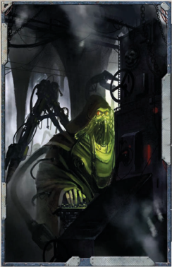

## Darkness

You have always been inquisitive, and within Imperial society, this is a trait  highly frowned upon. Thus, you have had to strike out and follow your own path through the galaxy going from one mystery to the next. Y ou have a thirst for knowledge that has brought you out into the voids. Perhaps you have come to explore the Koronus Expanse, or you seek to decipher the riddle  of  why  a  particular  precursor  race  vanished.  Maybe you're seeking an empirical truth, or enlightenment that you know must be somewhere in  the  cosmos.  Or  perhaps  you simply want validation to a theory you have. Regardless, you are prepared to travel to the ends of the universe to find it.

Cost: 100xp

Effect: Gain  +3 Intelligence. In addition, gain Scholastic Lore  (any  one)  (Int)  as  a  Trained  Skill.  Also,  gain  +1 Corruption Point.

## Forbidden Knowledge

Academic scholarship has long been your fervent pursuit. Y ou seek to study the dreaded xenos and their works throughout the  galaxy.  However,  you  walk  a  thin  line  as  you  have learned that those who possess knowledge of the alien are persecuted-some are even executed or taken away by the Holy Inquisition. This is a fate you try very hard to avoid. Y ou know that there are several groups out there, including Rogue Traders, who highly prize those who possess knowledge of the  xenos  that  they  deal  with.  Y ou  may  have  amassed  you own small library (hidden, of course), or perhaps you have a  mysterious  patron  who  sends  you  information  from  time to time. Y ou dream of the day when your knowledge can be used to aid humanity.

Cost: 200xp

Effect: Gain +3 Intelligence or +3 Willpower. In addition, gain the Peer (Academics) Talent or Forbidden Lore (Xenos) as a Trained Skill.

## Warp Incursion

Ancient  technology,  known  as  'archeotech,'  has  always fascinated you ever since you first laid eyes on a piece of some hallowed, mysterious relic. You wondered why the people that made it no longer can, and you are determined to find more. You may be an Explorator of the Mechanicus, for whom finding such items is a holy quest, or simply an enthusiastic amateur. However, whether you travel to the dig  sites  of  Mechanicus  Explorators,  or  manage  to  have a  wealthy  patron  sponsor  a  dig  of  your  own,  you  know that eventually more will be unearthed. You scour auction houses  and  deal  with  the  great  Commercias  of  Noble Houses in an effort to buy, trade, or even steal the objects of your desire. Your knowledge of such devices is as great as your desire to find more.

Cost: 250xp

Effect: Gain +3 Intelligence or +3 Perception. In addition, gain  one  randomly  determined  item  from Table 1-2: Heirloom Items , on page 30 of the ROGUE TRADER Core Rulebook as your first archeotech item. Also, gain Forbidden Lore (Archeotech) (Int) as a Trained Skill.

## Dark Secret

'Better crippled in body than corrupt in mind.'

-Imperial Proverb

The Explorers of ROGUE TRADER are far from average. The R are far from average. The R experiences they have endured help to shape them into what they  are.  Like  the  Trials  and  Travails  options  presented  in the ROGUE TRADER Core Rulebook, the details of these new options have been left vague so that the players and GM can fill in the blanks as needed. They work identically to the Lure of the Void options presented above in terms of Experience Point costs and applications to the player's Explorer.

## A Product of Upbringing

A character may select Darkness instead of The Hand of W ar or High Vendetta entries on the standard Origin Path table.

The  galaxy  is  a  dark  and  unforgiving  place;  anyone  who says  otherwise  is  a  fool!  As  happens  in  the  universe,  some are  selected  by  things  dark  and  terrible.  Their  exposure  to such things has left  its  mark  upon  their  souls.  Some  study forbidden  tomes  and  texts  in  the  hopes  of  learning  some arcane or esoteric lore. Others have been victim to a warpincursion, a tear in the barrier between the material universe and the Realm of Chaos. A rare few have been touched by something wicked, even possessed by it, and now carry the burden of that encounter-seeking to rid themselves of the affliction before they either succumb to it or are found out by their peers or the authorities.

Select one of the following options.

## New Blood

You are drawn to the esoteric like a moth to a flame. Perhaps your  study  was  intentional;  you  found  a  mysterious  tome or  other  work.  Maybe it  was  accidental.  It  could  have  been spoken to you through the cracked lips of a dying man, or perhaps you spied a document that should have been sealed and  the  knowledge  burned  itself  into  your  brain.  Whatever the reason or circumstance, you bear forbidden knowledge. It might be part of the name of a daemon, or the location of some barbaric fane where human sacrifices are made in the name of the  Ruinous Powers. It might also be something a bit more mundane, such as a proscribed  experiment  being  conducted by a Magos-Biologis of the Adeptus Mechanicus. Whatever it is, you're sure that if the powers that be were to learn that you know, they would stop at nothing to purge it from you.

Cost: 200xp

Effect: Gain Common Lore (any one) and Forbidden Lore (any  one)  as  Trained  Skills.  Also,  gain  the  Paranoia  and Enemy Talents; the Enemy is the group the character took the knowledge from.## Rivals

You have been witness to a singular event: the opening of a portal between the material universe and the warp. Y ou were the survivor of a Geller Field failure, or witness to (or victim of ) a daemonic possession or another warp entity-somehow you lived through the incident, but it has scarred you forever. You suffer from nightmares, but in return you have gained a degree of protection from warp entities. This might manifest as a type of invisibility to these entities, or maybe they find your  'smell'  to  be  intolerable.  Whatever  the  reason,  you thank the God-Emperor every day for the protection He has imparted unto you.

Cost: 100xp

Effect: Gain  Resistance  (Psychic  Powers)  and  the  Light Sleeper Talents. Also gain +1d5 Corruption Points from the exposure to the incursion.

## Decadent

There's a secret you carry with you that, if known by others, could destroy you. Perhaps you were the unfortunate victim of a possession, and even though you fought the entity off its mark is forever upon you. Or maybe you carry within you some xenos artefact, such as a Yu'vath device, and you seek a way to rid yourself of it. Whatever the secret is, you're sure it will devastate you and your friends if found out. There are no lengths you would not go to prevent that discovery.

Cost: 200xp

Effect: The character carries within him the mark of his past. Something terrible happened to him, but it gave him a great advantage as well. Add +6 to any one Characteristic. However, the character also harbours a dark secret he struggles to be rid of. Gain +1d5 Insanity Points and work with the GM to determine what this is and what circumstances are required to remove it. It should be something difficult, rare, esoteric, and very dangerous for the Explorer (such as getting blasted with gamma rays from a certain pulsar at a certain time).

## Lost Worlds

A character may select A Product of Upbringing instead of the PressGanged or Ship Lorn entries on the standard Origin Path table.

There are many different types of nobility within the Imperium. Some  might  be  part  of  the  Commercia  Houses,  others  are Imperial Officers, and still others are members of the Rogue Trader Dynasties and clans. It's a confusing and often tangled web of intrigue and fealty. Only the High Lords of Terra can declare a family line to be nobility, but planetary lords, Imperial Commanders, and sector Governors can all declare lesser vassals to be raised in status under them. Some families are given titles as  a  reward  for  service  to  the  Golden  Throne;  these  family members are often looked down upon as upstarts until they have proven themselves over the course of many generations.

Of  course,  noble  families  are  always  trying  to  gain  the advantage over one another, and thus earn the favour of their lords. They scheme and plot in the hopes that one day their plans will come to fruition and they will be elevated in status and gain even more power  and  wealth.  Aside  from  the  direct bloodlines and heirs, there are those family members who are associated by marriage, and those who have been brought into the family for some potent ability they possess. These scions typically form the backbone of the nobility and help keep the lines viable for future generations.

Select one of the following options:

## Lost Dynasty

You or a member of your family were recently rewarded for something done in service to the Emperor or a lesser noble. Whatever it was, you now find yourself thrust into the ranks of Imperial nobility-but it's not the life of easy luxury and power you envisioned. The more established members of the aristocracy scorn and look down upon you. Many dynasties see you as an upstart family-a rival at best and an enemy at worst. Given time, you know that your family will prove themselves worthy of the honour they have been given. Cost: 200xp

Effect: The character is considered part of an upstart family and as such you gain the Rival (Nobility) Talent. However, his wealth adds +1 Profit Factor to the group's starting Profit Factor.

## Rogue Planet

You  have  been  scorned!  Another  family  has  wronged  or insulted you and it's something you cannot let rest. Y ou will pursue the matter until satisfaction has been had, even if that means taking payment in blood. This is a personal matter for you, and the insult may only be slight. Whatever the case may be it's a matter for you to settle and you alone.

Cost: 100xp

Effect: Gain +3 Fellowship. Also, you gain the Rival Talent the  rival  being  the  group  that  the  character  has  a  rivalry with (subject to GM's approval). Whenever you encounter a member of this rival faction the character attempts to visit retribution  upon  them.  A Difficult  (-10)  Willpower  Test can be made to prevent this from happening once per scene. In addition, the character gains the Peer Talent: these peers consist  of  an  allied  group  that  supports  him  in  his  rivalry . The circumstances of this relationship, including nature of the insult or injury and the motives of allies, must be determined by the player and the GM.

## Beyond the Pale

You have lived your entire life in the lap of luxury. Y ou demand the finest, no matter the cost in terms of money or lives. Fine foods, fine drink, and fine clothes are your hallmarks, and you see no reason to have anything less. Y ou might be despised by your family or lauded for your passions. Y our lifestyle is envied by many and reviled by the rest, but you dismiss their opinions as nothing more than the petty sniping of the bitter and envious.

Cost: 150xp

Effect: Gain +3 Willpower, the Decadence Talent, and a +5 bonus  to  Charm  Tests.  Additionally,  gain  1d5  Corruption Points.

*Source:* `Battle Fleet of the Koronus, pages 23–25`
