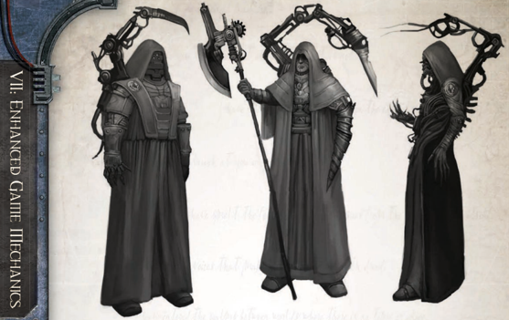

## Ship's Confessor

Also sometimes known as the Navigator Primaris, the Warp Guide is wholly responsible for steering the vessel through the treacherous tides of the Empyrean, both the safer routes within Imperial borders, and the terrible, dark voids beyond. The Warp Guide's burden is heavy indeed; he and he alone stands as a bulwark between thousands of faithful Imperial souls  and  the  unbridled  damnations  of  the  warp.  A  single mistake  and  terrible  daemons  of  the  Empyreal  spaces  will consume the vessel and all aboard it, and that horrid death will be but a prelude to the eternal torment that follows.

### Career Preference

Only characters with the Navigator Career may select this Role.

### Examples of Immediate Subordinates

Lesser Navigators on board, trusted bodyguards and assassins, emissary of the Navigator House elders.

### Important Skills

Navigation (Warp): Employed for travel within the terrible Empyrean.

Trade  (Astrographer): For  recording  the  details  of  new warp routes.

Scholastic  Lore  (Astromancy): Useful  when  deciphering the subtleties of partial void-maps.

Forbidden Lore (The Warp): To anticipate or mitigate the worst upheavals in the Empyrean during warp travel.

### Benefits

The Warp Guide gains a +5 bonus to the Navigation (Warp) Skill for purposes of steering the ship through the Warp (see ROGUE TRADER page 183).

## Drivesmaster

This is the rank of ship's officers who have the most day to day contact with the crew, and are often intimately familiar with the ship's workings.

### Career Preference

The Ship's Confessor is the uppermost hierarch of shrines and Clerics aboard the vessel, responsible for their scriptural purity and by extension the spiritual well-being of all aboard. The God-Emperor protects the righteous who abide by the holy laws of Ministorum and Imperium, and it is His will that keeps the warp at bay and guides weapons to strike true against foul xenos. The Ship's Confessor pledges to uphold the  faith  and  courage  of  the  crew  against  all  adversities, and so make the void-ship a true cathedral of the Imperial Creed, echoing with the prayers of the holy and blessed in the God-Emperor's sight.

### Examples of Immediate Subordinates

This role is usually associated with the Missionary Career but may also be selected by a character with the Explorator or Seneschal Career.

### Important Skills

Lesser Clerics and Confessors of the vessel's shrines, emissaries of major Ministorum cults in attendance, an unruly mob of zealots, penitents, and pilgrims.

### Benefits

Scholastic Lore (Imperial Creed): To ensure purity of faith and rightful ritual.

Common  Lore  (Ecclesiarchy,  Imperial  Creed): To conduct  worship  in  a  way  fitting  to  the  habits  of  the faithful, such that they will be fulfilled and blessed in soul and mind.

Charm, Intimidate: To soothe the dolorous and rain hellfire upon the faithless, in both cases to bring straying souls back to the path of righteous worship and steadfast toil.

## Omnissianic Congregator

The Ship's Confessor gains a +10 bonus to the Put your backs into it! Extended Action (see ROGUE TRADER page 218).

229

### Career Preference

A voidship's enginarium is a sprawling complex filling many decks. Within this sepulchral facility countless ranks of enginseers work the rites that appease the machine spirits of the vessels roaring heart. Some among their number are schooled in special rituals that inspire the drive to greater efforts. The Drivesmaster is in charge of monitoring and maintaining the roaring plasma drives that form the heart of the ship. Though subservient  to  the  Enginseer  Prime,  the  Drivesmaster  often maintains the plasma drives as his own fiefdom, where none but the Mechanicus and their servants are welcome.

### Examples of Immediate Subordinates

This Role is open only to Explorators.

### Important Skills

Enginseers  of  the  Drive  Temple,  enginearium  servitors, crewmembers who maintain the primary plasma conduits

### Benefits

Tech-Use: Without even the simplest of technoarcane rituals, the engine will not function.

Forbidden Lore (Archeotech): Each voidship's drive is an ancient relic, little understood in these dark times.

Pilot  (Space  Craft): Without  knowledge  of  what  tasks  a drive is meant to perform, an Drivesmaster cannot expect to guide its actions.

## Chief Bosun

The  Drivesmaster  gains  a  +10  bonus  to  the  Flank  Speed Extended Action (see ROGUE TRADER page 217).

230

### Career Preference

The machine spirit of a starship is a slow but fickle intelligence, demanding the veneration and respect of hundreds if it is to function properly. The Omnissianic Congregator guides the tech-priests and other crew versed in technoarcane ritual, in the  maintenance  rites  and  algorithmic  prayers  that  appease spirit of the ship, conferring the blessings of the Omnissiah upon its operation.

### Examples of Immediate Subordinates

This Role is open only to Explorators and characters with the Forge World Home World option.

### Important Skills

Laymen Shipwrights, lexemechanics of the Central Cogitation Vault, keepers of the Altar Omnissiah.

### Benefits

Tech-Use: To understand the ways of sacred technology and the rituals that please the spirits of the machine.

Forbidden Lore (Adeptus Mechanicus): Those who wish to receive the blessings of the ship's machine spirit must be guided in the canticles of activation and the benedictions of efficiency.

Trade  (Technomat): Every  ship's  component  must  be entreated  in  a  different  way,  and  the  ship's  holy  symmetry reinforced by constant rituals of maintenance.

## Infernus Master

The Omnissianic Congregator gains a +10 bonus to the Aid the  Machine  Spirit  Extended  Action  (see ROGUE  TRADER page 216).### Career Preferences

Voidfarers are often trained from birth in the tasks they will be expected to perform aboard ship, and this training does not end when a position is secured. To keep skills sharp, all crew are expected to participate in regular drills and practice sessions. A steady regimen of drills makes for an efficient crew . The Chief Bosun also serves as the enforcer of discipline aboard a vessel.

### Examples of Immediate Subordinates

This Role is open to Arch-militants, Missionaries, Seneschals, and Void-masters.

### Important Skills

Watch leaders, bonded shipwrights, armsmen commanders.

### Benefits

Command: A rating is expected to answer the call to drill as if the order came from the Lord-Captain himself.

Intimidation: Fear inspires discipline, and loyalty.

Trade (Shipwright): The Ship's Bosun is expected to know all essential duties aboard ship, and must be ready to instruct the ignorant in how their tasks are to be done.

## Twistcatcher

The Ship's Bosun provides a +5 bonus to the ship's NPC Crew Rating, As long as the Chief Bosun is aboard, Command Tests involving the ship's crew suffer no penalties for reduced Morale.

### Career Preference

No shipboard danger is more devastating or frightening than fire, burning uncontrolled through a voidship's corridors and decks. Even the smallest blaze can send a seasoned crew into a panic, trampling each other in the frenzy to escape through narrow corridors before the bulkhead is sealed in a vain attempt to  keep  the  fire  from  spreading.  During  a  conflagration,  the Infernus Master is charged with keeping order and minimising the damage caused to equipment, personnel, and morale. The Infernus  Master  organises  bucket  chains,  directs  evacuations, and commands damage control crews brave enough to combat even the deadliest plasma flares.

### Examples of Immediate Subordinates

This  Role  may  not  be  selected  by  characters  with  the  Rogue Trader, Astropath Transcendent, Explorator, or Navigator careers.

### Important Skills

Commanders  of  shipboard  troops,  aqueduct  technicians, senior damage-control crew.

### Benefits

Command: Used when organising fire response teams. Intimidate: Often  needed  to  browbeat  reticent  crew  into facing down a blaze.

Search: In order to spot fire hazards and assess the risks to fire control teams under the Infernus Master's command.

## Master of the Vox

The  Infernus  Master  gains  a  +20  bonus  to  all  Command Tests made to combat shipboard fires.

### Career Preference

Those who dwell within the enclosed environment of a voidship's hull risk constant exposure to radiation, both from the vessel's mighty engines and the void itself. These harsh conditions mean an increased risk of mutation. It is a lamentable fact that even the  most  well-maintained  vessels  play  host  to  sizeable  mutant populations,  hordes  of  the  deformed  unfortunates  lurking  in unused holds and seldom-serviced bilge decks. It is the duty of the Twistcatcher to keep his ship's mutant population in check, and in times of dire need press these malformed wastrels into service for the good of the human crew .

### Examples of Immediate Subordinates

The thankless task of twistcatching is most often left to Archmilitants and Missionaries, although anyone save the Rogue Trader can perform this role.

### Important Skills

Press gang foreman, mutant informants, bilge workers.

### Benefits

Forbidden Lore (Mutants): To better identify mutants, locate warrens, and take precautions against their dangerous mutations. Secret T ongue (Underdecks): For gathering information from the lowest of the human crew , who often have some contact with the  mutant  population.  Many  mutants  also  speak  this  dialect, making it useful for interrogating mutant prisoners. Tracking: To apprehend those that flee.

## Purser

Immediately after Starship Combat, the Twistcatcher may raid the lower decks, replacing a portion of the dead crew with mutant slaves captured in the raid. If such a raid is undertaken, the ship regains 1D5 Crew Population but loses 1 Crew Morale.

### Career Preference

In the course of daily operations, an endless stream of vox traffic passes  through  a  voidship's  command  deck.  These  lines  of communication are vital to the operation of a vessel and a Rogue Trader's fleet, and it is the responsibility of the Master of The V ox to keep all channels of communication clear, and all vox-casters functioning at peak efficiency .

### Examples of Immediate Subordinates

This Role is open to characters with the Astropath Transcendent, Seneschal, and Void-master careers.

### Important Skills

Senior communications officers, officers of cryptography, vox-caster maintenance personnel.### Benefits

Ciphers (Rogue Trader): Communications officers must be well versed in the parlance of the master's fleet.

Secret  Tongue  (Rogue  Trader): Transmissions  made  for the benefit of the fleet must remain confidential.

Trade (Cryptographer): The secret codes and ciphers that protect a fleet's secrets must be forever improved and changed, lest eavesdroppers grasp their meaning.

## Carto-artifex

The  Master  of  The  Vox  gains  a  +20  bonus  to  the  Jam Communications  Extended  Action  (see ROGUE  TRADER page 218).

### Career Preferences

The operation of a Rogue Trader's vessel and the execution of  endeavours  requires  uncountable  amounts  of  wealth  to be  shuffled  between  investments  and  expenses  on  a  daily basis, and the risk of loss is great. Financial officers must be prepared to balance enough books to fill a librarium many times over. In an economic climate where the single stroke of an autoquill can mean the difference between tragic loss and phenomenal gain, the purser must be tireless and ever vigilant. However, the purser also has a second duty, to ration payment and rewards to the crew serving aboard his  ship. This often means the purser is loved and hated in turn, based on how forthcoming a crew's pay is.

### Examples of Immediate Subordinates

This Role is only available to characters with the Seneschal Career.

### Important Skills

Senior financial managers, chartered accountants, the Master of Pensions.

### Benefits

Barter: Only  the  best  prices  and  the  shrewdest  deals  can keep one's ledgers in the black.

Commerce: The Lord-purser must develop old investments while seeking out the new.

Evaluate: Everything has its price, and a purser must be able to quote that price at a moment's notice.

## Ship's Steward

When replenishing Morale by spending Achievement Points ( ROGUE TRADER page 226), the Purser only has to spend 25 R page 226), the Purser only has to spend 25 R Achievement Points, and may always make a Routine (+20) Barter  Test instead  of  a  Charm  Test.  (This  test  is  always Routine,  no  matter  how  many  times  Morale  is  replenished in this manner.)

### Career Preferences

The  void and the warp  contain dangers that often  mean  death  for  those  who  venture  forth unprepared.  The  best  way  to  survive  such dangers is to avoid them entirely. To this

232

end,  a  wise  Lord-Captain  consults  his  Carto-artifex  before any  voyage.  This  master  of  charts  and  hololithic  maps  is charged  with  finding  safe  routs  and  circumventing  danger. The secrets of the void and the warp are laid bare before his vast knowledge of the tides and current of the immaterium.

### Examples of Immediate Subordinates

Seneschals, Navigators, Explorators, and other Explorers with a scholarly bent can serve in this Role.

### Important Skills

Navigator  House  archivists,  keeper  of  the  librarium,  deep void auger operator.

### Benefits

Trade  (Astrographer): A  Carto-artifex is expected to interpret old maps and constantly revise new ones.

Navigation  (Stellar  and  Warp): When a safe course  has been determined, it must be plotted and followed.

Forbidden  Lore  (Navigators): The  insular  Houses  often issue false maps to confuse enemies, and maintain secret routs for their own convenience.

*Source:* `Battle Fleet of the Koronus, pages 229–233`
