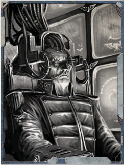

## Master-at-arms

The High Factotum is a maestro of the mechanisms of trade: negotiations,  compacts,  endless  records,  bribes,  threats,  and the filling and emptying of great-holds. Maintaining the crew at strength and obtaining needed supplies for the continuing operation  of  the  void-ships  is  also  the  High  Factotum's concern.  This  is  a  realm  in  which  corruption  and  honour walk hand in hand, and the path taken by Thrones is always twisted  to  private  ends.  The  High  Factotum  has  pledged to  bring  profit  to  the  Lord-Captain's  venture,  and  will  do whatever is necessary to keep both dock-scum and haughty, hidebound merchants in line.

### Career Preference

This role is usually associated with the Seneschal Career, but may also be selected by characters with the Missionary Career.

### Examples of Immediate Subordinates

Quartermasters, skilled negotiators and factors, officers of the common great-hold crew.

### Important Skills

Barter: For less clear-cut trading operations, such as bolstering the crew through press-gangs or 'recruiting' convicts from Imperial prisons.

Commerce: Vital  to  succeed  in  matters  of  commerce  and negotiation.

Evaluate: Every  trader  lies,  either  to  himself  or  to  others. Establishing a true worth in any potential trade is of great importance.

### Benefits

Once per game session, the High Factotum may take up to 300 Achievement Points gathered towards the  completion  of  one  Endeavour  and  apply them to the completion of another.

226

## Master Helmsman

Those in the 'third rank' aboard a starship are still command staff, usually those given specialised duties with unique skill-sets.

### Career Preference

An  Imperial  void-ship  can  muster  numerous  small  armies: security  companies,  boarding  parties,  the  common  crew armed  with  rusty  blades  and  stub-guns,  and  often  entire barracked regiments of mercenaries, Imperial Guard, or other steadfast troops. The Master-at-Arms is responsible for these militants and their commanders; it is his pledged duty to the Lord-Captain to ensure the loyalty of the void-ship's forces, carefully guard the vessel's security, maintain the armouries, ensure victory against boarders, and guide attacks upon the crew of enemy vessels or foes on hostile worlds.

### Examples of Immediate Subordinates

This Role is usually associated with the Arch-Militant Career but may also be selected by a character with the Void-master Career.

### Important Skills

Armoury crew, shipboard troop commanders, mercenary leaders.

### Benefits

Command: For leadership in battle, security operations, and boarding actions.

Tech-Use: To make the best use of the vessel's machine and servitor security systems to capture or eliminate intruders.

Intimidate: A battle is doubly won when force of arms is not required for victory.

Scholastic Lore (Tactica Imperialis): The Master-at-Arms must be learned in strategy and tactics.

## Master of Ordnance

The Master-at-Arms gains a +10 bonus to the Prepare to Repel Boarders! Extended Action (see ROGUE TRADER page 218).

### Career Preference

The Master Helmsman is responsible for safely piloting the vast vessel through the myriad threats of the void of space. A helmsman risen to be master of his profession must have a sixth sense for the dangers that can confound auspex and lead void-ships to ruin, and know how best to make use of his helm crew and their familiarity with a vessel's character. The Master Helmsman must pilot not just the voids, but also the competing fiefdoms of enginarium, auspex, and bridge crew to ensure that every manoeuvre is accomplished to the Lord-Captain's exacting standards.

### Examples of Immediate Subordinates

This role is usually associated with the Void-master Career, but may also be selected by a character with the Explorator or Arch-Militant Career.### Important Skills

Helm crew, enginarium Tech-Priests, lesser auspex officers.

### Benefits

Pilot (Space Craft): Used  for most  manoeuvres  and unexpected situations at the helm.

Scholastic Lore (Astromancy), Common Lore (Koronus Useful  in  deciphering  the  subtleties  of  partial

Expanse): void-maps, or anticipating hidden dangers left uncharted.

Trade (Voidfarer): Understanding the common practices of void-crew is necessary for those who direct their toil.

## Master of Etherics

The  Master  Helmsman  gains  a  +10  bonus  to  the  Evasive Manoeuvres Action (see ROGUE TRADER page 215).

### Career Preference

The  Master  of  Ordnance  pledges  to  keep  the  void-ship's weapons and fighting crew in the finest condition, and then directs them to destroy foes at the Lord-Captain's order. He is responsible for the quality of gun-deck crews, the workings of  the  armoured  munitions  vaults  deep  within  the  vessel, and  the  operation  of  weapons  in  void-battle.  If  the  vessel boasts  torpedoes,  fighter  squadrons,  or  other  more  esoteric ordnance, then these crews and systems also fall under the Master's purview.

### Examples of Immediate Subordinates

This role is usually associated with the Arch-militant Career, but may also be selected by a character with the Void-master Career.

### Important Skills

Assembled officers of each gun-deck, lance battery, and other ordnance system, munitions vault crew, commanding officer of small-craft squadrons.

### Benefits

Command: the varied battery and ordnance crews must fight as one, and the Master must lead them to do so.

Scholastic  Lore  (Tactica  Imperialis): To  use  a  weapon well, its place in the broader battle must be clear.

Trade (Voidfarer): Understanding the common practices of void-crew is necessary for those who direct their toil.

## Chief Chirurgeon

When firing ship weapons while benefiting from the Lock on Target Extended Action, the Master of Ordnance adds an additional +5 bonus to the Ballistic Skill Test.

### Career Preference

The Master of Etherics is responsible for the operation of the void-ship's auspex and vox systems. Without auspex a vessel is blind, and without vox it is deaf and mute; the Master of Etherics stands at the Lord-Captain's right hand, such is his worth, and to  fail  in  his  pledge  is  unthinkable.  Dire  regions  beyond  the Imperium are cloaked with the darkness of the unknown-the Master of Etherics must marshal his resources to overcome these hostile voids and light the path ahead with his vision.

### Examples of Immediate Subordinates

This role is usually associated with the Void-master Career, but may also be selected by a character with the Arch-militant or Explorator Career.

### Important Skills

Lesser auspex  vault officers, lesser vox  system  officers, appointed Tech-Priest of Etherics.

### Benefits

Scrutiny, Tech-Use: Used in operating the ship's auspex and vox systems.

Trade (Voidfarer): Understanding the common practices of void-crew is necessary for those who direct their toil.

Appropriate knowledge Skills may be used to identify specific Components of an opposing vessel.

## Master of Whispers

The Master of Etherics gains a +10 bonus to the Focused Augury Extended Action (see ROGUE TRADER page 217).### Career Preference

The Chief Chirurgeon is master of the void-ship's medicae wards and their staff: doctors of physiks, medicae, alchemists, and a horde of apprentices. Accidents, maladies, and agues of a thousand varieties afflict common voidfarers, and a crew unattended by medicae and physiks will soon enough lapse into illness, putting the safety of the vessel at risk. The Chief Chirurgeon pledges his talents to maintain the crew's stalwart willingness  to  toil,  and  further  to  make  of  his  wards  and supply vaults a scourge upon disease, injury, and sicknesses of the mind.

### Examples of Immediate Subordinates

This  role is  usually  associated  with  the  Missionary  or Explorator Careers but may also be selected by a character with the Seneschal Career.

### Important Skills

Biologis Tech-Adepts pledged to the medicae wards, lesser medicae and doctors of physiks, appointed Savant-Medicaes of the void-ship librarium.

### Benefits

Medicae: For all the practical duties of a Chirurgeon. Chem-Use, Scholastic Lore (Chymistry): When preparing unusual drugs and anti-venoms, sometimes from base reagents

Tech-Use, Trade (Technomat): When preparing augmetics for implantation or repairing existing augmetic implants

## Choir-master Telepathica

The  Chief  Chirurgeon  gains  a  +10  bonus  to  the  Triage Extended Action (see ROGUE TRADER page 218).

### Career Preferences

Men and women are wilful creatures, given to secrets, deceit, disloyalty, and subterfuge. The Master of Whispers inhabits this realm; he seeks out and purge the crooked timbers and weak spars in the Rogue Trader's crew. His agents hunt for the very same elements in rival Rogue Trader missions-but for the purpose of advantage and deception. Spies pledged to the Master of Whispers roam far beyond the void-ship's bulkheads in search of precious knowledge, untended resources, and hidden weaknesses that can benefit the LordCaptain's mission.

### Examples of Immediate Subordinates

This  role  is  usually  associated  with  the  Seneschal Career but may also be selected by characters with the Missionary Career.

### Important Skills

A  array  of  capable  agents,  master  savant  of  the  void-ship librarium, trusted spies in the crew.

### Benefits

Inquiry: Investigate crew unrest or uncover vital information from other groups.

Deceive: Keep the crew loyal and in high spirits, even if that means lies and corruption.

Interrogation: For more direct means of learning secrets. Scrutiny: To uncover what others wish to remain hidden.

## Warp Guide

The Master  of  Whispers  gains  a  +10  bonus  to  the  Disinformation Extended Action (see ROGUE TRADER page 216).

### Career Preference

The  etheric  voices  of  Astropaths  resound  throughout  the Immaterium. When these voices are united by a single will, they  combine  into  a  psychic  harmony  capable  of  touching minds  half  a  galaxy  away.  The  Choir-master  directs  this harmony, and in turn directs the choir as a whole.

### Examples of Immediate Subordinates

Only characters with the Astropath Transcendent Career may select this Role.

### Important Skills

Lesser  Astropaths  of  the  Choir,  Choir  support  staff,  Ritemasters of the Adeptus Astra Telepathica.

### Benefits

Psyniscience: The foundation of training from whence all an Astropath's talents spring.

Forbidden  Lore  (The  Warp): The  chaotic  eddies  of  the Immaterium can hinder and enhance an Astropath's powers. By  understanding  these  eddies  the  Astropath  can  ensure  a clear signal in the most turbulent Warp storms.

Command: It is not enough for lesser Astropaths to respect the Choirmaster. He must command their minds if they are to focus their wills.

*Source:* `Battle Fleet of the Koronus, pages 227–229`
