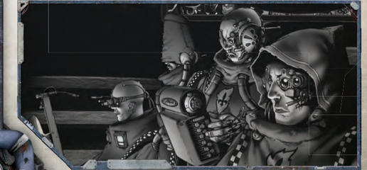
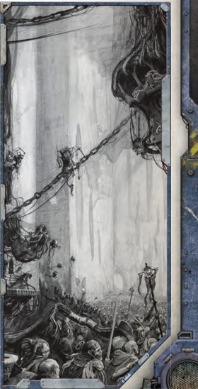
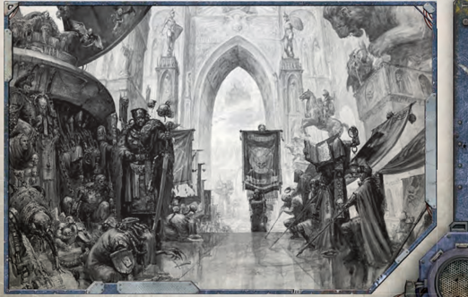
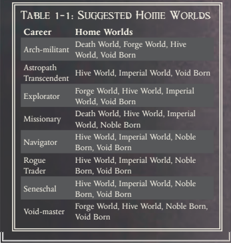
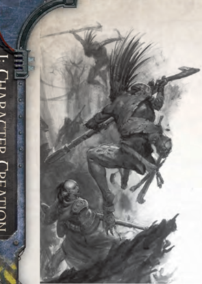

## Example

Andrew  has  selected  Void  Born  on  the  first  line,  Home  W orld. He  may  then  select  from  Scapegrace  (the  choice  directly  below Void Born on the second line, Birthright), Scavenger (adjacent to Scapegrace), or Stubjack (also adjacent). Andrew selects Scavenger. Since Scavenger is on the end of the row, his choices on the third line, Lure of the Void, are limited to Tainted (the choice directly below Scavenger) or Criminal (the only choice adjacent to Tainted).

As each player makes his selections on the chart, he connects the selections with a line. When he is done, the selections and the lines that connect them form the character's Origin Path. Once the player has completed his Origin Path on the chart, he hands the chart to the next player. That player then creates his own Origin Path and hands it to the next player, and so

<!-- image -->

## The Origin Path T

Instead  of  passing  Origin  Paths  around  the table  to  the  other  players,  another  option  is for  the  players  to  hand  in  their  Origin  Paths  to  the GM directly.  That  way,  the  GM  can  see  where  the intersections lie and can discuss those intersections with the players at his discretion. This can be more useful for future plots based on hidden depths, revelations of prior entanglements, or other surprises. Instead  of  passing  Origin  Paths  around  the table  to  the  other  players,  another  option  is

<!-- image -->

## Origin Path Options O

One of the goals of the Origin Path system is to simplify character creation. This allows new players to start playing faster, and provides shortcuts for  players  who  aren't  familiar  with  the  extensive [Warhammer](weapons-general.md) 40,000 setting. The Game Master should consider  allowing  players  who  are  comfortable  with the setting and have an excellent character concept to make some non-adjacent selections in the Origin Path chart.  Another option for Game Masters who would like  a  less  constrained  Origin  Path  is  to  designate  a single row as a 'free choice row' for the entire group, where selections don't have to be adjacent to the prior and following choices. One of the goals of the Origin Path system is to simplify character creation. This allows new

on, until all the players have completed creating Origin Paths for their characters.

It  is  suggested  that  players  should  use  different  colored markers to help tell each path apart, but simply labeling each path with the player's name, a number, or a letter is also fine.

## Intersections

The Origin Path system helps to  identify  areas  where  characters have things in common. Where two or more Origin Paths meet on a single selection, an Intersection is said to exist. An Intersection presents an excellent opportunity for characters to begin the game with shared experiences or aspirations in their background.

## Example

Bob has filled out his Origin Path and happens to have an Intersection with Sam at the shared selection of The Hand of W ar. Bob and Sam discuss the possibilities of the Intersection and decide that their characters served together on the same Imperial Navy [Frigate](starship-anatomy-detailed.md).

Each  Intersection  provides  a  bit  of  shared  back-story between characters and provides an opportunity to build the concept of characters standing together as part of a Rogue Trader's crew. Additionally, each Intersection provides both the players and the Game Master with hooks for future story events, adventures, or even shared enemies and allies that may show up along the way!

## Skills and Talents: the Sequel

If  you  receive  the  same  Skill  more  than  once  from different sources, you gain Skill Mastery in that Skill (see page 74). If you gain the same Talent more than once from different sources, you may elect to trade in the  redundant  Talent  for  the  [Talented](talents-descriptions.md)  (choose  one) Talent.## Home World Options

'I and my servants have descended to the surfaces of a hundred worlds, but the machine spirits of my data-arrays will forever hold images of the wind-swept, cerasteel spires where I first pledged to the Omnissiah.'

-Magos-[Explorator](career-explorator.md) Markus Valgar

Your Rogue  TRadeR character  may  now  travel  amongst distant  stars,  but  that  was  not  always  the  case.  The  type  of world a character grew up on affects many of his facets, from physical abilities, skills, and Temperament to appearance and the Career Paths he may choose. Select a Home World from any of the types described below and listed on the first row of the Origin Path Chart on page 16.

When you have chosen your Home World, write down your starting Skills and [Traits](character-traits.md) on your character sheet and move on to the next stage.

### Death World

'Death Worlds are teeming with threats to survival, meaning that those who thrive on such planets are unlike anyone else. Peril and violence have always been a part of your life, and you are stronger because of it. You are aggressive and inured to hardship, proficient at staying alive where others cannot, and aloof from your fellow man.'

Upon Death Worlds, the plants, beasts, and sometimes even the environment itself takes aggressive and destructive forms inimical  to  human  life.  Whilst  exceptionally  difficult  to colonise, many death worlds possess valuable resources that require an outpost or other human presence upon the planet's surface  to  harvest.  Death  worlders  often  band  together  in tribes, clans, gangs, or other social groups in order to survive. An upbringing in such a harsh environment breeds very [Hardy](talents-descriptions.md) and resilient examples of the human race-those tested and found wanting die young.

#### Life on a Death World

Death Worlds, whilst not common within the Imperium, can be found in every segmentum. From the depths of the jungle hell of Catachan to the predator-filled deserts of Luther Mcintyre, death  worlds  have  a  well-earned  reputation  as  some  of  the most dangerous planets in the galaxy. The inhabitants of these worlds are determined, tenacious people, highly valued for their strength and stamina, and are often drawn upon as recruits for both The Imperial Guard and some Space Marine Chapters. For most Death Worlds, their inhabitants are their only exports.

Death worlds vary widely in appearance and environment; some are rich and verdant, stalked by ambulatory, carnivorous plants, whilst others are empty deserts scoured by ionic storms. Each death world presents a thousand new and different ways to die, such as the scythewinds of Mortressa or the corrosive, alkaline storm-mires of Burnscour.

Those  unlucky  enough  to  be  raised  on  a  death  world are  generally  pragmatic  and  fatalistic.  Death  is  a  constant companion, and only by accepting that can a death worlder hope  to  reach  maturity  with  his  sanity  intact.  Usually,  the greatest  achievement  a  death  worlder  can  strive  for  is  to achieve some truly impressive feat before his death, so he will be remembered by his descendants. If a death worlder actually makes it  off-world,  he  is  likely  to  view  distant  worlds  with [Jaded](talents-descriptions.md) eyes. After all, he has already seen the worst the galaxy has to offer, for surely nothing can exceed the horrors of his birth world.

#### Death World Characters

Death  world  characters  are  those  who  have  travelled  offworld and have left behind the danger and ferocity of their home.  They  are  rugged,  uncomplicated  individuals  for  the most  part,  often  drawn  to  the  bold  lifestyle  of  the  Archmilitant  or  the  [Void-master](career-void-master.md).  Unfortunately,  death  worlders are uncomfortable in the complex social situations common to  civilised  worlds  and  rarely  find  themselves  able  to  relax amongst the [Decadence](talents-descriptions.md) and intrigues of noble society. Death worlders are renowned for their resilience and exemplify the concept of survival of the fittest.

Characteristic Modifiers: +5 Strength, +5 Toughness, -5 Willpower, -5 Fellowship

Starting Skills: All death worlders are [Adept](rules-allies-enemies-rivals.md) at resisting the  dangers  of  a  hostile  environment.  Death  worlders  gain the Survival Skill.

Hardened: Death  worlders  are  accustomed  to  violence. In  addition,  many  death  worlds  contain  many  venomous predators.  Death  worlders  may  choose  to  start  one  of  the following talents: [Jaded](talents-descriptions.md) or Resistance (Poisons).

If It Bleeds, I Can Kill It: Most Death Worlds possess plants and beasts utterly hostile to human life, and inhabitants must find any means necessary to [Combat](rules-combat-overview.md) them if they are to survive. Death worlders are [Adept](rules-allies-enemies-rivals.md) at using [Weapons](weapons-general.md) commonly found in or fashioned from their environment. Death worlders gain the Melee Weapon Training (Primitive) Talent.

Paranoid: The inherently dangerous conditions of a death world encourage distrust and doubt. Death worlders tend to be slow to put their faith in anyone other than themselves and chafe against the petty strictures of a more complex society. They suffer a -10 penalty to all [Interaction](rules-interaction.md) Skill Tests made in formal surroundings.

Survivor: Simply reaching adulthood is an achievement for  death  worlders.  Having  overcome  myriad  dangers  to achieve this goal means that a hardened death worlder is less likely to succumb in the face of new threats. Death worlders gain a +10 bonus to any test to resist [Pinning](combat-special-circumstances.md) and Shock.

Starting [Wounds](character-injury.md): Death world characters double their starting  Toughness  Bonus  and  add  1d5+2  to  the  result  to determine their starting number of [Wounds](character-injury.md).

Starting  Fate  Points: Roll  1d10  to  determine  a  death world character's starting Fate Points. On a 1-5, he begins with  2  Fate  Points;  on  a  6-10,  he  begins  with  3  Fate Points.### Void Born

'You were not born on one of the Emperor's worlds, but instead on a vast ship in the depths of space-perhaps even in [The Warp](warp-imperial-space-travel.md) itself. Why this sets you apart from your fellow man is unknown, but the way you look, act, and think is somehow different. You have been raised in the company of voidfarers and psykers, and what other men [Fear](character-fear-and-damnation.md) or loathe is commonplace to you.'

Not merely star travellers but the products of many generations passed  in  the  [Darkness](combat-special-circumstances.md)  between  worlds,  the  void  born  are relatively few among the teeming multitudes of humanity, but singular, and form a disparate and odd collection of misfits, strangers, and other ill-omened folk, perhaps birthed in the belly of a vessel that has spent centuries charting its course through the stars or aboard an ancient orbital satellite. The void born are often considered to be somehow touched by the taint of [The Warp](warp-imperial-space-travel.md), or at least associated with the many and unfathomable dangers of the outer darkness by the common well of the Imperium. Most consider them bringers of bad fortune and ill-tidings, secretive, and untrustworthy.

#### Life as a Void Born

The vast Imperial fleet is a vital factor in the maintenance of the Imperium; without it, human worlds would be isolated from each other and left unprotected. Without it, trade could not exist, [Weapons](weapons-general.md) could not reach the Emperor's armies, and world after world would fall into the [Darkness](combat-special-circumstances.md).

Space  travel  throughout  the  Imperium  is  dangerous  and arduous. Most interstellar travel is undertaken using powerful, ancient engines that push a vessel into the immaterium, also known as the empyrean or warp. Within [The Warp](warp-imperial-space-travel.md), a ship can [Cover](combat-special-circumstances.md) many thousands of light years within a relatively short time, dropping back into the materium far beyond the ship's starting point. Some parts of [The Warp](warp-imperial-space-travel.md), however, act as powerful vortices that drag helpless vessels to their doom. There is also a constant danger of turbulence, warp storms, and loops: ships can be thrown thousands of light years [Off Course](warp-travel-navigation.md) or trapped in stasis forever. In the warp there is neither time nor distanceonly  the  constantly  flowing  streams  of  the  immaterium.  On board a ship in the warp, a single month of time may pass, yet in the material realm anything from six months to several years may elapse. Fleets responding to distress calls and supply vessels on long voyages have been known to arrive months or even years too late.

Those who live their lives on void-ships become inured to some extent to the reality-altering process of warp travel, and to living in low- or zero-gravity environments and never knowing the feel of solid ground beneath their feet. Some vessels never make berth, their crews instead raising generations of families in the cold depths of space where gravitational variance, radiation exposure, genetic distortion, and warp anomalies slowly take their toll. What true effect these taints have on individual void born humans is both uncertain and varied, but there is quite evidently  something  strange  about  most  of  them.  In  many cases, their features are drawn and their skin pallid, and they may may have minor deformities, or an oddness of speech, gait, or general appearance that sets them apart from others. Some, although outwardly normal, carry a strange air about them, a perceptible something 'not quite right' about them that makes others uneasy.

Some void born are raised on huge space stations-asteroid mining installations, Battlefleet Calixis refit stations, or Machine Cult research platforms-but the majority come from a variety of backgrounds aboard an active star vessel, be they the issue of the crew of merchant vessels or warships, miners, scavengers, prison guards (or prisoners), and even the servants of a Rogue Trader. The largest Imperial void-ships are vast, city-sized craft, many of which are thousands of years old. On such huge star vessels,  lobotomised  [Servitors](crew-servitors.md)  and  tech-adepts  move  about their mysterious business, whilst menial crew, passengers, and merchant guilders coexist in crowded vaults, lonely corridors, and cramped quarters. At the right hand of the ship's Lordcaptain sits the Navigator, one of a strange and select breed of psykers who expertly guide vessels through the immaterium

following the psychic beacon of the Astronomican.

Those void born raised in the service of The Imperial Navy or amongst the crew of a Rogue Trader know firsthand the horrors  of  space  and  the  sheer  multitude  of  the  Emperor's enemies. This knowledge often forces voidfarers of the lowdecks into insular crew brotherhoods, afraid to look outward from their duties or small societies for [Fear](character-fear-and-damnation.md) of what might be lurking in the void beyond the [Hull](starship-anatomy-detailed.md).

#### Void Born Characters

You have called the interior of a huge Imperial vessel or voidstation your home all your life, but now you have been thrust into the company of others-people completely unlike your peers amongst the void born-and the Culture shock gnaws at you. Y ou feel awkward in the company of those born upon worlds, an outsider, distrusted and strange, in their eyes. Y ou come into your own when your expertise is required, however, and  what  to  others  may  be  stark  terrors  are  old  familiar enemies to you. Unlike the world born, you are not [Blinded](character-injury.md) by ignorance when confronted by [Psychic Phenomena](psychic-phenomena-table.md), warp anomalies,  and  the  strange  technology  of  void-ships,  and  as such, your kind make the best Void-masters and [Astropaths](psychic-psyker-types.md). As long as common dirt-dwellers stand in awe or [Fear](character-fear-and-damnation.md) of you, they will cease trying to make you fit into their strange cultures and will leave you to your own ways and your own secrets.

Characteristic Modifiers: -5 Strength, +5 Willpower Starting Skills: All void born can speak a Language unique to their home vessel. Void born gain the Speak Language (Ship Dialect) Skill.

Charmed: The void born are touched by the fickle powers of [The Warp](warp-imperial-space-travel.md), making them preternaturally lucky. Whenever a void born character spends a Fate Point (though not if he burns one), roll a 1d10. On the roll of a natural 9, the Fate Point is not lost.

Ill-omened: Whether  because  of  their  strange  looks, clannish ways, or unwholesome air, the void born are shunned and mistrusted by most. In addition, the void born are most likely to attract any negative attention that the party of Explorers creates-accusations of deceit in trade, disgruntled negotiators, mobs armed with stones, and so on. Because of this, void born characters suffer a -5 penalty on all Fellowship Tests made to interact with non-void born humans.

Shipwise: Birthed  in  the  depths  of  a  voidfaring  craft, the  void  born  have  a  natural  affinity  for  such  vehicles.  As  a result, Navigation (Stellar) (Int) and Pilot (Spacecraft) (Ag) are untrained  Basic  Skills  (instead  of  Advanced  Skills)  for  void born characters.

Void  Accustomed: Due  to  their  strange  and  unnatural childhood, the void born are used to the vagaries of changing gravity . They are immune to space travel sickness. In addition, zero- or low-gravity environments are not considered [Difficult Terrain](combat-special-circumstances.md) for void born characters.

Starting  W ounds: V oid  born  characters  double  their  starting Toughness Bonus and add 1d5 to the result to determine their starting number of [Wounds](character-injury.md).

Starting Fate Points: Roll 1d10 to determine a void born character's starting Fate Points. On a 1-5, he begins with 3 Fate Points; on a 6-10, he begins with 4 Fate Points.

### Forge World

'You were born in the shadow of the Omnissiah and all your life you have been surrounded by the great wonders and dire terrors of the Machine God's arts. Ever since you were born, you have been weighed, measured, codified, and tested so that your masters might find your place in the great pattern. This unforgiving process has fitted you well for survival and supremacy.'

The domains of The Adeptus Mechanicus are many, from the ceaseless industry of the iron realms of the Forge Worlds, to labyrinthine  orbitals  and  distant  research  outposts,  to  the nomadic and self-contained void caravans of the [Explorator](career-explorator.md) fleets. They are an empire within an empire, distinct and yet interwoven with the fabric of the Imperium since its founding. Their masters are as ancient, wise, mysterious, and cold as the machineries they tend. Beyond the Forge Worlds, this Home World option also includes those born and raised on city-sized orbital stations, Mechanicus-administered  colonies  (often called  demesnes),  research  outposts,  and  restless  [Explorator](career-explorator.md) fleets, for the rites, rituals, and beliefs of the Omnissiah also govern those places.

#### Life on a Forge World

Forge Worlds, such as the Lathe worlds of The Calixis Sector, are  the  beating  iron  heart  of  the  Imperium  and  sovereign domains of the Priesthood of Mars. They are given over to the demands of vast macro-industries too vital or rare to be entrusted  to  the  petty  domains  of  the  Imperial  Governors of hive worlds, and are eternally hungry for new resources to consume. A forge world's wheels never cease to turn: the reactors blaze and foundries thunder unendingly for millennia, turning  out  refined  materials  and  technologies  to  meet  the Imperium's needs. Forge Worlds are far more than the sum of their continent-spanning manufactories, however. Each is blessed with a higher level of technological advancement than the wider Imperium as a whole, and many arcane wonders are  commonplace  in  their  baroque  labyrinths  of  ferrocrete and steel. Forge worlds also house vast repositories of data and obscure lore, with as much as a third of any given forge world's entire infrastructure consisting of endless scriptoriums, mimetic vaults, info-tombs, and libraria, tended in perpetuity by mindless drones and generations of archive adepts.

A forge world's undisputed masters are the Magi of the Cult  Mechanicus,  who  rule  with  harsh  precision  and  cold logic. To them, the human menials of their domains are little more than cogs and gears in the great machine, resources to be  measured,  graded,  and  used  to  fit  their  worth.  At  their direction, the bulk of a forge world's population is utilised as a skilled and trained labour force, whilst the brightest and best are inducted to The Adeptus Mechanicus itself. The more militant are chosen for the Skitarii Tech-guard. Those deemed unworthy or irredeemable are fated to be 'recycled' into [Servitor](equipment-tools.md) [Components](starship-anatomy-detailed.md), and indeed, [Servitors](crew-servitors.md) and drones often  far  outnumber  a  forge  world's  free-willed population. Such is the price of failure.

Despite their mechanistic society and ceaseless  industry,  the  life  for  the  averageforge world menial is little harsher than on most hive worlds. Each forge world, regardless of its rigidly enforced order and the cold reason of its masters, is still home to very human ambition  and  apathy,  still  home  to  vice  and  virtue.  The Mechanicus themselves, with their cogitator-enhanced minds and iron logic, are still [Prone](combat-special-circumstances.md) to factionalism and schism, often for reasons quite incomprehensible to outsiders. Rivalries and feuds simmer between sects and individual magos, each with his own plots and desires.

#### Forge World Characters

Forge  worlds  are  not  environments  that  reward,  let  alone tolerate, weakness in body or in mind. To have survived and prospered  enough  to  leave  a  forge  world's  rigid  society,  a character must possess drive, ambition, and good fortune, or at the very least be bloody-minded and ruthless enough to have endured. You find yourself in a wider Imperial society that is at once familiar and strangely alien, where fools either [Fear](character-fear-and-damnation.md) or profane sacred technology and have no understanding of its spiritual mysteries and purity of essence. Nor do they seem to grasp that men can only prosper by the teachings of the Omnissiah, that survival requires power, and power is knowledge incarnate.

Characteristic Modifiers: -5 Weapon Skill, +5 Intelligence

Starting Skills: Common Lore (Tech) (Int) and Common Lore (Machine Cult) (Int) are untrained [Basic Skills](skills-basic-and-advanced.md) for forge world characters.

Credo Omnissiah: Rather than being fully indoctrinated into the Imperial Cult, even the lowliest member of a forge world's society is brought up to properly venerate the spirits of the machine and taught the basic rites of tech-propitiation. All forge world characters begin with the [Technical Knock](talents-descriptions.md) Talent.

Fit  For  Purpose: A  forge  world  inhabitant  is  tested, indoctrinated, and trained from birth for his chosen station and role in life. Weakness is not tolerated, and failure brings painful  incentives  to  do  better.  Even  those  who  follow  an errant path must strive to be better than their peers to survive. Because of this, a starting forge world character may increase a Characteristic of his choice by +3.

Stranger  to  the  Cult: Although  forge  world  born citizens know that the Emperor is their god and saviour, they see the Imperial Creed through the lens of Cult Mechanicus doctrine. As a result, they can be surprisingly-and sometimes dangerously-ignorant of the common teachings and practices of the Ecclesiarchy, often failing to offer its clerics the level of  deference  they  expect.  Forge  world  characters  suffer  a -10 penalty on Tests involving knowledge of the Imperial Creed and a -5 penalty on Fellowship Tests to interact with members of the Ecclesiarchy in formal settings.

Starting  [Wounds](character-injury.md): Forge  world  characters  double  their starting  Toughness  Bonus  and  add  1d5+1  to  the  result  to determine their starting number of [Wounds](character-injury.md).

Starting  Fate  Points: Roll  1d10  to  determine  a  forge world character's starting Fate Points. On a 1-5, he begins with 2 Fate Points; on a 6-9, he begins with 3 Fate Points; on a 10, he begins with 4 Fate Points.

### Hive World

'The great hives are not like the lesser cities of other worlds in the Imperium, and you are not like the common men and women who live there. Technology has surrounded you all your life, and you find its rarity elsewhere bemusing. You are an adventurer, an opportunistmore inquisitive than your fellows and certainly quicker on the draw!'

Hive  worlds  are  home  to  countless  teeming  billions.  The population  is  so  dense  that  frequently  great  swathes  of  the  surface of the world are covered with gargantuan cities stretching from horizon to horizon. Many hivers labour in thankless obscurity, manning huge manufactories that churn out endless streams of [Weapons](weapons-general.md), chemicals, or other vital goods. Others [Run](rules-combat-overview.md) with violent gangs in the dark of the underhives, living by their wits and savagery in an endless struggle for survival.

#### Life on a Hive World

Hive worlds are vital to the welfare of the Imperium and are the beating heart of its economy and war machine. They are industrial  worlds,  producing  munitions  for  the  Emperor's armies in vast manufactories, mining valuable minerals, and refining [Fuel](weapons-ammunition.md) for the Imperial fleet. Innumerable regiments of The Imperial Guard are raised from their massive populations, and  legions  of  Planetary  Defence  Force  troops  stand  in readiness to protect them from the threat of invasion.

Whilst many hive cities are strange and unique, products of the vagaries of history and the nature of the planet they have been founded on, the most common type is the so-called 'solar  hive,'  a  vast,  super-continental  sprawls  of  cityscape and  manufactora  which  grows  to  [Dominate](psychic-disciplines-list.md)  its  host  world. Beyond the hive city, the worlds which host them are usually barren and hostile, much of the surface commonly becoming inhospitable, or sometimes even deadly to human life after centuries of pollution and exploitation. Hive cities themselves are astonishingly large-massive urban conglomerations set with  spires  of  adamantine  and  rockcrete  whose  Roots  sink deep into the earth, and that can grow to [Cover](combat-special-circumstances.md) continents and soar for kilometres into the sky. Each major hive houses billions of Imperial citizens and is a nation in its own right, where noble houses rule small empires, trading and sometimes fighting with the rulers of [Rival](talents-descriptions.md) hives.

A  shroud  of  pollution  clings  to  the  lower  portions  of many  industrial  hive  cities,  condemning  a  great  many  to shortened and slowly poisoned lives as they toil to feed the city's gargantuan manufactories. Only the wealthy can afford to live in the upper sections of such a hive, in gleaming spires that pierce the clouds below. Within these hive spires reside the noble houses or the richest of merchant barons and guild leaders who enjoy lives of luxury and comfort undreamt of by those who maintain the systems on which their wealthy masters and their parasitic courts feed.

Below  the  vaunted  spires,  heavy  gateways  and  security [Patrols](patrols.md)  regulate  passage  between  the  upper  levels  and  the rest  of  the  hive.  Below  this  point  lies  the  vast  bulk  of  the working hive-the hive-city. It is here that the bulk of a hive's population dwells, a concentration of humanity so great as to require constant monitoring and draconian restrictions on itsfreedom and movement, or risk the whole system's collapse into catastrophe. Most mid-hivers know only their own hivecity and do not leave it during their lifetime. They never see the sky or set foot on the surface of their own planet.

The further one gets from the heavily regulated industrial and  population  centres  of  the  hive,  the  worse  conditions become. The very air itself is endlessly recycled and pumped downward, growing ever more bitter  and  rank  the  further down it filters. Here the water is distilled from the discharge of  the  upper  hive,  and  food  must  be  supplemented  with factory-produced concentrate or, in rare cases where no other sustenance  can  be  gained,  spun  from  corpse  starch.  Crush zones,  lethal  [Toxic](weapons-general.md)  pollution,  power  failure,  and  collapsing access tunnels are common occurrences in the lowest parts of the hive-cities. These areas are the very edge of true Imperial control, places of decay, lawlessness, poverty, and superstition, but still better than the nightmare world that lurks beyond their margins, the world of the underhive.

Some  underhives  are  creations  or  aftermaths  of  catastropheof  reactor  explosions,  structural  collapses,  burnouts,  and great  fires.  Normal  habitation  is  all  but  impossible,  but  the underhive serves as a refuge for the destitute and the outcast, and is home to all manner of [Scum](rules-allies-enemies-rivals.md), outlaws, mutants, the lost, and the mad. Underhives are frontiers in more ways than one, and are often seen as a necessary evil, both a place to be rid of undesirables and a barrier against an often far more dangerous [Darkness](combat-special-circumstances.md)  below.  They  separate  the  hive-city  from  the  hive bottom-a desolate, polluted waste, long since abandoned, and partially flooded by centuries of effluence and industrial waste. In the hive bottom, the only living things are the most monstrous mutants.

#### Hive World Characters

Not all hivers are content to serve their world in the traditional fashion, toiling until death. Some dream of better lives, driven by a desire for wealth, freedom, power, or adventure, or just the urge to [Escape](combat-escape-action.md) terrible poverty . Y ou are one such hiver-a young adventurer, willing to chance all for a taste of wealth, prestige, and power. Hivers are resourceful and quick-witted, more  likely  to  rely  on  tech-devices  and  fast-talking  than outright confrontation.

Characteristic Modifiers: -5 Toughness, +5 Fellowship Starting  Skills: All  hive  worlders  can  converse  in  the common cant of their home, each one unique to its hive of origin. Hive worlders gain the Speak Language (Hive Dialect) (Int) as an untrained Basic Skill.

Accustomed to Crowds: Hivers grow up surrounded by crowds. They are used to weaving through even the densest mobs with ease. Crowds do not count as [Difficult Terrain](combat-special-circumstances.md) for hivers, and when Running or Charging through a dense crowd, hivers take no penalty to the Agility Test to keep their feet.

Caves  of  Steel: To  a  hiver,  surrounded  at  all  times  by metal, machinery, and industry, the lesser arcane mysteries of technology are not so strange. Hivers treat the Tech-Use (Int) Skill as an untrained Basic Skill.

Hivebound: Hivers  seldom  endure  the  horrors  of  the open sky or the indignity of the great outdoors. They suffer a -10 penalty to all Survival (Int) Tests, and whilst out of a

'proper hab' (e.g., places without manufactured goods, solid ceilings, and electrical power) the hiver suffers a -5 penalty to all Intelligence Tests.

Wary: Hivers are constantly alert for the first hint of trouble, be it a gang shoot-out, hab riot, or hivequake. All hivers gain a +1 bonus to [Initiative](starship-combat-rules.md) rolls.

Starting  [Wounds](character-injury.md): Hive  world  characters  double  their starting  Toughness  Bonus  and  add  1d5+1  to  the  result  to determine their starting number of [Wounds](character-injury.md).

Starting Fate Points: Roll 1d10 to determine a hive world character's starting Fate Points. On a 1-5, he begins with 2 Fate Points; on a 6-8, he begins with 3 Fate Points; on a 9-10, he begins with 4 Fate Points.

### Imperial World

'You hail from an Imperial world, one of a million planets united by a belief in the immortal God-Emperor of Mankind. Soldier, fanatic, thief, mercenary, noble: these are some of your many possible backgrounds. Whatever your previous calling, you are now an Explorer of the void, and your adventure has only just begun.

A bewildering variety of worlds are known to the Imperium. Hailing  from  hyper-technological  democratic  societies  to grimy feudal populations, the inhabitants of countless worlds offer  fealty  and  devotion to the God-Emperor of Mankind and the Imperial Creed taught by His servants.

#### Life on an Imperial World

The Imperium covers such an utterly vast area of the galaxy that it is impossible to conjure an image of a 'typical' Imperial world-no such thing exists. Amongst the uncounted worlds of man, there exists endless variety . Agri-worlds, for instance, are little more than vast farms, producing food for Imperial hives and legions. Mining worlds produce ore and raw minerals for use in the vast factories of the Forge Worlds. Cardinal worlds are ruled by the Ministorum, given over entirely to the priesthood of  the  Imperial  Creed-the  Ecclesiarchy-whilst  the  worlds of  the  Schola  Progenium  are  places  of  stern  discipline  and instruction  where  the  orphaned  millions  of  the  honoured dead are  brought  up  to  take  their  part  in  the  machinery  of the Imperium's rule. Stranger still are the garden and pleasure worlds that serve as havens for Imperial nobles who possess wealth beyond measure. Paradise, however, comes at a price, for temptation and heresy are sometimes rife in these places. Some Imperial worlds are utterly remote, having had no contact with the rest of humanity for centuries. A broad diversity of cultures and societies is to be expected from planet to planet, sometimes even within the same solar system.

The closer  a  world  lies  to  Holy  Terra-the  home  planet of mankind, far from The Calixis Sector-the more important, advanced, and well-governed it is likely to be. Far-flung planets on The Fringes, on the other hand, are more likely to be frontier worlds, left to their own devices for much of the time and under the constant threat of physical or spiritual [Attack](combat-attack-rules.md). Many worlds have a technological base to match that of Holy Terra, whilst many more have  devolved  into  feudal  backwaters  with  little  more than black powder technology. These hardscrabble worlds, as well as those at the periphery of the Imperium, make excellent recruiting grounds for The Imperial Guard, Space Marines, and a Rogue Trader's low-deck crew, as nothing assures obedience quite so well as [Fear](character-fear-and-damnation.md), and life on such places often winnows out the weak early on. Upon such backwater planets, the Imperial Cult casts its [Influence](economy-influence-rules.md) through superstition and is often seen through a lens of local legend and folklore, demanding fealty to the immortal God-Emperor who, for many citizens of the

Imperium, may seem so distant as to be little more than a myth or a vital supernatural [Guardian](talents-descriptions.md) holding the terrors of the night at bay .

Most major scientific advances in the Imperium come from the rediscovery of forgotten secrets from  the  Dark  Age  of  Technology,  and innovation is forbidden-the powerful Adeptus Mechanicus of Mars maintain an iron-handed monopoly on all such matters of  high  techno-arcana.  The  reliance  on  ancient  template systems, proven patterns, and a tangled web of contracts and dispensations  from  the  Machine  Cult  to  the  planet's  rulers, not to mention the [Availability](economy-availability-rules.md) of local materials and imports, often creates a bizarre mishmash of tech-use on many Imperial worlds. The method of government employed by the diverse Imperial worlds are equally varied at the planetary level, with monarchies, republics, and oligarchies all presents in numerous iterations and forms. Ultimately, however, most Imperial worlds are  ruled  by  a  planetary  governor  (sometimes  known  as  an Imperial [Commander](rank-commander.md)) who has final authority over the world as the Imperium's chosen representative. Many imperial worlds support a thriving ruling class of some sort, known usually as its nobility (regardless of any peerage involved, or its absence). A  world's  nobility  frequently  assume  all  positions  of  power and privilege that are not inherently part of a wider Imperial organisation, gathering wealth and authority over the planet's common masses to themselves.

Religion, superstition, and [Fear](character-fear-and-damnation.md) dominates much of society within the Imperium, and deviancy from the standards expected from  a  loyal  servant  of  the  God-Emperor  is  rarely  tolerated by the powers-that-be. Common people place great faith in honest [Hatred](talents-descriptions.md) to guard them against the manifold horrors of the universe and find genuine spiritual solace in the Imperial Creed of the Ministorum to uplift and protect them.

Whilst each world of the Imperium is charged with enforcing its own local law and maintaining proper control of its people and  environs  (usually  via  enforcer  cadres  or  the  household forces of its nobility) law and order across the Imperium as a whole is the [Charge](rules-combat-overview.md) of The Adeptus Arbites. A grim and dutybound force whose authority, given by The High Lords of Terra themselves, knows no bounds of planet or border, the Arbites are charged to maintain high Imperial law, to hunt fugitives between worlds, to make sure planetary tithes are upheld and no local ruler oversteps his bounds.

#### Imperial World Characters

To have broken away from the dogmatic constraints of Imperial life, your character must either be of exceptional spirit or have true potential. Perhaps you are an adventurer or soldier, or a true believer beginning a long pilgrimage to prove your faith; maybe  you  are  a  mercenary,  brought  in  to  defend  a  planet during wartime. Y ou have undoubtedly seen conflict, madness, or perhaps even heresy, and now, for whatever reason, you are embarking into unknown voids in the God-Emperor's name.

Characteristic Modifiers: +3 Willpower

Blessed Ignorance: Imperial citizens know that the proper ways of living are those tried and tested by the generations that have gone before. Horror, pain, and death are the just [Rewards](economy-rewards.md) of curiosity, for those that look too deeply into the mysteries of the universe are all too likely to find malefic beings looking back at them. Their wise blindness imposes a -5 penalty on Forbidden Lore (Int) Tests.

Hagiography: Widespread scriptures describing the lives-and,  more  importantly,  the  deaths-of  the  Emperor's blessed  saints  and  warmasters,  and  the  sequence  of  endlesswars, [Crusades](mass-combat-crusades.md), and terrors that make up history, grant Imperial citizens a comparatively wide knowledge of The Imperium of Man. Imperial worlders gain Common Lore (Imperial Creed) (Int), Common Lore (Imperium) (Int), and Common Lore (War) (Int) as untrained [Basic Skills](skills-basic-and-advanced.md).

Liturgical  Familiarity: Surrounded  as  they  are  by  the zealous and the faithful, Imperial citizens are accustomed to the  tutelage  of  the  Ecclesiarchy .  Imperial  world  characters gain Literacy (Int) and Speak Language (High Gothic) (Int) as untrained [Basic Skills](skills-basic-and-advanced.md).

Starting  [Wounds](character-injury.md): Imperial world characters double their starting Toughness Bonus and add 1d5 to the result to determine their starting number of [Wounds](character-injury.md).

Starting Fate Points: Roll 1d10 to determine an Imperial world character's starting Fate Points. On a 1-8, he begins with 3 Fate Points; on a 9-10, he begin with 4 Fate Points.

### Noble Born

'Some things can be taught, others acquired by force or trade. But they are all inconsequential. The only thing that truly matters is the Lineage of your blood, the noble worth that flowed in your veins from the very day you were born.'

The high nobility of the Imperium are an enormously wealthy and powerful elite, a breed apart from the common masses they rule. Many noble houses span the stars in an intricate web of kinship, arranged marriages, and political alliances that ensure power and [Influence](economy-influence-rules.md) will ever continue, even if the fortunes of  a  single  world  fail.  The  products  of  centuries-or  even millennia-of tech-assisted breeding and cultured refinement, these noble lineages hold the history of the Imperium itself in their blood. They are the finest that humanity has to offer-or so they would have you believe, at any rate.

Nobility  of  birth  has  never  been  a  guarantee  of  good character,  and  for  every  [Example](rules-tests.md)  of  true  enlightenment  or greatness, there exist dozens of capricious, self-obsessed noble scions who prove, by their base failings, that bloodline is no measure of superiority in the Imperium. Worse still than the dissolute idlers and petty tyrants are those nobles whose dark inclinations  spill  over  into  heresy  and  other  forms  of  true malignancy,  often  for  no  better  reason  than  boredom  or  a sadistic love of power. This last supremely dangerous group are the cause of many Imperial woes.

From  almost  their  first  breath,  those  born  to  the  high nobility are schooled in the role they must play and how they must play it. Their fine tutelage covers not only the details of history,  commerce,  and  power-politics,  but  an  education  in the finer points of taste and etiquette. How to wear a mask of one's own choosing, how to give an intended slight, how to  curry  and  mete  favour,  how  to  defend  one's  honour,  and how to comport oneself are all lessons deeply ingrained. In some great families, these arts have darker nuances yet-such as the correct use of poison, a well-executed betrayal, and the employment of assassins.

Connected,  socially  skilled,  highly  educated,  and  able  to move in the high circles  of  Imperial  society,  those  of  noble blood are frequently as ruthless as they are charming and as dangerous as they are well mannered, making them skilled and subtle members of a Rogue Trader's retinue.

#### Noble Born Characters

You were born into wealth and privilege, educated by tutors, and tempered by spiteful intrigues. Y ou know how to move in the high circles of Imperial society, you know how to bend others to your will, and you have never been touched by the harsh life endured by common citizens. Y ou may be an honourable and faithful soul, well aware of the duties your station imposes on you, or a dissolute, apostate rakehell who cares naught for the low-born. Either way, the risk and the power of a Rogue Trader's dynasty beckon to you.

Characteristic Modifiers: -5 Willpower, +5 Fellowship Starting  Skills: Noble  born  characters  begin  play  with Literacy (Int), Speak Language (High Gothic) (Int), and Speak Language (Low Gothic) (Int) as untrained [Basic Skills](skills-basic-and-advanced.md).

Etiquette: Nobles are schooled in  how  to  comport themselves  in  all  manner  of  formal  situations.  They  gain  a +10 bonus on [Interaction](rules-interaction.md) Skill Tests when dealing with high authority and in formal situations.

Legacy  of  Wealth: To  be  born  an  Imperial  noble  is  to inherit  a  legacy  of  staggering  wealth.  Even  a  scorned  scion enjoys access to resources beyond the wildest dreams of the toiling  masses.  This  adds  +1  to  the  group's  starting  [Profit Factor](economy-wealth-and-acquisitions.md).

Supremely Connected: Nobles  have  extensive  connections, and  they  know  that  dropping  the  'right'  names  into  a conversation can open more doors than a fistful of Thrones. A  starting  noble  born  character  begins  play  with  the  [Peer](talents-descriptions.md) (Nobility) Talent. Also, to reflect his family's powerbase, he also gains one additional [Peer](talents-descriptions.md) from the following list: Academics, Adeptus Mechanicus, Administratum, [Astropaths](psychic-psyker-types.md), Ecclesiarchy, Government, Mercantile, Military, or Underworld.

Vendetta: Every  noble  house  has  its  sworn  enemies  and rivals  who  would  do  it  and  its  members  harm.  Even  the protection of a Rogue Trader's mission merely forces those who wish you harm to be a bit more cautious and subtle in exacting their vengeance. As a result, starting noble born characters have powerful enemies, perhaps in the shape of a rival noble house or some other powerful group. The details of these enemies are left to the player and the Game Master to define, working together  to  create  a  formidable  threat.  Whilst  they  do  not dog the character's steps at every turn, these enemies [Aim](rules-combat-overview.md) to inconvenience,  harm,  or  kill  him  whenever  he  crosses  their path. The noble character, of course, is free to return the favour when it's expedient to do so.

Starting  [Wounds](character-injury.md): Noble  born  characters  double  their starting  Toughness  Bonus  and  add  1d5  to  the  result  to determine their starting number of [Wounds](character-injury.md).

Fate  Points: Roll  1d10  to  determine  a  noble  born character's starting Fate Points. On a 1-3, he begins with 2 Fate Points; on a 4-9, he begins with 3 Fate Points; on a 10 he begins with 4 Fate Points.

## Home Worlds and Careers

In Rogue TRadeR , there are no special restrictions on characters  from  a  certain  Home  World  gaining  any Career (see Chapter Ii: Career Paths ) of the player's choice. However, the Game Master has the final word in  his  own  [Campaign](rules-campaign.md).  Below,  you  will  find  a  list  of Home Worlds that are most commonly appropriate for each Career:

## Birthright

In the 41st millennium, life in the Imperium often follows a set course. From birth to death, most Imperial citizens follow an immovable path towards their fate. However, some rare few are able to rise beyond their beginnings, however humble.

### Scavenger

You became an adult amidst the yearning and poverty of the least of the God-Emperor's flock, one soul amongst countless underhivers,  renegades,  bonepickers,  and  a  thousand  other outcast  castes  that  exist  on  the  fringes  of  the  Imperium, scavenging what they can to survive. All that you owned was claimed from the wastes of those far above you in the Imperial hierarchy or gleaned from the wreckage and ashes of past war and catastrophe-at least, everything that wasn't taken from the bodies of your peers and rivals, of course. Y ours was a hard life lived upon a [Knife](weapons-general.md)-edge: the dark abyss of starvation on one side and death or worse on the other. A childhood where each day of survival was a triumph has hardened and honed you, but left its scars on your soul.

Effect: You gain the [Unremarkable](talents-descriptions.md) Talent or the [Resistance](talents-descriptions.md) (Fear) Talent, plus you gain a +3 bonus to your choice of Willpower or Agility. Y ou suffer your choice of 1d5 [Corruption Points](character-corruption.md) or 1d5 Insanity Points.### Scapegrace

An orphan of the borderland between light and dark, you spent years living by your wits as a scapegrace amidst entertainers, gangers, reclaimators, and other ne'er-do-wells on The Fringes of Imperial society. Y our youth was spent in a grey borderland where the near-outcast mingled with shadowed figures risen from  the  depths  and  thrill-seekers  come  down  from  safer climes. A good scapegrace knows that the law only applies to  those  caught  by  the  enforcers,  that  a  life  is  worth  only as much as is spent on keeping it. Y ou've carried these hard earned lessons on into later life. Survival is best thought of as a game, with pleasure and ease the [Rewards](economy-rewards.md) along the way. A body must eat, drink, and live well, for death can come calling when it pleases.

Effect: You  gain  Sleight  of  Hand  as  a  trained  Basic Skill,  plus  a  bonus of +3 to your choice of Intelligence or Perception. Y ou suffer your choice of 1d5 [Corruption Points](character-corruption.md) or 1d5 Insanity Points.

### Stubjack

You were born to violence. It has surrounded you your whole life,  and you've had a weapon in easy reach ever since you were strong enough to grip one. Y ou could have joined the PDF or even become a Guardsman, but what sort of life is that? Joining a regiment means [Orders](combat-orders.md) here, orders there, and none that make any sense. It was clear to you that fighting for Thrones as a mercenary was the best way for a warrior to become rich in his trade and still [Escape](combat-escape-action.md) with his skin. Y ou've seen death, victory, and most of the ugly things that lie inbetween, but as long as there is always a fat purse waiting on the far side of the battlefield that's fine with you. As for the dead, the Emperor will know his own.

Effect: You  gain  the  Quick  Draw  Talent  and  gain Intimidate as a trained Basic Skill. Y ou gain a bonus of +5 to your choice of Weapon Skill or Ballistic Skill, but you suffer both -5 Fellowship and 1d5 Insanity Points.

### Child of the Creed

It was not until comparatively late in your youth that you set foot in a room in which the stern gaze of the God-Emperor was absent, and during your impressionable years, you were shielded by the enfolding arms of the Ministorum from much of the hardship and uncertainty so many must endure. The unyielding visage of His statues was as much a part of your upbringing as the zealous, [Pure Faith](talents-descriptions.md) of those closest to you. Scripture,  ritual,  lessons,  and  priestly  exhortations  fill  your memories, rising unbidden in every quiet moment-as though the aged, white-haired clerics who taught you still remain by your shoulder in spirit, jealously guarding over your soul. All men hear  the  God-Emperor's  holy  words  if  they  are  born under His rule, but you heard more than most before even reaching adulthood.

Effect: Y ou gain the Unshakeable Faith Talent and a bonus of either +3 Willpower or +3 Fellowship (your choice), but you suffer -3 Weapon Skill.

### Savant

To the scholar's ear, there is no worse sound than the [Tearing](weapons-general.md) of parchment. It always marks a desecration of one sort or another,  be  it  a  priceless  work  lost  or  a  savant  destroying his  own  flawed  labours  in  disgust.  Y ou  know  this  because the murmuring of savants, clicking of lexmachinery, and scent of  ink  and  dust  have  been  a  part  of  your  life  for  as  long as  you  can  recall.  Apprentices  are  brought  young  into  the [Adept](rules-allies-enemies-rivals.md)'s trade, for there is much to learn and the human span holds little time to learn it in. Apprentices sit in attendance at meeting after meeting between elder savants, bathed in the exchange of knowledge until they know how to learn and the correct knowledge has been drilled into them. All the galaxy is packed with knowledge, and even the smallest drop of it would fill the minds of a world of savants to bursting. Y et you derive much comfort from learning-even though you could never personally know more than a miniscule fraction of all there is to know.

Effect: Y ou  gain  your  choice  of  Logic  (Int)  as  a  trained Basic skill or the [Peer](talents-descriptions.md) (Academic) Talent. Y ou also gain your choice of +3 Intelligence or +3 Fellowship, but you suffer -3 Toughness.

### Vaunted

You grew to adulthood upon the spire of wealth and privilege that towers, in some cases literally, high above the common Imperial masses. Y ou expected their obedience and lived upon the fruits of their toil, surrendered to your extended family in solemn fealty. It was an upbringing amidst proud scions, wastrel  lords,  and  high-priced  retainers  of  silent,  watchful competence. All the distractions available to the wealthy, bored elite were arrayed before you for the taking, day after day-a panoply  of  [Decadence](talents-descriptions.md)  to  enervate  the  body  and  transport the mind. Those were years of fantastical exhibitions, sordid entanglements,  strange  drugs,  conspiracies  for  the  sake  of show, mindless rivalries, and carefully hidden violence.

Effect: Y ou  gain  the  [Decadence](talents-descriptions.md)  Talent  and  a  bonus  of +3  to  Agility  or  Fellowship  (your  choice).  Y ou  suffer  -3 Perception and 1d5 [Corruption Points](character-corruption.md).

## Lure of the Void

Few Imperial citizens ever see beyond the narrow horizons of faith, toil, and the vicissitudes of life upon a single world. Many do not even recognize that anything lies beyond their appointed cycle of birth, service in the God-Emperor's name for as long as they remain capable, and burial in the very place they lived all their life. Such is the price paid to keep at bay the corruptions that inevitably accompany freedom and knowledge.

Yet there are bright sparks amidst the [Darkness](combat-special-circumstances.md) of ignorance. It is a continuing, strange miracle of human nature that from the  downtrodden,  planet-bound  masses  arise  adventurous, ambitious,  and  sometimes  twisted  or  rebellious  souls  who seek more, or have it thrust upon them by uncaring fate. It is these men and women who through endeavour, fortune, or the turning of great events strike off from their home world and set foot on a greater stage.

### Tainted

You are vile in the eyes of the holy, declared tainted by your twisted form or marked by your accursed bloodline or your strange demeanour and heretical beliefs. Few look more closely than is needed to condemn you, fearing the contagion of evil and the judgment of the God-Emperor's appointed servants. But despite the excoriation by the witless fools who have turned their hands against you, your soul burns for greatness. Y ou now search relentlessly for the place where you might attain even a small fraction of what would have been your rightful victories were your life not so blighted by fate, and the power to avenge yourself on those who would see you suffer.

Effect: Choose one of the following results and apply it to your character.

- Mutant: · Y ou must roll once on Table 14-3: [Mutations](character-mutations-list.md) (see page 369). If you choose, you may spend 200 xp to select one result from the table (must be a result of lower than 76-00) instead of rolling randomly.
- Insane: · Y ou  suffer  your  choice  of  either  -3  Fellowship or -1 Fate point. Y ou gain +3 Toughness, the [Peer](talents-descriptions.md) (The Insane) Talent, and suffer 2d10 Insanity Points.
- Deviant Philosophy: · You gain +3 Willpower and the Enemy (Ecclesiarchy) Talent.

### Criminal

The  wheels  of  Imperial  justice  turn  slowly,  but  they  will surely grind to a pulp any life caught in their path. To make matters worse, there are traps in the criminal underworld that will lead to far worse consequences than years of hard labour in an Imperial penal colony. Y ou are an individual declared guilty by Imperial law or called outcast by the crime baron you once served and have no recourse but to leave the life you once knew. The black paths of smugglers and renegades that winds behind the façade of Imperial society offer a dangerous refuge for those one step ahead of justice, as well as those so damaged by past punishment that they could never rejoin a law-abiding citizenry.

Effect: Choose one of the following results and apply it to your character.

- Wanted Fugitive: · Y ou gain the Enemy (Adeptus Arbites) and [Peer](talents-descriptions.md) (Underworld) Talents.
- Hunted by a Crime Baron: · Y ou  gain +3 Perception and the Enemy (Underworld) Talent.
- Judged and Found Wanting: · Y ou suffer -5 Fellowship. You gain one poor-[Craftsmanship](components-craftsmanship.md) bionic limb or implant (you  may  spend  200  xp  to  upgrade  it  to  commonCraftsmanship or a total of 300 xp to upgrade it to goodCraftsmanship).

### Renegade

The Imperium survives and prospers in no small part due to the narrowness of its vision, and by the strictures imposed by high walls, harsh order, and obedient faith on worlds where no man looks beyond the simple rotes taught in childhood. A rebellious mind such as yours could not be so easily constrained, however, but you have had to pay a price for your freedom and have learned those high walls are there for a reason. Perhaps you were a visionary in search of strange knowledge, seeking answers to questions those around you never thought to ask, answers that proved dark indeed. Or perhaps you denied the sanctity of the God-Emperor's church in your heart and fled its shackles of faith, or fought as part of a bloody revolt against the tyranny and injustice of your home world. In any case, you saw your only options to be [Escape](combat-escape-action.md) or death. Now, the stars beyond await you with the possibility of freedoms and powers unguessed at and perils unknown.

Effect: Choose one of the following results and apply it to your character.

- Recidivist: · Y ou  gain  the  Enemy  (Adeptus  Arbites)  and the [Resistance](talents-descriptions.md) (Interrogation) Talents. You  also gain Concealment as a trained Basic Skill.
- Free-thinker: · Y ou  gain  your  choice  of  +3  Intelligence or +3 Perception. Y ou suffer -3 Willpower and gain the Enemy (Ecclesiarchy) Talent.
- Dark  Visionary: · You  suffer  your  choice  of  1d5+1 [Corruption](character-corruption.md)  Points  or  1d5+1  Insanity  Points.  In  return, you gain the [Dark Soul](talents-descriptions.md) Talent and Forbidden Lore (choose one) as a trained Basic Skill.### Duty Bound

Only  the  ignorant  believe  that  duty  is  a  prison  forced  on others by those in power. True duty arises spontaneously from the soul, a call to service and struggle that should be neither shirked  nor  denied.  It  is  your  faith  and  your  honour  that impels you to places and labours far beyond the imagining of those that grub in the dirt of self-interest. Whether you serve the Aquila, strive to guide and guard the numberless masses of mankind, or serve the honour and calling of your blood, you know well the great trials and far journeys that lie ahead, and intend to see them through to the last.

Effect: Choose one of the following results and apply it to your character.

- Duty to the Throne: · Y ou gain +3 Willpower and (if you meet the WP 40 prerequisite) the Armour of Contempt Talent. Y ou suffer a -10 penalty to [Interaction](rules-interaction.md) Skill Tests when dealing with any source outside of the Imperium (e.g., aliens and traitors).
- Duty  to  Humanity: · You  gain  your  choice  of  +3 Perception or +3 Intelligence. Y ou suffer a -1 to your group's beginning [Profit Factor](economy-wealth-and-acquisitions.md).
- Duty  to  Your  Dynasty: · Y ou  gain  the  Rival  (Rogue Trader family) Talent and suffer -3 Toughness. Y ou gain a bonus of +1 to your group's beginning [Profit Factor](economy-wealth-and-acquisitions.md).

### Zealot

You possess faith so great that it has carried you far beyond the mundane life that would otherwise have been your lot. Whether it is something that has always been a part of you or was born in you from amidst a battlefield or came to you in a revelation, where others merely believe, you have certainty. It  is  this  faith  that  has  led  you  on  a  pilgrim's  path  to  the stars,  where  you  will  bring  the  God-Emperor's  will  to  the unbeliever and the needy, to protect the righteous and punish the enemies of mankind.

Effect: Choose one of the following results and apply it to your character.

- Blessed  Scars: · Y ou  gain  +10  to  Intimidate  Tests  and -10 to [Charm](equipment-gear.md) Tests, and one poor-[Craftsmanship](components-craftsmanship.md) bionic (you  may  spend  200  xp  to  upgrade  it  to  commonCraftsmanship  or  a  total  of  300  xp  to  upgrade  it  to good-[Craftsmanship](components-craftsmanship.md)).
- Unnerving Clarity: · You gain +5 Willpower. You also suffer  your  choice  of  -5  Fellowship  or  1d10  Insanity Points.
- Favoured of the Faithful: · Y ou gain +5 Fellowship and the [Peer](talents-descriptions.md) (Ecclesiarchy) Talent. Y ou suffer -5 Toughness.

### Chosen by Destiny

For as long as you can recall, you have been certain that a grand  destiny  awaits  you.  The  God-Emperor  must  watch over  you,  for  sometimes  events  have  unfolded  in  exactly the right manner to carry your plans forward, and at others times, the actions needed to set you upon the way ahead were quickly apparent. Perhaps you quest for forbidden truths that have made you enemies amongst the stolid thinkers of the Imperium, or perhaps you know in your heart that your fate lies upon strange xenos worlds, or perhaps you are sure that you will be the greatest of your bloodline, whose name will echo down through the ages, no matter what the cost.

Effect: Choose one of the following results and apply it to your character.

- Seeker of Truth: · You gain the [Foresight](talents-descriptions.md) Talent and the Enemy (Academics or Ecclesiarchy) Talent. Y ou suffer -3 Willpower.
- Xenophile: · Y ou gain a bonus of +10 to Fellowship Tests when dealing with alien races or cultures. Y ou suffer a -5 penalty to Willpower Tests involving alien artefacts and alien psychic powers.
- Fated for Greatness: · You gain +1 Fate Point, but you also suffer 1d10+1 Insanity Points.

## Trials and Travails

Rogue TRadeR characters are a cut above the rest of humanity . Whether by dint of sheer talent, raw energy, dark fortune, or plain will to survive, they have prospered where others have fallen  and  have  been  raised  up  to  the  status  they  currently hold.  Such  individuals  are  not  simply  the  product  of  their background and training, but also of those experiences they have  endured,  experiences  that  have  forged  them  into  what they are where others around them were broken and destroyed. The following  brief  descriptions  offer  a  series  of  Trials  and Travails an Explorer might have endured after launching into his career, and details the effects of those experiences on him for both good and ill.

The  precise  details,  such  as  places  and  names,  are  left deliberately  absent  for  each  player  to  fill  in  the  blanks  and create his own unique background and story. The player may either  make up his own detailed history alone, or decide in concert with the GM. Intersections on the Trials and Travails line of the Origin Path are an excellent way for disparate Player Characters within the same Rogue Trader crew to have come into contact with each other and become allies in the past.

When making a selection from these Trials and Travails, it is important to note that all the [Traits](character-traits.md) below are received.

### The Hand of War

The Imperium of Man is wracked by war and violence, whilst beyond its borders the strife and conflict is even worse in many regions. Not all wars, however, are equal, and you were caught up in a bitter and terrifying [Campaign](rules-campaign.md) in which starships were left as burning hulks and cities were blasted to ruin in a vicious series of battles that saw no quarter asked or given. The war and the enemy you fought to the death has had a profound effect  on  you,  and  to  the  present  day ,  the  faces  of  the  dead haunt you still when you close your eyes. Now, you count only those you have fought and bled with as true allies, and will never  forgive  your  old  foe.  Y ou  strive  hard  for  what  you desire, for you know that death stands never more than a heartbeat away.

The  Ashes  of  War: Y ou  gain  one  Weapon Training Talent of your choice, or the [Leap up](talents-descriptions.md) Talent, as well as the [Hatred](talents-descriptions.md) Talent againstyour foe in the war that defined your past. Choose from among: Orks, Eldar, mutants, Chaos worshipers, The Imperial Guard, The Imperial Navy or void pirates.

The Face of the Enemy: Y ou  will  never  willingly  have dealings  with  your  sworn  enemy  except  under  the  direst circumstances,  and  if  you  must  do  so,  you  suffer  -10  to  all Fellowship Tests in those dealings. Also, if given the slightest provocation, you will react violently towards them. (Y ou may take a Willpower Test to avert this, modified by the provocation and the consequences of succumbing to your hatred.)

### Press-ganged

Skilled women and men with unique and valuable talents, be they [Navigators](psychic-psyker-types.md) or Armsmen, are themselves commodities to the unscrupulous and the desperate. There are many voyages undertaken and crewed by those who have little choice in the matter,  from  [Ratings](crew-ratings.md)  that  toil  under  an  overseer's  lash  in  the depths of a warship to abducted [Astropaths](psychic-psyker-types.md) and scions of Rogue Trader blood whose shackles may be made of silken threats and prison cells crafted by insidious blackmail but are no less real for that. Although some may see such experiences as no more than part of the 'great game' of things, you take a different view and have sworn never to be a puppet or pawn in someone else's game again. Just who you were forced into serving in the past and how you managed to [Escape](combat-escape-action.md) your bondage is a secret you rarely share, but one day your captors will have cause to remember the offence they did you and regret it.

Unwilling Accomplice: Thanks to your shadowed past, you  have  picked  up  some  knowledge  on  the  way  that  you would not normally have access to. Y ou gain a single Skill (as long as it has no prerequisites) for your character. Y ou may also either select a single additional Common Lore Skill or improve a Common Lore Skill you already have by one level.

Jealous Freedom: Having endured captivity once, you have no intention of doing so again. Y ou react violently towards the prospect of imprisonment or loss of your freedom. Y ou may take a Willpower Test to avert this, modified by the provocation and the consequences (set by the GM) of succumbing to your dread.

### Calamity

When reaching out beyond the relative safety of the Imperium, one  of  the  great,  often  underestimated,  dangers  is  disaster, whether it affects an isolated colony outpost or affects a star vessel  suddenly  robbed  of  its  supplies  by  circumstances  or sabotage.  Famine,  plague,  and  other  unlooked-for  disasters kill the weak, can make death a mercy, and often destroy the thin veneer of civilisation worn by many, revealing both the worst and best in humanity. Y ou have seen all this and more, and perhaps were forced into desperate measures in order to survive or remain true to your honour. Regardless, you hold no illusions about what others are capable of in extremis and have learned the hard way that sometimes a bolt shell is worth a Lord [Commander](rank-commander.md)'s ransom and that a starving man cannot eat gold, no matter how much he has grasped.

Inured to Adversity: Y ou gain the [Light Sleeper](talents-descriptions.md) Talent and your choice of the [Hardy](talents-descriptions.md) Talent or Nerves of Steel Talent.

Echo of Hard Times: Thanks to the adversities of the past and a sense of priority that promotes caution and the needs of the present over [Acquisition](economy-acquisition-rules.md) and risk, you reduce your group's [Starting Profit Factor](chargen-stage5-profit-and-ship-points.md) by -1.

### Ship-lorn

For those who ply the void, there are few things that provoke as  much  [Fear](character-fear-and-damnation.md)  in  them  as  to  be  robbed  of  their  starship,  to have the very crux of their identity cruelly taken from them by  sudden  destruction  or  betrayal.  Whether  by  shipwreck, enemy action, or darker reasons such as mutiny or deliberate abandonment, there are few more terrible fates for an Explorer than to have been a castaway without help, either on a strange world or, worse yet, lost in the icy grip of the cold stars. It takes a remarkable individual to survive such a fate, capable of drawing on reservoirs of resolve and self-reliance few can hope to muster, but such endurance can be a two-edged [Sword](weapons-general.md). To others who travel the stars and brave the tides of the empyrean, you  are  marked  out  and  distrusted  for  surviving  what  you should not have endured, and the void born whisper that your ill-luck will follow you wherever you go. Y ou care not, for every day you stride the deck of a ship and see another star dawn is another step taken in scorn of the doom you have escaped.

Against All Odds: Y ou gain the Survival Skill (or increase it by one level if you already possess it) or the [Dark Soul](talents-descriptions.md) Talent. Additionally,  whenever  you  spend  a  Fate  Point  to  recover [Wounds](character-injury.md) (see page 233), you may re-roll the dice if you wish but must accept the second result even if it is worse.

Ill-starred: Reduce  your  starting  number  of  Fate  Points permanently by -1. Additionally, you suffer -5 on Fellowship Tests  when  interacting  with  the  void  born,  Rogue  Traders, and other voidfarers who are not personal friends, if they have heard of your background and reputation.

### Dark Voyage

Starport taverns and station galleys are filled with travellers, wanderers,  and  old  voidfarers.  Sooner  or  later,  when  the lumen globes have dimmed, these folk will tell of the many strange  legends  they  have  heard.  They  tell  of  hell-hulks crewed by the lost and warp storms that howl with mocking voices, of the things that claw and scratch at the [Hull](starship-anatomy-detailed.md) waiting for the merest flicker of the [Geller Field](starship-essential-components.md) for [The Warp](warp-imperial-space-travel.md) to pour in  and  devour  all,  and  of  horrifying  xenos  encounters  and voyages of the damned. But you have no taste for such stories, because you know the truth-you have lived them. Y ou have stared into the eyes of the abyss and lived. Y ou have seen the dead walk and the bulkheads bleed. These experiences have marked you, opening your eyes to the [Darkness](combat-special-circumstances.md) that  hides beneath the surface of things, and whether you have recoiled in dread or been drawn on in fascination is a truth you keep to yourself.

Things Man Was Not Meant to Know: Y ou may gain a single Forbidden Lore Skill pertaining to your experiences (or may increase a Forbidden Lore Skill you already possesses by one level), or may gain the [Resistance](talents-descriptions.md) (Fear) Talent.

Marked by [Darkness](combat-special-circumstances.md): Haunted by your experiences, you gain 1d5 Insanity Points.### High Vendetta

Honour, friendship, and loyalty are not mere empty words or worthy ideals to you, they are [Tools](equipment-tools.md) for survival. Without your ship,  your  crewmates,  and  your  allies,  you  are  alone  in  the cold darkness of space and prey to enemies and rivals without number; with them, you are protected, you have a home and backup  when  others  seek  your  life.  This  knowledge  was brought home to you when you and your allies were caught up  in  a  deadly  vendetta  with  another  faction,  a  murderous feud that consumed your life and sent friends to their graves. Whether your enemies were a [Rival](talents-descriptions.md) crew, noble house, cult, cartel, or outlaw gang, blood was spilt and vengeance taken. Regardless of whether your side was victorious, or was left tasting  bitter  defeat  in  the  end,  what  matters  was  that  you fought and would to so again.

Blood Will Have Blood: Y ou gain your choice of the Die Hard or Paranoia Talent, and gain the Inquiry Skill (or, if you already possess it, increase it by one level).

Brook No Insult: Y ou  will  allow  no  serious  offence  to your  honour  and  person  or  those  under  your  protection  to pass  unchallenged,  meeting  threat  with  threat  and  violence with violence. Y ou may take a Willpower Test to avert this if you wish, modified by the provocation and the consequences (set by the GM) of succumbing to your rage.

## Motivation

When a  brave  soul  takes  his  first  step  into  the  void, what he  hopes  to  find  is  less  important  than  the why .  Whether motivated by burning ambition, greed, or vengeance, there is always a compelling reason that someone leaves his home world behind and ventures forth Into the Unknown.

### Endurance

You  seek  to  endure  and,  in  enduring,  grow  stronger.  Y ou welcome  opposition,  risk,  setbacks,  [Injury](character-injury.md),  and  pain  as  old friends-for these trials are but a stairway by which you will climb to greater heights. Endure, and you shall be made mighty in the God-Emperor's eyes, and a power of the Imperium.

The  virtuous  welcome  the  storm,  the  Imperial  Creed teaches, for its fury guides humanity upon the path to strength in body and soul. Just as a mighty tree sheds its weakest limbs before the [Tearing](weapons-general.md) winds, and stands the greater for it, so too is humanity made sturdy by struggle and want. Others would put it more simply: the weak die and only the strong remain, and you choose to be the latter.

Effect: +1 Wound.

### Fortune

You  seek  wealth  beyond  measure,  countless  Thrones  with which to purchase the fulfilment of your every desire. Y ou understand that all things begin with the clink, clink, clink of worn Throne coins dropped upon a finely crafted counter. That  is  the  sound  that  carries  into  the  hearts  of  men  and compels them to your will. Perhaps your ultimate goals are admirable,  perhaps  they  are  despicable-wealth  cares  not, and wealth causes others to care not. So it is that everything you have ever wanted, everything you could ever need, all comes down to Thrones. You must have them and the great wealth they represent. That is your quest, and you can only hope that you are still the same person at the end of it, having evaded  the  myriad  ways  in  which  single-minded  fortuneseeking twists the mind and the soul.

Effect: +1 Fate Point.

### Vengeance

Vengeance burns within your heart, flaming afresh in your veins each time you wake from dreams of knives and murder. You seek revenge against those who have wronged you. That desire  gnaws  at  you,  haunts  your  sleep,  and  shadows  your every action. All must toil to live, but with each step you take, you ask yourself: 'Is this a step closer to my revenge?' The need rides you, and it will do so until the day you stand above the  bloody  corpses  of  the  last  of  your  enemies.  And  what then? It matters not, now, for that day is far yet, and the path long. If retribution consumes you entirely between now and then, making a ghost of the man you once were, then that is a price you are willing to pay.

Effect: You gain the [Hatred](talents-descriptions.md) (choose one) Talent.

### Renown

The  Imperium  is  undying  and  uncaring,  and  every  day countless billions toil and strive and die unknown, nameless, unremarked, and unthanked. But there are a rare few whose names  echo  through  eternity  in  glory:  Macharius,  Solon, Haarlock, Land… And it is amongst their company you will one day be counted, or such is your most fervent desire. Y ou have grand visions and the burning desire to make them real. Through your actions and victories, you will ensure that your name will be spoken on the lips of the multitudes yet to be born in the millennia ahead. Y ou will gather the best and brightest to your banner, secure the allegiance of Imperial potentates, and then achieve such great deeds that those who come after you will one day [Bow](weapons-general.md) down to statues cast in your image.

Effect: Y ou gain your choice of the [Air of Authority](talents-descriptions.md) or the [Peer](talents-descriptions.md) (choose one) Talent.

### Pride

Above  all  else,  you  want  respect-the  admiration  of  allies and the grudging esteem of foes, and will countenance no insult  to  your  honour to go unchallenged. Y ou suffer none to  be  so  ignorant  as  to  deride  you  as  unworthy  of  your name, unfit for your legacy, or lacking in talent. When you seek to prove yourself, it is for the sake of your own high standards, or perhaps out of frustration that the mighty do not yet recognize your true worth. Regardless, it is for you to lead and demonstrate your worth by your actions and your bearing, and any that doubt or disparage you had best have the steel to back up their words.

Effect: You gain an Heirloom Item (see Table 1-2:  Heriloom  Items )  or  +3  Toughness (your choice).| Table   | 1-2: Heirloom Items                                                                                                                                                                                                                                                                                                                |
|---------|------------------------------------------------------------------------------------------------------------------------------------------------------------------------------------------------------------------------------------------------------------------------------------------------------------------------------------|
| 01-20   | Archeotech [Laspistol](weapons-general.md): A weapon of unknown origin and great antiquity. You gain one best- [Craftsmanship](components-craftsmanship.md) archeotech [Laspistol](weapons-general.md).                                                                                                                                                                                                       |
| 21-40   | Angevin Era Chainsword: An ancient blade bearing Crusade purity seals and kill-marks, supposedly used against dire xenos in the cleansing of the Drusus Marches. You gain one Best-[Craftsmanship](components-craftsmanship.md) chainsword.                                                                                                                       |
| 41-60   | Ancestral Seal: A potent and respected mark of power once held, passed down through a family even after their scions have long departed the vaults of Imperial rulership. You gain a +10% bonus to all [Interaction](rules-interaction.md) Skill Tests when displaying the seal and dealing with Imperial citizens or organisations.                       |
| 61-80   | Saint-blessed Carapace [Armour](armour.md): A set of [Armour](armour.md) that once belonged to a saint's honour- guard. Anointed and inscribed with the saint's teachings, it is a sign to stir the faithful of the Imperial Creed. You gain one best-Craftsmanship set of carapace armour.                                                                  |
| 81-00   | Reliquary of Saint Drusus: An inscribed void- steel canister containing a true relic of the saint, attested to in Ecclesiarchy data-vaults. Such an artefact opens many doors in the Ministorum. You gain a +20% bonus to all [Interaction](rules-interaction.md) Skill Tests when displaying the reliquary and dealing with any member of the Ministorum. |

### Prestige

The Imperium of Mankind is a grand hierarchy, and that, to your eyes, is a ladder reaching from the least peasant to the blinding heights of the God-Emperor's own Holy Terra. Y ou have dedicated your life to [Climbing](combat-movement.md) that ladder in search of the highest station you can reach: the greatest power, the most important position of leadership, the utmost [Influence](economy-influence-rules.md). Wealth, renown, and relationships with the powerful are only important insofar as they enable you to reach that next step. All too many fools never reach upward, but you bear them no ill-will. The position they might have ascended to will be yours, and they will be your loyal servants in the years ahead.

Effect: You gain your choice of the [Talented](talents-descriptions.md) (choose one) Talent or the [Peer](talents-descriptions.md) (choose one) Talent.

## Career

Whilst your Origin Path and [Characteristics](starship-anatomy-detailed.md) are important for understanding your character, it is your Career Path that defines your character's function within the game. Rogue TRadeR has eight  Career  Paths:  [Arch-militant](career-arch-militant.md),  Astropath  Transcendent, [Explorator](career-explorator.md),  [Missionary](career-missionary.md),  Navigator,  Rogue  Trader,  [Seneschal](career-seneschal.md), and [Void-master](career-void-master.md). As you play the game, your Rank within your Career Path will increase. Each increase in Rank opens doors to a host of new options, giving you the means to customise your Explorer. See Chapter Ii: Career Paths on page 36 .

*Source:* `Roguetrader Corerulebook, pages 16–31`
