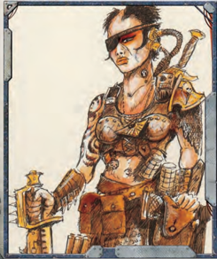

O nce the Explorers have generated their initial [Profit Factor](economy-wealth-and-acquisitions.md) and starship, the group is now [Ready](rules-combat-overview.md) to make use of their resources. Each character may then use the group's [Starting Profit Factor](chargen-stage5-profit-and-ship-points.md) to make one [Acquisition](economy-acquisition-rules.md) (see page 272) of a single item from Chapter V: Armoury with an [Acquisition](economy-acquisition-rules.md) Modifier of +0.

At the Game Master's discretion, he may also allow each character to choose any number of items from Chapter V: Armoury , provided those items are of common [Availability](economy-availability-rules.md) and common [Craftsmanship](components-craftsmanship.md). However, this second option is not recommended for beginning groups, as it may take up a great deal of time.

*Source:* `Roguetrader Corerulebook, page 35`
