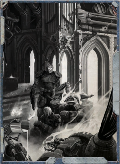

Your family has long held a fascination with the warp, the witch, and the daemon. The presence of the witch amongst you has only fuelled that fascination, though you work hard to hide it from the Inquisition and others who would not understand your labours. Y our quest for knowledge has led you to deal with all manner of individuals who may know useful information.

Cost:

300xp

Effect: Gain Forbidden Lore (Psykers or Warp) as a Trained Skill. Gain the Peer (Astropaths or the Insane) Talent.

*Source:* `Into the Storm, page 33`
