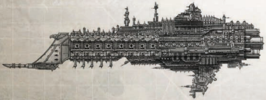

Dimensions: 5 km long, .8 km abeam at fins

Mass: 27.2 megatons

Crew: 90000 crew, approx.

Accel: 2.4 gravities max. sustainable acceleration

The  Tyrant's  design  was  designed  at  the  end  of  the  38th millennium around the principles of superfired plasma weaponry. In the attempt to give the Imperial Navy a warship with  a  powerful,  long-range  macrobattery  broadside,  the Tyrant was developed.

Early versions mixed  short and  long-ranged plasma macroweapons, in an effort to reduce total power draw on the  ship's  reactors.  However,  the  firepower  at  long  range was unspectacular enough that the Navy began retrofitting Tyrants with longer ranged weaponry recovered from space hulks or disabled renegade warships, in order to boost range without boosting power draw.

The cruiser is popular amongst Rogue Traders who can afford it, although they often replace the superfired plasma weapons with less space and power intensive macrobatteries.

Speed: 5

Manoeuvrability: +10

Detection: +10

Hull Integrity:

70

Armour:

20

Turret Rating: 2

Space:

77

SP: 61

Weapon Capacity:

Prow 1, Port 2, Starboard 2

*Source:* `Into the Storm, page 154`
