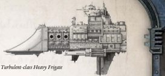

Dimensions: 1.4 km long, 0.3 km abeam at fins approx.

Mass: 5.9 megatonnes approx.

Crew: 21,000 crew, approx.

Accel: 4.6 gravities max sustainable acceleration.

Corvettes are specialist escort craft, usually slightly smaller and less powerful than true [Frigates](hulls-overview.md), but slower and more heavily armoured than [Raiders](ships-raiders-overview.md). Typically constructed rapidly in times of war, Corvettes utilise simple [Components](starship-anatomy-detailed.md) and rugged designs. Their normal mission profile is to escort vulnerable [Transports](ships-transports-overview.md), protecting them against light raiders, thus freeing more valuable true frigates to accompany [Battleships](ships-battleships-overview.md) and cruisers.

Corvettes  are  unpopular  with  Imperial  Navy  officers. Most Battlefleets tend to have many parochial and conservative tendencies, and receiving [Orders](combat-orders.md) to nursemaid civilian vessels in a newly-constructed and untested ship is seen as demeaning, or even as a calculated insult. Despite this, the corvettes have upheld the traditions of the Navy for thousands of years, hurling themselves in the path of more powerful and dangerous vessels, their actions often saving millions of lives.

The Claymore is a typical corvette. Rugged, easily-repaired and utilitarian, more than fifty of these stopgap vessels were constructed during the Angevin Crusade to [Cover](combat-special-circumstances.md) losses in the Sword-class frigate [Squadrons](squadrons-overview.md), churned out by Adeptus Mechanicus  mobile  shipyards  and  small  civilian  concerns orbiting stronghold worlds like Sinophia.

Few of these ships currently serve in Battlefleet Calixis; they were rewarded for their bravery by almost immediately being relegated to reserve fleets or sold to opportunistic Rogue Traders. The latter appreciate them for what they are; cheap compared to most warships, easily maintained and relatively common.

Speed: 8

Manoeuvrability:

+18

Detection:

+12

Hull Integrity:

30

[Armour](armour.md):

17

Turret Rating: 1

Space:

38

SP:

38

Weapon Capacity:

Dorsal 2

*Source:* `Battle Fleet of the Koronus, page 28`
