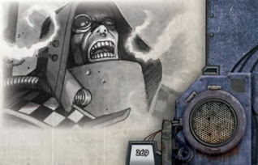

## Narrative Movement and Terrain

Terrain conditions affect how fast a character can [Cover](combat-special-circumstances.md) ground during [Narrative Time](rules-combat-overview.md). Obviously, slogging through a waistdeep [Death World](chargen-stage2-origin-path.md) swamp is far more laborious than strolling through the steel corridors of an orbital space station.

Halve  distances  when  moving  through  tightly  packed foliage, dense urban areas, or similarly [Difficult Terrain](combat-special-circumstances.md).

The Game Master will determine what, if any, modifiers apply to [Narrative Time](rules-combat-overview.md) caused by the environment.

### Hurrying

A character  can  pick  up  the  pace,  moving  up  to  double  his movement in [Narrative Time](rules-combat-overview.md) for a number of hours equal to his Toughness Bonus. At the end of this time, he must make a Challenging (+0) Toughness Test or take 1 level of [Fatigue](character-injury.md). In addition, a hurrying character is less likely to pay attention to  his  surroundings  and  thus  suffers  a  -10  penalty  to  all Perception-based Tests.

A character may push on, even with these penalties, but he must continue to make progressively more difficult Toughness Tests  to  avoid  accumulating  additional  levels  of  [Fatigue](character-injury.md).  He suffers a -10 penalty to his Toughness Test after the second time period, a -20 penalty after the third period, and so forth.

### Running and Narrative Time

Characters  can  [Run](rules-combat-overview.md)  during  Narrative  Time,  but  doing  so  is tiring. When running, a character triples his rate of movement, but each hour of sustained running requires the character to make a  Toughness  Test,  with  a  cumulative  -10  penalty  per hour after the first, to sustain the pace. On a failed test, the character takes 1 level of [Fatigue](character-injury.md). Characters moving at this brisk pace are focused on running and watching their steps, so they take a -20 penalty to all Perception-based Tests. As with hurrying, characters can continue running after a failed test, but penalties gained from multiple failed tests are cumulative.

### Forced Marching

There's nothing stopping characters from pushing themselves beyond the standard ten hours of marching. Characters may safely push themselves for a number of extra hours equal to their Toughness Bonus. Beyond this, a character must make a Toughness Test, with a cumulative -10 penalty per hour, for each hour he travels beyond his Toughness Bonus. A failed test  indicates  that  the  character  takes  a  level  of  [Fatigue](character-injury.md).  It is  possible  to  march  oneself  into  [Unconsciousness](character-injury.md).  Fatigue taken  from  forced  marching  is  removed  after  the  character has rested for two hours for each hour they marched beyond their Toughness Bonus.

### Movement and Environment

The movement rates for characters described on Table 9-36: Structured  Time  Movement  (Metres/Round) assume  a relatively clear battlefield. There may be a few minor obstacles, but characters can still move at their standard rates. There are, however, some circumstances that reduce a character's speed. These can include rubble-strewn hallways, deep snow, dense fog, thick underbrush and a variety of other conditions that make it tough to navigate. In such environments, a character's movement is halved. If a character charges or runs, he must succeed at Challenging (+0) Agility Test or fall [Prone](combat-special-circumstances.md). The difficulty of this test can be modified based on the terrain.

| Table 9-31: [Narrative Time](rules-combat-overview.md) Movement   | Table 9-31: [Narrative Time](rules-combat-overview.md) Movement   | Table 9-31: Narrative Time Movement   | Table 9-31: Narrative Time Movement   |
|---------------------------------------|---------------------------------------|---------------------------------------|---------------------------------------|
| AB                                    | Per Minute                            | Per Hour                              | Per Day †                             |
| 0                                     | 12m                                   | 0.75km                                | 7km                                   |
| 1                                     | 24m                                   | 1.5km                                 | 15km                                  |
| 2                                     | 48m                                   | 3km                                   | 30km                                  |
| 3                                     | 72m                                   | 4km                                   | 40km                                  |
| 4                                     | 96m                                   | 6km                                   | 60km                                  |
| 5                                     | 120m                                  | 7km                                   | 70km                                  |
| 6                                     | 144m                                  | 9km                                   | 90km                                  |
| 7                                     | 168m                                  | 10km                                  | 100km                                 |
| 8                                     | 192m                                  | 12km                                  | 120km                                 |
| 9                                     | 216m                                  | 13km                                  | 130km                                 |
| 10                                    | 240m                                  | 14km                                  | 140km                                 |
| † Assumes 10 hours of walking.        | † Assumes 10 hours of walking.        | † Assumes 10 hours of walking.        | † Assumes 10 hours of walking.        |### Table  9-32:  Agility  Modifiers  for  Running Through Treacherous Environments

See Table 9-32: Agility Modifiers for Running Through Treacherous Environments for suggestions.

| Condition     | Difficulty       |
|---------------|------------------|
| Fog or [Smoke](weapons-general.md)  | Ordinary (+10)   |
| Mud           | Challenging (+0) |
| Shallow Water | Challenging (+0) |
| [Darkness](combat-special-circumstances.md)      | Difficult (-10)  |
| Snow          | Difficult (-10)  |
| Underbrush    | Difficult (-10)  |
| Dense Crowds  | Hard (-20)       |
| [Zero Gravity](starship-combat-rules.md)  | Hard (-20)       |
| Rubble        | Hard (-20)       |
| Tremors       | Hard (-20)       |

## Climbing

There may be times during a character's explorations when he wants to scramble over a low wall, descend into a crevasse, climb to an ideal rooftop sniper position, or shinny up a tree to [Escape](combat-escape-action.md) the claws of vicious xenos. Climbing is divided into two general categories: simple climbs and sheer surfaces.

### Simple Climbs

Simple climbs can include fences, steep hills, boulders, trees, and anything else that requires effort and concentration, but no real Skill to accomplish. Any character with both hands free can automatically accomplish a simple climb, provided he takes his time and is not being distracted (such as being [Shot](weapons-ammunition.md) at).

If a character is trying to climb quickly, is being attacked, or is otherwise distracted, he needs to make a Strength Test or Climb Test to perform a simple climb. On a success, the character ascends or descends at a rate of one-half his Half Move speed (round up). For each degree of success, the character climbs an extra metre. On a failed test, the character falls from his starting climbing position.

The GM can adjust the difficulty of the test based on the nature  of  the  climb  and  other  conditions,  but  the  default difficulty is Challenging (+0).

Note that some acts of climbing, such as ascending a sturdy ladder, are so basic that no test should be necessary .

### Sheer Surfaces

Many surfaces are beyond the means of ordinary characters to climb. A sheer cliff with overhangs and no visible hand-holds, an icy crevasse, and the exterior walls of most buildings all require Skill to climb successfully. Such efforts always require a test.

A  character  may  attempt  to  climb  a  sheer  surface  by making a Climb Test. On a success, the character ascends or descends at a rate of one-half his Half Move speed (round up). For each degree of success, the character climbs an extra metre. On a failed test, the character falls from his starting climbing position.

Climbing difficulty varies with the nature of the climbing surface,  though  most  tests  should  be  Challenging  (+0). Characters  can  receive  bonuses  to  Climb  Tests  if  they  use special climbing [Gear](equipment-gear.md) (see Chapter V: Armoury ).

### Abseiling

A  character  can  descend  a  sheer  surface  more  quickly  by abseiling. This requires some kind of climbing [Gear](equipment-gear.md), such a drop harness, or at the very least some long rope. An abseiling character  makes  a Challenging  (+0)  Agility  Test .  On  a success, he descends at a rate of 10 metres per Round. On a failure, his descent rate is only five metres per Round. Failure by two or more degrees requires to the character to make a Challenging (+0) Strength Test or lose his grip-if he is not wearing a drop harness, he falls.

## Jumping and Leaping

A  Jump  is  a  controlled  vertical  ascent  or  descent  where a  character  attempts  to  either  jump  as  high  as  he  can,  or jump down safely without suffering [Damage](character-injury.md). If a character is  pushed over an edge, or is otherwise not in control of a descent, he is not Jumping, but [Falling](character-injury.md) (see page 261). A Leap is a horizontal jump where a character attempts to [Cover](combat-special-circumstances.md) as much distance  as  possible.  Both  Jumping  and  Leaping  can benefit from a running start. Performing any kind of [Jump or Leap](rules-combat-overview.md) is treated as a Full Action.

### Standing Vertical Jumps

From  a  standing  position,  an  average  character  can  jump about half a metre straight up (measured from the ground to the bottom of his feet). Jumping distance depends as much on a character's body mass as it does his Strength and Agility, so this distance tends to vary only slightly between characters. A character can jump up to reach an overhead ledge, or similar object,  that  is  as  high  as  his  own  height,  plus  about  one metre for average arm length, plus another half a metre for an average standing jump. Usually, no test is required to make such a jump, though pulling oneself up onto a grabbed ledge requires a Challenging (+0) Strength Test .

A character can attempt to safely jump down a number of metres equal to his Agility Bonus by making a Challenging (+0) Agility Test .  If  he succeeds, he lands on his feet and takes  no  [Damage](character-injury.md).  If  he  succeeds,  but  the  jump  is  a  greater distance than his Agility Bonus, he must take [Falling](character-injury.md) Damage (see page 261) equal to the distance jumped in metres beyond his  Agility  Bonus  and  ends  his  Turn  [Prone](combat-special-circumstances.md).  If  he  fails  the Agility Test, he suffers Falling Damage for the entire distance of the jump and ends his Turn [Prone](combat-special-circumstances.md).

### Running Vertical Jumps

If  a  character  gets  a  running  start  by  moving  at  least  four metres in a straight line, he can jump higher. At the end of his movement, he must make a Challenging (+0) Agility Test . If he succeeds, he can add half his Strength Bonus (roundedup) in metres to his normal vertical jump distance (see above), plus an additional half metre for each degree of success. If he fails the test, he stumbles, which ends his Turn. For every four additional metres beyond the first four that a character runs before making a Jump, he receives a +10 bonus to his Agility Test (maximum +30).

### Standing Horizontal Leaps

To make a Standing Horizontal Leap, a character must make a Difficult  (-10)  Agility  Test .  On  a  success,  he  leaps  a number of metres equal to his Strength Bonus, plus another half metre for each degree of success. On a failure, he only Leaps a number of metres equal to half his Strength Bonus (round  up),  and  each  degree  of  failure  further  reduces  this distance  by  another  half  metre  (to  a  minimum  of  one-half metre).

The height attained while leaping is equal to one quarter the distance in metres travelled (round up).

### Running Horizontal Leaps

When performing  a  Running  Horizontal  Leap,  a  character must  move  at  least  four  metres  in  a  straight  line  before making the Leap. At the end of his movement, he makes a Challenging  (+0)  Agility  Test .  On  a  success,  he  Leaps number of metres equal to his Strength Bonus, plus another half metre for each degree of success. On a failure, he only Leaps a number of metres equal to half his Strength Bonus (round  up),  and  each  degree  of  failure  further  reduces  this distance  by  another  half  metre  (to  a  minimum  of  one-half metre). For every four additional metres beyond the first four that a character runs before making a Leap, he receives a +10 bonus to his Agility Test (maximum +30).

The height attained while leaping is equal to one quarter the distance in metres travelled (round up).

## Swimming

A character doesn't need to make a Swim Test under ideal circumstances, but hazardous conditions such as rough waters, hands  being  tied,  or  swimming  whilst  fighting  all  require Swim Tests to move. To swim under hazardous conditions, a character must make a Challenging (+0) Swim Test as a Full Action. A success indicates that the character moves in any direction up to a number of metres equal to one-half his Strength Bonus, or simply tread water at his option. A failed Test means that he makes no progress and cannot move.

A character can choose to swim underwater, but he must hold his breath do so. A character that is unable to swim for some  reason  (unconsciousness,  paralysis,  etc.)  automatically goes underwater. While underwater, a character risks [Suffocation](character-injury.md) due to drowning (see page 261).

Heavy  equipment,  especially  [Armour](armour.md),  makes  swimming extremely  difficult.  If  a  character  is  wearing  [Armour](armour.md)  or  is otherwise  weighted  down,  all  Swim  Tests  are  Very  Hard (-30) and a failed Swim Test automatically imposes one level of [Fatigue](character-injury.md).

### Swimming and Narrative Time

Prolonged  swimming  can  be  exhausting.  A  character  may swim for a number of hours equal to your Toughness Bonus. After that point, he must make a Toughness Test each hour with  a  cumulative  -10  penalty  per  hour.  On  a  failed  test, he  takes  one  level  [Fatigue](character-injury.md).  If  a  swimming  character  falls unconscious due to [Fatigue](character-injury.md), he goes underwater and begins to Suffocate (see page 261).

To  determine  the  distance  covered  for  each  hour  of Swimming, use Table 9-31: [Narrative Time](rules-combat-overview.md) Movement and  swap  the  character's  Strength  Bonus  for  his  Agility Bonus.

## Carrying, Lifting, and Pushing Objects

Under normal circumstances, characters in Rogue Trader do not  need  to  precisely  calculate  how  much  they  can  carry. Common sense can serve as a guide for most purposes. In general,  most  characters  can  reasonably  carry  one  main weapon (such as a boltgun, [Lasgun](weapons-general.md), or flamer), plus one or two secondary [Weapons](weapons-general.md) (such as pistols or melee weapons), plus a few clips of extra ammo and several pieces of miscellaneous equipment in a [Backpack](equipment-gear.md), satchel, or similar container. On the other hand, it would not be at all reasonable for a character (even  a  very  strong  one)  to  be  walking  around  with  three different  heavy  weapons  and  several  thousand  [Rounds](rules-combat-overview.md)  of ammo for each, or for a character to have a [Backpack](equipment-gear.md) with one of everything from the equipment section in Chapter 5: Armoury . However, there are likely to be instances when it is useful to know how much a character can lift or carry.

The amount of weight a character can move depends on the sum of his Strength Bonus and Toughness Bonus. Compare the total to Table 9-33: Carrying, Lifting, and Pushing Weights to find out the limits of a character's might. Note that certain [Traits](character-traits.md) may increase these values.

### Carrying Weight

A character's Carrying Weight is how much he can comfortably carry without suffering any penalties to his movement. If a character carries more that this weight, he is Encumbered (see below).

### Lifting Weight

A character's Lifting Weight represents the maximum amount of weight he can pick up off the ground. A character can attempt to move whilst holding a heavy load, but if the load exceeds his Carrying Weight, he is Encumbered (see below). Lifting a heavy load is treated as a Full Round Action.

A character can attempt to lift more than his usual limit by making a Challenging (+0) Strength Test . Each degree of success adds a +1 bonus to the sum of the character's Strength Bonus and Toughness Bonus for the purpose of determining limits. If the test is failed by two degrees or more, the character suffers one level of [Fatigue](character-injury.md).| Table 9-33: Carrying, Lifting Weights   | Table 9-33: Carrying, Lifting Weights   | Table 9-33: Carrying, Lifting Weights   | & Pushing Maximum   |
|-----------------------------------------|-----------------------------------------|-----------------------------------------|---------------------|
| Sum of SB and TB                        | Maximum Carrying Weight                 | Maximum Lifting Weight                  | Pushing Weight      |
| 0                                       | 0.9 kg                                  | 2.25 kg                                 | 4.5 kg              |
| 1                                       | 2.25 kg                                 | 4.5 kg                                  | 9 kg                |
| 2                                       | 4.5 kg                                  | 9 kg                                    | 18 kg               |
| 3                                       | 9 kg                                    | 18 kg                                   | 36 kg               |
| 4                                       | 18 kg                                   | 36 kg                                   | 72 kg               |
| 5                                       | 27 kg                                   | 54 kg                                   | 108 kg              |
| 6                                       | 36 kg                                   | 72 kg                                   | 144 kg              |
| 7                                       | 45 kg                                   | 90 kg                                   | 180 kg              |
| 8                                       | 56 kg                                   | 112 kg                                  | 225 kg              |
| 9                                       | 67 kg                                   | 135 kg                                  | 270 kg              |
| 10                                      | 78 kg                                   | 157 kg                                  | 315 kg              |
| 11                                      | 90 kg                                   | 180 kg                                  | 360 kg              |
| 12                                      | 112 kg                                  | 225 kg                                  | 450 kg              |
| 13                                      | 225 kg                                  | 450 kg                                  | 900 kg              |
| 14                                      | 337 kg                                  | 675 kg                                  | 1,350 kg            |
| 15                                      | 450 kg                                  | 900 kg                                  | 1,800 kg            |
| 16                                      | 675 kg                                  | 1,350 kg                                | 2,700 kg            |
| 17                                      | 900 kg                                  | 1,800 kg                                | 3,600 kg            |
| 18                                      | 1,350 kg                                | 2,700 kg                                | 5,400 kg            |
| 19                                      | 1,800 kg                                | 3,600 kg                                | 7,200 kg            |
| 20                                      | 2,250 kg                                | 4,500 kg                                | 9,000 kg            |

### Pushing Weight

A  character's  Pushing  Weight  represents  the  maximum amount of weight he can shove across a smooth surface, such as  metal  floor.  Difficult  Terrain  can  make  pushing  objects much more difficult. Pushing a heavy object is treated as a Full Round Action.

A character can attempt to push more than his usual limit by making a Challenging (+0) Strength Test . Each degree of  success  adds  a  +1  bonus  to  the  sum  of  the  character's Strength  Bonus  and  Toughness  Bonus  for  the  purpose  of determining limits. If the test is failed by two degree or more, the character suffers one level of [Fatigue](character-injury.md).

### Encumbered Characters

If a character attempts to carry more than his normal carrying limits (but less thank his lifting limit), he is Encumbered. An Encumbered character takes a -10 penalty to all movementrelated  tests  and  reduces  his  Agility  Bonus  by  one  for  the purposes  of  determining  movement  rates  and  [Initiative](starship-combat-rules.md).  In addition,  after  a  number  of  hours  equal  to  his  Toughness Bonus have passed while carrying this weight, he must make a Challenging  (+0)  Toughness  Test or  take  one  level  of [Fatigue](character-injury.md).

## Throwing Objects

Chapter  V:  Armoury describes  several  [Weapons](weapons-general.md)  designed to be thrown at targets, but a character can attempt to throw just  about  any  object  that  weighs  up  to  half  the  character's normal Lifting Weight (as indicated by Table 9-33: Carrying, Lifting, and Pushing Weights ).

To throw an object, a character makes a Challenging (+0) Strength Test . A successful test means that the object flies a number of metres equal to his Strength Bonus. For each degree of success, this distance increases by a factor of one, so one degree means that the character throws the object a number of metres equal to twice his SB, two degrees means that the object is  thrown  a  number of metres equal to your three times his SB, and so forth. On a failed test, the object flies a number of metres equal to half his Strength Bonus (round down; a result of 0 means it fell at his feet). If the object hits a hard surface such as a wall, it takes 1d10+SB [Damage](character-injury.md) plus one for every degree of success on the test. These rules do not apply to aerodynamic throwing [Weapons](weapons-general.md) and grenades. Such weapons have a range given on the weapons tables and have range brackets like other weapons.

If the object is being thrown at a specific target, it is treated as an improvised weapon and the throwing character makes a Ballistic Skill Test instead of a Strength Test.

A character can attempt to throw an object that weighs more than half his Lifting Weight, but such tests are Hard (-20).

## Lighting

Many adventures in Rogue TRadeR take place under the [Cover](combat-special-circumstances.md) of night, in the shadowy depths of caves, or in the dank and foetid underhive. As a result, the oppressive [Darkness](combat-special-circumstances.md) becomes a constant enemy, concealing countless terrors and monstrous threats  in  its  depths.  For  these  reasons,  light  sources  are  of paramount importance when exploring the dark places of the Imperium.

For  simplicity , Rogue  TRadeR uses  three  levels  of  light: Bright,  Shadow  and  Darkness.  Bright  light  is  any  light  that allows normal vision, such as sunlight or being within the radius of a torch, glo-lantern, and so on. Shadow conditions occurs during  pre-dawn  and  twilight  hours  on  Earth-like  planets, whenever a character or object is just beyond the range of a normal light source, or when that source is obscured by an effect such as fog. Darkness, naturally enough, is the absence of light.

Aside from the obvious effects of Darkness and Shadowbeing the inability to see, areas of Shadow and Darkness can interfere with a character's movement and [Combat](rules-combat-overview.md) capabilities. Characters may move through areas of Shadow at no penalty, but  may  move  at  only  half  speed  or  less  through  Darkness. Exceeding  this  speed  means  that  the  character  may  drift in  a  random  direction  unless  the  character  succeeds  on  a Hard (-20) Perception Test .  For  the  effects  of  lighting  on [Combat](rules-combat-overview.md), see Darkness , page 247, and Fog, Mist, or Shadow , page 248.

## Flying

This section describes rules for flying creatures, or characters with specific technology that grants flight capability.### Altitude

On a typical Earth-like planet, there are three broad altitude levels: Hovering, Low Altitude, and High Altitude. A flying creature can change altitude by one level (up or down) during each Move Action taken. If a creature is using a [Charge](rules-combat-overview.md) or [Run](rules-combat-overview.md) Action, it can change altitudes by two levels.

#### Hovering Altitude

Hovering means that a creature is skimming just above the ground,  no  higher  than  two  metres.  It  can  move  over  low obstacles with ease. A hovering creature can both [Attack](combat-attack-rules.md) and be attacked by other creatures and characters on the ground.

Some creatures are capable of hovering, but incapable of flying  at  other  altitudes.  Such  creatures  have  the  [Hoverer](character-traits.md) trait (see Chapter Xiv: Adversaries and Aliens ). A creature with the [Hoverer](character-traits.md) trait always stays at the same height above ground (usually within two metres) even if it descends into low terrain, such as a pit. Such creatures will not willingly descend into an area that cannot get out of, no more so than any  normal  creature  would  willingly  jump  into  a  hole  in which they could not [Escape](combat-escape-action.md).

#### Low Altitude

This altitude indicates that a creature is flying at height that is beyond the melee [Attack](combat-attack-rules.md) range of other creatures or characters on the ground, but is still within the range of most ranged attacks from such creatures or characters. A Low Altitude flier takes no penalties for shooting downwards, but those firing up at it suffer a -10 penalty to their Ballistic Skill Tests in addition to any normal penalties for range.

#### High Altitude

When a creature is flying at High Altitude, it is far above the ground beyond the range of all attacks, even those coming from Low Altitude. A High Altitude flier can only [Attack](combat-attack-rules.md) or be attacked by other creatures flying at High Altitude.

### Flying Movement

Flying  creatures  and  characters  are  broken  up  into  two  categories, each  of  which  is  a  Trait:  Hoverers  and  Flyers  (see Chapter Xiv: Adversaries and Aliens ). Hoverers can move through the air, but are incapable of gaining more than two metres of altitude. A [Flyer](character-traits.md) can ascend or descend to any altitude.

Each  Trait  has  an  associated  number  in  the  creature's [Description](career-path-format-guide.md). This number describes the character or creature's Flying  Movement.  This  works  just  like  regular  movement, but  applies  only  when  the  creature  is  flying.  While  flying or  hovering,  a  creature  must  devote  a  Movement  Action  to maintaining  its  flight  each  Turn,  or  it  falls.  Half  Move,  Full Move, [Charge](rules-combat-overview.md), and [Run](rules-combat-overview.md) are all valid Actions for maintaining flight.

If the creature at Hovering Altitude suddenly stops flying (by not devoting a Move Action or being [Stunned](character-injury.md), for [Example](rules-tests.md)), it simply lands on the ground unharmed. If it is instead at Low Altitude, it suffers [Falling](character-injury.md) Damage (see page 261) as if it fell 15 metres. If it is instead at High Altitude, it suffers Falling Damage as if it fell 25 metres, or more at the GM's discretion.

## The Effects of Gravity

Although  the  inhabited  worlds  of  the  Imperium  may  vary slightly in terms of gravity, the effects on game play are minimal. Only when characters explore High Gravity or Low Gravity worlds are movement, lifting and other factors affected.

### Low Gravity Worlds

On worlds of low gravity, all characters increase their Agility Bonus by two for the purposes of movement and determining [Initiative](starship-combat-rules.md). In addition, characters add four to the total of their Strength Bonus and Toughness Bonuses for the purpose of determining carrying, lifting and pushing limits. Characters also add two to their Strength Bonus for determining how far they can throw objects. All Jumping and Leaping distances are doubled.

### High Gravity Worlds

On worlds of high gravity, all characters decrease their Agility Bonus by two (to  a  minimum  of  one)  for  the  purposes  of movement and determining [Initiative](starship-combat-rules.md). In addition, characters subtract  four  (to  a  minimum  zero)  from  the  total  of  their Strength Bonus and Toughness Bonuses for the purpose of determining carrying, lifting and pushing limits. Characters also subtract two from their Strength Bonus (to a minimum of 0) for determining how far they can throw objects. Finally, halve all Jumping and Leaping distances.

### Zero Gravity

Explorers are most likely to encounter [Zero Gravity](starship-combat-rules.md) conditions in outer space when there has been a serious technological failure. [Zero Gravity](starship-combat-rules.md) is considered [Difficult Terrain](combat-special-circumstances.md), meaning that a character's movement is halved while in it, and if he attempts a [Charge](rules-combat-overview.md) or [Run](rules-combat-overview.md) Action, he must succeed at a Hard (-20)  Agility  Test or  drift  out  of  control  (treat  as  [Falling](character-injury.md) [Prone](combat-special-circumstances.md)). Additionally, a character beginning a movement action in zero gravity must be adjacent to a floor, wall, ceiling, or other secure object, so he has something to push off from.

*Source:* `Roguetrader Corerulebook, pages 265–270`
