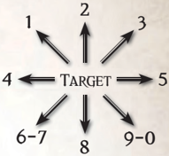

## Cover

Cover is a vital part of surviving a firefight and a good Explorer knows that you go for your cover first and then draw your gun. There are no penalties to Ballistic Skill Tests made to [Attack](combat-attack-rules.md) targets standing partly behind cover. However, there is a chance that the [Shot](weapons-ammunition.md) may hit the cover rather than the target. It is up to the Explorer to decide which parts of his body he is exposing when behind cover,  but  as  a  general  rule,  a  character  firing around or over cover will have his body and legs concealed. If the [Shot](weapons-ammunition.md) would hit a body location that is concealed behind cover, work out the [Damage](character-injury.md) against the [Armour](armour.md) Points of the cover instead, with any excess being applied to the target as normal (see Table 9-7: Cover Examples for a guide to the [Armour](armour.md) Points of different kinds of cover).

| Table 9-7: Cover Examples                  | Table 9-7: Cover Examples   |
|--------------------------------------------|-----------------------------|
| Cover Type                                 | AP                          |
| Armour-glas, Generatoria pipes, thin metal | 4                           |
| Flakboard, storage crate, sandbags, ice    | 8                           |
| Cogitator bank, stasis pod                 | 12                          |
| Rockcrete, hatchway, thick iron, stone     | 16                          |
| Armaplas, bulkhead, Plasteel               | 32                          || Table 9-8: [Combat](rules-combat-overview.md) Difficulty Summary   | Table 9-8: [Combat](rules-combat-overview.md) Difficulty Summary   | Table 9-8: Combat Difficulty Summary                                                                                                                                                                                                                    |
|----------------------------------------|----------------------------------------|---------------------------------------------------------------------------------------------------------------------------------------------------------------------------------------------------------------------------------------------------------|
| Difficulty                             | Skill Modifier                         | [Example](rules-tests.md)                                                                                                                                                                                                                                                 |
| Easy                                   | +30                                    | Attacking a Surprised or Unaware target. Shooting a Massive target. Shooting a target at Point Blank Range.                                                                                                                                             |
| Routine                                | +20                                    | Melee attacks against a foe who is outnumbered three to one or more. Attacking a [Stunned](character-injury.md) opponent. Shooting an Enormous target.                                                                                                                         |
| Ordinary                               | +10                                    | Melee attacks against a foe who is outnumbered two to one. Attacking a Prone opponent with a melee weapon. Attacking from higher ground. Shooting a Hulking target. Shooting a target at Short Range.                                                   |
| Challenging                            | +0                                     | A Standard Attack.                                                                                                                                                                                                                                      |
| Difficult                              | -10                                    | Any test whilst Fatigued. Attacking or Dodging whilst in the mud or heavy Rain. Shooting a target at Long Range. Shooting a Prone target. Shooting a Scrawny target.                                                                                    |
| Hard                                   | -20                                    | Shooting into melee combat. Dodging whilst Prone. Making an unarmed attack against an armed opponent. Melee attacks in darkness. Shooting at a target in fog, mist, shadow or smoke. Shooting a Puny target. Using a weapon without the correct Talent. |
| Very Hard                              | -30                                    | Attacking or Dodging in deep snow. Firing a heavy weapon that has not been Braced. Shooting a Minuscule target. Shooting a target at Extreme range. Shooting at a completely concealed target. Shooting at a target in darkness.                        |

### Damaging Cover

Cover is not invulnerable. Attacks can [Damage](character-injury.md) or destroy the protection afforded by cover. Each successful hit against cover that  deals  any  amount  of  [Damage](character-injury.md)  in  excess  of  the  [Armour](armour.md) Points it provides reduces the cover's [Armour](armour.md) Points by 1.

### Example

Titus has taken cover behind a small pile of sandbags while a gun [Servitor](equipment-tools.md) blasts at him with its twin autoguns. The gun [Servitor](equipment-tools.md) fires a [Full Auto Burst](rules-combat-overview.md) and hits Titus three times for 8, 11, and 8 points of [Damage](character-injury.md). Fortunately for Titus, all of the hits would have struck either his legs or body, so they are absorbed by the sandbags instead. The first hit is fully absorbed by the sandbags to no effect because they provide 8 [Armour](armour.md) Points of protection. The second hit's [Damage](character-injury.md) is reduced by 8, leaving 3 points of excess damage, which reduces the sandbag's AP to 7. The third hit's damage is reduced by 7, leaving 1 point of excess damage, which further reduces the sandbag's AP to 6.

## Darkness

Weapon  Skill  Tests made  in  darkness  are regarded  as Hard (-20), while Ballistic Skill Tests are regarded as Very Hard  (-30).  While  a  Character  is  concealed  by  darkness, Concealment Skill Tests are Routine (+20).

## Difficult Terrain

Weapon  Skill  and  [Dodge](rules-combat-overview.md)  Tests  made  whilst  standing  in difficult terrain, such as mud, are Difficult (-10). Tests made whilst standing in arduous terrain, such as deep snow or slick ice, are Very Hard (-30).

## Engaged in Melee

If an attacking Character is adjacent to his target, both the Character  and  his  target  are  considered  to  be  engaged  in melee.

## Shooting Into Melee Combat

Ballistic  Skill  Tests  made  to  hit  a  target  engaged  in  melee [Combat](rules-combat-overview.md) are Hard (-20). If one or more Characters engaged in the melee is [Stunned](character-injury.md), Helpless, or Unaware, this penalty is ignored.

## Extreme Range

Targets that are at a distance of more than three times the  range  of  a  character's  weapon  are  at  Extreme Range. Ballistic Skill Tests made to hit targets at Extreme Range are Very Hard (-30).## Stray Shots (optional Rule)

GMs keen on reinforcing the merciless nature of the 41st Millennium may rule that if a character shooting into a melee [Combat](rules-combat-overview.md) misses his target by a small margin (one degree of failure or less), [The Attack](rules-combat-overview.md) instead hits another target engaged in the same melee. The GM might also rule  that  anyone  shooting  into  a  melee  combat  with a  Semi-Auto  Burst  or  Full  Auto  Burst  must  allocate multiple hits to different targets engaged in the melee.

## Fatigued

When  a  character  is  Fatigued  all  his  tests,  including  any Weapon Skill and Ballistic Skill Tests, suffer a -10 penalty.

## Fog, Mist, Shadow or Smoke

Ballistic Skill Tests made to [Attack](combat-attack-rules.md) targets concealed by fog, mist, shadow, or [Smoke](weapons-general.md) are Hard (-20). While a character is concealed by fog, mist, or shadow, Concealment Skill Tests are Ordinary (+10).

## Ganging up

A character has an advantage when he and his allies engage the  same  foe  in  melee  [Combat](rules-combat-overview.md).  If  a  group  of  characters outnumber their  opponent  two  to  one,  their  Weapon  Skill Tests are Ordinary (+10). If a group of characters outnumber their opponent by three to one or more, their Weapon Skill Tests are Routine (+20).

## Helpless Targets

Weapon Skill Tests made to hit a sleeping, unconscious or otherwise helpless target automatically succeed. When rolling [Damage](character-injury.md) against such a target, roll twice and add the results. If one die rolled results in 10, there is a chance of [Righteous Fury](rules-combat-overview.md) as normal, but if two dice come up as 10, a [Righteous Fury](rules-combat-overview.md) is automatic (no second [Attack](combat-attack-rules.md) roll necessary).

## Higher Ground

Characters standing on higher ground, such as standing on a table, hill, or atop of a mound of dead comrades, have an advantage. Weapon Skill Tests made by these characters are Ordinary (+10).

## Long Range

Targets that are at a distance of more than double the range of a character's weapon are at Long Range. Ballistic Skill Tests made to hit targets at Long Range are Difficult (-10).

## Missing

Sometimes, when flinging a thrown weapon, it's important to  know  where  the  weapon  lands  should  the  attacker  fail his Ballistic Skill Test. On a failed roll, the GM rolls 1d10 and  consults  the  following  [Scatter](weapons-general.md)  Diagram.  Roll  1d5  to determine the number of metres the weapon travels in the indicated direction.

## Scattering in Zero Gravity

The consequences  of  throwing  dangerous  objects  in a [Zero Gravity](starship-combat-rules.md) environment can be both amusing and deadly.  One  way  of  determining  exactly  where  that errant  [Krak](weapons-general.md)  grenade  floats  after  it  bounces  off  the bulkhead is to roll twice on the [Scatter](weapons-general.md) diagram, once for the X axis and once for the Y axis.

## Pinning

Being [Shot](weapons-ammunition.md) at is a terrifying experience at the best of times, and  even  the  most  inexperienced  Explorers  know  to  keep their heads down when the [Bullets](weapons-ammunition.md) and bolt shells start [Flying](combat-movement.md). Pinning represents a character's survival instincts telling him to stay in cover. While he may want to [Charge](rules-combat-overview.md) headlong into a storm of bullets, he first needs to steel his nerves. When a character is on the receiving end of suppressive fire, even if the shot struck a Hit Location that is behind cover or the character suffers  no  [Damage](character-injury.md),  he  must  make  a Hard (-20 ) Pinning Test . This is a Willpower Test. On a success, the character may act normally. On a failure, the character becomes Pinned.

### Being Pinned

A Pinned character may only take [Half Actions](rules-combat-overview.md). Additionally, he suffers a -20 penalty to all Ballistic Skill Tests. If a Pinned character is in cover relative to the attacker that Pinned him, he may not leave it except to retreat (provided he can remain in cover while doing so). If he is not in cover when Pinned he must use his next Turn to reach cover. If there is no cover nearby, he must move away from the attacker that Pinned him.A character can test Willpower at the end of his Turn to [Escape](combat-escape-action.md) Pinning, in which case he may act as normal on his next Turn. This test is Easy (+30) if the character is no longer under fire (i.e., no one tried to shoot him since his last Turn). A character engaged in melee [Combat](rules-combat-overview.md) automatically escapes Pinning. There are  some special Talents, Skills and Psychic Powers that can also free a character from the effects of Pinning, as well as such things as combat drugs and terrifying commissars.

## Point Blank Range

When a character makes a ranged [Attack](combat-attack-rules.md) against a target that is two metres away or closer, that target is at Point Blank Range. Ballistic Skill Tests made to attack a target at Point Blank Range are Easy (+30). This bonus does not apply when the attacker and the target are engaged in melee [Combat](rules-combat-overview.md) with each other. For [Weapons](weapons-general.md) with a short range of less than 3 metres, point blank range is 1 metre less than the weapon's short range.

## Prone

A  character  is  considered  Prone  any  time  he  lying  on  the ground. Weapon Skill Tests made to [Attack](combat-attack-rules.md) Prone targets are Ordinary (+10), but Ballistic Skill Tests made to hit Prone targets are Difficult (-10) unless the attacker is at Point Blank Range.  A  character  who  is  Prone  suffers  a  -10  penalty  to Weapon Skill Tests and a -20 penalty to [Dodge](rules-combat-overview.md) Tests.

Unless a character is engaged in a [Grapple](rules-combat-overview.md), he can drop Prone as a Free Action.

## Short Range

Targets that are at a distance of less than half the Range of a character's weapon are at Short Range. Ballistic Skill Tests made to [Attack](combat-attack-rules.md) targets at Short Range are Ordinary (+10).

## Size

[Size](character-traits.md)  is  an  important  factor  when  shooting  ranged  [Weapons](weapons-general.md)  because it's usually easier to hit a larger target. All characters and creatures in Rogue TRadeR have a defined [Size](character-traits.md) category , and it should be relatively easy for the GM to assign appropriate size categories to objects as needed. Use Table 9-9: Target Size Modifiers for determining bonuses and penalties based on a target's size.

| Table 9-9: Target Size Modifiers      | Table 9-9: Target Size Modifiers   |
|---------------------------------------|------------------------------------|
| Size                                  | Modifier                           |
| Minuscule (autoquill, [Knife](weapons-general.md))          | -30                                |
| Puny (bolt pistol, servo-skull)       | -20                                |
| Scrawny (Gretchin, Human child)       | -10                                |
| Average (Human, Eldar)                | +0                                 |
| Hulking (Ork Nob, [Combat](rules-combat-overview.md) [Servitor](equipment-tools.md))    | +10                                |
| Enormous (Sentinel Walker, Krootox)   | +20                                |
| Massive (Battle Tank, greater daemon) | +30                                |
| Immense (Land Raider, Great Knarloc)  | +40                                |
| Monumental (Squiggoth, Baneblade)     | +50                                |
| Titanic (Reaver Battle Titan)         | +60                                |

## Stunned Targets

Weapon Skill and Ballistic Skill Tests made to [Attack](combat-attack-rules.md) Stunned targets are Routine (+20).

## Unaware Targets

When a character has no idea that he about to be attacked, he is considered an Unaware target. Usually, this happens at the beginning of a [Combat](rules-combat-overview.md) when one or more characters are Surprised (see page 235). Weapon Skill or Ballistic Skill Tests made to [Attack](combat-attack-rules.md) Unaware targets are Easy (+30).

## Weapon Jams

So capricious is the whim of the 41st Millennium that many of the ranged [Weapons](weapons-general.md) Explorers use will have an unfortunate tendency to malfunction, either through extreme age, maltreatment of their machine spirit, or just plain poor design. To  represent  these  unfortunate  occurrences,  an  unmodified result of 96 to 00, in addition to being an automatic miss, also indicates the weapon has jammed. A Jammed weapon cannot be  fired  until  it  is  cleared.  Clearing  a  Jam  is  a  Full  Action which requires a Ballistic Skill Test. If the test is successful then the Jam has been cleared, though the weapon needs to be reloaded and any ammo in it is lost. If the test is failed, the weapon is still Jammed, though the character can attempt to clear it again next Round.

Note: Some [Weapons](weapons-general.md), such as plasma guns, grenades and missiles, are particularly dangerous to use. For these weapons, refer to their descriptions and Weapon Special Qualities (see Chapter V: Armoury ). Semi-automatic and fully automatic fire also increases the likelihood of Jamming. This is described within the [Semi-auto Burst](rules-combat-overview.md), [Full Auto Burst](rules-combat-overview.md) and Suppressing Fire Actions.

## Weather and Unnatural Conditions

Weapon Skill and Ballistic Skill Tests made to [Attack](combat-attack-rules.md) whilst enduring  harsh  weather  or  unnatural  conditions,  such  as heavy Rain, an ash storm or knee-deep in waves of fungus, are considered Hard (-20).

*Source:* `Roguetrader Corerulebook, pages 247–250`
