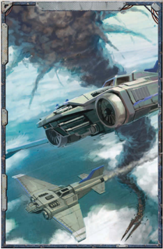

Due  to  a  number  of  factors,  it is quite possible for one unit to surprise another in

[Large-scale Warfare](mass-combat-rules.md). Before [Combat](rules-combat-overview.md) begins, the GM should determine if any units are surprised.

*Source:* `Battle Fleet of the Koronus, page 131`
