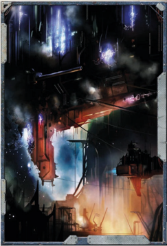

## Cypra-pattern Drives

Whether it's a matter of scouting out enemy vessels or quietly determining the best goods to bring to market, hiding from a competitor offers a crucial advantage. Cypra-pattern Drives use a series of additional baffles, magnetic fields, and hyperefficient coolants to reduce their energy signature.

Dampened [Drives](components-drives.md): This  Component grants a +15 bonus to the Silent Running [Manoeuvre](rules-combat-overview.md). Any attempts to detect the vessel  (any  actions  that  use  a  ship's  Detection,  such  as  the [Active Augury](starship-combat-rules.md) Extended Action) suffer a -15 penalty.

## Jovian-pattern Nova Cannon

One of the rarest of all  Nova  Cannons, the Jovian pattern replaces the explosive [Shells](weapons-ammunition.md) with [Vortex Warheads](weapons-warheads-vortex.md). The resultant rifts into [The Warp](warp-imperial-space-travel.md) have been known to rend target vessels cleanly in half. This follows all the rules for [Nova Cannons](weapons-nova-cannons.md).

Vortex Warhead: The terrifying nature of vortex weaponry means a ship hit by a shot from this weapon (even if it does not do [Damage](character-injury.md)) immediately loses 1d5 Morale.

Core Architecture: This weapon Component is always revealed by successful [Active Augury](starship-combat-rules.md)-it is too large to be concealed.

[Unstable](weapons-general.md)  [Ammunition](economy-wealth-and-acquisitions.md): If  a  Jovian-pattern  Nova  Cannon is  ever damaged, it is destroyed instead. In addition, as the ammunition explodes, the vessel is suffers 1d10 [Hull](starship-anatomy-detailed.md) Integrity Damage, ignoring [Armour](armour.md) or [Void Shields](components-void-shields.md).

## Plasma Accelerated Torpedo Tubes

In  the  early  days  of  the  Imperium,  certain  Forge  worlds produced [Weapons](weapons-general.md) and starship [Components](starship-anatomy-detailed.md) of a quality now lost to mankind, and [Torpedoes](weapons-torpedoes.md) were no exception. 'Plasma accelerated' [Torpedo Tubes](components-torpedo-tubes.md) refer to a type of torpedo launch system, rather than a specific pattern. These [Weapon Systems](weapons-systems-overview.md) utilize  plasma  from  the  ship's  [Drives](components-drives.md)  to  'hot  launch'  the torpedoes, while integral guidance systems constantly update target  profiles  to  the  torpedoes'  machine  spirits.  They  are even safer than their counterparts, with multiple reinforced adamantium-alloy  blast  hatches.  This  component  can  store sixteen torpedoes, plus an additional four if the ship's [Captain](rank-captain.md)

Table 1-12: Archeotech Weapons

| [Supplemental Components](wraithship.md#supplemental-components)          | Appropriate Hull Types   |   Power |   Space |   SP | Strength   | [Damage](character-injury.md)   | Crit Rating   | Range   |
|----------------------------------|--------------------------|---------|---------|------|------------|----------|---------------|---------|
| Jovian-pattern Nova Cannon †     | [Cruisers](hulls-overview.md)                 |       5 |       7 |    5 | †          | 2d5+7    | †             | 6-35    |
| Plasma Accelerated Torpedo Tubes | All Ships                |       1 |       4 |    4 | 4          | -        | -             | -       |

† See page 16 for [Special Rules](mass-combat-special-rules.md) on Nova Cannon Strength and [Critical Hits](starship-combat-rules.md).

does not mind keeping four 'in the tubes.'  This follows all the rules for torpedo tubes.

Hot Launch: Torpedoes launched from this Component gain an additional +4 VU speed on the turn they are launched, after which they revert to normal.

Augur Accuracy: Torpedoes launched from this Component gain a +10 bonus to hit.

Volatile: If  this  Component is Damaged or Destroyed (but not Unpowered or Depressurised) while torpedoes are loaded, it has a 5% chance of exploding. In this event, the Component is destroyed and the ship takes 2d5 Hull Integrity damage.

## Warp Antenna

As the Imperium first began to expand away from the glowing light  of  the  Astronomican,  many  [Navigators](psychic-psyker-types.md)  were  much  less [Adept](rules-allies-enemies-rivals.md) at finding their way through [The Warp](warp-imperial-space-travel.md). To assist in this technique,  massive  force  staves  were  added  to  the  exterior of  some  vessels.  These  functioned  as  antennae,  allowing  a navigator to more easily hone in on [The Astronomican](warp-travel-navigation.md)'s signal. His Holy Light: The Navigator receives a +20 bonus to all tests to Locate the Astronomican.

Beacon: In addition to increasing the navigator's sensitivity, this Component also makes the vessel much more noticeable to others in the warp. Vessels equipped with a Warp Antenna suffer a -10 modifier on Warp Travel Encounter Tests.

External: This  Component  does  not  require  [Hull](starship-anatomy-detailed.md)  space. Although it is external, it can only be destroyed or Damaged with a Critical Hit.

## Warp Sextant

This massive submersion tank enhances a Navigator's ability to safely sense the ebb and flow of [The Warp](warp-imperial-space-travel.md) outside of the vessel. A broad spectrum of [Sensors](starship-anatomy-detailed.md) measures the intensities and  currents  in  the  warp  outside  of  the  starship.  This information  is  then  relayed  safely  to  the  Navigator  so  that it can be more easily analysed and addressed. The Sextant's array of cogitators further aids the Navigator in identifying known routes and calculating their current stability.

The True Path: When using a Warp Sextant, the Navigator receives a +20 bonus on any Perception Tests or Navigation (Warp) Tests made to steer the vessel through the warp.Duty of the Imperial Navy · Battlefleet Calixis · Battlefleet Koronus · NOTABLE STARSHIPS · [Ranks in the Battlefleet](ranks-battlefleet-overview.md)

43

II: The Imperium's Sheild

*Source:* `Battle Fleet of the Koronus, pages 41–43`

# Archeotech Components

## Table of Contents
  - [Castellan Shield](#castellan-shield)
  - [Castellan Shield Array](#castellan-shield-array)
  - [Cogitator Interlink](#cogitator-interlink)
  - [Energistic Conversion Matrix](#energistic-conversion-matrix)
  - [Gyro-stabilisation Matrix](#gyro-stabilisation-matrix)
  - [Staravar Laser Macrobattery](#staravar-laser-macrobattery)
  - [Star-flare Lance](#star-flare-lance)

Only the richest shipmasters can afford to devote so much space and resources to growing gardens aboard their vessel. Replenishing supplies: Double the time a ship may remain at  void  without  suffering  Crew  Population  or  Morale  loss. Increase Crew Population permanently by +2.

## Castellan Shield

For  some  traders,  trading  minerals  and  materials  is  not enough.  They  prefer  to  harvest  their  profits  directly. An  asteroid  mining  facility  consists  of  bays  of mining lighters, tractor fields, adamantine drills, vast  internal  refineries  and  stowage  bunkers for the minerals mined. A single ship can remain amongst an asteroid field for decades, accumulating a vast wealth in minerals. However, an asteroid mining facility dominates a starship.

Mining Rig: An asteroid mining facility Component allows a vessel to conduct mining operations in an asteroid field (or similar location). This allows the vessel's crew to construct a Trade Endeavour based on those operations (see ROGUE TRADER page 277). When completing this Endeavour's objectives, the players earn an additional 200 Endeavour Points.

## Castellan Shield Array

Though all ships have a specific area set aside for the use of their Astropathic Choir, some ships have vast chambers specifically designed to amplify astropathic signals and boost the power and effectiveness of the ship's Astropath Transcendent.

Psy-locus: When performing Astro-telepathy in this Component, an Astropath gains a +10 bonus to his Focus Power Test. While occupying this Component during Space Combat, any psychic powers the Astropath uses have their range increased by 5 VUs.## Cogitator Interlink

Broadcast towers flood  all  frequencies  with  deafening  hymns  to  the God-Emperor, jamming communications and terrifying enemies. Heathen  or  renegade  ships  have  been  known  to  use  similar systems, though the nature of their 'hymns' is very different.

Deafening: If this system is activated, all other ships must make a Difficult (-10) T ech Use T est in order to use vox or other broadcast communications while within 30 VUs of this vessel.

Terrifying: When this system is activated, characters aboard this vessel gain +10 on all Intimidate Tests against all ships within 30 VUs.

External: This  Component  does  not  require  hull  space. Although it is external, it can only be destroyed or damaged by a critical hit.

## Energistic Conversion Matrix

These artefacts from the Dark Age of Technology can greatly boost  the  effectiveness  of  the  starship  that  carries  them. As  stated  on  page  206  of ROGUE TRADER ,  all  Archeotech Components are only available  through  a  Complication  or Background Package that allows them, certain results on the Warrant Generation Path (see page 34), or if the GM makes them available over the course of the game.

## Gyro-stabilisation Matrix

Some of the oldest Imperial vessels are blessed with 'Castellan' class void shields. These shields are far superior to current void shields, and their multiple banks of fail-safe circuit breakers means they can remain up under far-greater stresses.

Void Shield: This Component counts as a ship's Void Shield, giving the ship one void shield. ‚

Fail-safes: Once per Strategic Round, during one opponent's Strategic  Turn,  the  ship's  Enginseer  Prime  may  make  a Difficult (-10) Tech-Use Test . This does not count as the Enginseer's Extended Action. If he succeeds, the ship doubles its  number  of  Void  Shields  for  the  duration  of  a  single opponent's Strategic Turn.

† This must be used as a ship's Void Shield.

## Staravar Laser Macrobattery

Only a very few Imperial ships are blessed with 'Castellan' class void shields, and even fewer are ships of the line. These shields' multiple banks of fail-safe circuit breakers take up a great deal of room, but mean they can remain up under even more stress than a single Castellan Shield.

Void  Shields: This  Component  counts  as  a  ship's  Void Shields, giving the ship two void shields. ‚

Fail-safes: Once per Strategic Round, during one opponent's Strategic  Turn,  the  ship's  Enginseer  Prime  may  make  a Difficult (-10) Tech-Use Test . This does not count as the Enginseer's Extended Action. If he succeeds, the ship doubles its  number  of  Void  Shields  for  the  duration  of  a  single opponent's Strategic Turn.

† This must be used as a ship's Void Shield.

## Star-flare Lance

Though the creation of true artificial intelligence is one of the  darkest  heresies  of  the  Adeptus  Mechanicus,  this  was not  always  so.  The  Men  of  Iron  were  the  most  infamous example of such technology, but the Dark Age of Technology generated  many  others.  The  cogitator  interlink  is  designed to amplify the starship's core cogitator, enhancing the ship's operations considerably.

Sophisticated cogitation operation: This starship's Crew Rating gains a +5 bonus.

*Source:* `Into the Storm, pages 161–162`
