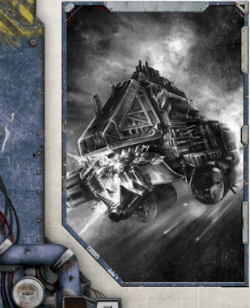

The exact nature of Ork life sustainers is unknown. Boarding parties and Mechanicus [Salvage](starship-salvage-rules.md) teams have observed everything  from  clanking  pneumatic  air  pumps  to  giant squigs of unknown breeds used as bellows. The only thing these devices have in common is none of them should work.

*Source:* `Battle Fleet of the Koronus, page 77`
