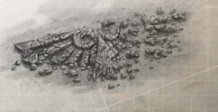

Many  Imperial  warships  mount  torpedo  decks  beneath their  prow  [Armour](armour.md)  to  give  them  a  forward  armament  with an  extremely  long  range.  The  torpedo  decks  are  wide  and tall  although  their  heavily-buttressed  ceilings  often  make them feel oppressive and cavern-like. Impressively thick rails follow overhead gantries from great slots in the deck to the individual tube entrances sealed by their towering pressure doors.

Torpedo  handling  is  even  more  labour-intensive  than operating  the  ship's  guns,  and  crews  can  number  in  the thousands. Each torpedo is an enormous device up to sixty meters  long  and  packed  with  volatile  sub-munitions  and [Plasma](weapons-general.md)  [Warheads](weapons-warheads.md).  Torpedo  crews  are  made  up  of  more experienced  [Ratings](crew-ratings.md)  than  the  ones  to  be  found  in  the  gun crews  for  just  this  reason.  An  accident  on  the  gun  decks might cause casualties among the crew, but an accident when handling the [Torpedoes](weapons-torpedoes.md) can imperil the whole ship.

The torpedo loading process is a notoriously dangerous and arduous one. It begins with ritual checks of the pressure in the [Torpedo Tubes](components-torpedo-tubes.md) before their inner doors are painstakingly cranked open. The torpedo is then hoisted up through the slots in the deck from the heavily-armoured torpedo store several decks below with the appropriate catechisms of welcome and purpose. Massed work gangs thousands strong then drag the huge missiles along the rails into the open tubes.

The torpedo shackles are then removed and finally the tube inner doors hauled shut, the outer doors unsealed, and the crews

hurry to ceramite bunkers to await the command to launch. Even with the thick inner doors locked in place the awesome energies unleashed by the torpedoes firing up their plasma drives creates a backwash of heat and radiation that kills anyone exposed.

When  the  torpedoes  hurl  themselves  forth,  the  ship shudders palpably. Anyone with warship experience can tell a launch has just occurred by the redistribution of mass alone. As the torpedoes blaze off into the void in pursuit of their distant targets, the torpedo crew emerge from their bunkers to make necessary repairs and begin the process all over again.

Even when not in battle the torpedoes must be periodically lifted from the store to be anointed and examined for failures by the tech-priests. It's said that torpedo-men can become quite enamoured of their charges over the long cycles of maintenance between battles. They view the eventual departure of a favourite with a curious mixture of [Pride](chargen-stage2-origin-path.md) and loss.

*Source:* `Battle Fleet of the Koronus, page 49`
