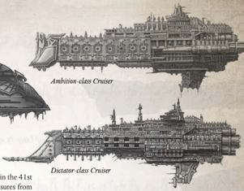

Dimensions: 5.1 km long, 0.7 km abeam at fins approx.

Mass: 30 megatonnes approx.

Crew: 65,000 crew, approx

Accel: 2.1 gravities max sustainable acceleration.

Star galleons are thought to be treasure ships from the very dawn of the Imperium, commissioned for the very first Rogue Traders on the [Orders](combat-orders.md) of the Emperor himself. Whether this is true is completely unprovable, but those Star Galleons found in  the  Koronus Expanse are usually ancient vessels bearing design elements lost to modern shipwrights. Specialist longrange exploration vessels, capable of voyaging for years at a time, they were conceived as heavily armed hybrids of  [Cruiser](starship-anatomy-detailed.md)  and  transport,  with  enough  firepower to  defend  themselves  and  carve  apart  [Renegade](chargen-stage2-origin-path.md) empires, yet also capable of safely transporting back the spoils of war by the megatonnne.Conquest-class Star Galleon

Few of these ships exist in the Koronus Expanse in the 41st Millennium. They are precious relics, priceless treasures from the legendary founding time of the Imperium. Only the most ancient  and  powerful  dynasties  retain  such  heirlooms,  and they guard them jealously. Generally regarded as fragile and undergunned for their [Size](character-traits.md) by modern naval officers, such an appraisal misses the obvious fact that these are not warships; rather, they are tremendously powerful armed freighters. Few of these ships exist in the Koronus Expanse in the 41st Millennium. They are precious relics, priceless treasures from the legendary founding time of the Imperium. Only the most ancient  and  powerful  dynasties  retain  such  heirlooms,  and

The  Conquest  class  is  the  archetypal  star  galleon,  though ten thousand years of variation amongst the limited number of ships still active renders the concepts of a 'class' somewhat moot. Every Conquest is a uniquely glamorous and beautiful vessel, a glittering city in the stars, laden with treasures from forbidden realms  and  lost  empires.  Physically  as  large  as  most  [Cruisers](hulls-overview.md), though not as well armed or armoured, they are nevertheless a match for most threats that can be found in the Koronus Expanse.

Rare…but  not  unknown.  The  Imperium,  despite  its complex  feudal  hierarchy,  does  occasionally  produce  the extremely wealthy individual, or dynasties with the financial wherewithal  to  commission  the  manufacture  of  a  bespoke cruiser. These are not rusty and echoing mothballed, second hand cruisers from the wrecking yards or reserve fleets, but shining  new  vessels  built  to  the  quixotic  specifications  of eccentric and boundlessly conniving individuals. Rare…but  not  unknown.  The  Imperium,  despite  its

Speed: 4

Manoeuvrability: +5

Detection: +10

Hull Integrity: 65

[Armour](armour.md):

16

Turret Rating: 1

Space:

56

SP: 52

Weapon Capacity:

Port 2, Starboard 2

Galleon: The Star Galleon comes pre-equipped with two [Main Cargo Hold](starship-supplemental-components.md) Components (see page 203 of the Rogue TRadeR core rulebook.) The hull's space has already been reduced to account for this; however, when the ship is constructed it must be able to provide four Power to these Components.

Hybrid Vessel: The Star Galleon may be equipped with  Transport  or  Cruiser  Components.  However,  if  the Component has both a Transport and a Cruiser  variant,  it must take the Cruiser variant.

*Source:* `Battle Fleet of the Koronus, page 24`
