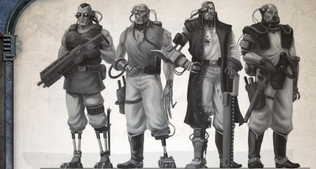

The ships Bosuns are disciplinarians and taskmasters in a crew, assigned to oversee the common  [Ratings](crew-ratings.md)  and  indentured  workers,

determine their duties, and ensure they're carried out. This often means they're responsible for enforcing discipline on recalcitrant crewmembers,  and  are  likely  to  handle  that  task  personally . This makes them unpopular figures in the Navy hierarchy, and aboard many warships they find themselves naturally allied with a ship's sergeants at arms, as their duties are similar.

*Source:* `Battle Fleet of the Koronus, page 70`
