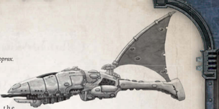

[Hull](starship-anatomy-detailed.md): Cruiser

Class: Dragon-class cruiser

Dimensions: 4.5-5.5 km long approx, 0.4-0.6 km abeam approx. Dimensions: 4.5-5.5 km long approx, 0.4-0.6 km abeam approx.

Mass: 16-20 megatonnes, approx.

Crew: Unknown

Accel: 7-8 gravities max sustainable acceleration

The name 'dragonship' doesn't refer to a specific Eldar vessel per se, but instead to a The name 'dragonship' doesn't refer to a specific Eldar vessel per se, but instead to a

wide variety of similar ships designed along  t h e wide variety of similar ships designed along  t h e

same basic layout. These ships are usually identifiable by their [Size](character-traits.md)-they're among the largest in [The Eldar](faction-eldar-overview.md) fleet, and by the use of the name 'dragon' as part of the ship's class. In fact, the Eldar often give them unique names based on their weapon configurations and roles in battle. same basic layout. These ships are usually identifiable by their size-they're among the largest in the Eldar fleet, and by the

For [Example](rules-tests.md), the Ghost Dragon is so named because they have virtually no crew and are instead piloted solely by the ship's Infinity Circuit, where void Dragons are equipped for extended operations away from the craftworld. Craftworld Kaelor utilises the Night Dragons-designed to be hard to detect and possess highly-advanced [Auger Arrays](starship-essential-components.md), Nova Dragons-armed almost exclusively with starcannon cluster batteries to serve as close-in support during [Fleet Actions](starship-fleet-actions.md), and Star Dragons-which use massed pulsar [Lances](starship-supplemental-components.md) to engage enemy vessels. There may be other Dragons as well, with different weaponry and uses.

Speed: 8

Manoeuvrability: +20

Detection:

+18

[Void Shields](components-void-shields.md): -

[Armour](armour.md): 18

Hull Integrity:

60

Morale: 100

Crew Population: 100

Crew Rating: Veteran (50)

Turret Rating: 1

Weapon Capacity: Prow 3, Keel 2

## Essential Components

Large Solar Sails, Warp-Plotter, [Command Bridge](starship-essential-components.md), Eldar Life Sustainer, Eldar Crew Quarters, Sensor Array

## Supplemental Components

The following represents the a configuration for each sub-class. Each sub-class has a combination of the following [Weapons](weapons-general.md):

Prow Starcannon Cluster Battery: (Macrobattery; Strength 4; [Damage](character-injury.md) 1d10+2; Crit Rating 4; Range 4; Superior Accuracy)

Prow Pulsar Lance: (Lance; Strength 1, Damage 1d10+3; Crit Rating 3; Range 6; Pulsed Fire)

Keel Landing Bay: (Launch Bay; Strength 2) This bay holds two [Squadrons](squadrons-overview.md) of Darkstar fighters and two squadrons of Eagle bombers (or their craftworld equivalents, the Nightwing fighter and the Phoenix bomber)

Keel [Torpedo Tubes](components-torpedo-tubes.md): (Torpedo Tubes; Strength 6; Damage 2d10+14; Range 40; Defensive Holofield, Terminal Penetration [3]) These torpedo tubes are loaded with Eldar plasma [Torpedoes](weapons-torpedoes.md), though they could also be loaded with different torpedoes at the GM's discretion. This Component has 32 torpedoes.

## Using Wraithships and Dragonships

Craftworld Eldar capital ships are a rare and highly dangerous sight in the Koronus Expanse, and Explorers should seldom encounter one randomly. Unlike Eldar Corsairs, the ships of a Craftworld are akin to an Eldar navy, and thus are only deployed in specific actions. Should one or more Craftworld Eldar vessels appear, it should be for a reason.

Aside from Void Dragons, these vessels are seldom encountered on their own. They are more likely to operate as part of a squadron, or at the least with a squadron of [Shadowhunter](shadowhunter.md) escorts. Their tactics vary depending on their weapon loadout-carrier vessels are likely to remain on the edges of a [Combat](rules-combat-overview.md) launching [Attack Craft](attack-craft-rules.md), while those with more Pulsar [Lances](starship-supplemental-components.md) and macroweapons are likely to close to do more [Damage](character-injury.md). Craftworld Eldar capital ships generally retreat if reduced to five or less [Hull](starship-anatomy-detailed.md) Integrity.

*Source:* `Battle Fleet of the Koronus, page 94`
