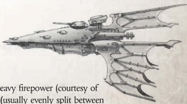

## Using the Aurora

Auroras  are  light  [Cruisers](hulls-overview.md),  and  extremely dangerous opponents. Their  armament of  dual  Pulsar  [Lances](starship-supplemental-components.md)  allows  them  to  fire  up  to  six times in a single turn. Even without macrobatteries to absorb shields, the pulsar lances can devastate a capital ship. In addition, the Aurora is manoeuvrable enough to outrun most [Raiders](ships-raiders-overview.md) and frigates. GMs should not put their group against an Aurora unless they have a very powerful ship or need a taxing challenge.

In [Combat](rules-combat-overview.md), Auroras launch volleys of [Torpedoes](weapons-torpedoes.md) to  pick  off  smaller  ships,  then  close  with  the larger targets, destroying them with brutal pulsar lance fire. They will generally retreat if reduced to 5 [Hull](starship-anatomy-detailed.md) Integrity or less.

Speed: 9

Manoeuvrability: +22

Detection:

+25

[Void Shields](components-void-shields.md): -

[Armour](armour.md): 15

Hull Integrity:

60

Morale: 100

Crew Population: 100

Crew Rating: Veteran (50)

Turret Rating: 1

Weapon Capacity: Prow 2, Keel 2## [Essential Components](wraithship.md#essential-components)

Large Solar Sails, Warp-Plotter, [Command Bridge](starship-essential-components.md), Eldar Life Sustainer, Eldar Crew Quarters, Sensor Array

## Supplemental Components

2 Prow Pulsar [Lances](starship-supplemental-components.md): (Lance; Strength 1, [Damage](character-injury.md) 1d10+3; Crit Rating 3; Range 3; Pulsed Fire)

2 Keel [Landing Bays](components-landing-bays.md): (Launch Bay; Strength 2) Each bay holds two [Squadrons](squadrons-overview.md) of Darkstar fighters and two squadrons of Eagle bombers, for four squadrons of each total.

Holofield: See page 86 for full rules.

[Stowage Bays](ships-npc-vessels.md): Corsair vessels aren't interested in trade, and store whatever cargo they acquire from a captured vessel in these smaller bays. However, if this ship is captured with this Component intact, the captors gain 50 [Achievement Points](economy-endeavours.md).

## Modifier Summery

The following modifiers apply to the Eclipse:

- -1 Movement if heading towards the nearest sun, +1 Movement if at right angle, no effect if moving away.
- If it loses Crew Population, it loses 1 additional Crew.
- If it loses Crew Morale, it loses 1 less Morale (to a minimum of 1).
- -40 on any Test to hit the ship with [Lances](starship-supplemental-components.md), [Torpedoes](weapons-torpedoes.md), [Attack Craft](attack-craft-rules.md) or by ramming. -20 to hit the ship with macrobatteries.
- -30 on any Extended Action involving Detection.
- If this ship is captured with the [Stowage Bays](ships-npc-vessels.md) Component intact, the captors gain 50 [Achievement Points](economy-endeavours.md).

*Source:* `Battle Fleet of the Koronus, pages 90–91`
