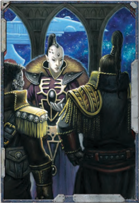

The  rewards  a  Rogue  Trader's  Warrant  of  Trade  can  bring are  exceptional,  and  often  quite  beyond  those  attainable  by any  other  legitimate  means.  The  greatest  reward  is  [Fortune](chargen-stage2-origin-path.md), obtained by trade or conquest. Often the two are one and the same. Quite aside from the financial gain, many Rogue Traders seek the fame and glory success can bring. Few men in the 41st millennium can ever hope that their name will be spoken of beyond the limits of their birth world or the span of their own lifetime. For many, the most valuable reward is the opportunity to establish a Lineage, with themselves as the primogenitors, of a noble house that will endure throughout the ages.

*Source:* `Roguetrader Corerulebook, page 335`
