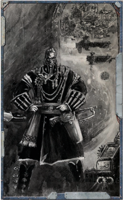

## Option 1: a Void-caravan

It  is  not  uncommon  for  the  paths  of  Rogue  Traders  and Explorators to cross, particularly out amongst the unexplored systems beyond the Imperium's borders. On occasion the two factions will have cause to join forces, and as both generally have  quite  different  objectives  to  their  exploration  this  is often a successful course of action. There are plenty of times however when the interests of the two groups will clash, such as  when  an  Explorator  Fleet  wishes  to  strip  mine  a  newly discovered world while a Rogue Trader wishes to trade with its  native  population,  or  a  particular  Explorator  Archmagos decides they want something the Rogue Trader has or that they know too much.

Nonetheless,  many  Rogue  Traders  maintain  ties  with Explorators they have worked alongside in the past. By doing so, the Rogue Trader can utilise information the Explorators have  gathered, gaining exclusive access to systems the Explorators have discovered. Frequently, an Explorator Fleet will pass through a system, exploring and cataloguing it but classifying  it  as  having  little  or  no  interest  to  the  Adeptus Mechanicus. A Rogue Trader with contacts with the Explorator Fleets will know of such worlds long before his rivals, and have a unique opportunity to investigate them for opportunities from which his House might profit.

Ship Points:

10

Profit Factor: 4

## Option 2: Have Macrocannon, Will Travel

Contacts within the Missionaria Galaxia can prove extremely useful, for this division of the Ecclesiarchy  maintains  holdings  far  beyond the  fringes.  It  may  well  be  that  a  single preacher operating out of an isolated mission proves a staunch ally in a crisis, for he will be well-schooled in the ways of the native population and well able to defend himself should the need arise.

The  Missionaria  does  not  lend  its  aid  to  just  anyone however, and any preacher to whom a Rogue Trader is forced to turn for aid will only help him out after determining the individual's morale purity. Even when aid is forthcoming, the preacher may well make demands in return, often including requests  for  support  in  his  own  mission  or  substantial donations to the mission of taking the Word of the Emperor to the ignorant souls beyond the fringes.

Ship Points: 8

Profit Factor:

6

## Option 3: War Stories

Those Rogue Trader Dynasties whose fortunes are built upon the  acquisition  and  generation  of  vast  sums  of  wealth  will have dealings with commercial combines across entire sectors and  beyond.  They  will  have  bonded  scribes  and  factors operating in the courts of the greatest of commercial concerns and these will have the ear of the most influential merchants in the region.

It is important to remember that the great merchant houses, particularly  those  who  span  several  worlds,  let  alone  whole## Pirates

The core  experience  of  Rogue  Trader  is  based  on  the  idea  of  a  group  of  characters  working  with  a  single  Rogue Trader aboard a single spaceship (at least at the beginning!), exploring the unknown and seeking profit amongst the stars as masters of their own destinies. However, there are many different ways to play Rogue Trader that are just as valid. Here are some options that the Game Master might consider when organising his Rogue Trader campaign.

*Source:* `Battle Fleet of the Koronus, pages 43–44`
