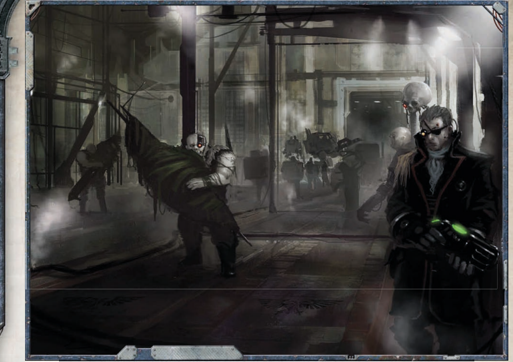

## Making Common Endeavours Into Background Endeavours

A GM should consider designing his Meta Endeavour so that completion of the component  Common Endeavours will generate enough Achievement Points to  complete  it.  The  Game  Master  should  always require  more  points  than  the  Common  Endeavours can generate to encourage the players to pursue leads and explore things outside of the stated goals of the Meta  Endeavour. This is where awarding small amounts  of Achievement  Points  comes  in.  They  are an  incentive  for  the  players  to  turn  over  rocks  and kick in doors and play in the spirit of a free-wheeling space  faring  Rogue  Trader  while  still  advancing  the story and contributing to the completion of the Meta Endeavour.

Alternately, the GM can expect his players to gain a  great  deal  of  additional  Achievement  Points,  and cash  them in at the end of the Endeavour for additional  Profit  Factor.  However,  if  the  GM  does this, he should consider the possibility that his players will have a huge Profit Factor jump at the end of the Meta Endeavour.

| Table 7-4: Meta Endeavour Scope   | Table 7-4: Meta Endeavour Scope   |
|-----------------------------------|-----------------------------------|
| Scale                             | Achievement Points Needed         |
| Monumental                        | 10000                             |
| /egendary                         | 15000                             |
| Epic                              | 20000                             |

page 278 of ROGUE TRADER for rules regarding the awarding of  Achievement  Points  for  both  Common  Endeavours  and random encounters. Each kind of Meta Endeavour has a set number of Achievement Points needed to complete it, dictated by  the  average  number  of  Common  Endeavours  involved and their Achievement Point rewards. See Table 7-4: Meta Endeavour  Scope  for  the  number  of  Achievement  Points needed to complete each type of Meta Endeavour.

## Marshalling Resources

The following check list is a quick reference for Game Masters to aid them in creating their Meta Endeavours.

- Determine  the  Scope  of  the  Meta  Endeavour  (Monumental, Legendary or Epic): The Game Master and his players discuss what they want from a game, the length of the campaign (roughly) and appropriate characters. Once all of this is agreed on the Game Master chooses the Scope that fits his campaign best. Choosing the Scope of the Meta  Endeavour  determines  approximately  how  long it  will  take,  along  with  the  difficulty  and  Achievement Point Requirements.
- Design Component Common Endeavours: Based on the Meta  Endeavour's  Scope,  the  Game  Master  sets  about designing the Common Endeavours that will form the body of the  Meta  Endeavour.  The  GM  may  also  make  notes about  possible  side  adventures  and  random  encounters that he would like to include in the Endeavour.
- Divide the Meta Endeavour into Objectives and Assign Themes:  Once  the  component  Endeavours  have  been designed, the GM can now group them together based on  common  themes  to  form  chapters  within  his  Meta Endeavour.

Once all of the pieces have come together and the Game Master has a good idea of how he'd like things to go, the Meta Endeavour is ready to be played.

## Example

Depending on the Scope of the Meta Endeavour, the resolution could simply have been one section of a grander idea forged by  the  Game  Master,  or  the  culmination  of  years  of  play that  ends  with  the  Explorers  becoming  major  intergalactic figures,  unimaginably  wealthy  and  powerful.  Whatever  the case,  the  Explorers  have  completed  near  superhuman  tasks and deserve every reward that is coming to them. In the case of Monumental and Legendary Scale Endeavours, the  Achievement  Points  gained  over  the  course  of the  Meta Endeavour are totalled and compared to  the  base  Acquisition  Point  requirement. Like  a  regular  Common  Endeavour,  Meta

Endeavours can still be completed even if the Explorers fail at one or more of the component Endeavours. Achievement Points lost through failed Endeavours can be made up through random encounters and the pursuit of side adventures. These points reflect the Explorers adapting to the fluid nature of life in the stars and new doors opening when others close.

- As  with  Common Endeavours, it's  very  likely  that  the Explorers have amassed more Achievement Points than needed to complete their Meta Endeavour. These surplus points  can  now  be  converted  into  Profit  Factor  at  the rate  of  +1  point  of  Profit  Factor  for  every  100  excess Achievement  Points.  To  say  that  Meta  Endeavours  are extremely profitable is a gross understatement.
- Epic  Meta  Endeavours  are  resolved  slightly  differently than  Monumental  and  Legendary  Endeavours,  as  they are  largely  their  own  reward.  Achievement  Points  are tallied  normally,  and  the  ability  to  make  up  for  failed Common Endeavours is still present. In this case however, excess  Achievement  Points  can  not  be  converted  into Profit  Factor.  Since  Epic  Endeavours  are  typically  full campaigns, by the climax the Explorers should either be wealthy beyond their wildest dreams, extremely powerful and influential in the highest levels of the Imperium, or perhaps dead, corrupted or even worse. Once the Epic Endeavour  is  completed,  the  campaign  is,  for  all intents and purposes, over and it's time to make new  characters  and  seek  new  adventures elsewhere in the Imperium.

## Background Endeavours and Profit Factor

There are times when a Rogue Trader needs something to happen,  but  doesn't  have  the  time  or  inclination  to  do  it himself.  That's  where  Background  Endeavours  come  in. Background Endeavours aren't a specific kind of Endeavour so much as they are a way to handle Common Endeavours that  a  Rogue  Trader  finds  menial,  beneath  his  station,  or simply boring. They reflect the Rogue Trader's ability to let his 'people' (lackeys, proxies and functionaries) handle things he  would  rather  not  do  himself.  Only  Lesser  and  Greater Common Endeavours can be made Background Endeavours, however, as Grand Endeavours are too complicated and too important to leave to underlings. While making a Common Endeavour into a Background Endeavour can free a Rogue Trader up to do things he'd rather do, such as hunting down pirates  or  plundering  backwater  planets,  the  trade-off  is  a reduction in the Profit Factor award and a greater chance that the Endeavour itself will be a failure.

Making a Common Endeavour a Background Endeavour may get a potentially boring and undesirable task out of the Rogue  Trader's  hair,  but  since  it's  being  done  essentially unsupervised  he  can  never  be  sure  that  it  will  get  done correctly,  if  at  all.  While  avoiding  drudge  work  certainly has  its  benefits,  Background  Endeavours  have  a  number  of disadvantages that should always be taken into consideration. First and foremost, a Background Endeavour will never be asprofitable as one undertaken directly by the player. Due to the fact that the player is essentially abdicating his responsibility for the Endeavour to a pack of NPCs, there will always be a reduction in the Endeavour's Profit Factor. This loss of Profit Factor reflects things like initial outlay of funds for the project, cost of hirelings and things that are missed, miscounted or flat-out stolen by the NPCs entrusted with carrying out the task.  See  the  sidebar  Background  Endeavours  and  Profit Factor for more information on how the Profit Factor rewards of  a  common  Endeavour  are  affected  by  changing  it  to  a Background Endeavour.

Secondly, lending credence to the saying that if someone wants  something  done  right  they  need  to  do  it  themselves, whenever a Rogue Trader entrusts his underlings with a task there  is  a  chance  that  complications  could  arise.  No  matter how good the underlings, there is always a chance that they will fail in their given task. Add to this the fact that the tasks are  unsupervised  and  generally  boring  and  menial,  and  you have a recipe for potentially spectacular failure.  Failure  by  a Rogue  Trader's  underlings  can  mean  anything  from  further loss of Profit Factor to embarrassment to the loss of men and material. A failure that's spectacular enough may even put an entire Meta Endeavour at risk. That's not to say that the effects of  an  underling's  failure  can't  be  mitigated,  especially  if  the Rogue Trader catches the mistake in time. More often than not, however,  the  mistake  isn't  caught  until  it's  too  late  and  the Rogue Trader and his underlings will be held accountable.

At its heart, the decision to make a Common Endeavour into a Background Endeavour is a strategic one. It is also a decision not to be entered into lightly. The good that comes out  of  it:  getting  someone  else  to  do  something  a  group doesn't want to do and still getting paid for it, is balanced by the bad: loss of Profit Factor and the real possibility of failure and the Rogue Trader having to clean up a mess and do the task anyway.

## Executing the Order

Once the decision has been made to involve NPCs and make a Common Endeavour into a Background Endeavour, steps need to be taken by the Explorers to ensure that the thing gets done correctly.

## Example

Now that the decision has been made to make a Common Endeavour into Background Endeavour, the first step toward executing  the  order  is  a  marshalling  of  resources.  During this  phase,  the  Explorers  take  stock  of  what  they  need  to complete  the  Endeavour  and  what  men  and  materiel  they have at hand to commit to it. Chances are that the Explorers will  have  everything  that  they  need,  as  they  should  have already planned to complete this as a Common Endeavour and  prepared  accordingly,  and  they  can  continue  on  with Executing the Orders. If this isn't the case, and the Explorers find themselves wanting, they must make Acquisition Tests to gather what they need. These tests are made normally as outlined on pages 271-272 of ROGUE TRADER .

When  attempting to acquire mercenaries, surveyors, intermediaries  or  other  hired  help,  the  difficulty  of  the Acquisition Test is modified by the quality of the hirelings. A  hireling's  quality  can  be  poor,  common,  good  or  best, and  is  roughly  analogous  to  an  item's  Craftsmanship.  Use the modifiers for craftsmanship on Table 9-35: Acquisition Modifiers  found  on  pages  272  of ROGUE  TRADER for  the R for  the R Acquisition Test made to acquire hired help. Explanations of a hireling's quality can be found in Table 9-37: Acquisition Quality on pages 274 of ROGUE TRADER .

## Further Modifying the Command Test

Lidiah needs to hire some people to survey an unfamiliar star cluster for her, and decides that one hundred of the best surveyors money can hire will get the job done nicely. Best Craftsmanship surveyors are hard to come by, and impose a penalty of -30 to her Acquisition Test. However, 100 as a Scale modifier is +0, no benefits or penalties, so her search is not too unreasonable. Lidiah's Profit Factor is 66, but with the -30 Acquisition modifier she'll have to roll a 36 or lower to find the men she needs. She rolls a 50 and is unable to find even ten Best Quality surveyors in this backwater system.

## Success, Failure, Time and Misfortune

As  was  stated  elsewhere,  a  Background  Endeavour is never as profitable  as  a  Common  Endeavour. The  first thing that happens  when  a  Common Endeavour becomes a Background Endeavour is that a set  number  of Profit Factor points are subtracted right  off the  top,  one  point  for  a  Lesser  Endeavour and two points for Greater Endeavour. This reflects the massive  outlay  of  resources  needed  to organise a Background Endeavour. Furthermore, NPCs  will  never  do  more  than  the  bare  minimum required  to  get  the  job  done.  The initial loss of points can never reduce the Profit Factor of a Background Endeavour to zero, This means that there will no extra Achievement Points awarded  and therefore  none  can  be  traded  in  for  further  Profit Factor  rewards,  reducing  the  potential  profitability of  the  Endeavour  even  further.  Depending  on  how successful the Endeavour is, or how badly the NPCs fail,  more  Profit  Factor  could  be  lost,  even  to  the point where the players come out upside down on the deal and end up owing money instead of making any.| Table 7-5: Hireling Quality Modifiers   | Table 7-5: Hireling Quality Modifiers   |
|-----------------------------------------|-----------------------------------------|
| Quality of Hireling                     | Command Test Modifier                   |
| Poor                                    | -20                                     |
| Common                                  | 0                                       |
| Good                                    | 10                                      |
| Best                                    | 20                                      |

## Example

When the Explorers have completed marshalling their resources, the  player  creating  the  Background  Endeavour,  typically  the Rogue Trader, makes a Command Test. This Command Test is modified by two factors, input from other Explorers and the quality of the underlings set to the task. Other Explorers may help the character executing the Endeavour by making relevant skill tests and adding bonuses to the Command Test, such as a Navigator making a Navigation Test to double check a Rogue Trader's  trade  route.  Each  successful  Skill  Test  made  by  a supporting character adds a +10 bonus to the Command Roll. The quality of people hired to carry out the Endeavour also has an effect on the Command Test. See Table 7-5: Hireling Quality Modifiers for the appropriate bonuses and penalties.

After all modifiers are applied and the Command Test is made, the player making the Test then tallies up their success or failures to  see  how  well  he  communicated  his  orders  and  how  well they'll be followed. A simple success nets a flat 50% chance that the Background Endeavour will succeed. Every Level of Success attained increases the chances that the Background Endeavour will succeed by one step. If the player fails his Command Test, the Endeavour still goes forward as planned but every degree of failure increases the likelihood of total failure by one step. It is important to note that a failure on this test doesn't necessarily mean the Endeavour fails, although it does increase the chances. Instead,  it  simply  means  some  sort  of  miscommunication  or misunderstanding makes failure more likely .

## Reaping Rewards and Dealing With Consequences

Having failed to round up any Best Craftsmanship (-30) surveyors, Lidiah  has  had  to  settle  for  a  pack  of  lesser  skilled  but  serviceable Common  Craftsmanship  (+0)  surveyors.  To  make  up  for  this,  she manages to hire a half a dozen advanced survey ships for the surveyors to operate from. The Game Master declares that these specialised ships give Lidiah a +10 modifier to her Command Test. During the planning phase  before  briefing  the  surveyors,  her  Navigator,  V oid-master  and Seneschal  all  provide  helpful  input.  This  contributes  a  further  +30 modifier for her Command Test. Her modifiers plus her Fellowship of 40 give her a total of 80 for her Command Test. She briefs the leaders of the survey teams, hands out her orders and rolls a 65, good enough to succeed on her command roll with one degree of success. The Survey teams set out to take care of business with a 60% chance of succeeding.

## Making the Players Sweat: the Importance of Secrecy and the Success Roll

If the Game Master allows it, the Command Test can be  further  modified  by  the  acquisition  of  ships  or equipment specifically designed for the task at hand. For example, hiring a ship specifically built for hauling  perishable cargo  to  haul  a  load  of fresh foodstuffs  from  one  planet  to  another  would  grant  a +10 to the Background Endeavour's Command Test. The number of items and the modifiers they provide,  if  any,  are solely the GM's discretion.

## Example

*Source:* `Battle Fleet of the Koronus, pages 210–213`
